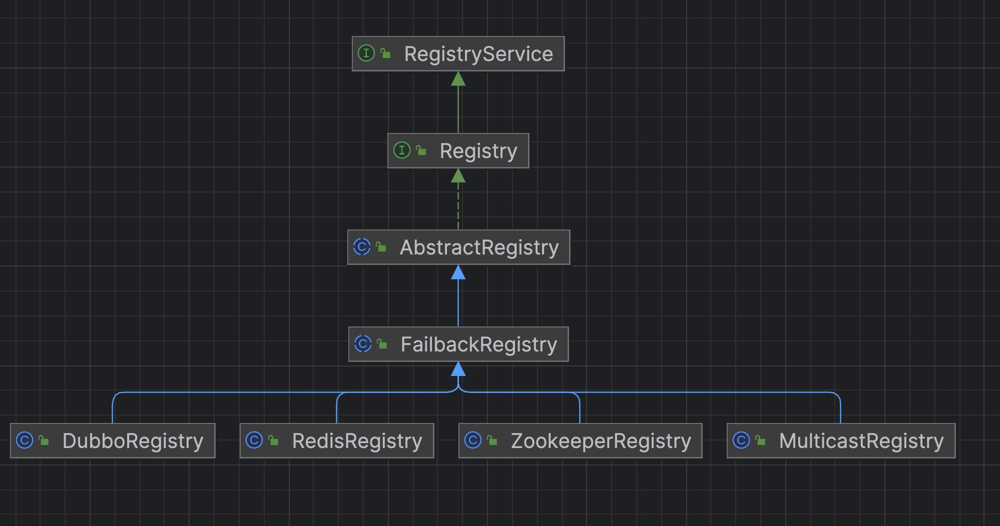
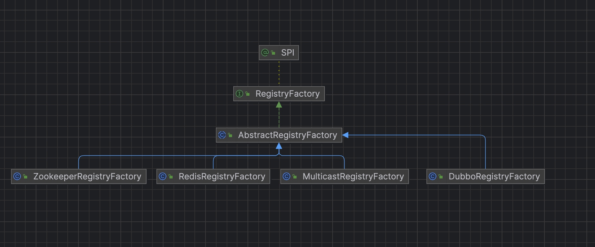

#  dubbo源码-注册中心-之接口层


### 代码结构，registry 抽象




### 代码结构 RegistryFactory抽象



#### 构造方法和成员变量

```java
    // The lock for the acquisition process of the registry
    private static final ReentrantLock LOCK = new ReentrantLock();

    /**
     * Registry 集合
     *
     * key：{@link URL#toServiceString()}
     */
    // Registry Collection Map<RegistryAddress, Registry>
    private static final Map<String, Registry> REGISTRIES = new ConcurrentHashMap<String, Registry>();
```
#### getRegistry 方法

```java
        /**
     * 获得注册中心 Registry 对象
     *
     * @param url 注册中心地址，不允许为空
     * @return Registry 对象
     */
    @Override
    public Registry getRegistry(URL url) {
        // 修改 URL
        url = url.setPath(RegistryService.class.getName()) // + `path`
                .addParameter(Constants.INTERFACE_KEY, RegistryService.class.getName()) // + `parameters.interface`
                .removeParameters(Constants.EXPORT_KEY, Constants.REFER_KEY); // - `export`
        // 计算 key
        String key = url.toServiceString();
        // 获得锁
        // Lock the registry access process to ensure a single instance of the registry
        LOCK.lock();
        try {
            // 从缓存中获得 Registry 对象
            Registry registry = REGISTRIES.get(key);
            if (registry != null) {
                return registry;
            }
            // 缓存不存在，进行创建 Registry 对象
            registry = createRegistry(url);
            if (registry == null) {
                throw new IllegalStateException("Can not create registry " + url);
            }
            // 添加到缓存
            REGISTRIES.put(key, registry);
            return registry;
        } finally {
            // 释放锁
            // Release the lock
            LOCK.unlock();
        }
    }

    /**
     * 创建 Registry 对象
     *
     */
    protected abstract Registry createRegistry(URL url);

```
#### 说明：
* 1，REGISTRIES  Key为 Registry Url转换后的string，value 为对应的Registry。
* 2, getRegistry 先通过URL创建 注册的URL列表，然后去 REGISTRIES 中拿，
* 3，拿不到了需要子类来创建。


#### ZookeeperRegistryFactory 子类
```java
public class ZookeeperRegistryFactory extends AbstractRegistryFactory {

    /**
     * Zookeeper 工厂
     */
    private ZookeeperTransporter zookeeperTransporter;

    /**
     * 设置 Zookeeper 工厂
     *
     * 该方法，通过 Dubbo SPI 注入
     *
     * @param zookeeperTransporter Zookeeper 工厂对象
     */
    public void setZookeeperTransporter(ZookeeperTransporter zookeeperTransporter) {
        this.zookeeperTransporter = zookeeperTransporter;
    }

    @Override
    public Registry createRegistry(URL url) {
        return new ZookeeperRegistry(url, zookeeperTransporter);
    }
}
```

#### 说明：
* 以 ZookeeperRegistryFactory子类为例，子类的实现只是初始化了 ZookeeperRegistry 这个类。


### RegistryService 注册中心接口

```java
    /**
     * Register data, such as : provider service, consumer address, route rule, override rule and other data.
     * <p>
     * Registering is required to support the contract:<br>
     * 1. When the URL sets the check=false parameter. When the registration fails, the exception is not thrown and retried in the background. Otherwise, the exception will be thrown.<br>
     * 2. When URL sets the dynamic=false parameter, it needs to be stored persistently, otherwise, it should be deleted automatically when the registrant has an abnormal exit.<br>
     * 3. When the URL sets category=routers, it means classified storage, the default category is providers, and the data can be notified by the classified section. <br>
     * 4. When the registry is restarted, network jitter, data can not be lost, including automatically deleting data from the broken line.<br>
     * 5. Allow URLs which have the same URL but different parameters to coexist,they can't cover each other.<br>
     *
     * @param url  Registration information , is not allowed to be empty, e.g: dubbo://10.20.153.10/com.alibaba.foo.BarService?version=1.0.0&application=kylin
     */

void register(URL url);

    /**
     * Unregister
     * <p>
     * Unregistering is required to support the contract:<br>
     * 1. If it is the persistent stored data of dynamic=false, the registration data can not be found, then the IllegalStateException is thrown, otherwise it is ignored.<br>
     * 2. Unregister according to the full url match.<br>
     *
     * @param url Registration information , is not allowed to be empty, e.g: dubbo://10.20.153.10/com.alibaba.foo.BarService?version=1.0.0&application=kylin
     */
void unregister(URL url);

    /**
     * Subscrib to eligible registered data and automatically push when the registered data is changed.
     * <p>
     * Subscribing need to support contracts:<br>
     * 1. When the URL sets the check=false parameter. When the registration fails, the exception is not thrown and retried in the background. <br>
     * 2. When URL sets category=routers, it only notifies the specified classification data. Multiple classifications are separated by commas, and allows asterisk to match, which indicates that all categorical data are subscribed.<br>
     * 3. Allow interface, group, version, and classifier as a conditional query, e.g.: interface=com.alibaba.foo.BarService&version=1.0.0<br>
     * 4. And the query conditions allow the asterisk to be matched, subscribe to all versions of all the packets of all interfaces, e.g. :interface=*&group=*&version=*&classifier=*<br>
     * 5. When the registry is restarted and network jitter, it is necessary to automatically restore the subscription request.<br>
     * 6. Allow URLs which have the same URL but different parameters to coexist,they can't cover each other.<br>
     * 7. The subscription process must be blocked, when the first notice is finished and then returned.<br>
     *
     * @param url      Subscription condition, not allowed to be empty, e.g. consumer://10.20.153.10/com.alibaba.foo.BarService?version=1.0.0&application=kylin
     * @param listener A listener of the change event, not allowed to be empty
     */
void subscribe(URL url, NotifyListener listener);

    /**
     * Unsubscribe
     * <p>
     * Unsubscribing is required to support the contract:<br>
     * 1. If don't subscribe, ignore it directly.<br>
     * 2. Unsubscribe by full URL match.<br>
     *
     * @param url      Subscription condition, not allowed to be empty, e.g. consumer://10.20.153.10/com.alibaba.foo.BarService?version=1.0.0&application=kylin
     * @param listener A listener of the change event, not allowed to be empty
     */
void unsubscribe(URL url, NotifyListener listener);

    /**
     * Query the registered data that matches the conditions. Corresponding to the push mode of the subscription, this is the pull mode and returns only one result.
     *
     * @param url Query condition, is not allowed to be empty, e.g. consumer://10.20.153.10/com.alibaba.foo.BarService?version=1.0.0&application=kylin
     * @return The registered information list, which may be empty, the meaning is the same as the parameters of {@link com.alibaba.dubbo.registry.NotifyListener#notify(List<URL>)}.
     * @see com.alibaba.dubbo.registry.NotifyListener#notify(List)
     */
List<URL> lookup(URL url);
```

#### 说明：
* 1，主要是注册、订阅、查询三种操作方法。
* 2， 注册数据，比如：提供者地址，消费者地址，路由规则，覆盖规则，等数据
* 3， 订阅数据，订阅符合条件的已注册数据，当有注册数据变更时自动推送。
* register方法：
     * 1. 当URL设置了check=false时，注册失败后不报错，在后台定时重试，否则抛出异常
     * 2. 当URL设置了dynamic=false参数，则需持久存储，否则，当注册者出现断电等情况异常退出时，需自动删除。
     * 3. 当URL设置了category=routers时，表示分类存储，缺省类别为providers，可按分类部分通知数据。
     * 4. 当注册中心重启，网络抖动，不能丢失数据，包括断线自动删除数据。
     * 5. 允许URI相同但参数不同的URL并存，不能覆盖。
     * @param url 注册信息，不允许为空，如：dubbo://10.20.153.10/com.alibaba.foo.BarService?version=1.0.0&application=kylin

* subscribe方法：
         * 订阅符合条件的已注册数据，当有注册数据变更时自动推送.

     * 1. 当URL设置了check=false时，订阅失败后不报错，在后台定时重试。
     * 2. 当URL设置了category=routers，只通知指定分类的数据，多个分类用逗号分隔，并允许星号通配，表示订阅所有分类数据
     * 3. 允许以interface,group,version,classifier作为条件查询，如：interface=com.alibaba.foo.BarService&version=1.0.0
     * 4. 并且查询条件允许星号通配，订阅所有接口的所有分组的所有版本，或：interface=*&group=*&version=*&classifier=*
     * 5. 当注册中心重启，网络抖动，需自动恢复订阅请求。
     * 6. 允许URI相同但参数不同的URL并存，不能覆盖。
     * 7. 必须阻塞订阅过程，等第一次通知完后再返回。
     *
     * @param url      订阅条件，不允许为空，如：consumer://10.20.153.10/com.alibaba.foo.BarService?version=1.0.0&application=kylin
     * @param listener 变更事件监听器，不允许为空


