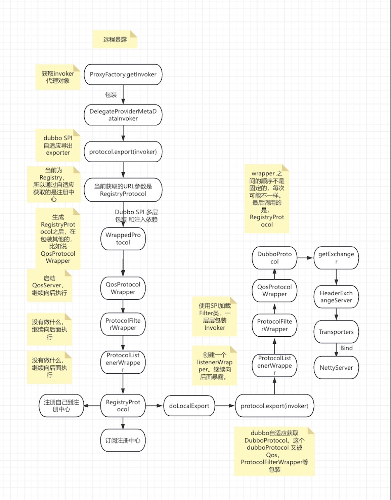
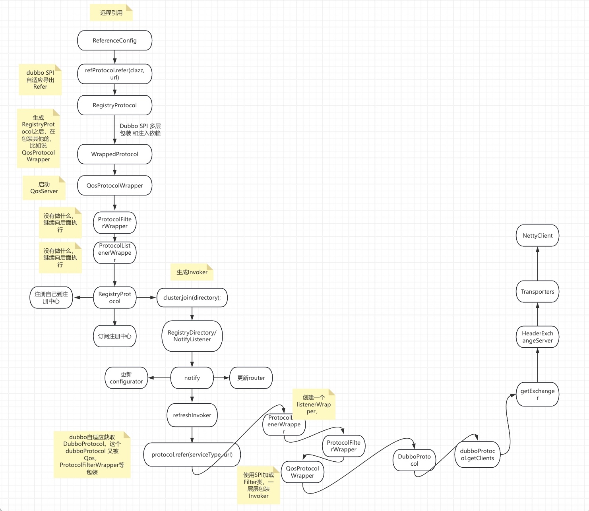
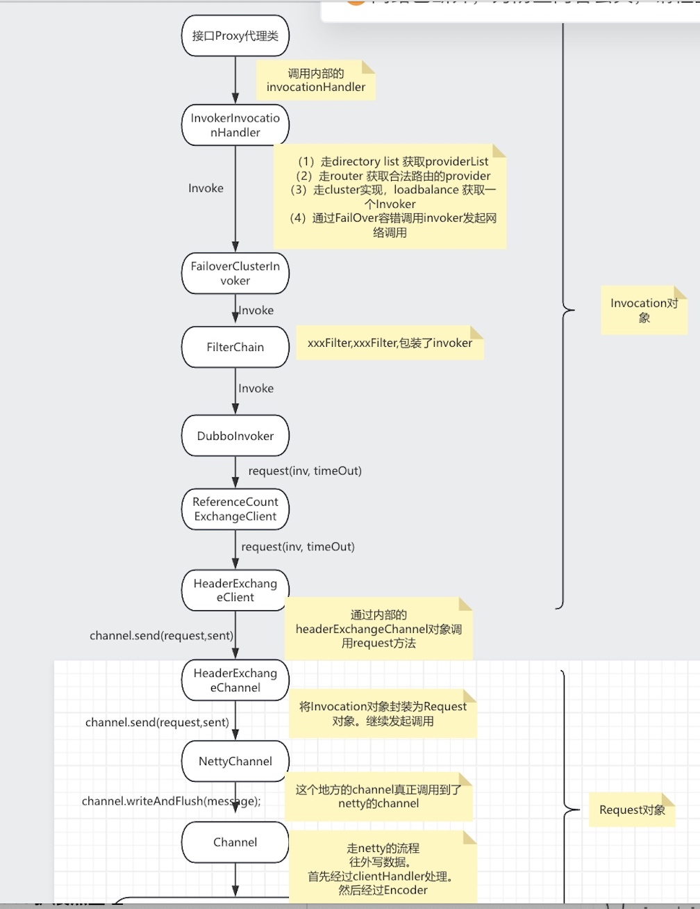
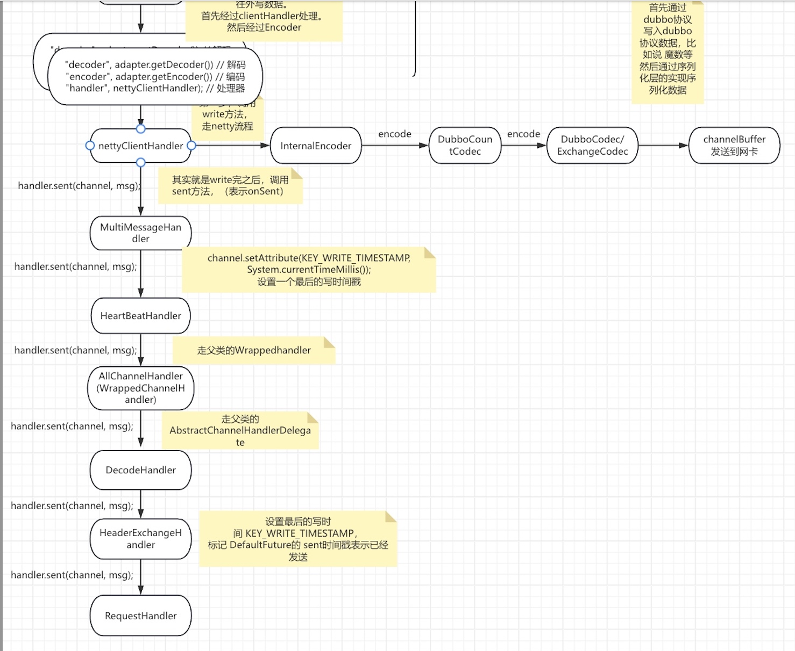
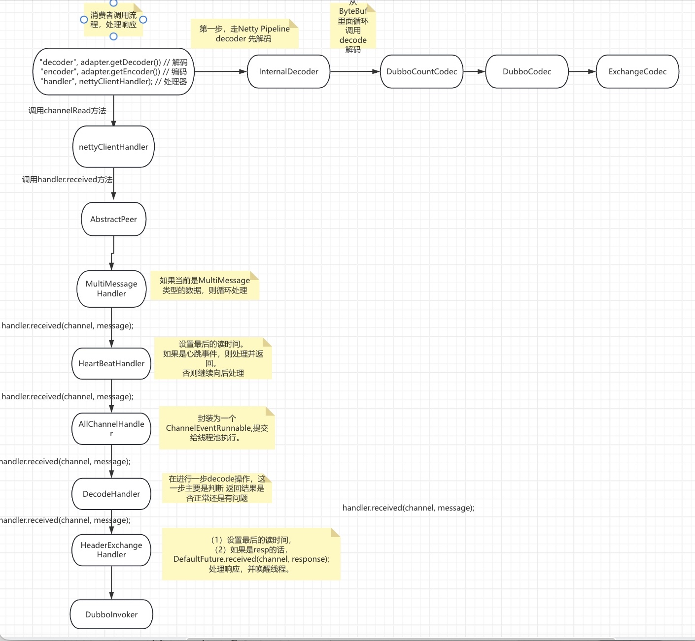
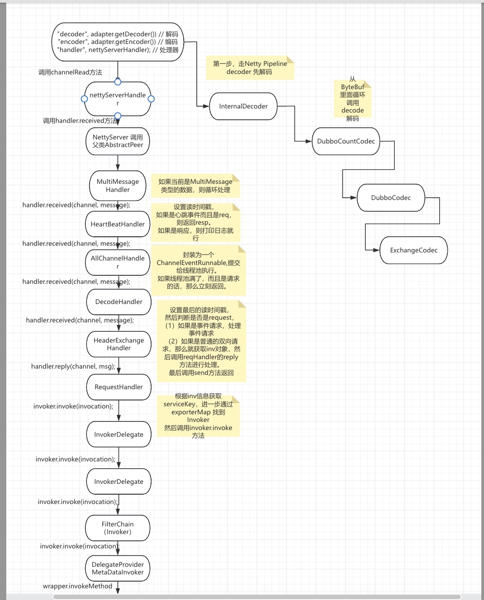
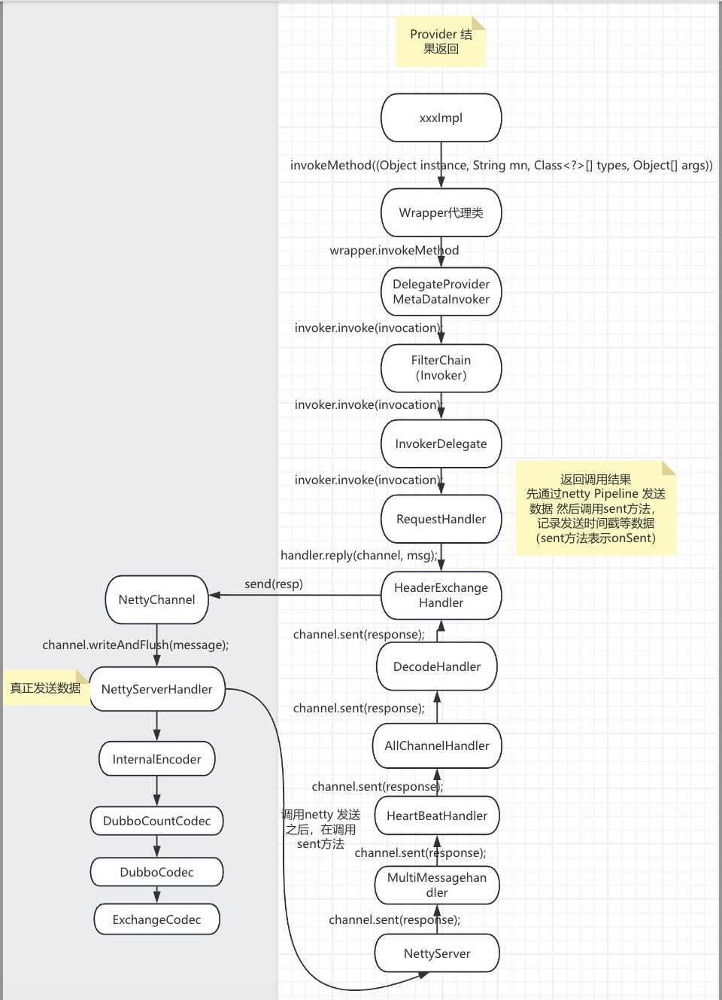

Dubbo源码详细解读

```
本项目基于dubbo 2.6.1版本，将dubbo的代码比较详细的做了分析。用于学习使用。
包括暴露流程，引用流程，请求与响应流程。还包括dubbo各个 module的详细解析。
可以先从总流程看起来。只要总流程理解了，dubbo子module自然也就理解了
```


## 打断点 Debug 请求与响应截图版

### provider端（断点截图）

[provider端收到请求](https://github.com/stevekangpei/dubbo_source_code/blob/master/dubbo%E6%BA%90%E7%A0%81-%20debug%20provider%E7%AB%AF%E6%94%B6%E5%88%B0%E8%AF%B7%E6%B1%82%E6%B5%81%E7%A8%8B.md)

[provider端返回响应](https://github.com/stevekangpei/dubbo_source_code/blob/master/dubbo%E6%BA%90%E7%A0%81-%20debug%20provider%E7%AB%AF%E8%BF%94%E5%9B%9E%E5%93%8D%E5%BA%94%E6%B5%81%E7%A8%8B.md)

### consumer端 （断点截图）
[consumer端发出请求](https://github.com/stevekangpei/dubbo_source_code/blob/master/dubbo%E6%BA%90%E7%A0%81-%20debug%20consumer%E7%AB%AF%E5%8F%91%E5%87%BA%E8%AF%B7%E6%B1%82%E6%B5%81%E7%A8%8B.md)

[consumer端收到响应](https://github.com/stevekangpei/dubbo_source_code/blob/master/dubbo%E6%BA%90%E7%A0%81-%20debug%20consumer%E7%AB%AF%E6%94%B6%E5%88%B0%E5%93%8D%E5%BA%94%E6%B5%81%E7%A8%8B.md)


## Dubbo consumer端Reference引用流程（无断点）

[consumer端本地引用](https://github.com/stevekangpei/dubbo_source_code/blob/master/dubbo%E6%BA%90%E7%A0%81%E4%B9%8B%20consumer%E7%AB%AF%20%E6%9C%AC%E5%9C%B0%E5%BC%95%E7%94%A8%EF%BC%88injvm%EF%BC%89%E5%88%86%E6%9E%90.md)


[consumer端远程引用（一）](https://github.com/stevekangpei/dubbo_source_code/blob/master/dubbo%E6%BA%90%E7%A0%81%E4%B9%8B-dubbo%20consumer%E7%AB%AF%E8%BF%9C%E7%A8%8B%E5%BC%95%E7%94%A8%E5%88%86%E6%9E%90%20%EF%BC%88%E4%B8%80%EF%BC%89.md)

[consumer端远程引用（二）](https://github.com/stevekangpei/dubbo_source_code/blob/master/dubbo%E6%BA%90%E7%A0%81%E4%B9%8B-dubbo%20consumer%E7%AB%AF%E8%BF%9C%E7%A8%8B%E5%BC%95%E7%94%A8%E5%88%86%E6%9E%90%20%EF%BC%88%E4%BA%8C%EF%BC%89.md)


## Dubbo provider端export暴露流程 （无断点）

[provider端本地暴露流程](https://github.com/stevekangpei/dubbo_source_code/blob/master/dubbo%E6%BA%90%E7%A0%81%E4%B9%8B-dubbo%20provider%E7%AB%AF%E6%9C%AC%E5%9C%B0%E6%9A%B4%E9%9C%B2(injvm)%E6%B5%81%E7%A8%8B.md)

[provider端远程暴露流程（一）](https://github.com/stevekangpei/dubbo_source_code/blob/master/dubbo%E6%BA%90%E7%A0%81%E4%B9%8B-dubbo%20provider%E7%AB%AF%E8%BF%9C%E7%A8%8B%E6%9A%B4%E9%9C%B2%E6%B5%81%E7%A8%8B%EF%BC%88%E4%B8%80%EF%BC%89.md)

[provider端远程暴露流程（二）](https://github.com/stevekangpei/dubbo_source_code/blob/master/dubbo%E6%BA%90%E7%A0%81%E4%B9%8B-dubbo%20provider%E7%AB%AF%E8%BF%9C%E7%A8%8B%E6%9A%B4%E9%9C%B2%E6%B5%81%E7%A8%8B%EF%BC%88%E4%BA%8C%EF%BC%89.md)

[provider端远程暴露流程（三）](https://github.com/stevekangpei/dubbo_source_code/blob/master/dubbo%E6%BA%90%E7%A0%81%E4%B9%8B-dubbo%20provider%E7%AB%AF%E8%BF%9C%E7%A8%8B%E6%9A%B4%E9%9C%B2%E6%B5%81%E7%A8%8B%EF%BC%88%E4%B8%89%EF%BC%89.md)


## consumer发起调用 和收到响应流程（无断点）

[consumer端发起调用流程](https://github.com/stevekangpei/dubbo_source_code/blob/master/dubbo%E6%BA%90%E7%A0%81%E4%B9%8B-dubbo%20consumer%20%E5%8F%91%E8%B5%B7%E8%B0%83%E7%94%A8.md)

[consumer端收到响应](https://github.com/stevekangpei/dubbo_source_code/blob/master/dubbo%E6%BA%90%E7%A0%81%E4%B9%8B-dubbo%20consumer%20%E6%94%B6%E5%88%B0%E5%93%8D%E5%BA%94.md)

## provider端收到请求和返回响应流程（无断点）

[provider端收到请求流程](https://github.com/stevekangpei/dubbo_source_code/blob/master/dubbo%E6%BA%90%E7%A0%81%E4%B9%8B-dubbo%20provider%20%E6%94%B6%E5%88%B0%E8%AF%B7%E6%B1%82.md)

[Provider端返回响应流程](https://github.com/stevekangpei/dubbo_source_code/blob/master/dubbo%E6%BA%90%E7%A0%81%E4%B9%8B-dubbo%20provider%20%E8%BF%94%E5%9B%9E%E5%93%8D%E5%BA%94.md)


## dubbo 序列化

[Dubbo序列化接口层实现](https://github.com/stevekangpei/dubbo_source_code/blob/master/dubbo%E6%BA%90%E7%A0%81-%E5%BA%8F%E5%88%97%E5%8C%96-%E6%8E%A5%E5%8F%A3%E5%B1%82%E5%AE%9E%E7%8E%B0.md)

[Dubbo序列化Kryo实现](https://github.com/stevekangpei/dubbo_source_code/blob/master/dubbo%E6%BA%90%E7%A0%81-%E5%BA%8F%E5%88%97%E5%8C%96-Kryo%E5%AE%9E%E7%8E%B0.md)

[Dubbo序列化 FST实现](https://github.com/stevekangpei/dubbo_source_code/blob/master/dubbo%E6%BA%90%E7%A0%81-%E5%BA%8F%E5%88%97%E5%8C%96-FST%E5%AE%9E%E7%8E%B0.md)

## Dubbo注册中心

[dubbo 注册中心 接口层实现](https://github.com/stevekangpei/dubbo_source_code/blob/master/%20dubbo%E6%BA%90%E7%A0%81-%E6%B3%A8%E5%86%8C%E4%B8%AD%E5%BF%83-%E4%B9%8B%E6%8E%A5%E5%8F%A3%E5%B1%82.md)

[Dubbo注册中心 抽象层实现](https://github.com/stevekangpei/dubbo_source_code/blob/master/dubbo%E6%BA%90%E7%A0%81-%E6%B3%A8%E5%86%8C%E4%B8%AD%E5%BF%83-%E6%8A%BD%E8%B1%A1%E5%B1%82%E5%AE%9E%E7%8E%B0%E3%80%82.md)

[Dubbo 注册中心 Zookeeper注册中心](https://github.com/stevekangpei/dubbo_source_code/blob/master/dubbo%E6%BA%90%E7%A0%81-%E6%B3%A8%E5%86%8C%E4%B8%AD%E5%BF%83-%E4%B9%8BZookeeper%E6%B3%A8%E5%86%8C%E4%B8%AD%E5%BF%83.md)

[Dubbo注册中心 Redis注册中心](https://github.com/stevekangpei/dubbo_source_code/blob/master/dubbo%E6%BA%90%E7%A0%81-%E6%B3%A8%E5%86%8C%E4%B8%AD%E5%BF%83-%E4%B9%8BRedis%E6%B3%A8%E5%86%8C%E4%B8%AD%E5%BF%83.md)

[Dubbo注册中心 Zk工具类](https://github.com/stevekangpei/dubbo_source_code/blob/master/dubbo%E6%BA%90%E7%A0%81-%E6%B3%A8%E5%86%8C%E4%B8%AD%E5%BF%83%E4%B9%8BZookeeper%E5%B7%A5%E5%85%B7%E7%B1%BB.md)


## Dubbo SPI与扩展点

[Dubbo SPI机制](https://github.com/stevekangpei/dubbo_source_code/blob/master/dubbo%E6%BA%90%E7%A0%81-dubbo%20SPI%E6%9C%BA%E5%88%B6.md)

[Dubbo扩展点整理](https://github.com/stevekangpei/dubbo_source_code/blob/master/dubbo%E6%BA%90%E7%A0%81-dubbo%E6%89%A9%E5%B1%95%E7%82%B9%E6%95%B4%E7%90%86.md)


## Dubbo Filter层

[Dubbo Filter层整理](https://github.com/stevekangpei/dubbo_source_code/blob/master/dubbo%E6%BA%90%E7%A0%81-filter%E5%B1%82.md)


## Dubbo cluster层

[Dubbo-Cluter 之Directory抽象](https://github.com/stevekangpei/dubbo_source_code/blob/master/dubbo%E6%BA%90%E7%A0%81-%E9%9B%86%E7%BE%A4cluster-%E4%B9%8Bdirectory%E6%8A%BD%E8%B1%A1%E3%80%82.md)

[Dubbo-Cluster 之 StaticDirectory](https://github.com/stevekangpei/dubbo_source_code/blob/master/dubbo%E6%BA%90%E7%A0%81-%E9%9B%86%E7%BE%A4cluster-%E4%B9%8BStaticDirectory.md)

[Dubbo-Cluster之 RegistryDirectory](https://github.com/stevekangpei/dubbo_source_code/blob/master/dubbo%E6%BA%90%E7%A0%81-%E9%9B%86%E7%BE%A4cluster-%E4%B9%8BRegistryDirectory.md)


[Dubbo-Cluster 之Configurator抽象层](https://github.com/stevekangpei/dubbo_source_code/blob/master/dubbo%E6%BA%90%E7%A0%81-%E9%9B%86%E7%BE%A4cluster-%E4%B9%8Bconfigurator%E6%8A%BD%E8%B1%A1%E5%B1%82.md)

[Dubbo-cluster 之 configurator 和其它层的抽象](https://github.com/stevekangpei/dubbo_source_code/blob/master/dubbo%E6%BA%90%E7%A0%81-%E9%9B%86%E7%BE%A4cluster-%E4%B9%8BConfigurator%20%E5%92%8C%E5%85%B6%E5%AE%83%E5%B1%82%E7%9A%84%E7%BB%84%E5%90%88.md)

[Dubbo-Cluster 之 Configurator实现](https://github.com/stevekangpei/dubbo_source_code/blob/master/dubbo%E6%BA%90%E7%A0%81-%E9%9B%86%E7%BE%A4cluster-%E4%B9%8BConfigurator%E5%AE%9E%E7%8E%B0%E5%B1%82.md)


[Dubbo-cluster之Router](https://github.com/stevekangpei/dubbo_source_code/blob/master/dubbo%E6%BA%90%E7%A0%81-%E9%9B%86%E7%BE%A4cluster-%E4%B9%8BRouter.md)

[Dubbo-cluster 之ScriptRouter实现](https://github.com/stevekangpei/dubbo_source_code/blob/master/dubbo%E6%BA%90%E7%A0%81-%E9%9B%86%E7%BE%A4cluster-router-ScriptRouter.md)


[Dubbo-cluster-之 ConditionRouter实现](https://github.com/stevekangpei/dubbo_source_code/blob/master/dubbo%E6%BA%90%E7%A0%81-%E9%9B%86%E7%BE%A4cluster-router-%E4%B9%8BConditionRouter.md)


[Dubbo-cluster 之merger实现](https://github.com/stevekangpei/dubbo_source_code/blob/master/dubbo%E6%BA%90%E7%A0%81-%E9%9B%86%E7%BE%A4cluster-%E4%B9%8Bmerger%E5%AE%9E%E7%8E%B0.md)


## Dubbo-cluster 集群容错

[Dubbo集群容错之容错全流程](https://github.com/stevekangpei/dubbo_source_code/blob/master/dubbo%E6%BA%90%E7%A0%81-%E9%9B%86%E7%BE%A4%E5%AE%B9%E9%94%99-%E4%B9%8B%E5%AE%B9%E9%94%99%E5%85%A8%E6%B5%81%E7%A8%8B.md)

[Dubbo集群负载均衡之最小连接数负载均衡](https://github.com/stevekangpei/dubbo_source_code/blob/master/dubbo%E6%BA%90%E7%A0%81-%E9%9B%86%E7%BE%A4%E5%AE%B9%E9%94%99-%E8%B4%9F%E8%BD%BD%E5%9D%87%E8%A1%A1%E4%B9%8B-LeastActiveLoadBalance%20%E6%9C%80%E5%B0%8F%E8%BF%9E%E6%8E%A5%E6%95%B0%E8%B4%9F%E8%BD%BD%E5%9D%87%E8%A1%A1.md)

[Dubbo集群负载均衡之-随机负载均衡](https://github.com/stevekangpei/dubbo_source_code/blob/master/dubbo%E6%BA%90%E7%A0%81-%E9%9B%86%E7%BE%A4%E5%AE%B9%E9%94%99-%E8%B4%9F%E8%BD%BD%E5%9D%87%E8%A1%A1%E4%B9%8B-RandomLoadBalance%E5%AE%9E%E7%8E%B0.md)

[Dubbo集群负载均衡一致性哈希负载均衡](https://github.com/stevekangpei/dubbo_source_code/blob/master/dubbo%E6%BA%90%E7%A0%81-%E9%9B%86%E7%BE%A4%E5%AE%B9%E9%94%99-%E8%B4%9F%E8%BD%BD%E5%9D%87%E8%A1%A1%E4%B9%8B-%E4%B8%80%E8%87%B4%E6%80%A7%E5%93%88%E5%B8%8C%20ConsistentHashLoadBalance.md)

[Dubbo集群负载均衡之--RoungRobin负载均衡](https://github.com/stevekangpei/dubbo_source_code/blob/master/dubbo%E6%BA%90%E7%A0%81-%E9%9B%86%E7%BE%A4%E5%AE%B9%E9%94%99-%E8%B4%9F%E8%BD%BD%E5%9D%87%E8%A1%A1%E4%B9%8BRoundRobin%E5%AE%9E%E7%8E%B0.md)


[Dubbo集群容错之BroadCastCluster](https://github.com/stevekangpei/dubbo_source_code/blob/master/dubbo%E6%BA%90%E7%A0%81-%E9%9B%86%E7%BE%A4%E5%AE%B9%E9%94%99%E4%B9%8BBroadcastCluster.md)

[Dubbo集群容错之-FailbackCluster](https://github.com/stevekangpei/dubbo_source_code/blob/master/dubbo%E6%BA%90%E7%A0%81-%E9%9B%86%E7%BE%A4%E5%AE%B9%E9%94%99%E4%B9%8BFailbackCluster.md)

[Dubbo集群容错之-FailFastCluster](https://github.com/stevekangpei/dubbo_source_code/blob/master/dubbo%E6%BA%90%E7%A0%81-%E9%9B%86%E7%BE%A4%E5%AE%B9%E9%94%99%E4%B9%8BFailfastCluster.md)

[Dubbo集群容错之FailOverCluster](https://github.com/stevekangpei/dubbo_source_code/blob/master/dubbo%E6%BA%90%E7%A0%81-%E9%9B%86%E7%BE%A4%E5%AE%B9%E9%94%99%E4%B9%8BFailoverCluster.md)

[Dubbo集群容错之FailSafeCluster](https://github.com/stevekangpei/dubbo_source_code/blob/master/dubbo%E6%BA%90%E7%A0%81-%E9%9B%86%E7%BE%A4%E5%AE%B9%E9%94%99%E4%B9%8BFailsafeCluster.md)

[Dubbo集群容错之MergableCluster
](https://github.com/stevekangpei/dubbo_source_code/blob/master/dubbo%E6%BA%90%E7%A0%81-%E9%9B%86%E7%BE%A4%E5%AE%B9%E9%94%99%E4%B9%8BMergeableCluster.md)

[Dubbo集群容错之-ForkingCluster](https://github.com/stevekangpei/dubbo_source_code/blob/master/dubbo%E6%BA%90%E7%A0%81-%E9%9B%86%E7%BE%A4%E5%AE%B9%E9%94%99%E4%B9%8BForkingCluster.md)


## Dubbo-网络服务器层

[Dubbo 服务器 之 Transporter抽象](https://github.com/stevekangpei/dubbo_source_code/blob/master/dubbo%E6%BA%90%E7%A0%81-%E7%BD%91%E7%BB%9C%E6%9C%8D%E5%8A%A1%E5%99%A8-%E4%B9%8Btransporter%20%E6%8A%BD%E8%B1%A1.md)

[Dubbo服务器之 服务端Server实现](https://github.com/stevekangpei/dubbo_source_code/blob/master/dubbo%E6%BA%90%E7%A0%81-%E7%BD%91%E7%BB%9C%E6%9C%8D%E5%8A%A1%E5%99%A8-%E4%B9%8Btransporter%20%E6%9C%8D%E5%8A%A1%E7%AB%AF%E5%AE%9E%E7%8E%B0.md)

[Dubbo服务器之客户端实现](https://github.com/stevekangpei/dubbo_source_code/blob/master/dubbo%E6%BA%90%E7%A0%81-%E7%BD%91%E7%BB%9C%E6%9C%8D%E5%8A%A1%E5%99%A8-Transporter%E4%B9%8B%E5%AE%A2%E6%88%B7%E7%AB%AF%E5%AE%9E%E7%8E%B0.md)


[Dubbo服务器之Exchange层](https://github.com/stevekangpei/dubbo_source_code/blob/master/dubbo%E6%BA%90%E7%A0%81-%E7%BD%91%E7%BB%9C%E6%9C%8D%E5%8A%A1%E5%99%A8-%E4%B9%8BExchange.md)

[Dubbo服务器之Exchange层-Request 和Response](https://github.com/stevekangpei/dubbo_source_code/blob/master/dubbo%E6%BA%90%E7%A0%81-%E7%BD%91%E7%BB%9C%E6%9C%8D%E5%8A%A1%E5%99%A8-%E4%B9%8BExchange%E5%B1%82-Request%E5%92%8CResponse.md)

[Dubbo服务器之-Exchange层-之Codec 和Dubbo协议](https://github.com/stevekangpei/dubbo_source_code/blob/master/dubbo%E6%BA%90%E7%A0%81-%E7%BD%91%E7%BB%9C%E6%9C%8D%E5%8A%A1%E5%99%A8-%E4%B9%8BExchange%E5%B1%82-codec%E5%92%8Cdubbo%E5%8D%8F%E8%AE%AE.md)


[Dubbo服务器之-Channel通道](https://github.com/stevekangpei/dubbo_source_code/blob/master/dubbo%E6%BA%90%E7%A0%81-%E7%BD%91%E7%BB%9C%E6%9C%8D%E5%8A%A1%E5%99%A8-%E4%B9%8BChannel%E9%80%9A%E9%81%93.md)


## dubbo provider端暴露流程图



## dubbo consumer端引用流程图




## dubbo consumer端发起请求流程图




## dubbo consumer端收到响应流程图



## Dubbo Provider端收到请求流程图




## Dubbo provider端返回响应流程图


