# dubbo源码- debug consumer端发出请求流程

```版本来自dubbo 2.6.x```

## 发起调用
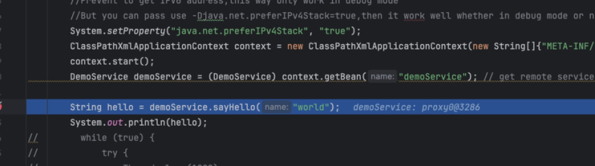

## InvokerInvocationHandler

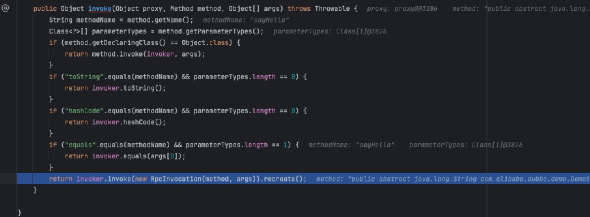


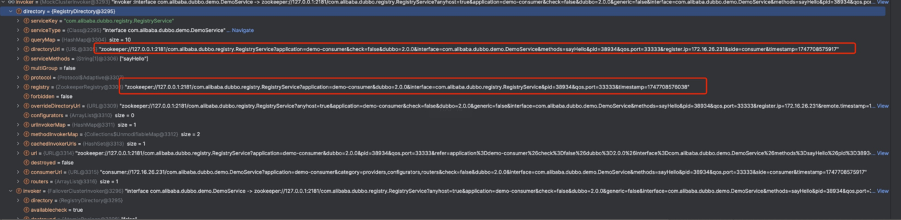


## MockClusterInvoker

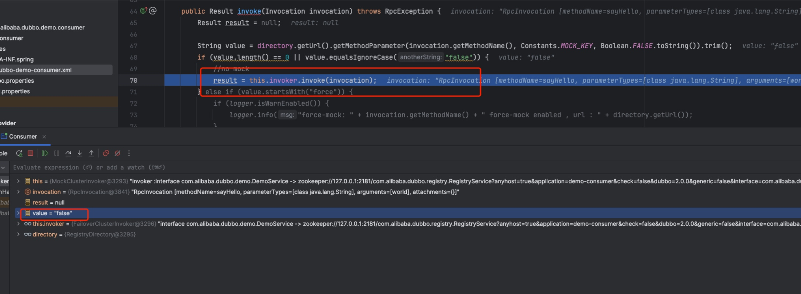


## AbstractClusterInvoker

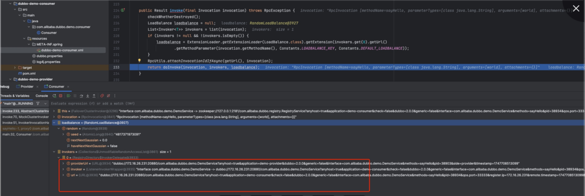


## FailoverClusterInvoker
默认的retry是2次，还加了1 所以是三次。

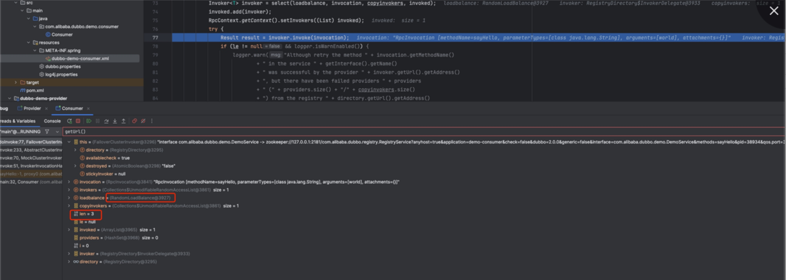


## InvokerWrapper 
只做了一层转发

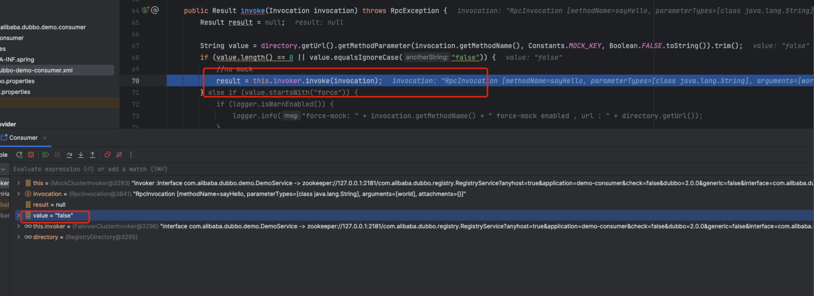


## ListenerInvokerWrapper

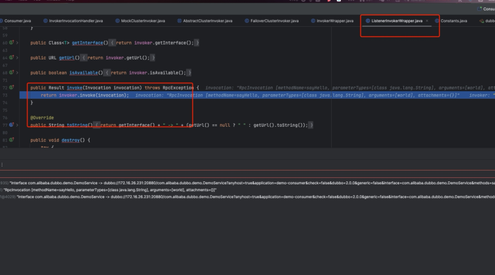


## ProtocolFilterWrapper
按照如下顺序向后执行

ConsumerContextFilter
FutureFilter
MonitorFilter

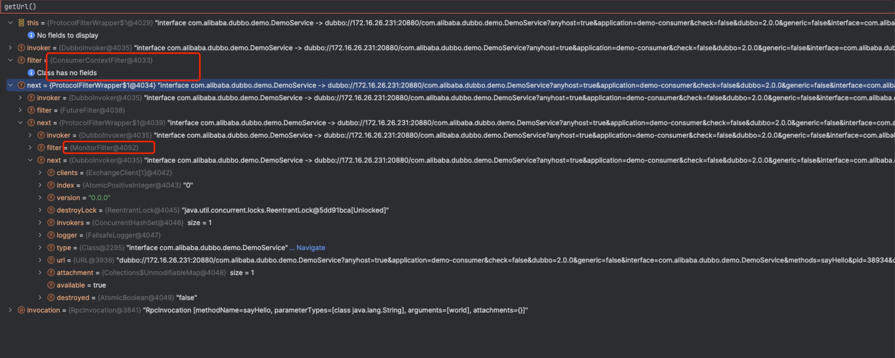


## AbstractInvoker

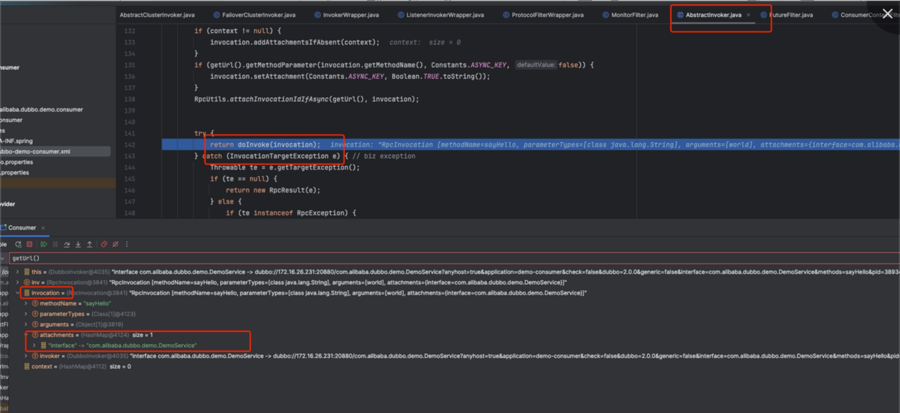


## DubboInvoker

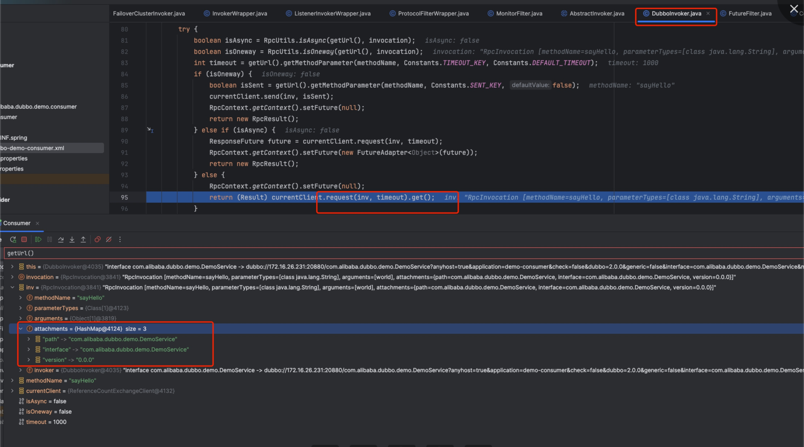

## ReferenceCountExchangeClient

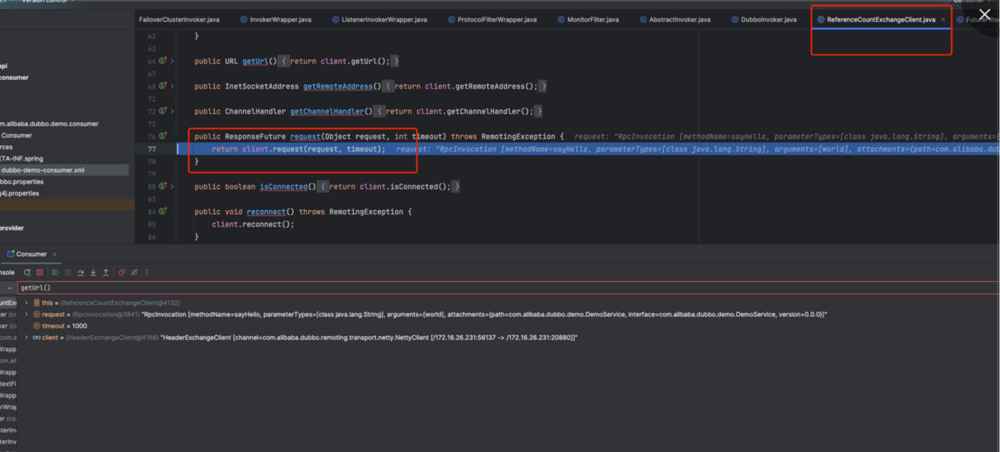


## HeaderExchangeClient

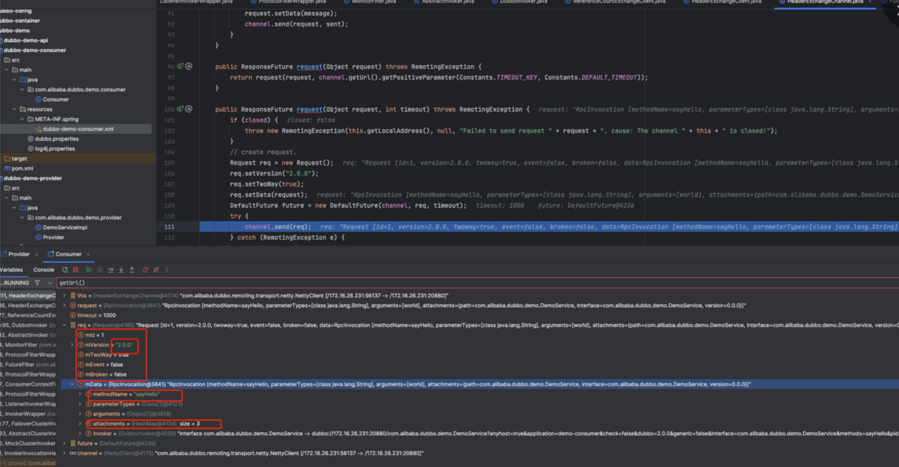


## AbstractClient

获取了Dubbo自定义的Channel，里面包装了真正的NettyChannel

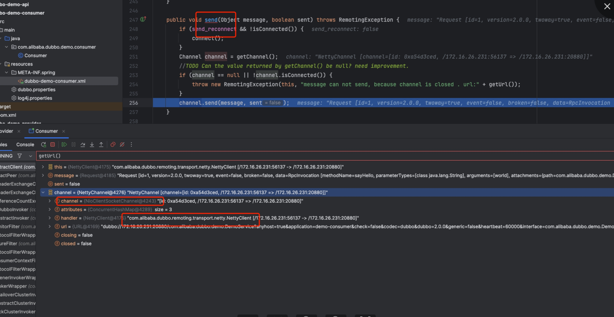


## NettyChannel

调用了真正的Netty的channel进行发送。
注意接下来这个地方要把断点停到InternalEncoder
因为接下来会走NettyPipeline进行编码。

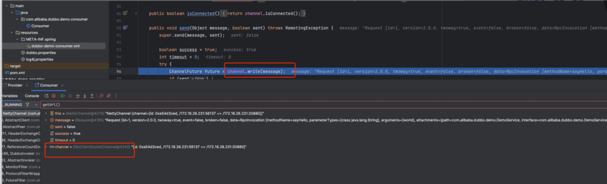

## InternalEncoder

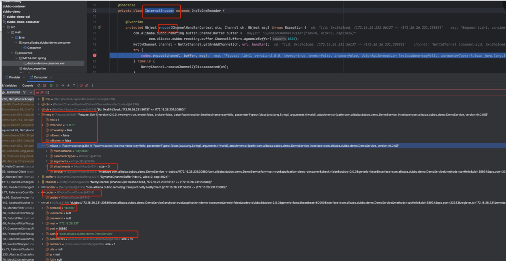


## ExchangeCodec

encodeRequest

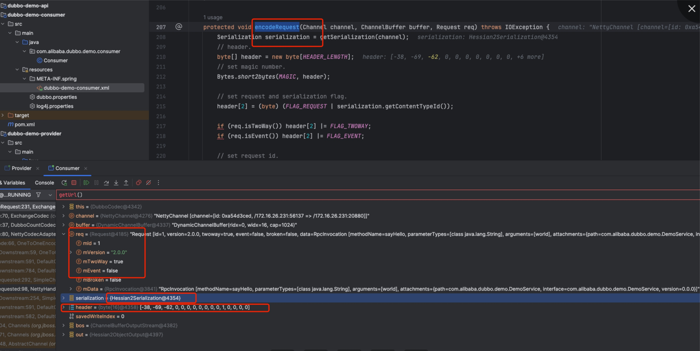


## DubboCodec 
编码和序列化 Invocation

这个地方真正将请求体的数据写进入

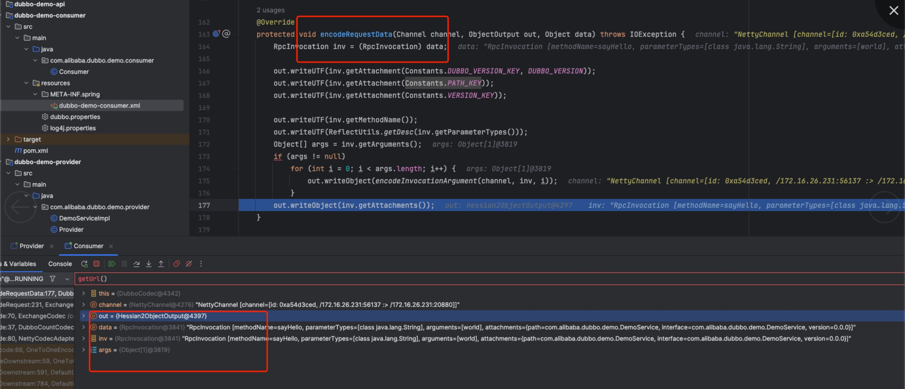


## 再回到ExchangeCodec

在请求头里面写入长度，我们的长度是185
数据后续会走NettyPipeline 发生到Provider。

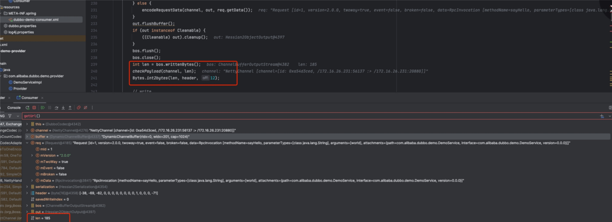


