# dubbo源码- debug consumer端收到响应流程

```版本来自dubbo 2.6.x```


## InternalDecoder

首先进行解码

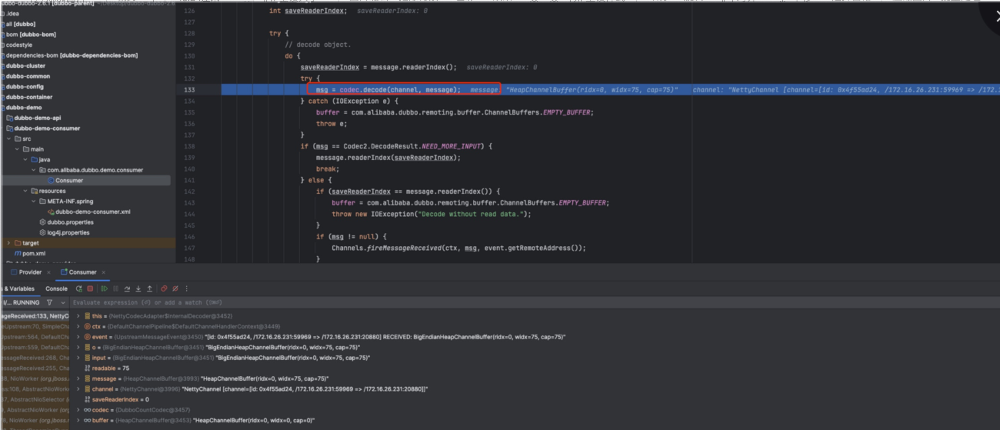


##  DubboCountCodec

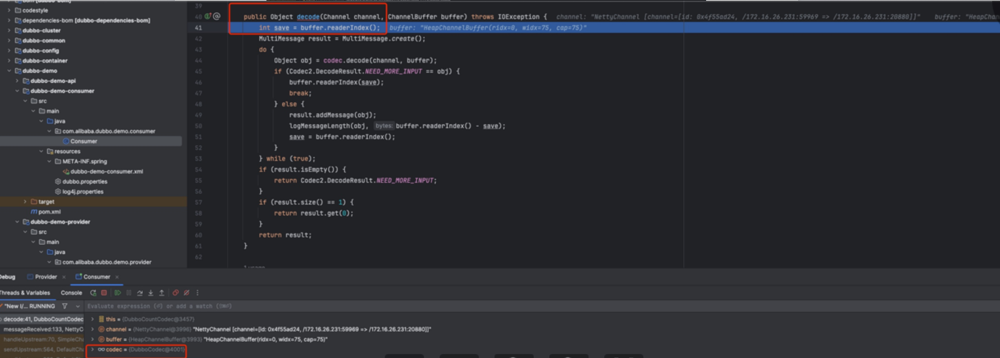


## ExchangeCodec

解码响应体
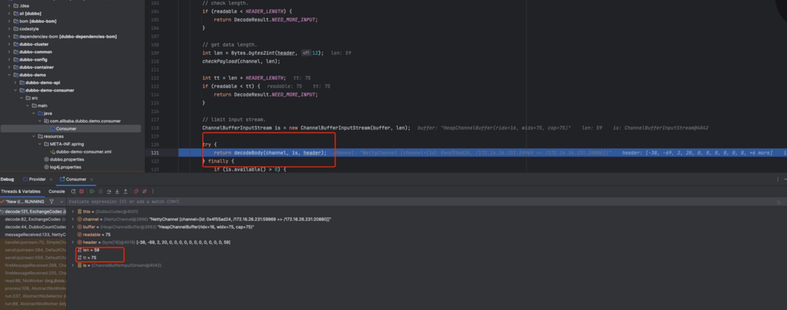


## 回到DubboCodec

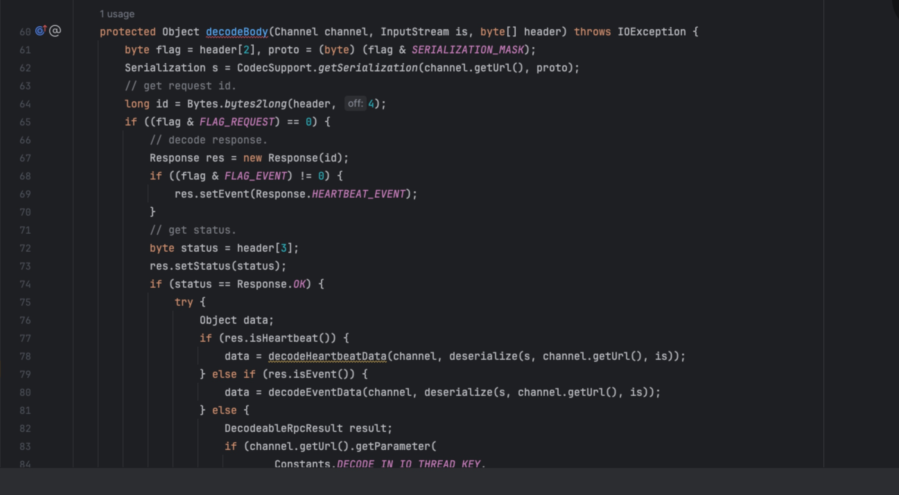


##  DecodeableRpcResult

解码 RPC响应
Flag = 1 表示响应是Ok的。
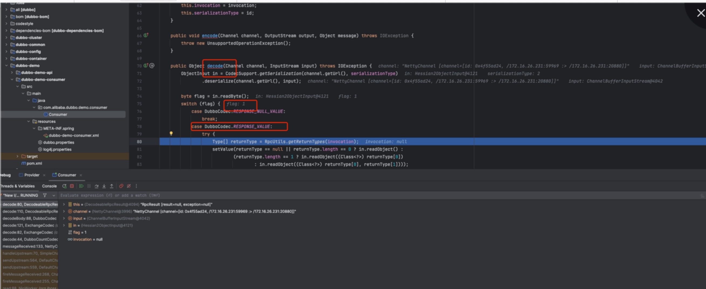


## 结果已经放到了RpcResult里面了

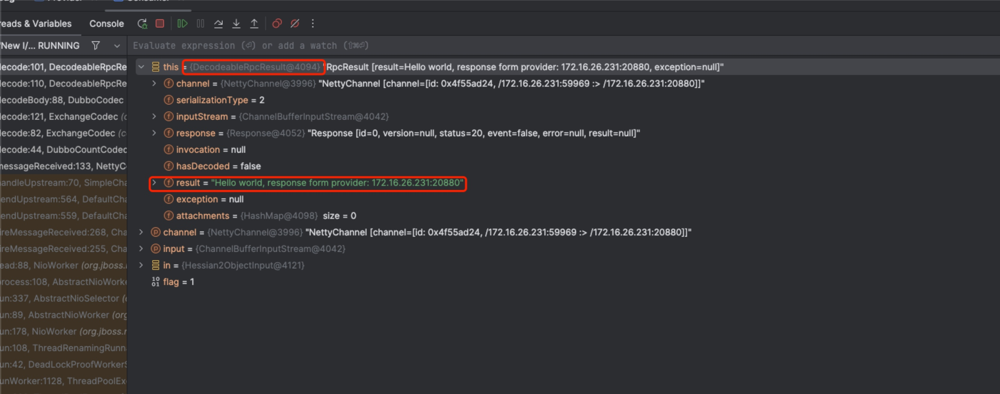


##  NettyHandler
走Netty Pipeline 跳转到messageReceived
表示已经收集到了结果，接下来相当于onReceived执行。

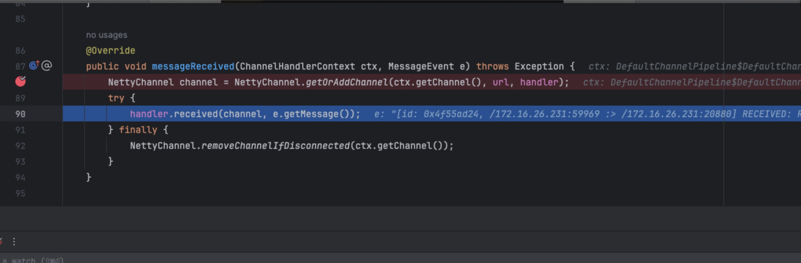


## 注意接下来会按照这个红框的顺序一层层传递。

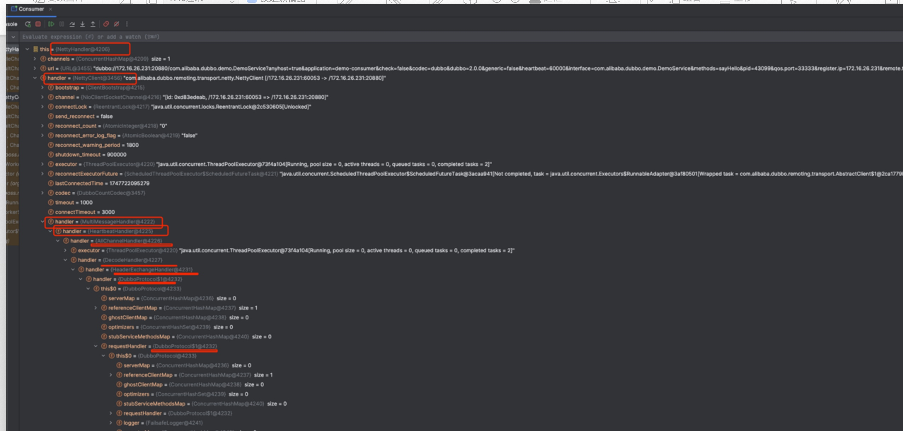

## AbstractPeer

没有做什么操作，通过里面的MultiMessageHandler 继续向后面传递

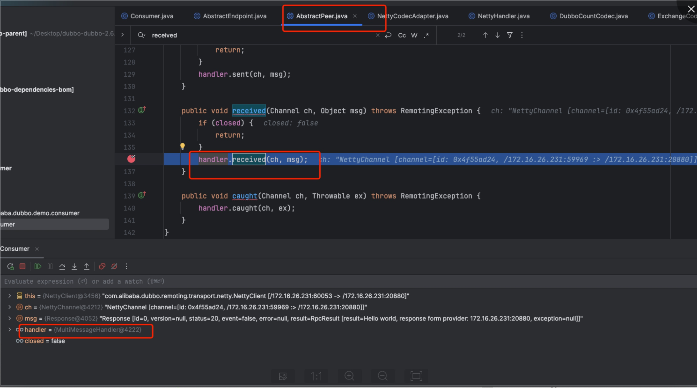


## MultiMessageHandler
 如果是MultiMessage，会一个个向后received。当前不是，所以直接跳到else
 
 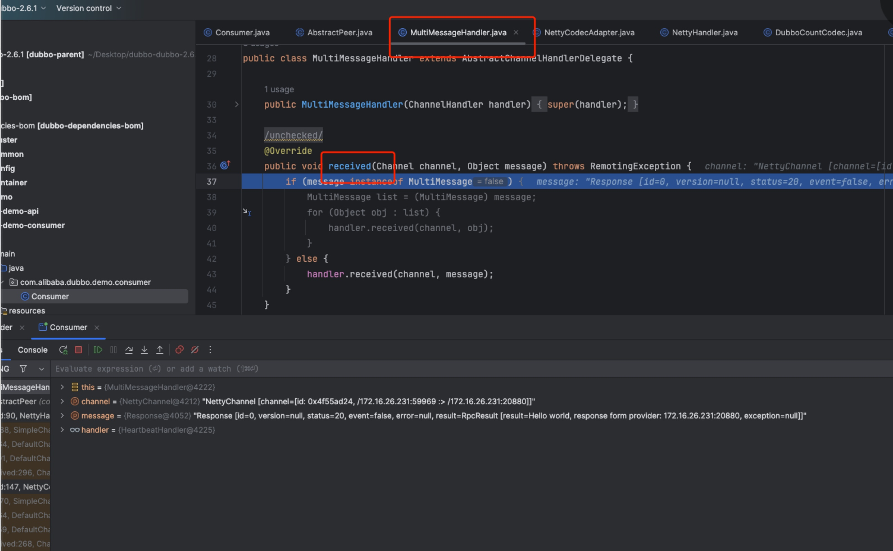


## HeartBeatHandler
设置读时间戳，如果是心跳的话，进行处理，否则继续传递

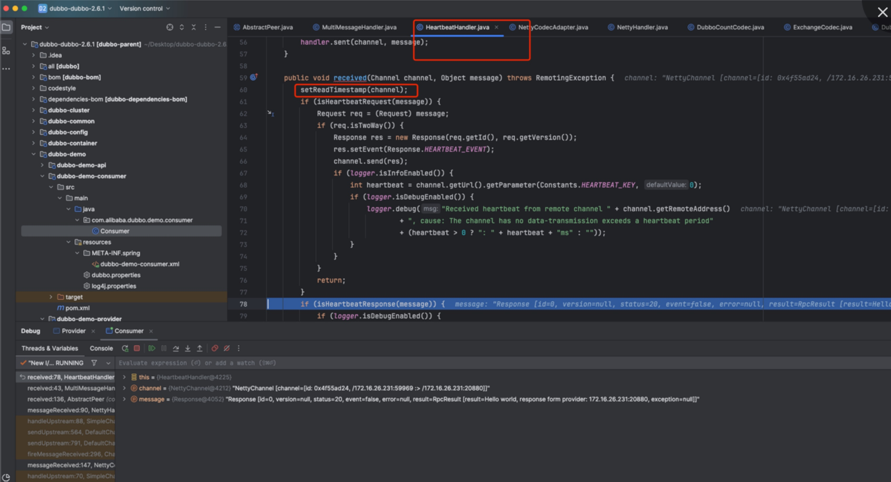


## AllChannelHandler
封装为一个ChannelEventRunnable 提交给线程池。

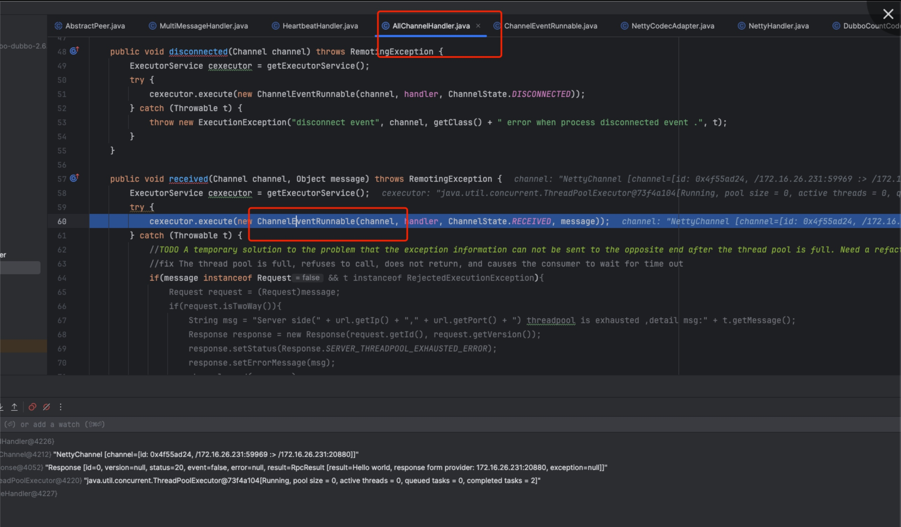


## DecodeHandler
提交给DecodeHandler 进一步解码
由于上一步已经解码了，所以这里没什么操作。

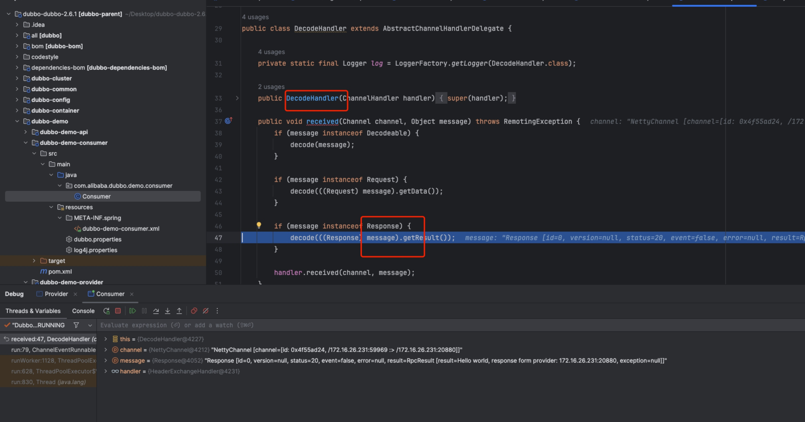


## HeaderExhchangeHandler。
写入读时间戳。

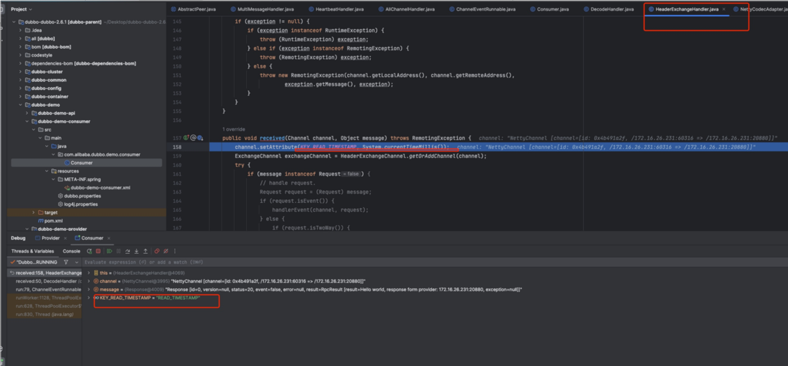


## handleResponse

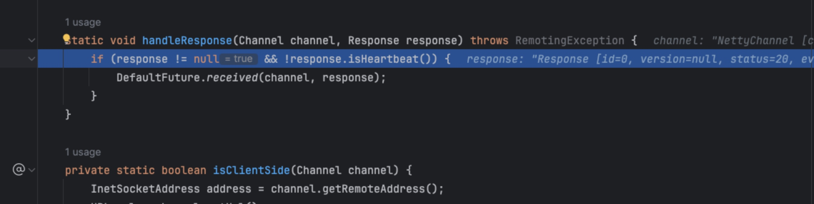


## DefaultFuture 

doReceived

设置返回值，
通知线程
触发回调。

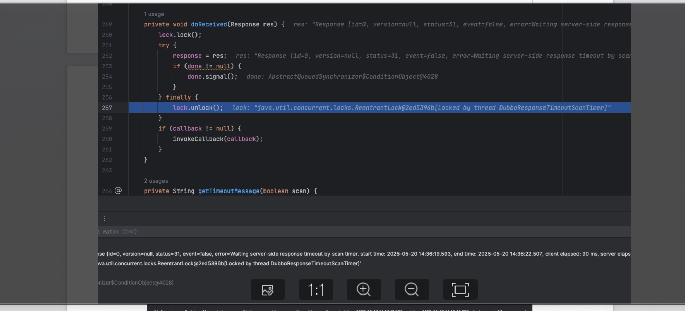


