# dubbo源码- debug provider端收到请求流程

```版本来自dubbo 2.6.x```


## InternalDecoder
首先走Netty Pipeline进行解码 

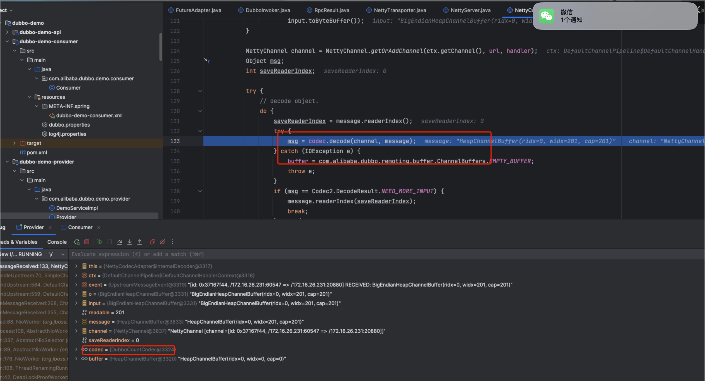


## DubboCountCodec

进一步调用DubboCodec进行解码

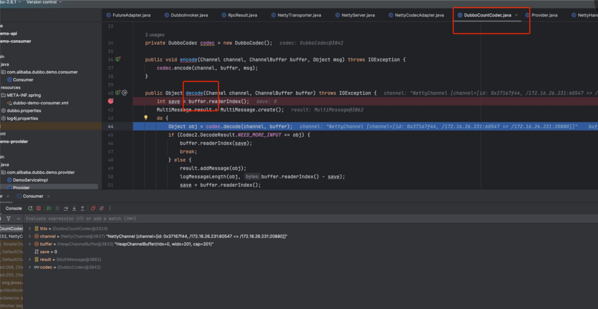


## ExchangeCodec 解码请求

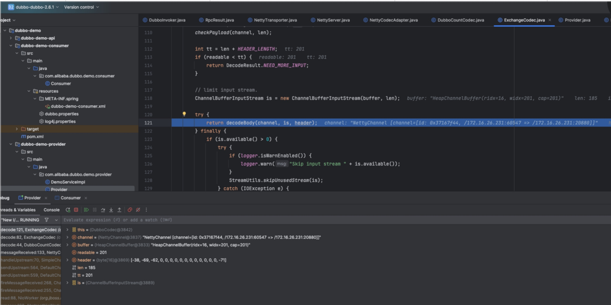


## DecodeableRpcInvocation
传递给 DecodeableRpcInvocation 解码和反序列化Request。

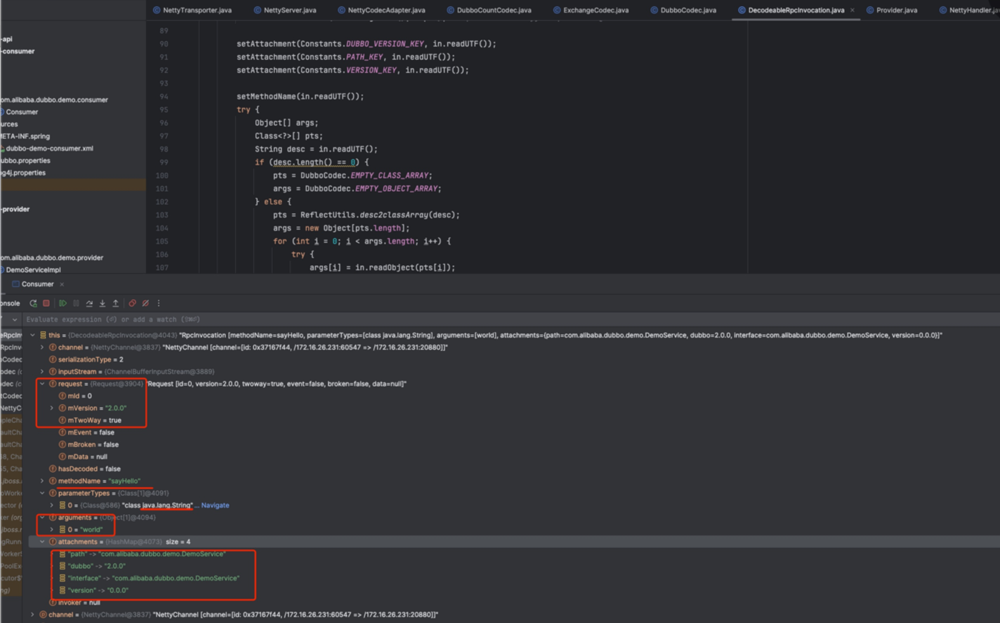


## 接下来走Dubbo流程。

会到NettyHandler， Netty解码和反序列化数据完了之后，会开始通过Dubbo各个handler进行传递。
一直到业务实现

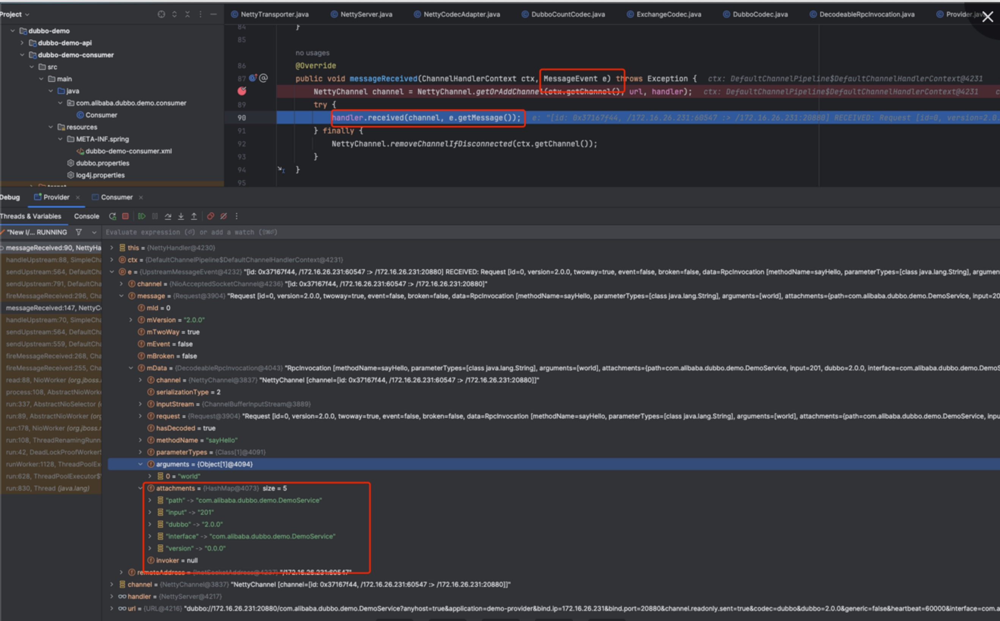


## MultiMessageHandler

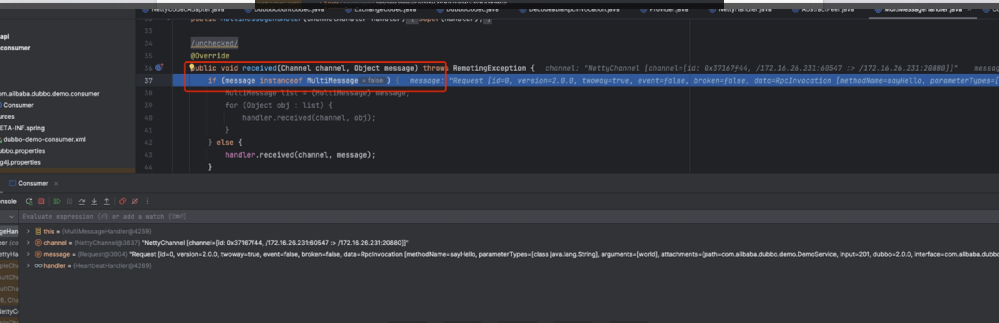


## HeartBeatHandler
设置读时间戳。
然后传递给AllChannelHandler 

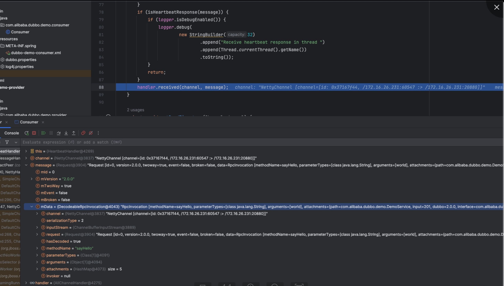

## AllChannelHandler 提交给线程池执行。

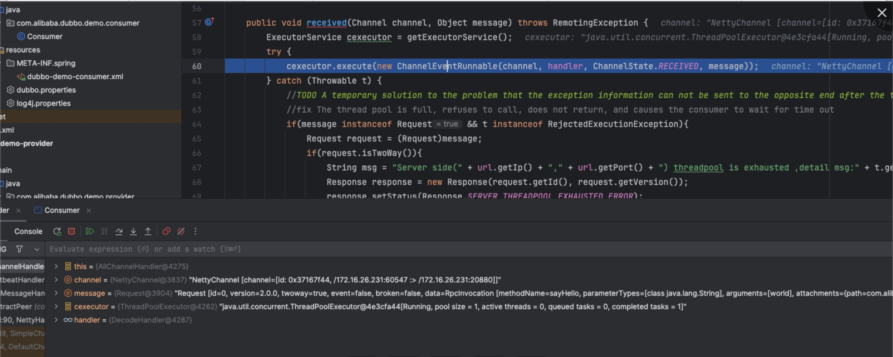


## 提交给Decodehandler
这个地方已经解码过了，所以不再继续反序列

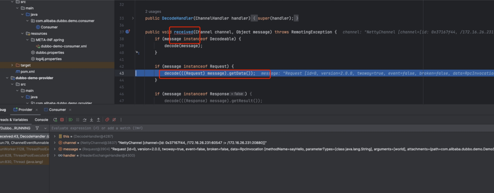


## HeaderExchangehandler

再一次设置写时间戳。


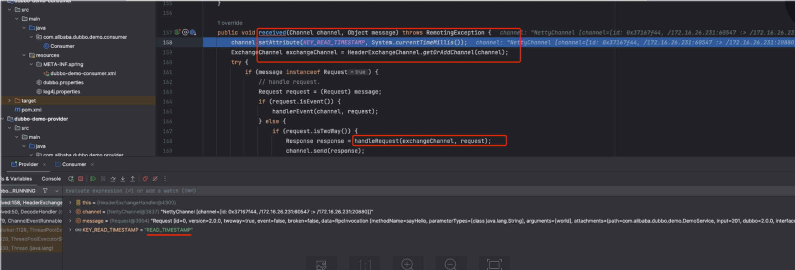


## 将数据转为request。提交给后续的handler处理。

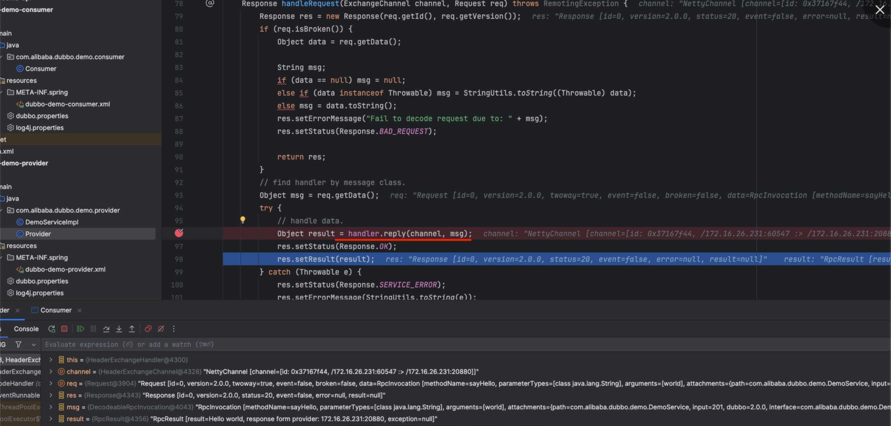


## DubboProtocol 里面的 ExchangeHandler

获取invoker 执行。
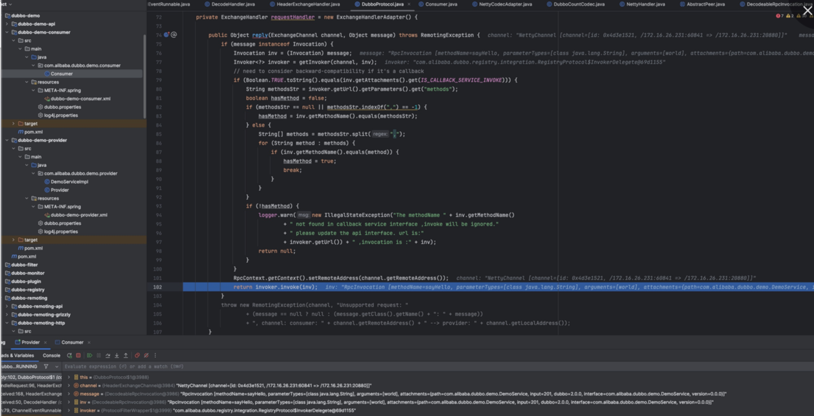


## 注意这里的Invoker。
先走FIlterChain， EchoFilter，ClassloaderFilter，GenericFilter，ContextFilter，
TraceFilter，TimeOutFilter，MonitorFilter，ExceptionFilter，
后面走到了DelegateProviderMetaDataInvoker。

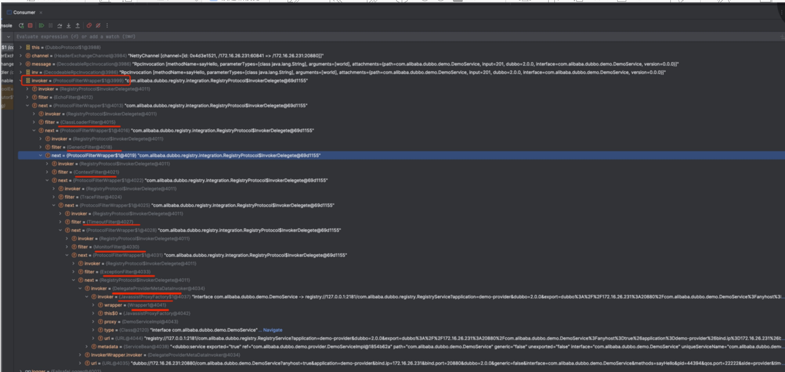


## DelegateProviderMetaDataInvoker 
没做什么操作，继续向后传递。

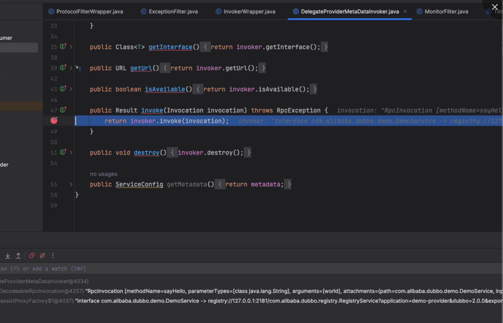


## 走到了JavaAssistFactory


调用Wrapper类 进行invoke
这个Wrapper类是一个动态编译生成的类。

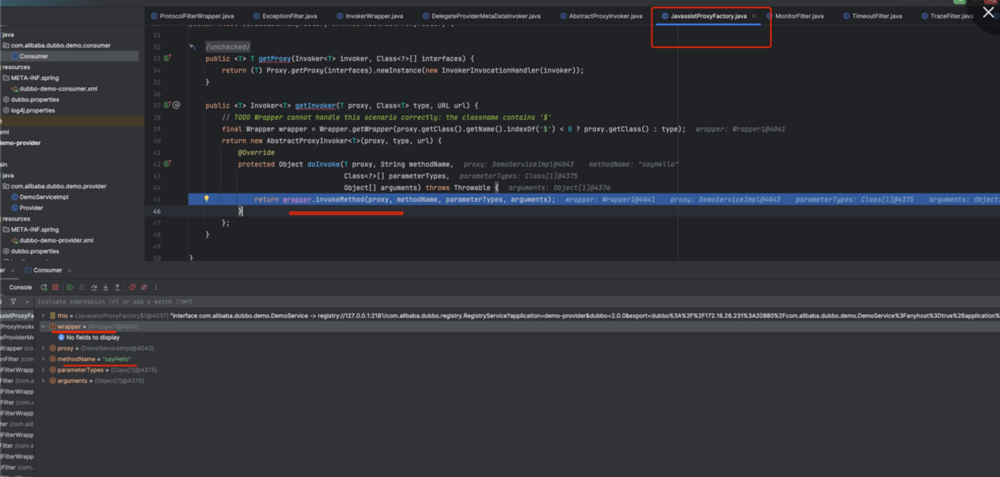


## 真实的实现 

DemoServiceImpl

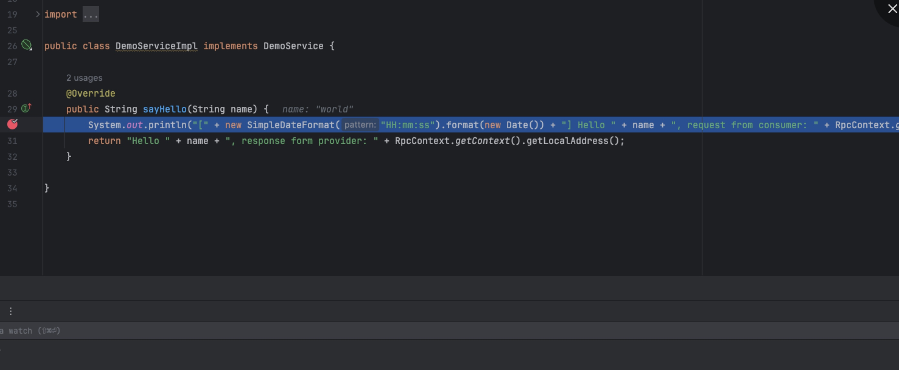


