# dubbo源码- debug provider端返回响应流程

```版本来自dubbo 2.6.x```


## DemoServiceImpl

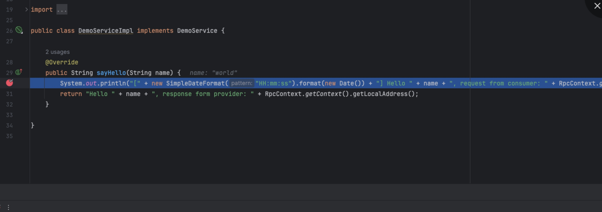


## JavaAssistFactory
向后传递

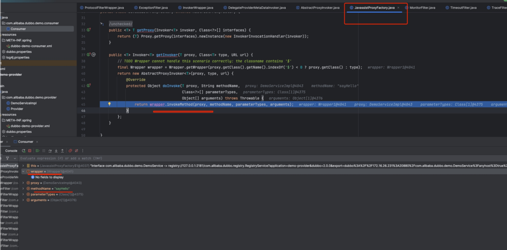


## DelegateProviderMetaDataInvoker 
没做什么操作，继续向后传递。

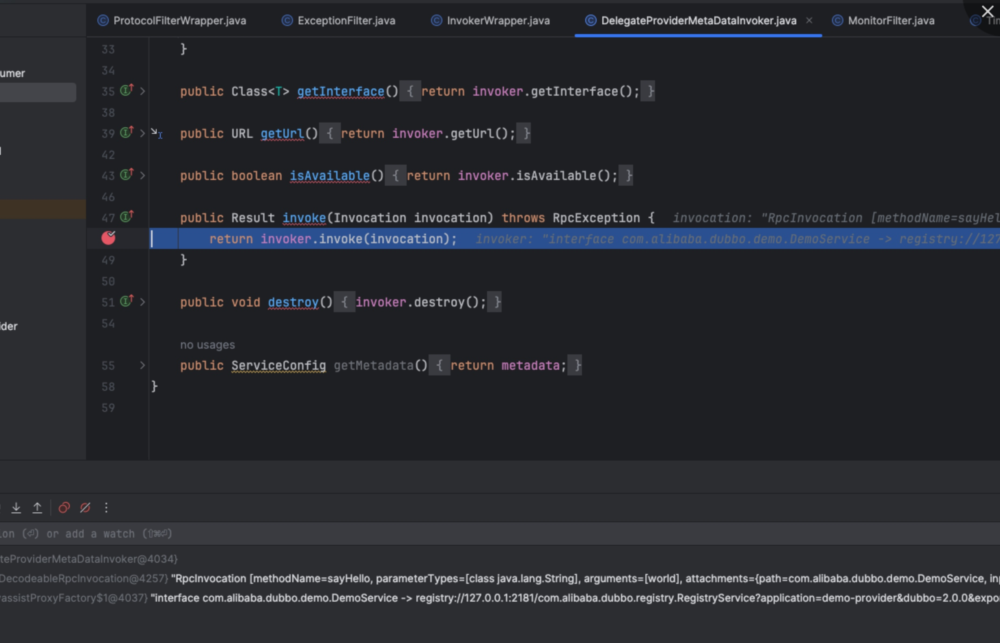


## 后面回到encode方法

先走Netty Pipeline 流程进行编码和序列化，发送到网卡。
后面 相当于调用sent方法做一些数据记录。


## NettyChannel 
先调用Netty 发送数据。

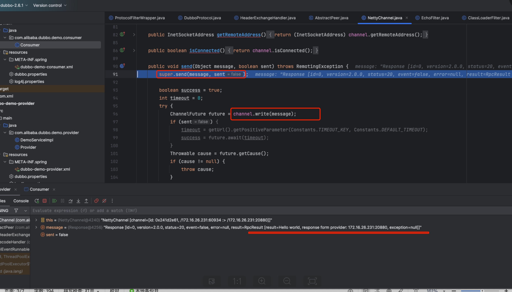


## InternalEncoder
进行编码和序列化

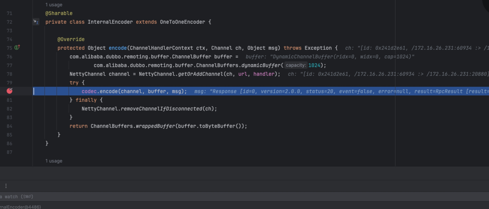


## DubboCountCodec
调用 DubboCodec

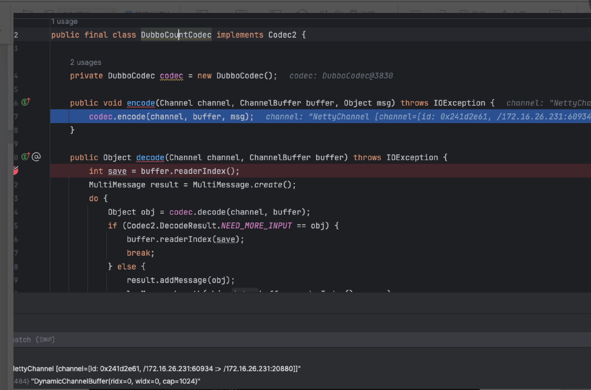


## ExchangeCodec

encodeResponse

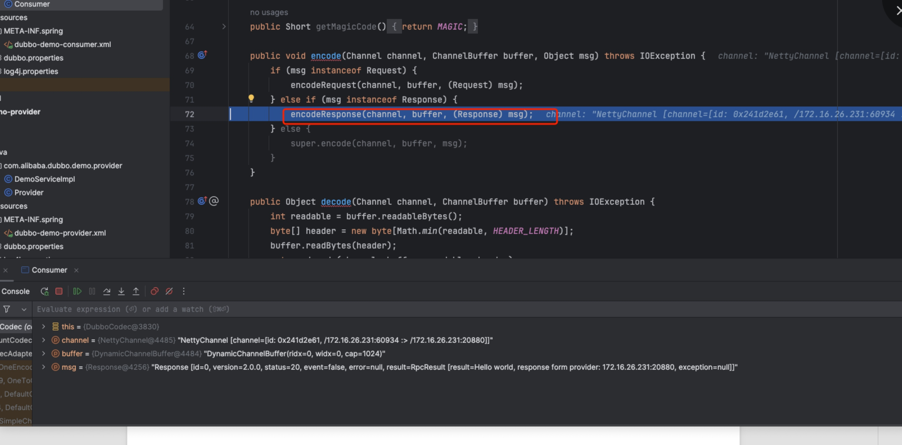

## 先按照Dubbo协议encode
最后encode 响应。

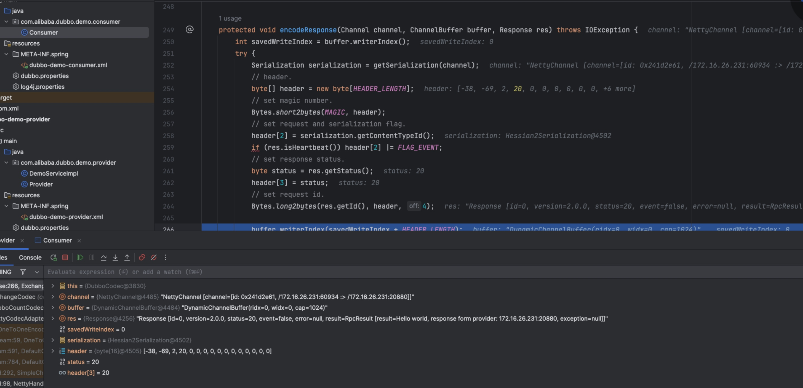


## 调用netty流程发送出去。

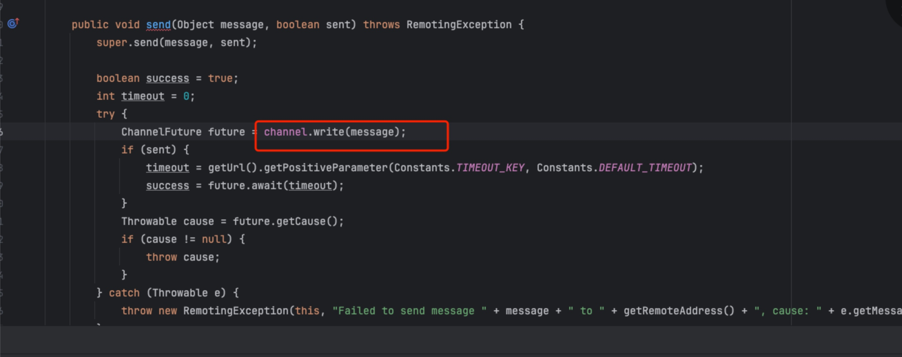

## 最后走到DubboHandler的业务流程。进行数据记录。

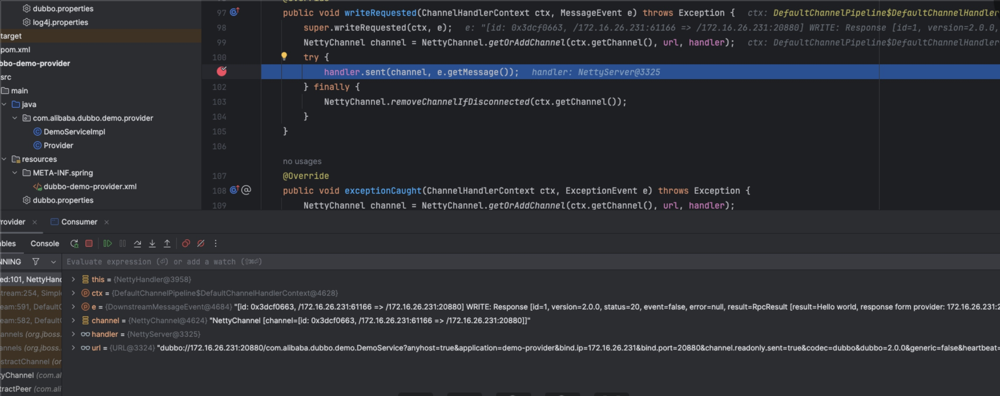


## 注意这个里面的handler，会按照这个顺序，一层层向后面传递

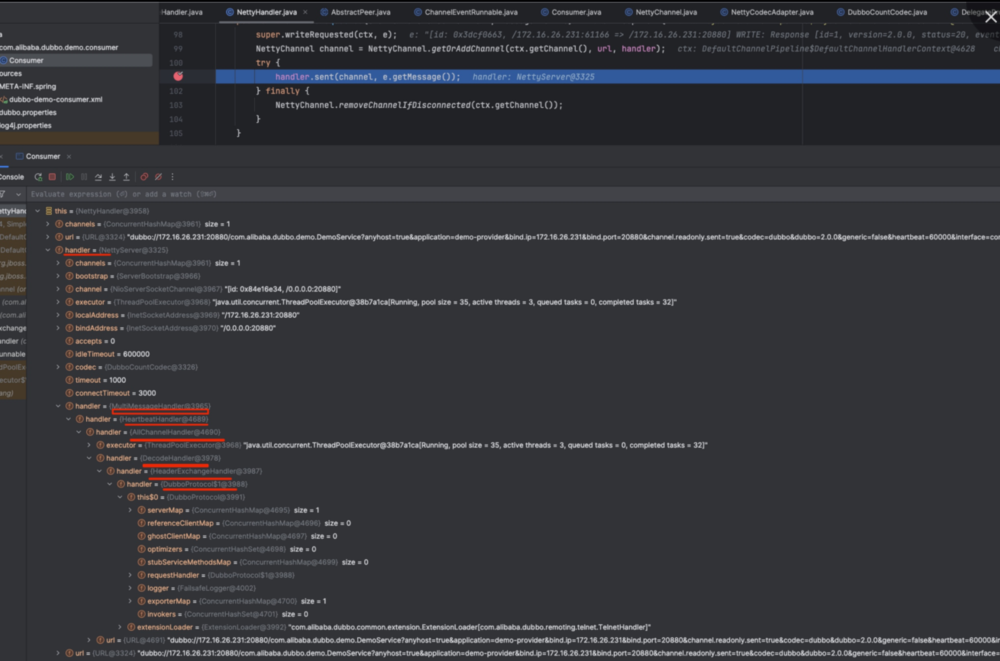


## HeartBeatHandler
设置写时间戳。继续向后传递。

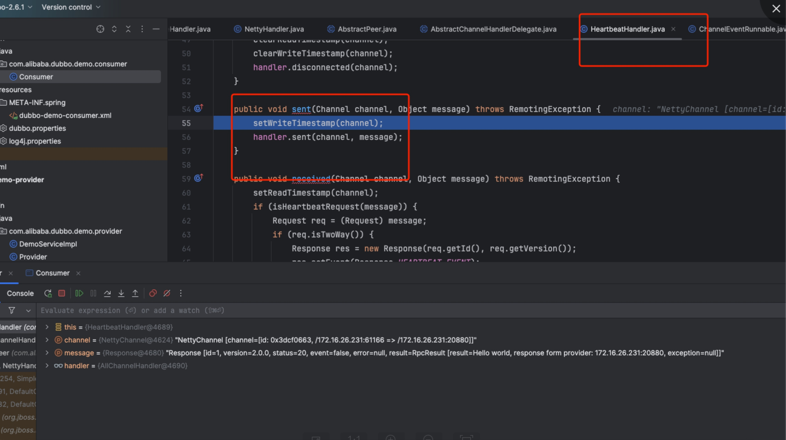


## HeaderExchangeHandler
在设置写时间戳，继续向后面传递

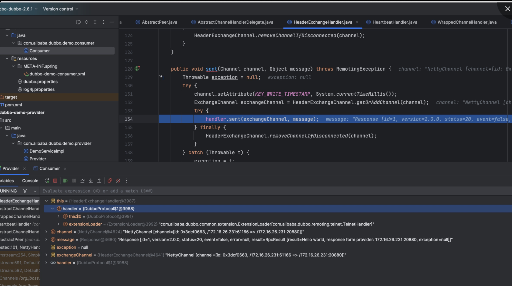


