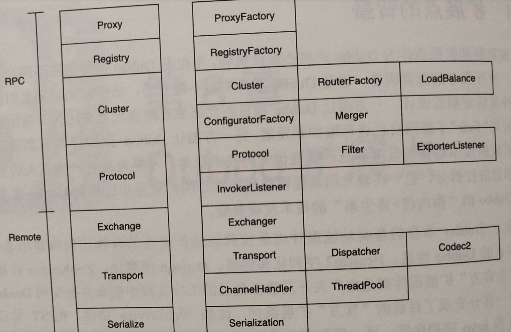

# dubbo源码-dubbo扩展点整理


## 扩展点分层



#### 说明：
* （1）dubbo扩展点分为rpc层和remote层。
* （2）每个达成里面分了多个小层，下面针对每个小层做分析。

## RPC层扩展点

### Proxy层扩展点

```Proxy层主要的扩展接口是ProxyFactory。Dubbo中的ProxyFactory有两种默认实现：Javassist和JDK，用户可以自行扩展自己的实现，如CGLIB。Dubbo默认选择Javassist作为默认字节码生成工具，主要是基于性能和使用的简易性考虑，Javassist的字节码生成效率相对于其他库更快。
```

```java
@SPI("javassist")
public interface ProxyFactory {

    /**
     * create proxy.
     *
     * 创建 Proxy ，在引用服务调用。
     *
     * @param invoker Invoker 对象
     * @return proxy
     */
    @Adaptive({Constants.PROXY_KEY})
    <T> T getProxy(Invoker<T> invoker) throws RpcException;

    /**
     * create invoker.
     *
     * 创建 Invoker ，在暴露服务时调用。
     *
     * @param <T> Service 类型
     * @param proxy Service 对象
     * @param type Service 类型
     * @param url 服务的 Dubbo URL
     * @return invoker
     */
    @Adaptive({Constants.PROXY_KEY})
    <T> Invoker<T> getInvoker(T proxy, Class<T> type, URL url) throws RpcException;
}
```


| 扩展key名	 | 扩展类名
                                                   |
|------------|-------------------------------------------------------------|
| jdk	       | org.apache.dubbo.rpc.proxy.jdk.JdkProxyFactory
             |
| javassist  | org.apache.dubbo.rpc.proxy.javassist.JavassistProxyFactory
 |


### Registry层扩展点
```
Registry层可以理解为注册层，这一层中最重要的扩展点就是org.apache.dubbo.registry.RegistryFactory。整个框架的注册与服务发现客户端都是由这个扩展点负责创建的
```

```java
@SPI("dubbo")
public interface RegistryFactory {

    /**
     * Connect to the registry
     * <p>
     * Connecting the registry needs to support the contract: <br>
     * 1. When the check=false is set, the connection is not checked, otherwise the exception is thrown when disconnection <br>
     * 2. Support username:password authority authentication on URL.<br>
     * 3. Support the backup=10.20.153.10 candidate registry cluster address.<br>
     * 4. Support file=registry.cache local disk file cache.<br>
     * 5. Support the timeout=1000 request timeout setting.<br>
     * 6. Support session=60000 session timeout or expiration settings.<br>

     * @param url 注册中心地址，不允许为空
     * @return 注册中心引用，总不返回空
     */
    @Adaptive({"protocol"})
    Registry getRegistry(URL url);
}
```


| 扩展key名	 | 扩展类名                                                      |
|------------|---------------------------------------------------------------|
| zookeeper	 | org.apache.dubbo.registry.zookeeper.ZookeeperRegistryFactory
 |
| redis      | org.apache.dubbo.registry.redis.RedisRegistryFactory
         |
| multicast	 | org.apache.dubbo.registry.multicast.MulticastRegistryFactory
 |
| dubbo      | org.apache.dubbo.registry.multicast.MulticastRegistryFactory
 |


### Cluster层扩展点

```Cluster层负责了整个Dubbo框架的集群容错，涉及的扩展点较多，包括容错（Cluster）、路由（Router）、负载均衡（LoadBalnce）、配置管理工厂（ConfiguratorFactory）和合并器（Merger）。

Cluster主要负责一些容错的策略，也是整个集群容错的入口。当远程调用失败后，由Cluster负责重试、快速失败等，整个过程对上层透明。默认为failover
```

```java
@SPI(FailoverCluster.NAME)
public interface Cluster {

    /**
     * Merge the directory invokers to a virtual invoker.
     *
     * 基于 Directory ，创建 Invoker 对象，实现统一、透明的 Invoker 调用过程
     *
     * @param directory Directory 对象
     * @param <T>  泛型
     * @return cluster invoker
     * @throws RpcException
     */
    @Adaptive
    <T> Invoker<T> join(Directory<T> directory) throws RpcException;
}
```


| 扩展key名	 | 扩展类名
                                             |
|------------|-------------------------------------------------------|
| failover   | org.apache.dubb.rpc.cluster.support.FailoverCluster
  |
| failfast   | org.apache.dubb.rpc.cluster.support.FailfastCluster
  |
| failsafe   | org.apache.dubb.rpc.cluster.support.FailsafeCluster
  |
| failback   | org.apache.dubb.rpc.cluster.support.FailbackCluster
  |
| forking    | org.apache.dubb.rpc.cluster.support.ForkingCluster
   |
| available  | org.apache.dubb.rpc.cluster.support.AvailableCluster
 |
| broadcast  | org.apache.dubb.rpc.cluster.support.BroadcastCluster
 |


### RouterFactory扩展点：
```
RouterFactory是一个工厂类，就是用于创建不同的Router。假设接口A有多个服务提供者提供服务，如果配置了路由规则（某个消费者只能调用某几个服务提供者），则Router会过滤其他服务提供者，只留下符合路由规则的服务提供者列表。
```

```java
@SPI
public interface RouterFactory {

    /**
     * Create router.
     *
     * 创建 Router 对象
     *
     * @param url
     * @return router
     */
    @Adaptive("protocol")
    Router getRouter(URL url);
}
```


| 扩展key名	 | 扩展类名
                                                             |
|------------|-----------------------------------------------------------------------|
| file       | org.apache.dubbo.rpc.cluster.router.file.FileRouterFacttory
          |
| script     | org.apache.dubbo.rpc.cluster.router.script.ScriptRouterFactory
       |
| condition  | org.apache.dubbo.rpc.cluster.router.condition.ConditionRouterFactory
 |


### LoadBalance扩展点：

```
LoadBalance是Dubbo框架中的负载均衡策略扩展点，框架中已经内置随机（Random）、轮询（RoundRobin）、最小连接数（LeastActive）、一致性Hash（ConsistenHash）这几种负载均衡策略，默认使用随机负载均衡。
```

```java
@SPI(RandomLoadBalance.NAME)
public interface LoadBalance {

    /**
     * select one invoker in list.
     *     *
     * @param invokers   invokers.
     * @param url        refer url
     * @param invocation invocation.
     * @return selected invoker.
     */
    @Adaptive("loadbalance")
    <T> Invoker<T> select(List<Invoker<T>> invokers, URL url, Invocation invocation) throws RpcException;

}
```


| 扩展key名	     | 扩展类名
                                                          |
|----------------|--------------------------------------------------------------------|
| random         | org.apache.dubbo.rpc.cluster.loadbalane.RandomLoadBalance
         |
| roundrobin     | org.apache.dubbo.rpc.cluster.loadbalane.RoundRobinLoadBalance
     |
| leastactive    | org.apache.dubbo.rpc.cluster.loadbalane.LeastActiveLoadBalance
    |
| consistenthash | org.apache.dubbo.rpc.cluster.loadbalane.ConsistentHashLoadBalance
 |


### ConfiguratorFactory:
```
ConfiguratorFactory是创建配置实例的工厂类，用于更新dubbo集群的配置参数
默认的两种实现，OverrideConfigurator会直接把配置心中的参数覆盖本地的参数；
AbsentConfigurator会先看本地是否存在该配置，没有则新增本地配置，如果已经存在则不会覆盖。
```

```java
@SPI
public interface ConfiguratorFactory {

    /**
     * get the configurator instance.
     *
     * @param url - configurator url.
     * @return configurator instance.
     */
    @Adaptive("protocol")
    Configurator getConfigurator(URL url);

}
```


| 扩展key名	 | 扩展类名
                                                                       |
|------------|---------------------------------------------------------------------------------|
| override	  | org.apache.dubbo.rpc.cluster.configurator.override.OverrideConfiguratorFactory
 |
| absent     | org.apache.dubbo.rpc.cluster.configurator.absent.AbsentConfiguratorFactory
     |


## Remte层扩展点

```
Remote处于整个Dubbo框架的底层，设计协议、数据的交换、网络的传输、序列化、线程池等
```

### Protocol扩展点：

```java
@SPI("dubbo")
public interface Protocol {

    /**
     * Get default port when user doesn't config the port.
     *
     * @return default port
     */
    int getDefaultPort();

    /**
     * Export service for remote invocation: <br>
     * 1. Protocol should record request source address after receive a request:
     * RpcContext.getContext().setRemoteAddress();<br>
     * 2. export() must be idempotent, that is, there's no difference between invoking once and invoking twice when
     * export the same URL<br>
     * 3. Invoker instance is passed in by the framework, protocol needs not to care <br>
     *
     * @param <T>     Service type
     * @param invoker Service invoker
     * @return exporter reference for exported service, useful for unexport the service later
     * @throws RpcException thrown when error occurs during export the service, for example: port is occupied
     */
    /**
     * 暴露远程服务：<br>
     * 1. 协议在接收请求时，应记录请求来源方地址信息：RpcContext.getContext().setRemoteAddress();<br>
     * 2. export() 必须是幂等的，也就是暴露同一个 URL 的 Invoker 两次，和暴露一次没有区别。<br>
     * 3. export() 传入的 Invoker 由框架实现并传入，协议不需要关心。<br>
     *
     * @param <T>     服务的类型
     * @param invoker 服务的执行体
     * @return exporter 暴露服务的引用，用于取消暴露
     * @throws RpcException 当暴露服务出错时抛出，比如端口已占用
     */
    @Adaptive
    <T> Exporter<T> export(Invoker<T> invoker) throws RpcException;

    /**
     * Refer a remote service: <br>
     * 1. When user calls `invoke()` method of `Invoker` object which's returned from `refer()` call, the protocol
     * needs to correspondingly execute `invoke()` method of `Invoker` object <br>
     * 2. It's protocol's responsibility to implement `Invoker` which's returned from `refer()`. Generally speaking,
     * protocol sends remote request in the `Invoker` implementation. <br>
     * 3. When there's check=false set in URL, the implementation must not throw exception but try to recover when
     * connection fails.
     *
     * @param <T>  Service type
     * @param type Service class
     * @param url  URL address for the remote service
     * @return invoker service's local proxy
     * @throws RpcException when there's any error while connecting to the service provider
     */
    /**
     * 引用远程服务：<br>
     * 1. 当用户调用 refer() 所返回的 Invoker 对象的 invoke() 方法时，协议需相应执行同 URL 远端 export() 传入的 Invoker 对象的 invoke() 方法。<br>
     * 2. refer() 返回的 Invoker 由协议实现，协议通常需要在此 Invoker 中发送远程请求。<br>
     * 3. 当 url 中有设置 check=false 时，连接失败不能抛出异常，并内部自动恢复。<br>
     *
     * @param <T>  服务的类型
     * @param type 服务的类型
     * @param url  远程服务的URL地址
     * @return invoker 服务的本地代理
     * @throws RpcException 当连接服务提供方失败时抛出
     */
    @Adaptive
    <T> Invoker<T> refer(Class<T> type, URL url) throws RpcException;

    /**
     * Destroy protocol: <br>
     * 1. Cancel all services this protocol exports and refers <br>
     * 2. Release all occupied resources, for example: connection, port, etc. <br>
     * 3. Protocol can continue to export and refer new service even after it's destroyed.
     */
    /**
     * 释放协议：<br>
     * 1. 取消该协议所有已经暴露和引用的服务。<br>
     * 2. 释放协议所占用的所有资源，比如连接和端口。<br>
     * 3. 协议在释放后，依然能暴露和引用新的服务。<br>
     */
    void destroy();
}
```


常见的Protocol扩展点：
| 扩展点key名 | 扩展类名
                                          |
|-------------|----------------------------------------------------|
| injvm	      | org.apache.dubbo.rpc.protocol.injvm.InjvmProtocol
 |
| dubbo       | org.apache.dubbo.rpc.protocol.dubbo.DubboProtocol
 |
| thrift      | org.apache.dubbo.rpc.protocol.ThriftProtocol
      |


### Filter扩展点：

```
Filter是Dubbo的过滤器扩展点，可以自定义过滤器，在Invoekr调用前后执行自定义的逻辑。
```

```java
@SPI
public interface Filter {

    /**
     * do invoke filter.
     * <p>
     * <code>
     * // before filter
     * Result result = invoker.invoke(invocation);
     * // after filter
     * return result;
     * </code>
     *
     * @param invoker    service
     * @param invocation invocation.
     * @return invoke result.
     * @throws RpcException 发生 RpcException 异常
     * @see com.alibaba.dubbo.rpc.Invoker#invoke(Invocation)
     */
    Result invoke(Invoker<?> invoker, Invocation invocation) throws RpcException;

}
```

### ExprterListener / InvokerListener 扩展点：
```
ExprterListener和InvokerListener这两个扩展点非常相似，ExporterListener是在暴露和取消暴露服务时提供回调；InvokerListener则是在服务的引用于销毁时提供回调。
```

```java
@SPI
public interface ExporterListener {

    /**
     * The exporter exported.
     *
     * 当服务暴露完成
     *
     * @param exporter Exporter
     * @throws RpcException RPC 异常
     * @see com.alibaba.dubbo.rpc.Protocol#export(Invoker)
     */
    void exported(Exporter<?> exporter) throws RpcException;

    /**
     * The exporter unexported.
     *
     * 当服务取消暴露完成
     *
     * @param exporter Exporter
     * @throws RpcException RPC 异常
     * @see com.alibaba.dubbo.rpc.Exporter#unexport()
     */
    void unexported(Exporter<?> exporter);
}
```

```java
@SPI
public interface InvokerListener {

    /**
     * The invoker referred
     *
     * 当服务引用完成
     *
     * @param invoker Invoker 对象
     * @throws RpcException
     * @see com.alibaba.dubbo.rpc.Protocol#refer(Class, URL)
     */
    void referred(Invoker<?> invoker) throws RpcException;

    /**
     * The invoker destroyed.
     *
     * 当服务销毁引用完成
     *
     * @param invoker Invoker 对象
     * @see com.alibaba.dubbo.rpc.Invoker#destroy()
     */
    void destroyed(Invoker<?> invoker);
}
```

### Transporter扩展接口：

```Transporter屏蔽了通信框架接口、实现的不同，使用同一的通信接口。
bind方法会生成一个服务，监听来自客户端的请求；connect方法则会连接到一个服务。两个方法上都有@Adaptive注解，首先会根据URL中server的参数值去匹配实现类，如果匹配不到则根据transporter参数去匹配实现类。默认的实现是netty4.

```

```java
@SPI("netty")
public interface Transporter {

    /**
     * Bind a server.
     *
     * 绑定一个服务器
     *
     * @param url     server url
     * @param handler 通道处理器
     * @return server 服务器
     * @throws RemotingException 当绑定发生异常时
     * @see com.alibaba.dubbo.remoting.Transporters#bind(URL, Receiver, ChannelHandler)
     */
    @Adaptive({Constants.SERVER_KEY, Constants.TRANSPORTER_KEY})
    Server bind(URL url, ChannelHandler handler) throws RemotingException;

    /**
     * Connect to a server.
     *
     * 连接一个服务器，即创建一个客户端
     *
     * @param url     server url 服务器地址
     * @param handler 通道处理器
     * @return client 客户端
     * @throws RemotingException 当连接发生异常时
     * @see com.alibaba.dubbo.remoting.Transporters#connect(URL, Receiver, ChannelListener)
     */
    @Adaptive({Constants.CLIENT_KEY, Constants.TRANSPORTER_KEY})
    Client connect(URL url, ChannelHandler handler) throws RemotingException;
}
```


| 扩展点key名 | 扩展类名                                                        |
|-------------|-----------------------------------------------------------------|
| mina        | org.apache.dubbo.remoting.transport.mina.MinaTransporter
       |
| netty       | org.apache.dubbo.remoting.transport.netty.NettyTransporter
     |
| netty4      | org.apache.dubbo.remoting.transport.netty4.NettyTransporter
    |
| grizzly     | org.apache.dubbo.remoting.transport.grizzly.GrizzlyTransporter
 |


### Dispatcher扩展接口：
```java
，例如：发起I/O请求查询数据库、请求远程数据等，则需要使用线程池。因为I/O速度相对CPU是很慢的，如果不适用线程池，则线程会因为I/O导致同步阻塞等待。Dispatcher扩展接口通过不同的派发策略，把工作派发到不同的线程池，以此来应对不用的业务场景。
```

```java
@SPI(AllDispatcher.NAME)
public interface Dispatcher {

    /**
     * dispatch the message to threadpool.
     *
     * @param handler 通道处理器
     * @param url
     * @return channel handler
     */
    @Adaptive({Constants.DISPATCHER_KEY, "dispather", "channel.handler"})
    // The last two parameters are reserved for compatibility with the old configuration
    ChannelHandler dispatch(ChannelHandler handler, URL url);

}
```


| 扩展key名	 | 扩展类名
                                                                              |
|------------|----------------------------------------------------------------------------------------|
| all        | org.apache.dubbo.remoting.transport.dispatcher.all.AllDispatcher
                      |
| direct     | org.apache.dubbo.remoting.transport.dispatcher.direct.DirectDispatcher
                |
| message    | org.apache.dubbo.remoting.transport.dispatcher.message.MessageOnlyDispatcher
          |
| execution  | org.apache.dubbo.remoting.transport.dispatcher.execution.ExecutionDispatch
            |
| connection | org.apache.dubbo.remoting.transport.dispatcher.connection.ConnectionOrderedDispatcher
 |


### Serialize层扩展点
```Serialize层主要实现具体的对象序列化，只有Serialization一个扩展接口。Serialization是具体的对象序列化扩展接口，即把对象序列化成可以通过网络进行传输的二进制流。
默认为 hessian2
| 扩展key名	 | 扩展类名
                                                             |
|------------|-----------------------------------------------------------------------|
| fastjson   | org.apache.dubbo.common.serialize.fastjson.FastJsonSerialization
     |
| fst        | org.apache.dubbo.common.serialize.fst.FstSerialization
               |
| hessian2   | org.apache.dubbo.common.serialize.hessian2.Hessian2Serialization
     |
| java       | org.apache.dubbo.common.serialize.java.JavaSerialization
             |
| kryo       | org.apache.dubbo.common.serialize.kryo.KryoSerialization
             |
| protostuff | org.apache.dubbo.common.serialize.protostuff.ProtostuffSerialization
 |


```

```java
@SPI("hessian2")
public interface Serialization {

    /**
     * get content type id
     *
     * 获得内容类型编号
     *
     * @return content type id
     */
    byte getContentTypeId();

    /**
     * get content type
     *
     * 获得内容类型名
     *
     * @return content type
     */
    String getContentType();

    /**
     * create serializer
     *
     * 创建 ObjectOutput 对象，序列化输出到 OutputStream
     *
     * @param url URL
     * @param output 输出流
     * @return serializer
     * @throws IOException 当发生 IO 异常时
     */
    @Adaptive
    ObjectOutput serialize(URL url, OutputStream output) throws IOException;

    /**
     * create deserializer
     *
     * 创建 ObjectInput 对象，从 InputStream 反序列化
     *
     * @param url URL
     * @param input 输入流
     * @return deserializer
     * @throws IOException 当发生 IO 异常时
     */
    @Adaptive
    ObjectInput deserialize(URL url, InputStream input) throws IOException;

}
```

