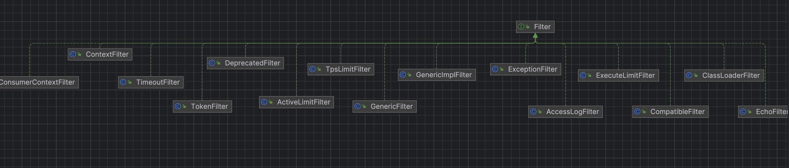

# dubbo源码-filter层


### filter与其子类




### Filter

```java
@SPI
public interface Filter {

    /**
     * do invoke filter.
     * <p>
     * <code>
     * // before filter
     * Result result = invoker.invoke(invocation);
     * // after filter
     * return result;
     * </code>
     *
     * @param invoker    service
     * @param invocation invocation.
     * @return invoke result.
     * @throws RpcException 发生 RpcException 异常
     * @see com.alibaba.dubbo.rpc.Invoker#invoke(Invocation)
     */
    Result invoke(Invoker<?> invoker, Invocation invocation) throws RpcException;

}
```

#### 说明：
* Dubbo中的Filter实现是 专门为服务提供方和服务消费方调用过程进行拦截，Dubbo本身的大多功能均基于此扩展点实现，每次远程方法执行，该拦截都会被执行.

* Dubbo的Filter实现入口是 在ProtocolFilterWrapper，因为ProtocolFilterWrapper是Protocol的包装类，所以会在加载的Extension的时候被自动包装进来，该封装器实现了Protocol接口，并提供了一个参数类型为Protocol的构造方法。Dubbo依据这个构造方法识别出封装器，并将该封装器作为其他Protocol接口实现的代理。


### ProtocolFilterWrapper

#### buildInvokerChain

```java
    /**
     * 创建带 Filter 链的 Invoker 对象
     * 注意这个是一个典型的装饰者模式。
     * 不过装饰器链条上的每个节点都是一个匿名内部类Invoker实例。
     *
     * （1）每个节点invoker持有一个Filter引用，一个下级invoker节点引用以及实际调用的invoker实例
     *      （虽然持有但并不实际调用，仅仅是提供获取实际invoker相关参数的功能，如getInterface，getUrl等方法）；
     * （2）通过invoke方法，invoker节点将下级节点传递给当前的filter进行调用；
     * （3）filter在执行invoke方法时，就会触发下级节点invoker调用其invoke方法，实现调用的向下传递；
     * （4）当到达最后一级invoker节点，即实际服务invoker，即可执行真实业务逻辑；
     * （5）通过获取所有可以被激活的Filter链，然后根据一定顺序构造出一个Filter的调用链，最后的调用链大致是这样子：Filter1->Filter2->Filter3->......->Invoker
     *
     * @param invoker Invoker 对象
     * @param key 获取 URL 参数名
     * @param group 分组
     * @param <T> 泛型
     * @return Invoker 对象
     */
    private static <T> Invoker<T> buildInvokerChain(final Invoker<T> invoker, String key, String group) {
        Invoker<T> last = invoker;
        // 获得过滤器数组
        List<Filter> filters = ExtensionLoader.getExtensionLoader(Filter.class).getActivateExtension(invoker.getUrl(), key, group);
        // 倒序循环 Filter ，创建带 Filter 链的 Invoker 对象
        if (!filters.isEmpty()) {
            for (int i = filters.size() - 1; i >= 0; i--) {
                final Filter filter = filters.get(i);
                final Invoker<T> next = last;
                last = new Invoker<T>() {

                    @Override
                    public Class<T> getInterface() {
                        return invoker.getInterface();
                    }

                    @Override
                    public URL getUrl() {
                        return invoker.getUrl();
                    }

                    @Override
                    public boolean isAvailable() {
                        return invoker.isAvailable();
                    }

                    @Override
                    public Result invoke(Invocation invocation) throws RpcException {
                        return filter.invoke(next, invocation);
                    }

                    @Override
                    public void destroy() {
                        invoker.destroy();
                    }

                    @Override
                    public String toString() {
                        return invoker.toString();
                    }
                };
            }
        }
        return last;
    }
```

#### 说明：
 * 创建带 Filter 链的 Invoker 对象
 * 注意这个是一个典型的装饰者模式。
 * 不过装饰器链条上的每个节点都是一个匿名内部类Invoker实例。
 *
 * （1）每个节点invoker持有一个Filter引用，一个下级invoker节点引用以及实际调用的invoker实例
 *  （虽然持有但并不实际调用，仅仅是提供获取实际invoker相关参数的功能，如getInterface，getUrl等方法）；
 * （2）通过invoke方法，invoker节点将下级节点传递给当前的filter进行调用；
 * （3）filter在执行invoke方法时，就会触发下级节点invoker调用其invoke方法，实现调用的向下传递；
 * （4）当到达最后一级invoker节点，即实际服务invoker，即可执行真实业务逻辑；
 * （5）通过获取所有可以被激活的Filter链，然后根据一定顺序构造出一个Filter的调用链，
 * （6）最后的调用链大致是这样子：Filter1->Filter2->Filter3->......->Invoker


### 如何加载Filter列表

### ExtensionLoader

#### getActivateExtension方法：

```java
    /**
     * This is equivalent to {@code getActivateExtension(url, url.getParameter(key).split(","), null)}
     *
     * 获得符合自动激活条件的拓展对象数组
     * String value = url.getParameter(key); 
     * 表示找到用户自己的配置的filter，
     * 比如说 <dubbo:service filter="demo,demo2" />
     * 表示用户配置了 demoFilter,demo2Filter
     * 
     *
     * @param url   url
     * @param key   url parameter key which used to get extension point names
     *              Dubbo URL 参数名
     * @param group group
     *              过滤分组名
     * @return extension list which are activated.
     * @see #getActivateExtension(com.alibaba.dubbo.common.URL, String[], String)
     */
    public List<T> getActivateExtension(URL url, String key, String group) {
        // 从 Dubbo URL 获得参数值
        String value = url.getParameter(key);
        // 获得符合自动激活条件的拓展对象数组
        return getActivateExtension(url, value == null || value.length() == 0 ? null : Constants.COMMA_SPLIT_PATTERN.split(value), group);
    }
```

#### 说明：
 * 获得符合自动激活条件的拓展对象数组
 * String value = url.getParameter(key); 表示找到用户自己的配置的filter，
 * 比如说 <dubbo:service filter="demo,demo2" /> 表示用户配置了 demoFilter,demo2Filter
 
####  getActivateExtension 方法：
```java
    /**
     * Get activate extensions.
     *
     * 获得符合自动激活条件的拓展对象数组
     *
     * （1）首先判断是否用户配置了 -default，如果配置的话表示移除所有的默认实现的过滤器。
     * （2）首先加载所有的默认的过滤器。
     * （3）判断是否满足group，匹配分组，比如说是否是provider，是否是consumer
     * （4）如果当期的默认的filter 不在 用户自定义的配置里面，且没有被移除 （比如说配置 -echo），且已经激活，则加入列表。
     * （5）按照升序优先级排序。
     * （6）加载用户自定义的过滤器实现
     * 
     * 
     * @param url    url
     * @param values extension point names
     * @param group  group
     * @return extension list which are activated
     * @see com.alibaba.dubbo.common.extension.Activate
     */
    public List<T> getActivateExtension(URL url, String[] values, String group) {
        List<T> exts = new ArrayList<T>();
        List<String> names = values == null ? new ArrayList<String>(0) : Arrays.asList(values);
        // 处理自动激活的拓展对象们
        // 判断不存在配置 `"-name"` 。例如，<dubbo:service filter="-default" /> ，代表移除所有默认过滤器。
        if (!names.contains(Constants.REMOVE_VALUE_PREFIX + Constants.DEFAULT_KEY)) {
            // 获得拓展实现类数组
            getExtensionClasses();
            // 循环
            for (Map.Entry<String, Activate> entry : cachedActivates.entrySet()) {
                String name = entry.getKey();
                Activate activate = entry.getValue();
                if (isMatchGroup(group, activate.group())) { // 匹配分组
                    // 获得拓展对象
                    T ext = getExtension(name);
                    if (!names.contains(name) // 不包含在自定义配置里。如果包含，会在下面的代码处理。
                            && !names.contains(Constants.REMOVE_VALUE_PREFIX + name) // 判断是否配置移除。例如 <dubbo:service filter="-monitor" />，则 MonitorFilter 会被移除
                            && isActive(activate, url)) { // 判断是否激活
                        exts.add(ext);
                    }
                }
            }
            // 排序
            Collections.sort(exts, ActivateComparator.COMPARATOR);
        }
        // 处理自定义配置的拓展对象们。例如在 <dubbo:service filter="demo" /> ，代表需要加入 DemoFilter 
        List<T> usrs = new ArrayList<T>();
        for (int i = 0; i < names.size(); i++) {
            String name = names.get(i);
            if (!name.startsWith(Constants.REMOVE_VALUE_PREFIX) && !names.contains(Constants.REMOVE_VALUE_PREFIX + name)) { // 判断非移除的
                // 将配置的自定义在自动激活的拓展对象们前面。例如，<dubbo:service filter="demo,default,demo2" /> ，则 DemoFilter 就会放在默认的过滤器前面。
                if (Constants.DEFAULT_KEY.equals(name)) {
                    if (!usrs.isEmpty()) {
                        exts.addAll(0, usrs);
                        usrs.clear();
                    }
                } else {
                    // 获得拓展对象
                    T ext = getExtension(name);
                    usrs.add(ext);
                }
            }
        }
        // 添加到结果集
        if (!usrs.isEmpty()) {
            exts.addAll(usrs);
        }
        return exts;
    }
```

#### 说明:
 * 获得符合自动激活条件的拓展对象数组
 *
 * （1）首先判断是否用户配置了 -default，如果配置的话表示移除所有的默认实现的过滤器。
 * （2）首先加载所有的默认的过滤器。
 * （3）判断是否满足group，匹配分组，比如说是否是provider，是否是consumer
 * （4）如果当期的默认的filter 不在 用户自定义的配置里面，且没有被移除 （比如说配置 -echo），且已经激活，则加入列表。
 * （5）按照升序优先级排序。
 * （6）加载用户自定义的过滤器实现
 * （7）结果：默认filter链，先执行原生filter，再依次执行自定义filter，继而回溯到原点。


### ClassLoaderFilter


```java
@Activate(group = Constants.PROVIDER, order = -30000)
public class ClassLoaderFilter implements Filter {

    @Override
    public Result invoke(Invoker<?> invoker, Invocation invocation) throws RpcException {
        // 获得原来的类加载器
        ClassLoader ocl = Thread.currentThread().getContextClassLoader();
        // 切换当前线程的类加载器为服务接口的类加载器
        Thread.currentThread().setContextClassLoader(invoker.getInterface().getClassLoader());
        // 服务调用
        try {
            return invoker.invoke(invocation);
        } finally {
            // 切换当前线程的类加载器为原来的类加载器
            Thread.currentThread().setContextClassLoader(ocl);
        }
    }
}
```

#### 说明：
* 调用 Thread#getContextClassLoader() 方法，获得原来的类加载器。
* 调用 Thread#setContextClassLoader(ClassLoader) 方法，切换当前线程的类加载器为服务接口的类加载器。
* 调用 Invoker#invoke(invocation) 方法，服务调用。
* 调用 Thread#setContextClassLoader(ClassLoader) 方法，切换当前线程的类加载器为原来的类加载器。
* 切换到加载了接口定义的类加载器，以便实现与相同的类加载器上下文一起工作。


### TimeoutFilter

```java
@Activate(group = Constants.PROVIDER)
public class TimeoutFilter implements Filter {

    private static final Logger logger = LoggerFactory.getLogger(TimeoutFilter.class);

    @Override
    public Result invoke(Invoker<?> invoker, Invocation invocation) throws RpcException {
        long start = System.currentTimeMillis();
        // 服务调用
        Result result = invoker.invoke(invocation);
        // 计算调用时长
        long elapsed = System.currentTimeMillis() - start;
        // 超过时长，打印告警日志
        if (invoker.getUrl() != null
                && elapsed > invoker.getUrl().getMethodParameter(invocation.getMethodName(), "timeout", Integer.MAX_VALUE)) {
            if (logger.isWarnEnabled()) {
                logger.warn("invoke time out. method: " + invocation.getMethodName()
                        + " arguments: " + Arrays.toString(invocation.getArguments()) + " , url is "
                        + invoker.getUrl() + ", invoke elapsed " + elapsed + " ms.");
            }
        }
        return result;
    }
}
```
#### 说明：
* 如果服务调用超时，记录告警日志，不干涉服务的运行。
* 在服务提供者，执行服务调用时，即使超过了超时时间，也不会取消执行。虽然，服务消费者，已经结束调用，返回调用超时。


### TokenFilter

```java
@Activate(group = Constants.PROVIDER, value = Constants.TOKEN_KEY)
public class TokenFilter implements Filter {

    @Override
    public Result invoke(Invoker<?> invoker, Invocation inv) throws RpcException {
        // 获得服务提供者配置的 Token 值
        String token = invoker.getUrl().getParameter(Constants.TOKEN_KEY);
        if (ConfigUtils.isNotEmpty(token)) {
            // 从隐式参数中，获得 Token 值。
            Class<?> serviceType = invoker.getInterface();
            Map<String, String> attachments = inv.getAttachments();
            String remoteToken = attachments == null ? null : attachments.get(Constants.TOKEN_KEY);
            // 对比，若不一致，抛出 RpcException 异常
            if (!token.equals(remoteToken)) {
                throw new RpcException("Invalid token! Forbid invoke remote service " + serviceType + " method " + inv.getMethodName() + "() from consumer " + RpcContext.getContext().getRemoteHost() + " to provider " + RpcContext.getContext().getLocalHost());
            }
        }
        // 服务调用
        return invoker.invoke(inv);
    }
}
```

### ServiceConfig
```java
        // token ，参见《令牌校验》https://dubbo.gitbooks.io/dubbo-user-book/demos/token-authorization.html
        if (!ConfigUtils.isEmpty(token)) {
            if (ConfigUtils.isDefault(token)) { // true || default 时，UUID 随机生成
                map.put("token", UUID.randomUUID().toString());
            } else {
                map.put("token", token);
            }
        }
```


### RpcInvocation

```java
    public RpcInvocation(Invocation invocation, Invoker<?> invoker) {
        this(invocation.getMethodName(), invocation.getParameterTypes(),
                invocation.getArguments(), new HashMap<String, String>(invocation.getAttachments()),
                invocation.getInvoker());
        if (invoker != null) {
            URL url = invoker.getUrl();
            // path
            setAttachment(Constants.PATH_KEY, url.getPath());
            // interface
            if (url.hasParameter(Constants.INTERFACE_KEY)) {
                setAttachment(Constants.INTERFACE_KEY, url.getParameter(Constants.INTERFACE_KEY));
            }
            // group
            if (url.hasParameter(Constants.GROUP_KEY)) {
                setAttachment(Constants.GROUP_KEY, url.getParameter(Constants.GROUP_KEY));
            }
            // version
            if (url.hasParameter(Constants.VERSION_KEY)) {
                setAttachment(Constants.VERSION_KEY, url.getParameter(Constants.VERSION_KEY, "0.0.0"));
            }
            // timeout
            if (url.hasParameter(Constants.TIMEOUT_KEY)) {
                setAttachment(Constants.TIMEOUT_KEY, url.getParameter(Constants.TIMEOUT_KEY));
            }
            // token
            if (url.hasParameter(Constants.TOKEN_KEY)) {
                setAttachment(Constants.TOKEN_KEY, url.getParameter(Constants.TOKEN_KEY));
            }
            // application
            if (url.hasParameter(Constants.APPLICATION_KEY)) {
                setAttachment(Constants.APPLICATION_KEY, url.getParameter(Constants.APPLICATION_KEY));
            }
        }
    }

```

#### 说明：
* （1）首先获得服务提供者配置的 Token 值
* （2）从隐式参数中，获得 Token 值。
* （3）对比，若不一致，抛出 RpcException 异常
* （4）在服务提供者发布服务的时候会配置token
* （5）再生成RPCInvocation的时候，如果有token，会将token放在隐式参数里面，后面的filter进行校验。


### ContextFilter

* ConsumerContextFilter ：在服务消费者中使用，负责发起调用时，初始化 RpcContext 。
* ContextFilter ：在服务提供者中使用，负责被调用时，初始化 RpcContext 。

### 首先是RpcContext

```java
    /**
     * RpcContext 线程变量
     */
    private static final ThreadLocal<RpcContext> LOCAL = new ThreadLocal<RpcContext>() {

        @Override
        protected RpcContext initialValue() {
            return new RpcContext();
        }

    };
    /**
     * 隐式参数集合
     */
    private final Map<String, String> attachments = new HashMap<String, String>();

    private List<URL> urls;
    /**
     * 调用服务的 URL 对象
     */
    private URL url;
    /**
     * 方法名
     */
    private String methodName;
    /**
     * 参数类型数组
     */
    private Class<?>[] parameterTypes;
    /**
     * 参数值数组
     */
    private Object[] arguments;
    /**
     * 服务消费者地址
     */
    private InetSocketAddress localAddress;
    /**
     * 服务提供者地址
     */
    private InetSocketAddress remoteAddress;

```

#### 说明：
* （1）RpcContext 是一个 ThreadLocal 的临时状态记录器，当接收到 RPC 请求，或发起 RPC 请求时，RpcContext 的状态都会变化。比如：A 调 B，B 再调 C，则 B 机器上，
  在 B 调 C 之前，RpcContext 记录的是 A 调 B 的信息，
  在 B 调 C 之后，RpcContext 记录的是 B 调 C 的信息。
* （2）attachments 属性，隐式参数集合。例如，我们在 PRC 调用前，可在业务代码里添加一些想要传递给服务的参数到该属性
* （3）隐式参数的数据在调用的时候，会被设置到invocation里面去，最后被序列化到请求里面


### AbstractInvoker

```java
    @Override
    public Result invoke(Invocation inv) throws RpcException {
        if (destroyed.get()) {
            throw new RpcException("Rpc invoker for service " + this + " on consumer " + NetUtils.getLocalHost()
                    + " use dubbo version " + Version.getVersion()
                    + " is DESTROYED, can not be invoked any more!");
        }
        RpcInvocation invocation = (RpcInvocation) inv;
        // 设置 `invoker` 属性
        invocation.setInvoker(this);
        // 添加公用的隐式传参，例如，`path` `interface` 等等，详见 RpcInvocation 类。
        if (attachment != null && attachment.size() > 0) {
            invocation.addAttachmentsIfAbsent(attachment);
        }
        // 添加自定义的隐式参数
        Map<String, String> context = RpcContext.getContext().getAttachments();
        if (context != null) {
            invocation.addAttachmentsIfAbsent(context);
        }
```

#### 说明：
* invocation.addAttachmentsIfAbsent(context); 这行代码将隐式参数放到了invocation里面去。
* 在DubboCodec中会将隐式参数序列化并发送到provider


### DubboCodec
```java
    @Override
    protected void encodeRequestData(Channel channel, ObjectOutput out, Object data) throws IOException {
        RpcInvocation inv = (RpcInvocation) data;

        // 写入 `dubbo` `path` `version`
        out.writeUTF(inv.getAttachment(Constants.DUBBO_VERSION_KEY, DUBBO_VERSION));
        out.writeUTF(inv.getAttachment(Constants.PATH_KEY));
        out.writeUTF(inv.getAttachment(Constants.VERSION_KEY));

        // 写入方法、方法签名、方法参数集合
        out.writeUTF(inv.getMethodName());
        out.writeUTF(ReflectUtils.getDesc(inv.getParameterTypes()));
        Object[] args = inv.getArguments();
        if (args != null) {
            for (int i = 0; i < args.length; i++) {
                out.writeObject(CallbackServiceCodec.encodeInvocationArgument(channel, inv, i));
            }
        }

        // 写入隐式传参集合
        out.writeObject(inv.getAttachments());
    }

```

#### 说明：
* out.writeObject(inv.getAttachments()); 写入隐式传参集合


### ConsumerContextFilter

```java
@Activate(group = Constants.CONSUMER, order = -10000)
public class ConsumerContextFilter implements Filter {

    @Override
    public Result invoke(Invoker<?> invoker, Invocation invocation) throws RpcException {
        // 设置 RpcContext 对象
        RpcContext.getContext()
                .setInvoker(invoker)
                .setInvocation(invocation)
                .setLocalAddress(NetUtils.getLocalHost(), 0) // 本地地址
                .setRemoteAddress(invoker.getUrl().getHost(), invoker.getUrl().getPort()); // 远程地址
        // 设置 RpcInvocation 对象的 `invoker` 属性
        if (invocation instanceof RpcInvocation) {
            ((RpcInvocation) invocation).setInvoker(invoker);
        }
        // 服务调用
        try {
            return invoker.invoke(invocation);
        } finally {
            // 清理隐式参数集合
            RpcContext.getContext().clearAttachments();
        }
    }
}
```

#### 说明：
* 设置 RpcContext 对象。
* 最后 调用 RpcContext#clearAttachments() 方法，清理隐式参数集合。所以，每次（注意，每次！！！）服务调用完成，RpcContext 设置的隐式参数都会被清理！


### ContextFilter

```java
@Activate(group = Constants.PROVIDER, order = -10000)
public class ContextFilter implements Filter {

    @Override
    public Result invoke(Invoker<?> invoker, Invocation invocation) throws RpcException {
        // 创建新的 `attachments` 集合，清理公用的隐式参数
        Map<String, String> attachments = invocation.getAttachments();
        if (attachments != null) {
            attachments = new HashMap<String, String>(attachments);
            attachments.remove(Constants.PATH_KEY);
            attachments.remove(Constants.GROUP_KEY);
            attachments.remove(Constants.VERSION_KEY);
            attachments.remove(Constants.DUBBO_VERSION_KEY);
            attachments.remove(Constants.TOKEN_KEY);
            attachments.remove(Constants.TIMEOUT_KEY);
            attachments.remove(Constants.ASYNC_KEY); // Remove async property to avoid being passed to the following invoke chain.
                                                     // 清空消费端的异步参数
        }
        // 设置 RpcContext 对象
        RpcContext.getContext()
                .setInvoker(invoker)
                .setInvocation(invocation)
//                .setAttachments(attachments)  // merged from dubbox
                .setLocalAddress(invoker.getUrl().getHost(), invoker.getUrl().getPort());
        // mreged from dubbox
        // we may already added some attachments into RpcContext before this filter (e.g. in rest protocol)
        if (attachments != null) {
            if (RpcContext.getContext().getAttachments() != null) {
                RpcContext.getContext().getAttachments().putAll(attachments);
            } else {
                RpcContext.getContext().setAttachments(attachments);
            }
        }
        // 设置 RpcInvocation 对象的 `invoker` 属性
        if (invocation instanceof RpcInvocation) {
            ((RpcInvocation) invocation).setInvoker(invoker);
        }
        // 服务调用
        try {
            return invoker.invoke(invocation);
        } finally {
            // 移除上下文
            RpcContext.removeContext();
        }
    }
}
```

#### 说明：
