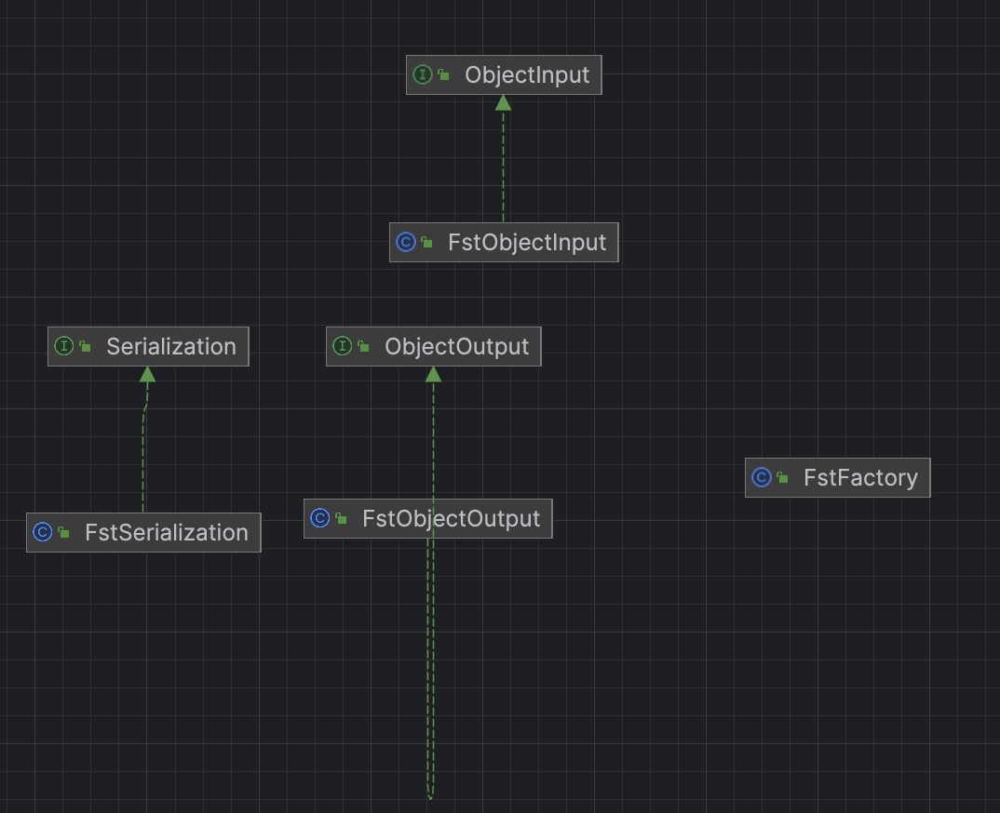

# dubbo源码-序列化-FST实现

## FST简介
```FST fast-serialization 是重新实现的 Java 快速对象序列化的开发包。序列化速度更快（2-10倍）、体积更小，而且兼容 JDK 原生的序列化。要求 JDK 1.7 支持。
```

## 类图简介：




代码比较简单

#### FstFactory
```java
/**
 * Fst 工厂类
 */
public class FstFactory {

    /**
     * 单例
     */
    private static final FstFactory factory = new FstFactory();

    /**
     * 配置对象
     */
    private final FSTConfiguration conf = FSTConfiguration.createDefaultConfiguration();

    public static FstFactory getDefaultFactory() {
        return factory;
    }

    public FstFactory() {
        // 注册
        for (Class clazz : SerializableClassRegistry.getRegisteredClasses()) {
            conf.registerClass(clazz);
        }
    }

    public FSTObjectOutput getObjectOutput(OutputStream outputStream) {
        return conf.getObjectOutput(outputStream);
    }

    public FSTObjectInput getObjectInput(InputStream inputStream) {
        return conf.getObjectInput(inputStream);
    }

}
```

#### 说明：#getObjectOutput() 方法，获得 org.nustaq.serialization.FSTObjectOutput 对象，被 FstObjectOutput 调用。

#### #getObjectInput() 方法，获得 org.nustaq.serialization.FSTObjectInput 对象，被 FstObjectInput 调用。


#### FstSerialization

```java
/**
 * FST 序列化实现类
 */
public class FstSerialization implements Serialization {

    @Override
    public byte getContentTypeId() {
        return 9;
    }

    @Override
    public String getContentType() {
        return "x-application/fst";
    }

    @Override
    public ObjectOutput serialize(URL url, OutputStream out) throws IOException {
        return new FstObjectOutput(out);
    }

    @Override
    public ObjectInput deserialize(URL url, InputStream is) throws IOException {
        return new FstObjectInput(is);
    }

}
```

#### FstObjectInput

```java
public class FstObjectInput implements ObjectInput {

    private FSTObjectInput input;

    public FstObjectInput(InputStream inputStream) {
        // 使用工厂 FstFactory#getObjectInput(inputStream) 方法 
        input = FstFactory.getDefaultFactory().getObjectInput(inputStream);
    }

    @Override
    public boolean readBool() throws IOException {
        return input.readBoolean();
    }

    @Override
    public byte readByte() throws IOException {
        return input.readByte();
    }
    /// 省略其他方法
    
    /**
     * 先获得字节数组的长度，
     * 在获得字节数组的内容
     * @return 
     * @throws IOException
     */
    @Override
public byte[] readBytes() throws IOException {
    int len = input.readInt();
    // 数组为空
    if (len < 0) {
        return null;
    // 数组为零
    } else if (len == 0) {
        return new byte[]{};
    // 数组 > 0
    } else {
        byte[] b = new byte[len];
        input.readFully(b);
        return b;
    }
}
}
```
****
#### 说明： readBytes方法比较特殊：
    先获得字节数组长度, 在获得字节数组内容。
    
#### FstObjectOutput
```java
    @Override
    public void writeBytes(byte[] v) throws IOException {
        // 空，写入 -1
        if (v == null) {
            output.writeInt(-1);
        // 有数组
        } else {
            writeBytes(v, 0, v.length);
        }
    }
    
    /**
     * 先写入字节数组的长度，
     * 在写入字节数组
     * offset 和 length
     * @param v   value. 
     * @param off offset.
     * @param len length.
     * @throws IOException
     */
    @Override
    public void writeBytes(byte[] v, int off, int len) throws IOException {
        if (v == null) {
            output.writeInt(-1);
        } else {
            output.writeInt(len);
            output.write(v, off, len);
        }
    }

```
