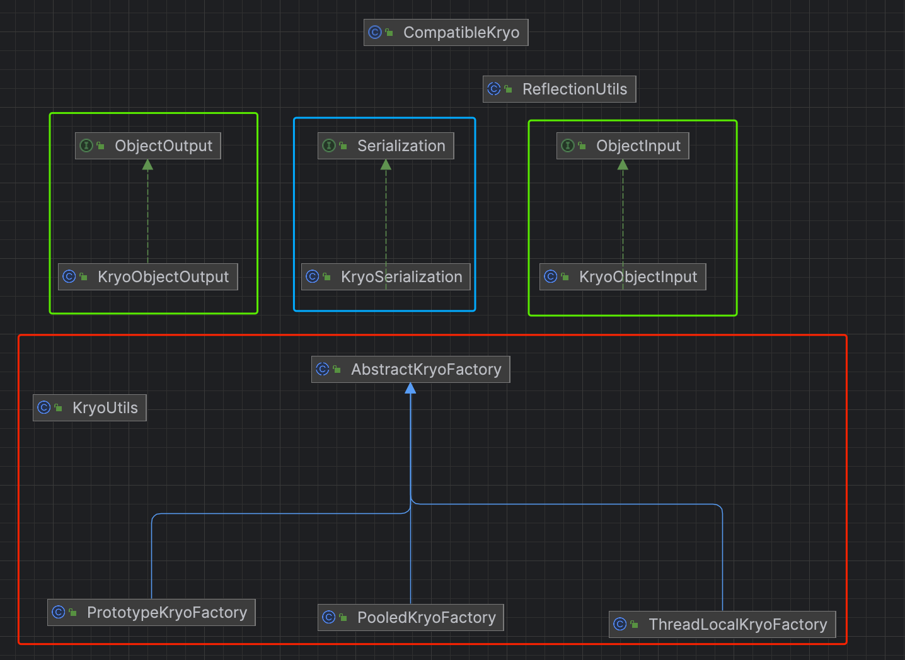

# dubbo源码-序列化-Kryo实现

## kyro简介：

```kryo号称Java中最快的序列化框架，kryo是一个高性能的序列化/反序列化工具，由于其变长存储特性并使用了字节码生成机制，拥有较高的运行速度和较小的体积。

特点：
序列化的性能非常高
线程不安全
序列化结果体积较小
提供了简单易用的API
记录类型信息, 可以通过注册类的方式，，Kryo为了提供性能和减小序列化结果体积，提供注册的序列化对象类的方式。在注册时，会为该序列化类生成int ID，后续在序列化时使用int ID唯一标识该类型。
 
类似于：kryo.register(SomeClass.class);

这算是kryo的一个特点，可以把对象信息直接写到序列化数据里，反序列化的时候可以精确地找到原始类信息，不会出错，这意味着在写readxxx方法时，无需传入Class或Type类信息。
```

## 类关系图



#### 说明：
> 红框为Kryo初始化工厂,分为prototype（原型类），Pooled （池化类），ThreadLocal类工厂
> 蓝框为整合好的KryoSerialization对象。
> 绿框为实现API的接口。


### AbstractKryoFactory
   #### 成员变量
   ```java
    // 需要注册的类
    private final Set<Class> registrations = new LinkedHashSet<Class>();
    // 是否需要注册
    private boolean registrationRequired;
    // kryo是否已经创建。
    private volatile boolean kryoCreated;
    
    public void registerClass(Class clazz) {
      if (kryoCreated) {
        throw new IllegalStateException("Can't register class after creating kryo instance");
      }
    registrations.add(clazz);
    }
   ``` 
 
 #### 方法列表说明：
```java
   抽象方法： returnKryo(Kryo kryo); 归还kryo
            Kryo getKryo(); // 获取kryo对象。
   具体方法：Kryo  create();         
```

#### kryo具体实现：
```java
        public Kryo create() {
        if (!kryoCreated) {
            kryoCreated = true;
        }

        Kryo kryo = new CompatibleKryo();

        // TODO
//        kryo.setReferences(false);
        kryo.setRegistrationRequired(registrationRequired);

        kryo.addDefaultSerializer(Throwable.class, new JavaSerializer());
        kryo.register(Arrays.asList("").getClass(), new ArraysAsListSerializer());
        kryo.register(GregorianCalendar.class, new GregorianCalendarSerializer());
        kryo.register(InvocationHandler.class, new JdkProxySerializer());
        kryo.register(BigDecimal.class, new DefaultSerializers.BigDecimalSerializer());
        kryo.register(BigInteger.class, new DefaultSerializers.BigIntegerSerializer());
        kryo.register(Pattern.class, new RegexSerializer());
        kryo.register(BitSet.class, new BitSetSerializer());
        kryo.register(URI.class, new URISerializer());
        kryo.register(UUID.class, new UUIDSerializer());
        UnmodifiableCollectionsSerializer.registerSerializers(kryo);
        SynchronizedCollectionsSerializer.registerSerializers(kryo);

        // now just added some very common classes
        // TODO optimization
        kryo.register(HashMap.class);
        kryo.register(ArrayList.class);
        kryo.register(LinkedList.class);
        kryo.register(HashSet.class);
        kryo.register(TreeSet.class);
        kryo.register(Hashtable.class);
        kryo.register(Date.class);
        kryo.register(Calendar.class);
        kryo.register(ConcurrentHashMap.class);
        kryo.register(SimpleDateFormat.class);
        kryo.register(GregorianCalendar.class);
        kryo.register(Vector.class);
        kryo.register(BitSet.class);
        kryo.register(StringBuffer.class);
        kryo.register(StringBuilder.class);
        kryo.register(Object.class);
        kryo.register(Object[].class);
        kryo.register(String[].class);
        kryo.register(byte[].class);
        kryo.register(char[].class);
        kryo.register(int[].class);
        kryo.register(float[].class);
        kryo.register(double[].class);

        for (Class clazz : registrations) {
            kryo.register(clazz);
        }

        SerializableClassRegistry.getRegisteredClasses().forEach((clazz, ser) -> {
            if (ser == null) {
                kryo.register(clazz);
            } else {
                kryo.register(clazz, (Serializer) ser);
            }
        });

        return kryo;
    }

```
#### 说明：
> 创建 CompatibleKryo 对象。
> 将常用的结构注册到kryo （从Throwable.class 到double[].class）
> 注册 registrations 到 Kryo 对象。
> 注册 SerializableClassRegistry 到 Kryo 对象。


#### 三个具体的实现类：
  * ThreadLocalKryoFactory：基于 ThreadLocal 的 Kryo 工厂实现类。代码如下：
  
  ```java
  public class ThreadLocalKryoFactory extends AbstractKryoFactory {
    private final ThreadLocal<Kryo> holder = new ThreadLocal<Kryo>() {
        @Override
        protected Kryo initialValue() {
            return create(); // 创建 Kryo
        }
    };

    @Override
    public void returnKryo(Kryo kryo) {
        // do nothing
    }
    @Override
    public Kryo getKryo() {
        return holder.get();
    }
}
``` 

* PooledKryoFactory (未使用到)
```java
    private KryoPool pool;

    public PooledKryoFactory() {
        // Build pool with SoftReferences enabled (optional)
        pool = new KryoPool.Builder(this).softReferences().build();
    }
    @Override
    public Kryo getKryo() {
        // 使用到了kryo 自己提供的Pool来进行创建和释放
        return pool.borrow();
    }
    @Override
    public void returnKryo(Kryo kryo) {
        pool.release(kryo);
    }
```
* PrototypeKryoFactory(未使用到)
```java
    @Override
    public void returnKryo(Kryo kryo) {
        // do nothing
    }
    // 每次都创建一个新的kryo对象。
    @Override
    public Kryo getKryo() {
        return create();
    }
```

### KryoSerialization

```java
public class KryoSerialization implements Serialization {

    @Override
    public byte getContentTypeId() {
        return KRYO_SERIALIZATION_ID; // KRYO_SERIALIZATION_ID = 8
    }

    @Override
    public String getContentType() {
        return "x-application/kryo";
    }

    @Override
    public ObjectOutput serialize(URL url, OutputStream out) throws IOException {
        return new KryoObjectOutput(out);
    }

    @Override
    public ObjectInput deserialize(URL url, InputStream is) throws IOException {
        return new KryoObjectInput(is);
    }
}
```

### KryoUtils
#### 说明： Kryo 工具类，封装了ThreadLocalFactory，目前仅仅对 KryoFactory 进行操作。代码如下：
```java
public class KryoUtils {

    private static AbstractKryoFactory kryoFactory = new ThreadLocalKryoFactory();

    public static Kryo get() {
        return kryoFactory.getKryo();
    }
    public static void release(Kryo kryo) {
        kryoFactory.returnKryo(kryo);
    }
    public static void register(Class<?> clazz) {
        kryoFactory.registerClass(clazz);
    }
    public static void setRegistrationRequired(boolean registrationRequired) {
        kryoFactory.setRegistrationRequired(registrationRequired);
    }
}
```

### KryoObjectInput
#### 说明： KryoObjectInput 是一个具体的反序列化的实现类，通过初始化好的Kryo对象，从流里反序列化对象。Output和其类似，就不写了。

```java
KryoObjectInput 上线了cleanable接口，用于序列化完成之后进行清理。
public class KryoObjectInput implements ObjectInput, Cleanable {

/**
 * Kryo 对象 通过 KryoUtils#get() 方法，获取。
 */ 
private Kryo kryo;
/**
 * Kryo 输入
 */
private Input input;

public KryoObjectInput(InputStream inputStream) {
    input = new Input(inputStream);
    this.kryo = KryoUtils.get();
}

```

#### 方法列表：
```java
@Override
public boolean readBool() throws IOException {
    try {
        return input.readBoolean();
    } catch (KryoException e) {
        throw new IOException(e);
    }
}
@Override
public Object readObject() throws IOException, ClassNotFoundException {
    // TODO optimization
    try {
        return kryo.readClassAndObject(input);
    } catch (KryoException e) {
        throw new IOException(e);
    }
}

cleanable接口的实现：
@Override
public void cleanup() {
    // 释放 Kryo 对象
    KryoUtils.release(kryo);
    // 清空
    kryo = null;
}

```