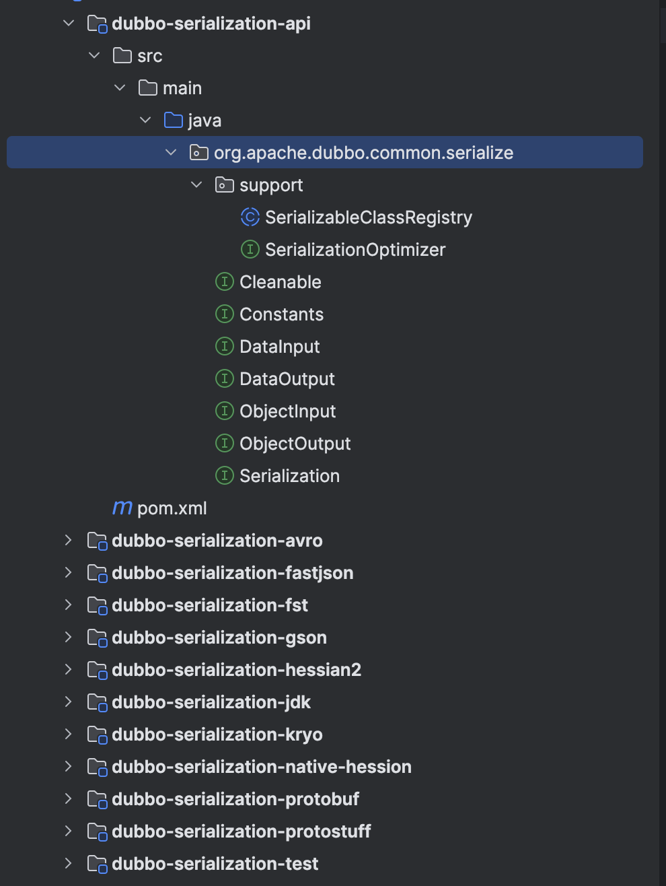

# dubbo源码-序列化-接口层实现


## 序列化的定义：

```将对象转成字节流，用于网络传输，以及将字节流转为对象，用于在收到字节流数据后还原成对象。```

#### 说明：
dubbo中提供了多个序列化实现，包括，kryo，jdk，hessian，fst等。
我们先看看dubbo的序列化的包抽象。



#### 说明：
> 最外层，定义了 API 接口。
> support 包，提供了多种序列化的实现。
> 其余的是一些针对性的序列化的实现。

## 接口整体抽象


#### 说明：
> 如图，红框接口定义了基本的序列化，反序列化的顶层接口，
基本数据类型的反序列化方法。

```java
public interface DataInput {
    boolean readBool() throws IOException;
    byte readByte() throws IOException;
    short readShort() throws IOException;
    int readInt() throws IOException;
    long readLong() throws IOException;
    float readFloat() throws IOException;
    double readDouble() throws IOException;
    String readUTF() throws IOException;
    byte[] readBytes() throws IOException;
}
```

```java
public interface ObjectInput extends DataInput {
    @Deprecated
    Object readObject() throws IOException, ClassNotFoundException;

    <T> T readObject(Class<T> cls) throws IOException, ClassNotFoundException;

    <T> T readObject(Class<T> cls, Type type) throws IOException, ClassNotFoundException;

default Throwable readThrowable() throws IOException, ClassNotFoundException {
        Object obj = readObject();
        if (!(obj instanceof Throwable)) {
            throw new IOException("Response data error, expect Throwable, but get " + obj);
        }
        return (Throwable) obj;
    }

    default Object readEvent() throws IOException, ClassNotFoundException {
        return readObject();
    }

    default Map<String, Object> readAttachments() throws IOException, ClassNotFoundException {
        return readObject(Map.class);
    }
}
```

#### 说明：
com.alibaba.dubbo.common.serialize.ObjectInput ，实现 DataInput 接口，对象输入接口。
DataOutPut 和ObjectOutput的实现和input类似。


    
```java
@SPI("hessian2")
public interface Serialization {

    /**
     * get content type id
     *
     * 获得内容类型编号
     *
     * @return content type id
     */
    byte getContentTypeId();

    /**
     * get content type
     *
     * 获得内容类型名
     *
     * @return content type
     */
    String getContentType();

    /**
     * create serializer
     *
     * 创建 ObjectOutput 对象，序列化输出到 OutputStream
     *
     * @param url URL
     * @param output 输出流
     * @return serializer
     * @throws IOException 当发生 IO 异常时
     */
    @Adaptive
    ObjectOutput serialize(URL url, OutputStream output) throws IOException;

    /**
     * create deserializer
     *
     * 创建 ObjectInput 对象，从 InputStream 反序列化
     *
     * @param url URL
     * @param input 输入流
     * @return deserializer
     * @throws IOException 当发生 IO 异常时
     */
    @Adaptive
    ObjectInput deserialize(URL url, InputStream input) throws IOException;

}
```
#### 说明：
> 蓝框定义了 com.alibaba.dubbo.common.serialize.Serialization ，序列化接口。
    通过dubbo的SPI扩展来进行序列化实现的加载。

> @SPI("hessian2") 注解，Dubbo SPI 拓展点，默认为 "hessian2" ，即未配置情况下，使用 Hessian 进行序列化和反序列化 。
> #getContentTypeId(),#getContentType() 方法，获得内容类型编号和名字。
  org.apache.dubbo.common.serialize.Constants.HESSIAN2_SERIALIZATION_ID = 2
>     


```java
org.apache.dubbo.remoting.transport.CodecSupport

    public static Serialization getSerialization(URL url) {
        return ExtensionLoader.getExtensionLoader(Serialization.class).getExtension(
                url.getParameter(Constants.SERIALIZATION_KEY, Constants.DEFAULT_REMOTING_SERIALIZATION));
    
    }
    
        public static Serialization getSerialization(URL url, Byte id) throws IOException {
        Serialization serialization = getSerializationById(id);
        String serializationName = url.getParameter(Constants.SERIALIZATION_KEY, Constants.DEFAULT_REMOTING_SERIALIZATION);
        // Check if "serialization id" passed from network matches the id on this side(only take effect for JDK serialization), for security purpose.
        if (serialization == null
                || ((id == JAVA_SERIALIZATION_ID || id == NATIVE_JAVA_SERIALIZATION_ID || id == COMPACTED_JAVA_SERIALIZATION_ID)
                && !(serializationName.equals(ID_SERIALIZATIONNAME_MAP.get(id))))) {
            throw new IOException("Unexpected serialization id:" + id + " received from network, please check if the peer send the right id.");
        }
        return serialization;
    }

```

#### 说明：

如上述代码所示：直接通过ExtensionLoader来加载对应的序列化实现。


## 总结：

> 序列化的接口比较简单，**Input** **Output**接口负责接口的序列化。
Serialization 接口定义了完整的序列化对象的抽象。
后面和其他层 通过 CodecSupport 通过ExtensionLoader来加载对应的序列化实现来初始化对应的序列化。

> 对于序列化的源码主要看Kryo 和FST的两个实现类即可，其他的都差不多。
