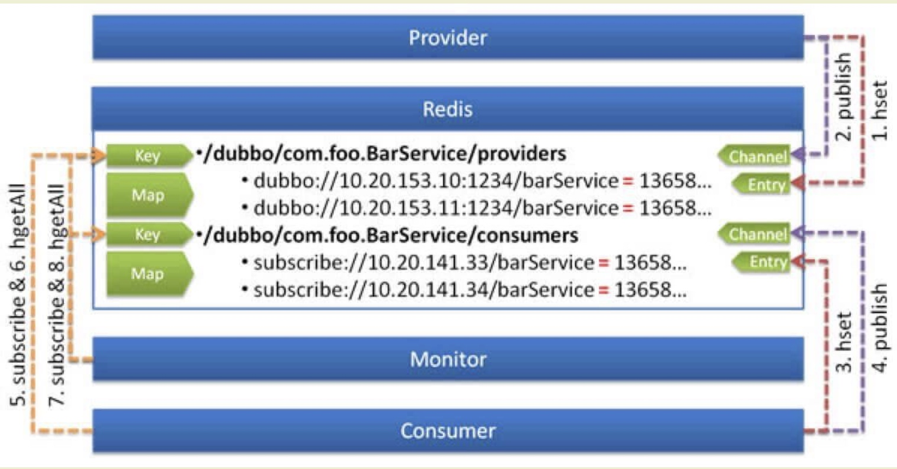

# dubbo源码-注册中心-之Redis注册中心


```
Redis：基于Redis实现的注册中心，使用 Redis的Publish/Subscribe事件通知数据变更；
```

## RedisRegistry流程图



#### 说明：
使用 Redis 的 Key/Map 结构存储数据结构：

* 主 Key 为服务名和类型  例子 /dubbo/com.foo.BarService/providers
* Map 中的 Key 为 URL 地址 
* Map 中的 Value 为过期时间，用于判断脏数据，脏数据由监控中心删除

* 注册的时候。
* jedis.hset(/dubbo/com.foo.BarService/providers, "url", expire)

* 即 注册的时候 jedis hset的主key 是 /dubbo/com.foo.BarService/providers，
子Map的key 是URL，value为其过期时间。


#### 说明：
使用 Redis 的 Publish/Subscribe 事件通知数据变更：

* 通过事件的值区分事件类型：register, unregister
* 普通消费者直接订阅指定服务提供者的 Key，只会收到指定服务的变更事件
* 监控中心通过 psubscribe 功能订阅 /dubbo/*，会收到所有服务的所有变更事件
* 服务实例的启动或关闭，会写入或删除对应的 Redis Map 中，并发起对应的 register, unregister 事件，从而保证实时性。
* 通过监控中心，轮询 Key 过期，保证未正常关闭的服务实例的 URL 的删除，并发起对应的 unregister 事件，从而保证最终一致性。


#### RedisRegistry 执行流程：
* **providers**:
* （1）服务提供方启动时，向 /dubbo/com.foo.BarService/providers 下，使用hset的方式，添加当前提供者的地址，并设置过期时间
* （2）并向 Channel:/dubbo/com.foo.BarService/providers 发送 register 事件

* **consumers**：
* （1）服务消费方启动时，从 Channel:/dubbo/com.foo.BarService/consumers 订阅 register 和 unregister 事件
* （2）服务消费方收到 register 和 unregister 事件后，从 Key:/dubbo/com.foo.BarService/consumers 下获取提供者地址列表

* **monitor**:
* (1) 服务监控中心启动时，从 Channel:/dubbo/* 订阅 register 和 unregister，以及 subscribe 和 unsubsribe 事件
* (2) 服务监控中心收到 register 和 unregister 事件后，从 Key:/dubbo/com.foo.BarService/providers 下获取提供者地址列表
* (3) 服务监控中心收到 subscribe 和 unsubsribe 事件后，从 Key:/dubbo/com.foo.BarService/consumers 下获取消费者地址列表


### 成员变量和构造方法：

```java
    /**
     * Redis Key 过期机制执行器
     */
    private final ScheduledExecutorService expireExecutor = Executors.newScheduledThreadPool(1, new NamedThreadFactory("DubboRegistryExpireTimer", true));
    /**
     * Redis Key 过期机制 Future
     */
    private final ScheduledFuture<?> expireFuture;

    /**
     * Redis 根节点
     */
    private final String root;

    /**
     * JedisPool 集合
     *
     * key：ip:port
     */
    private final Map<String, JedisPool> jedisPools = new ConcurrentHashMap<String, JedisPool>();

    /**
     * 通知器集合
     *
     * key：Root + Service ，例如 `/dubbo/com.alibaba.dubbo.demo.DemoService`
     */
    private final ConcurrentMap<String, Notifier> notifiers = new ConcurrentHashMap<String, Notifier>();

    /**
     * 重连周期，单位：毫秒
     */
    private final int reconnectPeriod;
    /**
     * 过期周期，单位：毫秒
     */
    private final int expirePeriod;

    /**
     * 是否监控中心
     *
     * 用于判断脏数据，脏数据由监控中心删除
     */
    private volatile boolean admin = false;

    /**
     * 是否复制模式
     */
    private boolean replicate;

    public RedisRegistry(URL url) {
        super(url);
        if (url.isAnyHost()) {
            throw new IllegalStateException("registry address == null");
        }
        // 创建 GenericObjectPoolConfig 对象
        GenericObjectPoolConfig config = new GenericObjectPoolConfig();
        config.setTestOnBorrow(url.getParameter("test.on.borrow", true));
        config.setTestOnReturn(url.getParameter("test.on.return", false));
        config.setTestWhileIdle(url.getParameter("test.while.idle", false));
        if (url.getParameter("max.idle", 0) > 0)
            config.setMaxIdle(url.getParameter("max.idle", 0));
        if (url.getParameter("min.idle", 0) > 0)
            config.setMinIdle(url.getParameter("min.idle", 0));
        if (url.getParameter("max.active", 0) > 0)
            config.setMaxTotal(url.getParameter("max.active", 0));
        if (url.getParameter("max.total", 0) > 0)
            config.setMaxTotal(url.getParameter("max.total", 0));
        if (url.getParameter("max.wait", url.getParameter("timeout", 0)) > 0)
            config.setMaxWaitMillis(url.getParameter("max.wait", url.getParameter("timeout", 0)));
        if (url.getParameter("num.tests.per.eviction.run", 0) > 0)
            config.setNumTestsPerEvictionRun(url.getParameter("num.tests.per.eviction.run", 0));
        if (url.getParameter("time.between.eviction.runs.millis", 0) > 0)
            config.setTimeBetweenEvictionRunsMillis(url.getParameter("time.between.eviction.runs.millis", 0));
        if (url.getParameter("min.evictable.idle.time.millis", 0) > 0)
            config.setMinEvictableIdleTimeMillis(url.getParameter("min.evictable.idle.time.millis", 0));

        // 是否复制模式
        String cluster = url.getParameter("cluster", "failover");
        if (!"failover".equals(cluster) && !"replicate".equals(cluster)) {
            throw new IllegalArgumentException("Unsupported redis cluster: " + cluster + ". The redis cluster only supported failover or replicate.");
        }
        replicate = "replicate".equals(cluster);

        // 解析
        List<String> addresses = new ArrayList<String>();
        addresses.add(url.getAddress());
        String[] backups = url.getParameter(Constants.BACKUP_KEY, new String[0]);
        if (backups != null && backups.length > 0) {
            addresses.addAll(Arrays.asList(backups));
        }

        // 创建 JedisPool 对象
        String password = url.getPassword();
        for (String address : addresses) {
            int i = address.indexOf(':');
            String host;
            int port;
            if (i > 0) {
                host = address.substring(0, i);
                port = Integer.parseInt(address.substring(i + 1));
            } else {
                host = address;
                port = DEFAULT_REDIS_PORT;
            }
            if (StringUtils.isEmpty(password)) { // 无密码连接
                this.jedisPools.put(address, new JedisPool(config, host, port,
                        url.getParameter(Constants.TIMEOUT_KEY, Constants.DEFAULT_TIMEOUT)));
            } else { // 有密码连接
                this.jedisPools.put(address, new JedisPool(config, host, port,
                        url.getParameter(Constants.TIMEOUT_KEY, Constants.DEFAULT_TIMEOUT), password));
            }
        }

        // 解析重连周期
        this.reconnectPeriod = url.getParameter(Constants.REGISTRY_RECONNECT_PERIOD_KEY, Constants.DEFAULT_REGISTRY_RECONNECT_PERIOD);

        // 获得 Redis 根节点
        String group = url.getParameter(Constants.GROUP_KEY, DEFAULT_ROOT);
        if (!group.startsWith(Constants.PATH_SEPARATOR)) { // 头 `/`
            group = Constants.PATH_SEPARATOR + group;
        }
        if (!group.endsWith(Constants.PATH_SEPARATOR)) { // 尾 `/`
            group = group + Constants.PATH_SEPARATOR;
        }
        this.root = group;

        // 创建实现 Redis Key 过期机制的任务
        this.expirePeriod = url.getParameter(Constants.SESSION_TIMEOUT_KEY, Constants.DEFAULT_SESSION_TIMEOUT);
        this.expireFuture = expireExecutor.scheduleWithFixedDelay(new Runnable() {
            @Override
            public void run() {
                try {
                    deferExpired(); // Extend the expiration time
                } catch (Throwable t) { // Defensive fault tolerance
                    logger.error("Unexpected exception occur at defer expire time, cause: " + t.getMessage(), t);
                }
            }
        }, expirePeriod / 2, expirePeriod / 2, TimeUnit.MILLISECONDS);
    }

```

#### 说明：
* （1）首先初始化了GenericObjectPoolConfig JedisPool的配置参数
* （2）根据cluster 判断是否是复制模式
* （3）创建jedisPools 对象，其中的key是 ip:port
* （4）notifiers 为notifiers的集合，其中的key是 /root/service. 比如说：
      /dubbo/com.alibaba.dubbo.demo.DemoService
* （5）reconnectPeriod  重连周期 用于订阅发生 Redis 连接异常时，等待重新连接
* （6）expireExecutor 属性： 初始化了deferExpired 任务。1）延长未过期的 Key ；2）删除过期的 Key 。
* （7）admin 属性，是否监控中心，监控中心来删除一些不需要的数据。


#### doRegister方法：

```java
    /**
     * （1）toCategoryPath 将URL 转换为对应的key，比如说：/dubbo/com.foo.BarService/providers
     * (2) url.toFullString(); 将URL转换为对应的value值。具体是URL的详细信息
     * （3）expire 为当前的value的过期时间。
     * （4）遍历所有的jedis， 通过 jedis.hset(key, value, expire); 进行注册，同时使用这个方法  jedis.publish(key, Constants.REGISTER); 向 这个通道 /dubbo/com.foo.BarService/providers
     *     发送注册事件。register
     * （5）如果不是replicate 退出即可。便完成了注册。
     * 
     * @param url 
     */
    @Override
    public void doRegister(URL url) {
        String key = toCategoryPath(url);
        String value = url.toFullString();
        // 计算过期时间
        String expire = String.valueOf(System.currentTimeMillis() + expirePeriod);
        boolean success = false;
        RpcException exception = null;
        // 向 Redis 注册
        for (Map.Entry<String, JedisPool> entry : jedisPools.entrySet()) {
            JedisPool jedisPool = entry.getValue();
            try {
                Jedis jedis = jedisPool.getResource();
                try {
                    // 写入 Redis Map 键
                    jedis.hset(key, value, expire);
                    // 发布 Redis 注册事件
                    jedis.publish(key, Constants.REGISTER);
                    success = true;
                    //  如果服务器端已同步数据，只需写入单台机器
                    if (!replicate) {
                        break; //  If the server side has synchronized data, just write a single machine
                    }
                } finally {
                    jedisPool.returnResource(jedis);
                }
            } catch (Throwable t) {
                exception = new RpcException("Failed to register service to redis registry. registry: " + entry.getKey() + ", service: " + url + ", cause: " + t.getMessage(), t);
            }
        }
        // 处理异常
        if (exception != null) {
            if (success) { // 虽然发生异常，但是结果成功
                logger.warn(exception.getMessage(), exception);
            } else { // 最终未成功
                throw exception;
            }
        }
    }
    
    /**
     * 获得分类路径
     *
     * Root + Service + Type
     */
    private String toCategoryPath(URL url) {
        return toServicePath(url) + Constants.PATH_SEPARATOR + url.getParameter(Constants.CATEGORY_KEY, Constants.DEFAULT_CATEGORY);
    }

    /**
     * 获得服务路径
     *
     * Root + Type
     */
    private String toServicePath(URL url) {
        return root + url.getServiceInterface();
    }
```

#### 说明：
 * （1）toCategoryPath 将URL 转换为对应的key，比如说：/dubbo/com.foo.BarService/providers
 *  (2) url.toFullString(); 将URL转换为对应的value值。具体是URL的详细信息
 * （3）expire 为当前的value的过期时间。
 * （4）遍历所有的jedis， 通过 jedis.hset(key, value, expire); 进行注册，同时使用这个方法  jedis.publish(key, Constants.REGISTER); 向 这个通道 /dubbo/com.foo.BarService/providers
 *     发送注册事件。register
 * （5）如果不是replicate 退出即可。便完成了注册。


#### doUnregister 逻辑和其类似


#### doSubscribe

```java
    /**
     * (1) 获取服务路径 比如说 /dubbo/com.foo.BarService
     * (2) 初始化 notifier，如果不存在，则初始化，并启动
     * (3) 如果key是以*号结尾，则表示处理Service层发起的订阅，例如监控中心的订阅 /dubbo/*
     *      （1）通过 jedis.keys(service); 获取所有的分类的集合，比如说 /dubbo/com.foo.BarService/providers,  /dubbo/com.foo.BarService/consumers
     *      (2) 对分类的集合调用 doNotify方法
     * （4）如果不是以*号结尾，则表示只处理置顶分类，比如说providers的数据。直接调用doNotify方法
     */
    @Override
    public void doSubscribe(final URL url, final NotifyListener listener) {
        // 获得服务路径，例如：`/dubbo/com.alibaba.dubbo.demo.DemoService`
        String service = toServicePath(url);
        // 获得通知器 Notifier 对象
        Notifier notifier = notifiers.get(service);
        // 不存在，则创建 Notifier 对象
        if (notifier == null) {
            Notifier newNotifier = new Notifier(service);
            notifiers.putIfAbsent(service, newNotifier);
            notifier = notifiers.get(service);
            if (notifier == newNotifier) { // 保证并发的情况下，有且仅有一个启动
                notifier.start();
            }
        }
        boolean success = false;
        RpcException exception = null;
        // 循环 `jedisPools` ，仅向一个 Redis 发起订阅
        for (Map.Entry<String, JedisPool> entry : jedisPools.entrySet()) {
            JedisPool jedisPool = entry.getValue();
            try {
                Jedis jedis = jedisPool.getResource();
                try {
                    // 处理所有 Service 层的发起订阅，例如监控中心的订阅
                    if (service.endsWith(Constants.ANY_VALUE)) {
                        admin = true;
                        // 获得分类层集合，例如：`/dubbo/com.alibaba.dubbo.demo.DemoService/providers`
                        Set<String> keys = jedis.keys(service);
                        if (keys != null && !keys.isEmpty()) {
                            // 按照服务聚合 URL 集合
                            Map<String, Set<String>> serviceKeys = new HashMap<String, Set<String>>(); // Key：Root + Service ; Value：URL 。
                            for (String key : keys) {
                                String serviceKey = toServicePath(key);
                                Set<String> sk = serviceKeys.get(serviceKey);
                                if (sk == null) {
                                    sk = new HashSet<String>();
                                    serviceKeys.put(serviceKey, sk);
                                }
                                sk.add(key);
                            }
                            // 循环 serviceKeys ，按照每个 Service 层的发起通知
                            for (Set<String> sk : serviceKeys.values()) {
                                doNotify(jedis, sk, url, Collections.singletonList(listener));
                            }
                        }
                    // 处理指定 Service 层的发起通知
                    } else {
                        doNotify(jedis, jedis.keys(service + Constants.PATH_SEPARATOR + Constants.ANY_VALUE), url, Collections.singletonList(listener));
                    }
                    // 标记成功
                    success = true;
                    // 结束，仅仅从一台服务器读取数据
                    break; // Just read one server's data
                } finally {
                    jedisPool.returnResource(jedis);
                }
            } catch (Throwable t) { // Try the next server
                exception = new RpcException("Failed to subscribe service from redis registry. registry: " + entry.getKey() + ", service: " + url + ", cause: " + t.getMessage(), t);
            }
        }
        // 处理异常
        if (exception != null) {
            if (success) { // 虽然发生异常，但是结果成功
                logger.warn(exception.getMessage(), exception);
            } else { // 最终未成功
                throw exception;
            }
        }
    }
```

#### 说明：
 * (1) 获取服务路径 比如说 /dubbo/com.foo.BarService
 * (2) 初始化 notifier，如果不存在，则初始化，并启动
 * (3) 如果key是以*号结尾，则表示处理Service层发起的订阅，例如监控中心的订阅 /dubbo/*
 *  （1）通过 jedis.keys(service); 获取所有的分类的集合，比如说 /dubbo/com.foo.BarService/providers,  /dubbo/com.foo.BarService/consumers
 *  (2) 对分类的集合调用 doNotify方法
 * （4）如果不是以*号结尾，则表示只处理置顶分类，比如说providers的数据。直接调用doNotify方法


#### doNotify 方法：

```java
    /**
     * （1）获取当前URL对应的分类，比如说是providers，还是configurators。
     * （2）循环分类的keys， 这个keys的数据比如说 /dubbo/com.alibaba.dubbo.demo.DemoService/providers， 大部分情况下只有一个。
     * （3）如果当前的key对应的 serviceName 和 url不匹配，则continue
     *     如果当前的key的分类和URL的分类不一样，则continue。
     * （4）通过 jedis.hgetAll(key); 获取当前key下面所有的URL信息， 比如说 /dubbo/com.alibaba.dubbo.demo.DemoService/providers 所有的URL信息。
     * （5）如果当前URL是非动态节点，并且没有过期，则添加进来。
     * （6）若不存在匹配，则创建 `empty://` 的 URL返回，用于清空该服务的该分类。
     * （7）全量数据获取完成时，调用 `super#notify(...)` 方法，回调 NotifyListener
     * 
     */
    private void doNotify(Jedis jedis, Collection<String> keys, URL url, Collection<NotifyListener> listeners) {
        if (keys == null || keys.isEmpty() || listeners == null || listeners.isEmpty()) {
            return;
        }
        long now = System.currentTimeMillis();
        List<URL> result = new ArrayList<URL>();
        List<String> categories = Arrays.asList(url.getParameter(Constants.CATEGORY_KEY, new String[0])); // 分类数组
        String consumerService = url.getServiceInterface(); // 服务接口
        // 循环分类层，例如：`/dubbo/com.alibaba.dubbo.demo.DemoService/providers`
        for (String key : keys) {
            // 若服务不匹配，返回
            if (!Constants.ANY_VALUE.equals(consumerService)) {
                String providerService = toServiceName(key);
                if (!providerService.equals(consumerService)) {
                    continue;
                }
            }
            // 若订阅的不包含该分类，返回
            String category = toCategoryName(key);
            if (!categories.contains(Constants.ANY_VALUE) && !categories.contains(category)) {
                continue;
            }
            // 获得所有 URL 数组
            List<URL> urls = new ArrayList<URL>();
            Map<String, String> values = jedis.hgetAll(key);
            if (values != null && values.size() > 0) {
                for (Map.Entry<String, String> entry : values.entrySet()) {
                    URL u = URL.valueOf(entry.getKey());
                    if (!u.getParameter(Constants.DYNAMIC_KEY, true) // 非动态节点，因为动态节点，不受过期的限制
                            || Long.parseLong(entry.getValue()) >= now) { // 未过期
                        if (UrlUtils.isMatch(url, u)) {
                            urls.add(u);
                        }
                    }
                }
            }
            // 若不存在匹配，则创建 `empty://` 的 URL返回，用于清空该服务的该分类。
            if (urls.isEmpty()) {
                urls.add(url.setProtocol(Constants.EMPTY_PROTOCOL)
                        .setAddress(Constants.ANYHOST_VALUE)
                        .setPath(toServiceName(key))
                        .addParameter(Constants.CATEGORY_KEY, category));
            }
            result.addAll(urls);
            if (logger.isInfoEnabled()) {
                logger.info("redis notify: " + key + " = " + urls);
            }
        }
        if (result.isEmpty()) {
            return;
        }
        // 全量数据获取完成时，调用 `super#notify(...)` 方法，回调 NotifyListener
        for (NotifyListener listener : listeners) {
            super.notify(url, listener, result);
        }
    }
```

#### 说明：
 * （1）获取当前URL对应的分类，比如说是providers，还是configurators。
 * （2）循环分类的keys， 这个keys的数据比如说 /dubbo/com.alibaba.dubbo.demo.DemoService/providers， 大部分情况下只有一个。
 * （3）如果当前的key对应的 serviceName 和 url不匹配，则continue
 *     如果当前的key的分类和URL的分类不一样，则continue。
 * （4）通过 jedis.hgetAll(key); 获取当前key下面所有的URL信息， 比如说 /dubbo/com.alibaba.dubbo.demo.DemoService/providers 所有的URL信息。
 * （5）如果当前URL是非动态节点，并且没有过期，则添加进来。
 * （6）若不存在匹配，则创建 `empty://` 的 URL返回，用于清空该服务的该分类。
 * （7）全量数据获取完成时，调用 `super#notify(...)` 方法，回调 NotifyListener


#### toServiceName 一些注册中心的转换为路径的方法：
```java
    /**
     * 获得服务名，从服务路径上
     *
     * Service 比如说 com.foo.BarService
     *
     * @param categoryPath 服务路径
     * @return 服务名
     */
    private String toServiceName(String categoryPath) {
        String servicePath = toServicePath(categoryPath);
        return servicePath.startsWith(root) ? servicePath.substring(root.length()) : servicePath;
    }

    /**
     * 获得分类名，从分类路径上
     *
     * Type 比如说： providers
     *
     * @param categoryPath 分类路径
     * @return 分类名
     */
    private String toCategoryName(String categoryPath) {
        int i = categoryPath.lastIndexOf(Constants.PATH_SEPARATOR);
        return i > 0 ? categoryPath.substring(i + 1) : categoryPath;
    }

    /**
     * 获得服务路径，主要截掉多余的部分
     *
     * Root + ServiceName
     * 比如说 /dubbo/com.foo.BarService
     *
     * @param categoryPath 分类路径
     * @return 服务路径
     */
    private String toServicePath(String categoryPath) {
        int i;
        if (categoryPath.startsWith(root)) {
            i = categoryPath.indexOf(Constants.PATH_SEPARATOR, root.length());
        } else {
            i = categoryPath.indexOf(Constants.PATH_SEPARATOR);
        }
        return i > 0 ? categoryPath.substring(0, i) : categoryPath;
    }

    /**
     * 获得服务路径
     *
     * Root + ServiceName
     * 比如说：/dubbo/com.foo.BarService
     *
     * @param url URL
     * @return 服务路径
     */
    private String toServicePath(URL url) {
        return root + url.getServiceInterface();
    }

    /**
     * 获得分类路径
     *
     * Root + Service + Type
     *
       比如说：/dubbo/com.foo.BarService/providers
     * @param url URL
     * @return 分类路径
     */
    private String toCategoryPath(URL url) {
        return toServicePath(url) + Constants.PATH_SEPARATOR + url.getParameter(Constants.CATEGORY_KEY, Constants.DEFAULT_CATEGORY);
    }
```

#### 说明：
* （1）toServiceName： Service 比如说 com.foo.BarService
* （2）toCategoryName： 分类名 providers
* （3）toServicePath：比如说： /dubbo/com.foo.BarService
* （4）toCategoryPath： 比如说： /dubbo/com.foo.BarService/providers


#### deferExpired  定时清理方法：


```java
    /**
     * （1）对所有的已经注册好的URL，
     * （2）如果是动态节点。
     * （3）获取URL的分类 比如说 toCategoryPath 的结果是 /dubbo/com.foo.BarService/providers
     * （4）使用 jedis.hset 将URL信息写入， 同时向/dubbo/com.foo.BarService/providers 这个通道 发布一个 register事件。
     * （5）如果是监控中心的话，执行clean方法 清理过期的脏数据。
     * （6）如果非 replicate， 服务器端已同步数据，只需写入单台机器
     */
    private void deferExpired() {
        for (Map.Entry<String, JedisPool> entry : jedisPools.entrySet()) {
            JedisPool jedisPool = entry.getValue();
            try {
                Jedis jedis = jedisPool.getResource();
                try {
                    // 循环已注册的 URL 集合
                    for (URL url : new HashSet<URL>(getRegistered())) {
                        // 动态节点
                        if (url.getParameter(Constants.DYNAMIC_KEY, true)) {
                            // 获得分类路径
                            String key = toCategoryPath(url);
                            // 写入 Redis Map 中
                            if (jedis.hset(key, url.toFullString(), String.valueOf(System.currentTimeMillis() + expirePeriod)) == 1) {
                                // 发布 `register` 事件。
                                jedis.publish(key, Constants.REGISTER);
                            }
                        }
                    }
                    // 监控中心负责删除过期脏数据
                    if (admin) {
                        clean(jedis);
                    }
                    // 如果服务器端已同步数据，只需写入单台机器
                    if (!replicate) {
                        break;//  If the server side has synchronized data, just write a single machine
                    }
                } finally {
                    jedisPool.returnResource(jedis);
                }
            } catch (Throwable t) {
                logger.warn("Failed to write provider heartbeat to redis registry. registry: " + entry.getKey() + ", cause: " + t.getMessage(), t);
            }
        }
    }
```

#### 说明：
 * （1）对所有的已经注册好的URL，
 * （2）如果是动态节点。
 * （3）获取URL的分类 比如说 toCategoryPath 的结果是 /dubbo/com.foo.BarService/providers
 * （4）使用 jedis.hset 将URL信息写入， 同时向/dubbo/com.foo.BarService/providers 这个通道 发布一个 register事件。
 * （5）如果是监控中心的话，执行clean方法 清理过期的脏数据。
 * （6）如果非 replicate， 服务器端已同步数据，只需写入单台机器


#### clean方法：

```java
    /**
     * (1) 通过 jedis.keys 获取 /dubbo/* 下面所有的服务分类
     * （2）通过 jedis.hgetAll(key); 获取 这个分类下面所有的URL信息
     * （3）如果是动态节点，而且过期了，那么 使用 jedis.hdel(key, url)的方式删除所有的信息。
     * （4）如果有删除的话，发布一个 unregister 事件。
     */
    private void clean(Jedis jedis) {
        // 获得所有服务
        Set<String> keys = jedis.keys(root + Constants.ANY_VALUE);
        if (keys != null && !keys.isEmpty()) {
            for (String key : keys) {
                // 获得所有 URL
                Map<String, String> values = jedis.hgetAll(key);
                if (values != null && values.size() > 0) {
                    boolean delete = false;
                    long now = System.currentTimeMillis();
                    for (Map.Entry<String, String> entry : values.entrySet()) {
                        URL url = URL.valueOf(entry.getKey());
                        // 动态节点
                        if (url.getParameter(Constants.DYNAMIC_KEY, true)) {
                            long expire = Long.parseLong(entry.getValue());
                            // 已经过期
                            if (expire < now) {
                                //
                                jedis.hdel(key, entry.getKey());
                                delete = true;
                                if (logger.isWarnEnabled()) {
                                    logger.warn("Delete expired key: " + key + " -> value: " + entry.getKey() + ", expire: " + new Date(expire) + ", now: " + new Date(now));
                                }
                            }
                        }
                    }
                    // 若删除成功，发布 `unregister` 事件
                    if (delete) {
                        jedis.publish(key, Constants.UNREGISTER);
                    }
                }
            }
        }
    }
```

#### 说明：
 * (1) 通过 jedis.keys 获取 /dubbo/* 下面所有的服务分类
 * （2）通过 jedis.hgetAll(key); 获取 这个分类下面所有的URL信息
 * （3）如果是动态节点，而且过期了，那么 使用 jedis.hdel(key, url)的方式删除所有的信息。
 * （4）如果有删除的话，发布一个 unregister 事件。

