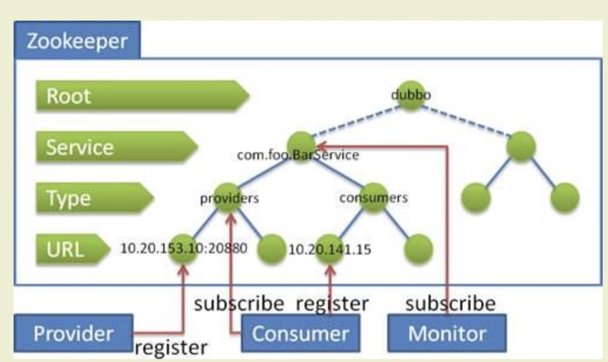

# dubbo源码-注册中心-之Zookeeper注册中心


## 服务提供者和消费者还有监控中心启动的注册流程图




#### 说明：
* 以阿里的官方文档为例，服务名：com.foo.BarService
* 服务提供者启动时: 向 /dubbo/com.foo.BarService/providers 目录下写入自己的 URL 地址
* 服务消费者启动时: 订阅 /dubbo/com.foo.BarService/providers 目录下的提供者 URL 地址。
   并向 /dubbo/com.foo.BarService/consumers 目录下写入自己的 URL 地址
* 监控中心启动时: 订阅 /dubbo/com.foo.BarService 目录下的所有提供者和消费者 URL 地址。


#### 说明：
在图中，我们可以看到 Zookeeper 的节点层级，自上而下是：

* **Root** 层：根目录，可通过 <dubbo:registry group="dubbo" /> 的 "group" 设置 Zookeeper 的根节点，缺省使用 "dubbo" 。
**Service** 层：服务接口全名。
**Type** 层：分类。目前除了我们在图中看到的 "providers"( 服务提供者列表 ) "consumers"( 服务消费者列表 ) 外，还有 "routes"( 路由规则列表 ) 和 "configurations"( 配置规则列表 )。
**URL** 层：URL ，根据不同 Type 目录，下面可以是服务提供者 URL 、服务消费者 URL 、路由规则 URL 、配置规则 URL 。
实际上 URL 上带有 "category" 参数，已经能判断每个 URL 的分类，但是 Zookeeper 是基于节点目录订阅的，所以增加了 Type 层。

实际上，服务消费者启动后，不仅仅订阅了 "providers" 分类，也订阅了 "routes" "configurations" 分类。


#### 成员变量：

```java
    /**
     * 默认 Zookeeper 根节点
     */
    private final static String DEFAULT_ROOT = "dubbo";

    /**
     * Zookeeper 根节点
     */
    private final String root;
    /**
     * Service 接口全名集合
     */
    private final Set<String> anyServices = new ConcurrentHashSet<String>();
    /**
     * 监听器集合
     */
    private final ConcurrentMap<URL, ConcurrentMap<NotifyListener, ChildListener>> zkListeners = new ConcurrentHashMap<URL, ConcurrentMap<NotifyListener, ChildListener>>();
    /**
     * Zookeeper 客户端
     */
    private final ZookeeperClient zkClient;
```

#### 说明：
* 默认 Zookeeper 根节点 为dubbo
* Service 接口全名集合，Service 接口接口全名集合。该属性适可用于监控中心，订阅整个 Service 层。因为，Service 层是动态的，可以有不断有新的 Service 服务发布

#### 构造器：
```java
    public ZookeeperRegistry(URL url, ZookeeperTransporter zookeeperTransporter) {
        super(url);
        if (url.isAnyHost()) {
            throw new IllegalStateException("registry address == null");
        }
        // 获得 Zookeeper 根节点
        String group = url.getParameter(Constants.GROUP_KEY, DEFAULT_ROOT); // `url.parameters.group` 参数值
        if (!group.startsWith(Constants.PATH_SEPARATOR)) {
            group = Constants.PATH_SEPARATOR + group;
        }
        this.root = group;
        // 创建 Zookeeper Client
        zkClient = zookeeperTransporter.connect(url);
        // 添加 StateListener 对象。该监听器，在重连时，调用恢复方法。
        zkClient.addStateListener(new StateListener() {
            @Override
            public void stateChanged(int state) {
                if (state == RECONNECTED) {
                    try {
                        recover();
                    } catch (Exception e) {
                        logger.error(e.getMessage(), e);
                    }
                }
            }
        });
    }
```

#### 说明：
* （1）设置注册中心的URL
* （2）设置根节点默认为dubbo
* （3）调用 ZookeeperTransporter#connect(url) 方法，初始化 zkClient。
* 基于 Dubbo SPI Adaptive 机制，根据 url 参数，加载对应的 ZookeeperTransporter 实现类，创建对应的 ZookeeperClient 实现类的对应。
* （4）添加了一个 StateListener 用于当状态变化的时候，进行恢复。


#### doRegister方法，（真实的注册方法）

```java
    @Override
    protected void doRegister(URL url) {
        try {
            zkClient.create(toUrlPath(url), url.getParameter(Constants.DYNAMIC_KEY, true));
        } catch (Throwable e) {
            throw new RpcException("Failed to register " + url + " to zookeeper " + getUrl() + ", cause: " + e.getMessage(), e);
        }
    }
```

#### 说明：
* （1）调用 #toUrlPath(url) 方法，获得 URL 的路径，其实就是转换为  Root/Service/Type/URL 
* （2）url.parameters.dynamic ，是否动态数据。若为 false ，该数据为持久数据，当注册方退出时，数据依然保存在注册中心
* (3) 调用 ZookeeperClient#create(url, ephemeral) 方法，创建 URL 节点。 即是开始的时候的图例。


#### toUrlPath, toCategoryPath, toServicePath, toRootDir 方法：

```java
    /**
     * 获得根目录
     *
     * Root
     *
     * @return 路径
     */
    private String toRootDir() {
        if (root.equals(Constants.PATH_SEPARATOR)) {
            return root;
        }
        return root + Constants.PATH_SEPARATOR;
    }

    /**
     * 获得服务路径
     *
     * Root + Type
     *
     * @param url URL
     * @return 服务路径
     */
    private String toServicePath(URL url) {
        String name = url.getServiceInterface();
        if (Constants.ANY_VALUE.equals(name)) {
            return toRootPath();
        }
        return toRootDir() + URL.encode(name);
    }

    /**
     * 获得分类路径
     *
     * Root + Service + Type
     *
     * @param url URL
     * @return 分类路径
     */
    private String toCategoryPath(URL url) {
        return toServicePath(url) + Constants.PATH_SEPARATOR + url.getParameter(Constants.CATEGORY_KEY, Constants.DEFAULT_CATEGORY);
    }

    /**
     * 获得 URL 的路径
     *
     * Root + Service + Type + URL
     *
     * 被 {@link #doRegister(URL)} 和 {@link #doUnregister(URL)} 调用
     *
     * @param url URL
     * @return 路径
     */
    private String toUrlPath(URL url) {
        return toCategoryPath(url) + Constants.PATH_SEPARATOR + URL.encode(url.toFullString());
    }

```

#### 说明：
* （1）toRootDir： 变为 dubbo/
* （2）toServicePath: 变为： dubbo/com.foo.BarService
* （3）toCategoryPath: 变为: dubbo/com.foo.BarService/providers
* （4）toUrlPath: 变为: dubbo/com.foo.BarService/providers/url
* （5）以上五个步骤将节点的数据写入了zk。


#### doUnregister:
```java
    @Override
    protected void doUnregister(URL url) {
        try {
            zkClient.delete(toUrlPath(url));
        } catch (Throwable e) {
            throw new RpcException("Failed to unregister " + url + " to zookeeper " + getUrl() + ", cause: " + e.getMessage(), e);
        }
    }
```

#### 说明：
* doUnregister 也和刚才的类似。


#### doSubscribe:

```java
    @Override
    protected void doSubscribe(final URL url, final NotifyListener listener) {
        try {
            // 处理所有 Service 层的发起订阅，例如监控中心的订阅
            if (Constants.ANY_VALUE.equals(url.getServiceInterface())) {
                String root = toRootPath();
                // 获得 url 对应的监听器集合
                ConcurrentMap<NotifyListener, ChildListener> listeners = zkListeners.get(url);
                if (listeners == null) { // 不存在，进行创建
                    zkListeners.putIfAbsent(url, new ConcurrentHashMap<NotifyListener, ChildListener>());
                    listeners = zkListeners.get(url);
                }
                // 获得 ChildListener 对象
                ChildListener zkListener = listeners.get(listener);
                if (zkListener == null) { // 不存在 ChildListener 对象，进行创建 ChildListener 对象
                    listeners.putIfAbsent(listener, new ChildListener() {
                        @Override
                        public void childChanged(String parentPath, List<String> currentChilds) {
                            for (String child : currentChilds) {
                                child = URL.decode(child);
                                // 新增 Service 接口全名时（即新增服务），发起该 Service 层的订阅
                                if (!anyServices.contains(child)) {
                                    anyServices.add(child);
                                    subscribe(url.setPath(child).addParameters(Constants.INTERFACE_KEY, child,
                                            Constants.CHECK_KEY, String.valueOf(false)), listener);
                                }
                            }
                        }
                    });
                    zkListener = listeners.get(listener);
                }
                // 创建 Service 节点。该节点为持久节点。
                zkClient.create(root, false);
                // 向 Zookeeper ，Service 节点，发起订阅
                List<String> services = zkClient.addChildListener(root, zkListener);
                // 首次全量数据获取完成时，循环 Service 接口全名数组，发起该 Service 层的订阅
                if (services != null && !services.isEmpty()) {
                    for (String service : services) {
                        service = URL.decode(service);
                        anyServices.add(service);
                        subscribe(url.setPath(service).addParameters(Constants.INTERFACE_KEY, service,
                                Constants.CHECK_KEY, String.valueOf(false)), listener);
                    }
                }
            // 处理指定 Service 层的发起订阅，例如服务消费者的订阅
            } else {
                // 子节点数据数组
                List<URL> urls = new ArrayList<URL>();
                // 循环分类数组
                for (String path : toCategoriesPath(url)) {
                    // 获得 url 对应的监听器集合
                    ConcurrentMap<NotifyListener, ChildListener> listeners = zkListeners.get(url);
                    if (listeners == null) { // 不存在，进行创建
                        zkListeners.putIfAbsent(url, new ConcurrentHashMap<NotifyListener, ChildListener>());
                        listeners = zkListeners.get(url);
                    }
                    // 获得 ChildListener 对象
                    ChildListener zkListener = listeners.get(listener);
                    if (zkListener == null) { // 不存在 ChildListener 对象，进行创建 ChildListener 对象
                        listeners.putIfAbsent(listener, new ChildListener() {
                            @Override
                            public void childChanged(String parentPath, List<String> currentChilds) {
                                // 变更时，调用 `#notify(...)` 方法，回调 NotifyListener
                                ZookeeperRegistry.this.notify(url, listener, toUrlsWithEmpty(url, parentPath, currentChilds));
                            }
                        });
                        zkListener = listeners.get(listener);
                    }
                    // 创建 Type 节点。该节点为持久节点。
                    zkClient.create(path, false);
                    // 向 Zookeeper ，PATH 节点，发起订阅
                    List<String> children = zkClient.addChildListener(path, zkListener);
                    // 添加到 `urls` 中
                    if (children != null) {
                        urls.addAll(toUrlsWithEmpty(url, path, children));
                    }
                }
                // 首次全量数据获取完成时，调用 `#notify(...)` 方法，回调 NotifyListener
                notify(url, listener, urls);
            }
        } catch (Throwable e) {
            throw new RpcException("Failed to subscribe " + url + " to zookeeper " + getUrl() + ", cause: " + e.getMessage(), e);
        }
    }
```

#### 说明：
 * （1）如果是 ANY_VALUE 即* 的话，处理所有 Service 层的发起订阅，即监控中心的订阅。
 *      （1）先获得 url 对应的监听器集合，如果没有就创建
 *      （2）获得对应的childListener 子节点监听器的集合。当节点变更的时候，添加订阅逻辑。
 *      （3）创建 Service 节点。该节点为持久节点。
 *      （4）向Service 节点，发起订阅，并获得Service 接口全名数组
 *      （5）首次全量数据获取完成时，循环 Service 接口全名数组，调用 #subscribe(url, listener) 方法，发起该 Service 层的订阅
 * （2）否则则是处理指定的 service 的某个类型，比如说提供者的订阅逻辑。
 *      （1）循环分类数组。toCategoriesPath
 *      （2）获得订阅的 url 对应的监听器集合。
 *      （3）获得 listener( NotifyListener ) 对应的 ChildListener 对象。在 URL 层发生变更时，
 *      会调用 NotifyListener#notify(url, listener, currentChilds) 方法
 *      ，回调 NotifyListener 的逻辑
 *      （4）创建type类型的节点，为持久节点。比如说 dubbo/com.foo.BarService/providers
 *      （5）向 Zookeeper 的 Path 节点，发起订阅。并将所有的子节点转换为url，
 *      （6）首次全量数据获取完成时，调用 NotifyListener#notify(url, listener, currentChilds) 方法，回调 NotifyListener 的逻辑。服务消费者可创建所有的 Invoker 对象，用于调用服务提供者们。


#### toCategoriesPath

```java
    /**
     * 获得分类路径数组
     *
     * Root + Service + Type
     *
     * @param url URL
     * @return 分类路径数组
     */
    private String[] toCategoriesPath(URL url) {
        // 获得分类数组
        String[] categories;
        if (Constants.ANY_VALUE.equals(url.getParameter(Constants.CATEGORY_KEY))) { // * 时，
            categories = new String[]{Constants.PROVIDERS_CATEGORY, Constants.CONSUMERS_CATEGORY,
                    Constants.ROUTERS_CATEGORY, Constants.CONFIGURATORS_CATEGORY};
        } else {
            categories = url.getParameter(Constants.CATEGORY_KEY, new String[]{Constants.DEFAULT_CATEGORY});
        }
        // 获得分类路径数组
        String[] paths = new String[categories.length];
        for (int i = 0; i < categories.length; i++) {
            paths[i] = toServicePath(url) + Constants.PATH_SEPARATOR + categories[i];
        }
        return paths;
    } 
```

#### 说明：
* 1,这个方法的核心是做了一个分类:
* 如果是anyValue （*） 的话， 
    * 返回的是 dubbo/service/router 
    *        dubbo/service/provider 
    *        dubbo/service/consumer
    *        dubbo/service/configurator

  如果不是的话：
    返回的是，对应的服务类型，


#### toUrlsWithEmpty
```java
/**
 * 获得 providers 中，和 consumer 匹配的 URL 数组
 *
 * 若不存在匹配，则创建 `empty://` 的 URL返回。通过这样的方式，可以处理类似服务提供者为空的情况。
 */
private List<URL> toUrlsWithEmpty(URL consumer, String path, List<String> providers) {
    // 获得 providers 中，和 consumer 匹配的 URL 数组
    List<URL> urls = toUrlsWithoutEmpty(consumer, providers);
    // 若不存在匹配，则创建 `empty://` 的 URL返回
    if (urls == null || urls.isEmpty()) {
        int i = path.lastIndexOf('/');
        String category = i < 0 ? path : path.substring(i + 1);
        URL empty = consumer.setProtocol(Constants.EMPTY_PROTOCOL).addParameter(Constants.CATEGORY_KEY, category);
        urls.add(empty);
    }
    return urls;
}
```
