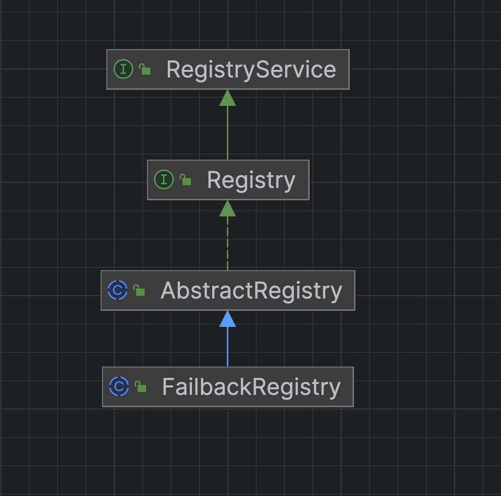

# dubbo源码-注册中心-抽象层实现。


## 代码结构



#### 说明：
* 1， RegistryService 定义了基本的接口方法实现。 注册，取消注册，订阅，取消订阅等
* 2， AbstractRegistry 实现 Registry 接口，Registry 抽象类，实现了通用的注册、订阅、查询、通知等方法。持久化注册数据到文件，以 properties 格式存储。应用于，重启时，无法从注册中心加载服务提供者列表等信息时，从该文件中读取。
* 3， FailbackRegistry 实现了基本的 失败重试机制。包含有 注册，取消注册，订阅，取消订阅等的失败重试
* 4，最后的真正实现会交给子类，比如说ZookeeperRegistry，RedisRegistry。


### AbstractRegistry 

#### 成员变量

```java
/**
** 本地磁盘缓存的数据，属性会写到这个里面，然后写入磁盘
/
    private final Properties properties = new Properties();

    /**
     * 是否同步保存文件
     */
    // Is it synchronized to save the file
    private final boolean syncSaveFile;


    /**
     * 数据版本号
     *
     * {@link #properties}
     */
    private final AtomicLong lastCacheChanged = new AtomicLong();
    
    /**
     * 订阅 URL 的监听器集合
     * key：订阅者的 URL ，例如消费者的 URL
     */
    private final ConcurrentMap<URL, Set<NotifyListener>> subscribed = new ConcurrentHashMap<URL, Set<NotifyListener>>();
    
        /**
     * 被通知的 URL 集合
     *
     * key1：消费者的 URL ，例如消费者的 URL ，和 {@link #subscribed} 的键一致
     * key2：分类，例如：providers、consumers、routes、configurators。【实际无 consumers ，因为消费者不会去订阅另外的消费者的列表】
     *            在 {@link Constants} 中，以 "_CATEGORY" 结尾
     */
    private final ConcurrentMap<URL, Map<String, List<URL>>> notified = new ConcurrentHashMap<URL, Map<String, List<URL>>>();

    /**
     * 注册中心 URL
     */
    private URL registryUrl;

```

#### 说明：
* 1， registered 存放的是已经注册的URL集合。
* 2， subscribed 订阅 URL 的监听器集合 其中key 是 订阅者的 URL ，例如消费者的 URL
* 3， notified 存放的是被通知的 URL 集合
      key1：消费者的 URL ，例如消费者的 URL 
      key2：分类，例如：providers、consumers、routes、configurators。

#### 构造方法：

```java
    public AbstractRegistry(URL url) {
        setUrl(url);
        // Start file save timer
        syncSaveFile = url.getParameter(Constants.REGISTRY_FILESAVE_SYNC_KEY, false);
        // 获得 `file`
        String filename = url.getParameter(Constants.FILE_KEY, System.getProperty("user.home") + "/.dubbo/dubbo-registry-" + url.getParameter(Constants.APPLICATION_KEY) + "-" + url.getAddress() + ".cache");
        File file = null;
        if (ConfigUtils.isNotEmpty(filename)) {
            file = new File(filename);
            if (!file.exists() && file.getParentFile() != null && !file.getParentFile().exists()) {
                if (!file.getParentFile().mkdirs()) {
                    throw new IllegalArgumentException("Invalid registry store file " + file + ", cause: Failed to create directory " + file.getParentFile() + "!");
                }
            }
        }
        this.file = file;
        // 加载本地磁盘缓存文件到内存缓存
        loadProperties();
        // 通知监听器，URL 变化结果
        notify(url.getBackupUrls());
    }
```


#### notify方法：

```
我们先看AbstractRegistry类的notify方法，这个方法负责分类变化的url。然后
通知RegistryDirectory 的notify方法进行处理。
```

#### com.alibaba.dubbo.registry.support.AbstractRegistry#notify方法：

```java
/**
     * 通知监听器，URL 变化结果。
     * (1) 如果URL 非法，或者 URL是ANY_VALUE 返回即可
     * （2）将 `urls` 按照 `url.parameter.category` 分类，添加到集合result 中
     * （3）针对result map，分类调用listener 进行notify处理。
     * 
     * @param url 消费者 URL
     * @param listener 监听器
     * @param urls 通知的 URL 变化结果（全量数据）
     */
    protected void notify(URL url, NotifyListener listener, List<URL> urls) {
        if (url == null) {
            throw new IllegalArgumentException("notify url == null");
        }
        if (listener == null) {
            throw new IllegalArgumentException("notify listener == null");
        }
        if ((urls == null || urls.isEmpty())
                && !Constants.ANY_VALUE.equals(url.getServiceInterface())) {
            logger.warn("Ignore empty notify urls for subscribe url " + url);
            return;
        }
        if (logger.isInfoEnabled()) {
            logger.info("Notify urls for subscribe url " + url + ", urls: " + urls);
        }
        // 将 `urls` 按照 `url.parameter.category` 分类，添加到集合
        Map<String, List<URL>> result = new HashMap<String, List<URL>>();
        for (URL u : urls) {
            if (UrlUtils.isMatch(url, u)) {
                String category = u.getParameter(Constants.CATEGORY_KEY, Constants.DEFAULT_CATEGORY);
                List<URL> categoryList = result.get(category);
                if (categoryList == null) {
                    categoryList = new ArrayList<URL>();
                    result.put(category, categoryList);
                }
                categoryList.add(u);
            }
        }
        if (result.size() == 0) {
            return;
        }
        // 获得消费者 URL 对应的在 `notified` 中，通知的 URL 变化结果（全量数据）
        Map<String, List<URL>> categoryNotified = notified.get(url);
        if (categoryNotified == null) {
            notified.putIfAbsent(url, new ConcurrentHashMap<String, List<URL>>());
            categoryNotified = notified.get(url);
        }
        // 【按照分类循环】处理通知的 URL 变化结果（全量数据）
        for (Map.Entry<String, List<URL>> entry : result.entrySet()) {
            String category = entry.getKey();
            List<URL> categoryList = entry.getValue();
            // 覆盖到 `notified`
            // 当某个分类的数据为空时，会依然有 urls 。其中 `urls[0].protocol = empty` ，通过这样的方式，处理所有服务提供者为空的情况。
            categoryNotified.put(category, categoryList);
            // 保存到文件
            saveProperties(url);
            // 通知监听器
            listener.notify(categoryList);
        }
    }
```
#### 说明：
 * （1）如果URL 非法，或者 URL是ANY_VALUE 返回即可
 * （2）将 `urls` 按照 `url.parameter.category` 分类，添加到集合result 中
 * （3）针对result map，分类调用listener 进行notify处理。
 * （4）最后一行代码 listener.notify(categoryList); 调用子类的notify方法进行处理。
 
 

### FailbackRegistry

```
具备失败重试机制的Registry
```

#### 成员变量

```java
    private final Set<URL> failedRegistered = new ConcurrentHashSet<URL>();
    /**
     * 失败取消注册失败的 URL 集合
     */
    private final Set<URL> failedUnregistered = new ConcurrentHashSet<URL>();
    /**
     * 失败发起订阅失败的监听器集合
     */
    private final ConcurrentMap<URL, Set<NotifyListener>> failedSubscribed = new ConcurrentHashMap<URL, Set<NotifyListener>>();
    /**
     * 失败取消订阅失败的监听器集合
     */
    private final ConcurrentMap<URL, Set<NotifyListener>> failedUnsubscribed = new ConcurrentHashMap<URL, Set<NotifyListener>>();
    /**
     * 失败通知通知的 URL 集合
     */
    private final ConcurrentMap<URL, Map<NotifyListener, List<URL>>> failedNotified = new ConcurrentHashMap<URL, Map<NotifyListener, List<URL>>>();
        /**
     * 定时任务执行器
     */
    // Scheduled executor service
    private final ScheduledExecutorService retryExecutor = Executors.newScheduledThreadPool(1, new NamedThreadFactory("DubboRegistryFailedRetryTimer", true));

```

#### 说明：

* 1，包含一个定时任务执行器，在初始化好的时候，会开始定时执行retry逻辑，定时的进行重试
* 2，总共包含有5个集合：
* （1）failedRegistered 发起注册失败的 URL 集合
* （2）failedUnregistered 取消注册失败的 URL 集合
* （3）failedSubscribed 发起订阅失败的监听器集合
* （4）failedUnsubscribed 取消订阅失败的监听器集合
* （5）failedNotified 通知通知的 URL 集合


#### 构造器

```java
    public FailbackRegistry(URL url) {
        super(url);
        // 重试频率，单位：毫秒
        int retryPeriod = url.getParameter(Constants.REGISTRY_RETRY_PERIOD_KEY, Constants.DEFAULT_REGISTRY_RETRY_PERIOD);
        // 创建失败重试定时器
        this.retryFuture = retryExecutor.scheduleWithFixedDelay(new Runnable() {
            @Override
            public void run() {
                // Check and connect to the registry
                try {
                    retry();
                } catch (Throwable t) { // Defensive fault tolerance
                    logger.error("Unexpected error occur at failed retry, cause: " + t.getMessage(), t);
                }
            }
        }, retryPeriod, retryPeriod, TimeUnit.MILLISECONDS);
    }
```

#### 说明：
* 创建了失败重试的定时器，里面包含了retry方法


几个比较基本的方法：
#### register

```java
    @Override
    public void register(URL url) {
        // 已销毁，跳过
        if (destroyed.get()){
            return;
        }
        // 添加到 `registered` 变量
        super.register(url);
        // 移除出 `failedRegistered` `failedUnregistered` 变量
        failedRegistered.remove(url);
        failedUnregistered.remove(url);
        // 向注册中心发送注册请求
        try {
            // Sending a registration request to the server side
            doRegister(url);
        } catch (Exception e) {
            Throwable t = e;

            // 如果开启了启动时检测，则直接抛出异常
            // If the startup detection is opened, the Exception is thrown directly.
            boolean check = getUrl().getParameter(Constants.CHECK_KEY, true)
                    && url.getParameter(Constants.CHECK_KEY, true)
                    && !Constants.CONSUMER_PROTOCOL.equals(url.getProtocol()); // 非消费者。消费者会在 `ReferenceConfig#createProxy(...)` 方法中，调用 `Invoker#avalible()` 方法，进行检查。
            boolean skipFailback = t instanceof SkipFailbackWrapperException;
            if (check || skipFailback) {
                if (skipFailback) {
                    t = t.getCause();
                }
                throw new IllegalStateException("Failed to register " + url + " to registry " + getUrl().getAddress() + ", cause: " + t.getMessage(), t);
            } else {
                logger.error("Failed to register " + url + ", waiting for retry, cause: " + t.getMessage(), t);
            }

            // 将失败的注册请求记录到 `failedRegistered`，定时重试
            // Record a failed registration request to a failed list, retry regularly
            failedRegistered.add(url);
        }
    }
```

#### unregister

```java
    @Override
    public void unregister(URL url) {
        // 已销毁，跳过
        if (destroyed.get()){
            return;
        }
        // 移除出 `registered` 变量
        super.unregister(url);
        // 移除出 `failedRegistered` `failedUnregistered` 变量
        failedRegistered.remove(url);
        failedUnregistered.remove(url);
        // 向注册中心发送取消注册请求
        try {
            // Sending a cancellation request to the server side
            doUnregister(url);
        } catch (Exception e) {
            Throwable t = e;

            // 如果开启了启动时检测，则直接抛出异常
            // If the startup detection is opened, the Exception is thrown directly.
            boolean check = getUrl().getParameter(Constants.CHECK_KEY, true)
                    && url.getParameter(Constants.CHECK_KEY, true)
                    && !Constants.CONSUMER_PROTOCOL.equals(url.getProtocol());
            boolean skipFailback = t instanceof SkipFailbackWrapperException;
            if (check || skipFailback) {
                if (skipFailback) {
                    t = t.getCause();
                }
                throw new IllegalStateException("Failed to unregister " + url + " to registry " + getUrl().getAddress() + ", cause: " + t.getMessage(), t);
            } else {
                logger.error("Failed to uregister " + url + ", waiting for retry, cause: " + t.getMessage(), t);
            }

            // 将失败的取消注册请求记录到 `failedUnregistered`，定时重试
            // Record a failed registration request to a failed list, retry regularly
            failedUnregistered.add(url);
        }
    }
```

#### subscribe

```java
    @Override
    public void subscribe(URL url, NotifyListener listener) {
        // 已销毁，跳过
        if (destroyed.get()){
            return;
        }
        // 移除出 `subscribed` 变量
        super.subscribe(url, listener);
        // 移除出 `failedSubscribed` `failedUnsubscribed` `failedNotified`
        removeFailedSubscribed(url, listener);
        // 向注册中心发送订阅请求
        try {
            // Sending a subscription request to the server side
            doSubscribe(url, listener);
        } catch (Exception e) {
            Throwable t = e;

            // 如果有缓存的 URL 集合，进行通知。后续订阅成功后，会使用最新的 URL 集合，进行通知。
            List<URL> urls = getCacheUrls(url);
            if (urls != null && !urls.isEmpty()) {
                notify(url, listener, urls);
                logger.error("Failed to subscribe " + url + ", Using cached list: " + urls + " from cache file: " + getUrl().getParameter(Constants.FILE_KEY, System.getProperty("user.home") + "/dubbo-registry-" + url.getHost() + ".cache") + ", cause: " + t.getMessage(), t);
            } else {
                // 如果开启了启动时检测，则直接抛出异常
                // If the startup detection is opened, the Exception is thrown directly.
                boolean check = getUrl().getParameter(Constants.CHECK_KEY, true)
                        && url.getParameter(Constants.CHECK_KEY, true);
                boolean skipFailback = t instanceof SkipFailbackWrapperException;
                if (check || skipFailback) {
                    if (skipFailback) {
                        t = t.getCause();
                    }
                    throw new IllegalStateException("Failed to subscribe " + url + ", cause: " + t.getMessage(), t);
                } else {
                    logger.error("Failed to subscribe " + url + ", waiting for retry, cause: " + t.getMessage(), t);
                }
            }

            // 将失败的订阅请求记录到 `failedSubscribed`，定时重试
            // Record a failed registration request to a failed list, retry regularly
            addFailedSubscribed(url, listener);
        }
    }
```

#### unsubscribe

```java
    @Override
    public void unsubscribe(URL url, NotifyListener listener) {
        // 已销毁，跳过
        if (destroyed.get()){
            return;
        }
        // 移除出 `unsubscribed` 变量
        super.unsubscribe(url, listener);
        // 移除出 `failedSubscribed` `failedUnsubscribed` `failedNotified`
        removeFailedSubscribed(url, listener);
        // 向注册中心发送取消订阅请求
        try {
            // Sending a canceling subscription request to the server side
            doUnsubscribe(url, listener);
        } catch (Exception e) {
            Throwable t = e;

            // 如果开启了启动时检测，则直接抛出异常
            // If the startup detection is opened, the Exception is thrown directly.
            boolean check = getUrl().getParameter(Constants.CHECK_KEY, true)
                    && url.getParameter(Constants.CHECK_KEY, true);
            boolean skipFailback = t instanceof SkipFailbackWrapperException;
            if (check || skipFailback) {
                if (skipFailback) {
                    t = t.getCause();
                }
                throw new IllegalStateException("Failed to unsubscribe " + url + " to registry " + getUrl().getAddress() + ", cause: " + t.getMessage(), t);
            } else {
                logger.error("Failed to unsubscribe " + url + ", waiting for retry, cause: " + t.getMessage(), t);
            }

            // 将失败的订阅请求记录到 `failedUnsubscribed`，定时重试
            // Record a failed registration request to a failed list, retry regularly
            Set<NotifyListener> listeners = failedUnsubscribed.get(url);
            if (listeners == null) {
                failedUnsubscribed.putIfAbsent(url, new ConcurrentHashSet<NotifyListener>());
                listeners = failedUnsubscribed.get(url);
            }
            listeners.add(listener);
        }
    }
```

#### 说明：
* 1， 方法的逻辑基本都一致
* 2， register，unregister，subscribe，unsubscribe。
* 3， 以register
    * （1）如果销毁了则返回。
    * （2）添加到 `registered` 变量， 移除出 `failedRegistered` `failedUnregistered` 变量
    * （3）doRegister 真实向注册中心发起注册
    * （4）如果注册失败了的话，将失败的注册请求记录到 `failedRegistered`，定时重试


#### retry方法：

```java
protected void retry() {
        // 重试执行注册
        if (!failedRegistered.isEmpty()) {
            Set<URL> failed = new HashSet<URL>(failedRegistered); // 避免并发冲突
            if (failed.size() > 0) {
                if (logger.isInfoEnabled()) {
                    logger.info("Retry register " + failed);
                }
                try {
                    for (URL url : failed) {
                        try {
                            // 执行注册
                            doRegister(url);
                            // 移除出 `failedRegistered`
                            failedRegistered.remove(url);
                        } catch (Throwable t) { // Ignore all the exceptions and wait for the next retry
                            logger.warn("Failed to retry register " + failed + ", waiting for again, cause: " + t.getMessage(), t);
                        }
                    }
                } catch (Throwable t) { // Ignore all the exceptions and wait for the next retry
                    logger.warn("Failed to retry register " + failed + ", waiting for again, cause: " + t.getMessage(), t);
                }
            }
        }
        // 重试执行取消注册
        if (!failedUnregistered.isEmpty()) {
            Set<URL> failed = new HashSet<URL>(failedUnregistered); // 避免并发冲突
            if (!failed.isEmpty()) {
                if (logger.isInfoEnabled()) {
                    logger.info("Retry unregister " + failed);
                }
                try {
                    for (URL url : failed) {
                        try {
                            // 执行取消注册
                            doUnregister(url);
                            // 移除出 `failedUnregistered`
                            failedUnregistered.remove(url);
                        } catch (Throwable t) { // Ignore all the exceptions and wait for the next retry
                            logger.warn("Failed to retry unregister  " + failed + ", waiting for again, cause: " + t.getMessage(), t);
                        }
                    }
                } catch (Throwable t) { // Ignore all the exceptions and wait for the next retry
                    logger.warn("Failed to retry unregister  " + failed + ", waiting for again, cause: " + t.getMessage(), t);
                }
            }
        }
        // 重试执行注册
        if (!failedSubscribed.isEmpty()) {
            Map<URL, Set<NotifyListener>> failed = new HashMap<URL, Set<NotifyListener>>(failedSubscribed); // 避免并发冲突
            for (Map.Entry<URL, Set<NotifyListener>> entry : new HashMap<URL, Set<NotifyListener>>(failed).entrySet()) {
                if (entry.getValue() == null || entry.getValue().size() == 0) {
                    failed.remove(entry.getKey());
                }
            }
            if (failed.size() > 0) {
                if (logger.isInfoEnabled()) {
                    logger.info("Retry subscribe " + failed);
                }
                try {
                    for (Map.Entry<URL, Set<NotifyListener>> entry : failed.entrySet()) {
                        URL url = entry.getKey();
                        Set<NotifyListener> listeners = entry.getValue();
                        for (NotifyListener listener : listeners) {
                            try {
                                // 执行注册
                                doSubscribe(url, listener);
                                // 移除出监听器
                                listeners.remove(listener);
                            } catch (Throwable t) { // Ignore all the exceptions and wait for the next retry
                                logger.warn("Failed to retry subscribe " + failed + ", waiting for again, cause: " + t.getMessage(), t);
                            }
                        }
                    }
                } catch (Throwable t) { // Ignore all the exceptions and wait for the next retry
                    logger.warn("Failed to retry subscribe " + failed + ", waiting for again, cause: " + t.getMessage(), t);
                }
            }
        }
        // 重试执行取消注册
        if (!failedUnsubscribed.isEmpty()) {
            Map<URL, Set<NotifyListener>> failed = new HashMap<URL, Set<NotifyListener>>(failedUnsubscribed);
            for (Map.Entry<URL, Set<NotifyListener>> entry : new HashMap<URL, Set<NotifyListener>>(failed).entrySet()) {
                if (entry.getValue() == null || entry.getValue().isEmpty()) {
                    failed.remove(entry.getKey());
                }
            }
            if (failed.size() > 0) {
                if (logger.isInfoEnabled()) {
                    logger.info("Retry unsubscribe " + failed);
                }
                try {
                    for (Map.Entry<URL, Set<NotifyListener>> entry : failed.entrySet()) {
                        URL url = entry.getKey();
                        Set<NotifyListener> listeners = entry.getValue();
                        for (NotifyListener listener : listeners) {
                            try {
                                // 执行取消注册
                                doUnsubscribe(url, listener);
                                // 移除出监听器
                                listeners.remove(listener);
                            } catch (Throwable t) { // Ignore all the exceptions and wait for the next retry
                                logger.warn("Failed to retry unsubscribe " + failed + ", waiting for again, cause: " + t.getMessage(), t);
                            }
                        }
                    }
                } catch (Throwable t) { // Ignore all the exceptions and wait for the next retry
                    logger.warn("Failed to retry unsubscribe " + failed + ", waiting for again, cause: " + t.getMessage(), t);
                }
            }
        }
        // 重试执行通知监听器
        if (!failedNotified.isEmpty()) {
            Map<URL, Map<NotifyListener, List<URL>>> failed = new HashMap<URL, Map<NotifyListener, List<URL>>>(failedNotified);
            for (Map.Entry<URL, Map<NotifyListener, List<URL>>> entry : new HashMap<URL, Map<NotifyListener, List<URL>>>(failed).entrySet()) {
                if (entry.getValue() == null || entry.getValue().size() == 0) {
                    failed.remove(entry.getKey());
                }
            }
            if (failed.size() > 0) {
                if (logger.isInfoEnabled()) {
                    logger.info("Retry notify " + failed);
                }
                try {
                    for (Map<NotifyListener, List<URL>> values : failed.values()) {
                        for (Map.Entry<NotifyListener, List<URL>> entry : values.entrySet()) {
                            try {
                                NotifyListener listener = entry.getKey();
                                List<URL> urls = entry.getValue();
                                // 通知监听器
                                listener.notify(urls);
                                // 移除出监听器
                                values.remove(listener);
                            } catch (Throwable t) { // Ignore all the exceptions and wait for the next retry
                                logger.warn("Failed to retry notify " + failed + ", waiting for again, cause: " + t.getMessage(), t);
                            }
                        }
                    }
                } catch (Throwable t) { // Ignore all the exceptions and wait for the next retry
                    logger.warn("Failed to retry notify " + failed + ", waiting for again, cause: " + t.getMessage(), t);
                }
            }
        }
    }
```

#### 说明：
* 方法逻辑也比较简单：主要是遍历五个failed集合，比如说失败注册的， 则遍历failRegistered集合
* 调用doRegister方法进行注册。其他的类似。

