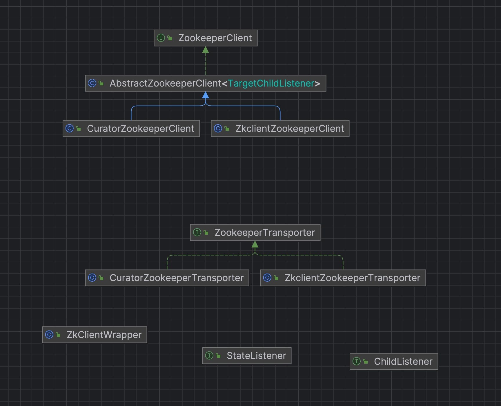

# dubbo源码-注册中心之Zookeeper工具类


## 代码结构



#### 说明：
* 1 ZookeeperClient 作为顶层接口定义了操作Zk的基本方法
* 2 具体的操作实现类，一个是Curator的zk实现类，一个是ZKClient的实现类，默认是Curator。
* 3 ZookeeperClient的作用是相当于基础的Zk的操作工具，在真正的注册中心使用的时候，是按照组合的方式被ZookeeperRegistry调研。
* 4 ZookeeperTransporter 相当于ZookeeperClient的工程方法。

### ZookeeperTransporter

```java
@SPI("curator")
public interface ZookeeperTransporter {

    /**
     * 连接创建 ZookeeperClient 对象
     *
     */
    @Adaptive({Constants.CLIENT_KEY, Constants.TRANSPORTER_KEY})
    ZookeeperClient connect(URL url);
}
```

#### 说明：
* connect(url)方法，连接创建ZookeeperClient对象
* @SPI("curator") 使用dubboSPI机制，默认使用curator实现
* @Adaptive, 使用了dubbo SPI的自适应加载机制。
* 下面以一个子类为例, 其实就是作为一个工厂类，创建了一个对象

### CuratorZookeeperTransporter

```java
/**
 * CuratorZookeeper 工厂实现类
 */
public class CuratorZookeeperTransporter implements ZookeeperTransporter {

    public ZookeeperClient connect(URL url) {
        return new CuratorZookeeperClient(url);
    }
}
```

### ZookeeperClient

```java
public interface ZookeeperClient {

    /**
     * 创建节点
     *
     * @param path 节点路径
     * @param ephemeral 是否临时节点
     */
    void create(String path, boolean ephemeral);

    /**
     * 删除节点
     *
     * @param path 节点路径
     */
    void delete(String path);

    List<String> getChildren(String path);

    /**
     * 添加 ChildListener
     *
     * @param path 节点路径
     * @param listener 监听器
     * @return 子节点列表
     */
    List<String> addChildListener(String path, ChildListener listener);

    /**
     * 移除 ChildListener
     *
     * @param path 节点路径
     * @param listener 监听器
     */
    void removeChildListener(String path, ChildListener listener);

    /**
     * 添加 StateListener
     *
     * @param listener 监听器
     */
    void addStateListener(StateListener listener);

    /**
     * 移除 StateListener
     *
     * @param listener 监听器
     */
    void removeStateListener(StateListener listener);

    /**
     * @return 是否连接
     */
    boolean isConnected();

    /**
     * 关闭
     */
    void close();

    /**
     * @return 获得注册中心 URL
     */
    URL getUrl();
}
```

### ChildListener
```java
/**
 * 节点监听器接口
 */
public interface ChildListener {

    /**
     * 子节点发生变化的回调
     *
     * @param path 节点
     * @param children 最新的子节点列表
     */
    void childChanged(String path, List<String> children);
}
```

### StateListener

```java
/**
 * 状态监听器接口
 */
public interface StateListener {

    /**
     * 状态 - 已断开
     */
    int DISCONNECTED = 0;
    /**
     * 状态 - 已连接
     */
    int CONNECTED = 1;
    /**
     * 状态 - 已重连
     */
    int RECONNECTED = 2;

    /**
     * 状态变更回调
     *
     * @param connected 状态
     */
    void stateChanged(int connected);
}
```

#### 说明：
* 上面一个是基本的接口定义了操作zk的基本方法
* 还有是几个监听器，一个是状态的监听，一个是节点的监听。


### AbstractZookeeperClient

#### 成员变量和构造方法
```java
    /**
     * 注册中心 URL
     */
    private final URL url;
    /**
     * StateListener 集合
     */
    private final Set<StateListener> stateListeners = new CopyOnWriteArraySet<StateListener>();
    /**
     * ChildListener 集合
     *
     * key1：节点路径
     * key2：ChildListener 对象
     * value ：监听器具体对象。不同 Zookeeper 客户端，实现会不同。
     */
    private final ConcurrentMap<String, ConcurrentMap<ChildListener, TargetChildListener>> childListeners = new ConcurrentHashMap<String, ConcurrentMap<ChildListener, TargetChildListener>>();
    /**
     * 是否关闭
     */
    private volatile boolean closed = false;

    public AbstractZookeeperClient(URL url) {
        this.url = url;
    }
```

#### 说明：
* 1 两个集合 statelisteners 状态监听器集合
* 2 childListeners 子节点监听器集合
* 3 是否关闭的对象。

#### create方法

```java
    @Override
    public void create(String path, boolean ephemeral) {
        // 循环创建父路径
        int i = path.lastIndexOf('/');
        if (i > 0) {
            String parentPath = path.substring(0, i);
            if (!checkExists(parentPath)) {
                create(parentPath, false);
            }
        }
        // 创建临时节点
        if (ephemeral) {
            createEphemeral(path);
        // 创建持久节点
        } else {
            createPersistent(path);
        }
    }
```

#### 说明：
* 1 递归创建路径
* 2 抽象了两个方法，createEphemeral，createPersistent，由子类来实现，分别创建临时节点和持久节点。


#### close方法
```java
    @Override
    public void close() {
        if (closed) {
            return;
        }
        closed = true;
        try {
            doClose();
        } catch (Throwable t) {
            logger.warn(t.getMessage(), t);
        }
    }
```

#### 抽象方法汇总
```java
    protected abstract void doClose();

    protected abstract void createPersistent(String path);

    protected abstract void createEphemeral(String path);

    protected abstract boolean checkExists(String path);

    protected abstract TargetChildListener createTargetChildListener(String path, ChildListener listener);

    protected abstract List<String> addTargetChildListener(String path, TargetChildListener listener);

    protected abstract void removeTargetChildListener(String path, TargetChildListener listener);

```

### CuratorZookeeperClient

```java
    public CuratorZookeeperClient(URL url) {
        super(url);
        try {
            // 创建 client 对象
            CuratorFrameworkFactory.Builder builder = CuratorFrameworkFactory.builder()
                    .connectString(url.getBackupAddress()) // 连接地址
                    .retryPolicy(new RetryNTimes(1, 1000)) // 重试策略，1 次，间隔 1000 ms
                    .connectionTimeoutMs(5000); // 连接超时时间
            String authority = url.getAuthority();
            if (authority != null && authority.length() > 0) {
                builder = builder.authorization("digest", authority.getBytes());
            }
            client = builder.build();
            // 添加连接监听器
            client.getConnectionStateListenable().addListener(new ConnectionStateListener() {
                public void stateChanged(CuratorFramework client, ConnectionState state) {
                    if (state == ConnectionState.LOST) {
                        CuratorZookeeperClient.this.stateChanged(StateListener.DISCONNECTED);
                    } else if (state == ConnectionState.CONNECTED) {
                        CuratorZookeeperClient.this.stateChanged(StateListener.CONNECTED);
                    } else if (state == ConnectionState.RECONNECTED) {
                        CuratorZookeeperClient.this.stateChanged(StateListener.RECONNECTED);
                    }
                }
            });
            // 启动 client
            client.start();
        } catch (Exception e) {
            throw new IllegalStateException(e.getMessage(), e);
        }
    }
```

#### 说明：
* 1， URL里面包含有Curator的初始化参数，连接地址，重试和超时策略。
* 2， 通过CuratorFramework client 这个成员变量 启动ZK连接。


#### 常规方法：
```java
    public void createPersistent(String path) {
        try {
            client.create().forPath(path);
        } catch (NodeExistsException e) { // 忽略异常
        } catch (Exception e) {
            throw new IllegalStateException(e.getMessage(), e);
        }
    }

    public void createEphemeral(String path) {
        try {
            client.create().withMode(CreateMode.EPHEMERAL).forPath(path);
        } catch (NodeExistsException e) { // 忽略异常
        } catch (Exception e) {
            throw new IllegalStateException(e.getMessage(), e);
        }
    }

    @Override
    public void delete(String path) {
        try {
            client.delete().forPath(path);
        } catch (NoNodeException e) {
        } catch (Exception e) {
            throw new IllegalStateException(e.getMessage(), e);
        }
    }

    @Override
    public List<String> getChildren(String path) {
        try {
            return client.getChildren().forPath(path);
        } catch (NoNodeException e) {
            return null;
        } catch (Exception e) {
            throw new IllegalStateException(e.getMessage(), e);
        }
    }
    public boolean checkExists(String path) {
        try {
            if (client.checkExists().forPath(path) != null) {
                return true;
            }
        } catch (Exception e) { // 忽略异常
        }
        return false;
    }

    @Override
    public boolean isConnected() {
        return client.getZookeeperClient().isConnected();
    }

    public void doClose() {
        client.close();
    }

```


#### 创建监听器

```java
    public CuratorWatcher createTargetChildListener(String path, ChildListener listener) {
        return new CuratorWatcherImpl(listener);
    }

    public List<String> addTargetChildListener(String path, CuratorWatcher listener) {
        try {
            return client.getChildren().usingWatcher(listener).forPath(path);
        } catch (NoNodeException e) {
            return null;
        } catch (Exception e) {
            throw new IllegalStateException(e.getMessage(), e);
        }
    }

    private class CuratorWatcherImpl implements CuratorWatcher {

        private volatile ChildListener listener;

        public CuratorWatcherImpl(ChildListener listener) {
            this.listener = listener;
        }

        public void unwatch() {
            this.listener = null;
        }

        @Override
        public void process(WatchedEvent event) throws Exception {
            if (listener != null) {
                String path = event.getPath() == null ? "" : event.getPath();
                listener.childChanged(path,
                        // if path is null, curator using watcher will throw NullPointerException.
                        // if client connect or disconnect to server, zookeeper will queue
                        // watched event(Watcher.Event.EventType.None, .., path = null).
                        StringUtils.isNotEmpty(path)
                                ? client.getChildren().usingWatcher(this).forPath(path) // 重新发起连接，并传入最新的子节点列表
                                : Collections.<String>emptyList()); //
            }
        }
    }

```

#### 说明：
* 1 外部调用者，比如说注册中心，通过createTargetChildListener 创建监听器，本质创建的是一个上线了CuratorWatcher的CuratorWatcherImpl对象。
* 2，当事件方法是的时候，会自动的调研CuratorWatcherImpl的process方法，进行处理，而#process内部方法调用了ChildListener的childChanged方法
* 3，子类或者匿名内部类实现了这个ChildListener，在这个时候就会被调用。


### ZkclientZookeeperClient 
```java
    private final ZkClientWrapper client;

    private volatile KeeperState state = KeeperState.SyncConnected;

    public ZkclientZookeeperClient(URL url) {
        super(url);
        // 创建 client 对象
        client = new ZkClientWrapper(url.getBackupAddress(), 30000);
        // 添加连接监听器
        client.addListener(new IZkStateListener() {
            public void handleStateChanged(KeeperState state) throws Exception {
                ZkclientZookeeperClient.this.state = state;
                if (state == KeeperState.Disconnected) {
                    stateChanged(StateListener.DISCONNECTED);
                } else if (state == KeeperState.SyncConnected) {
                    stateChanged(StateListener.CONNECTED);
                }
            }

            public void handleNewSession() throws Exception {
                stateChanged(StateListener.RECONNECTED);
            }
        });
        // 启动 client
        client.start();
    }
```

#### ZkClientWrapper 构造方法
```java
    public ZkClientWrapper(final String serverAddr, long timeout) {
        this.timeout = timeout;
        listenableFutureTask = ListenableFutureTask.create(new Callable<ZkClient>() {
            @Override
            public ZkClient call() throws Exception {
                return new ZkClient(serverAddr, Integer.MAX_VALUE); // 连接超时设置为无限，在 {@link #start()} 方法中，通过 listenableFutureTask ，实现超时。
            }
        });
    }
```

#### ZkClientWrapper #start方法
```java
    /**
     * 启动 Zookeeper 客户端
     */
    public void start() {
        if (!started) {
            Thread connectThread = new Thread(listenableFutureTask);
            connectThread.setName("DubboZkclientConnector");
            connectThread.setDaemon(true);
            connectThread.start();
            // 连接。若超时，打印错误日志，不会抛出异常。
            try {
                client = listenableFutureTask.get(timeout, TimeUnit.MILLISECONDS);
            } catch (Throwable t) {
                logger.error("Timeout! zookeeper server can not be connected in : " + timeout + "ms!", t);
            }
            started = true;
        } else {
            logger.warn("Zkclient has already been started!");
        }
    }
```

#### 说明：
* 1 使用了ZkClientWrapper这个成员变量，这个变量封装了Zk的基本操作方法，都是基本的API
* 2 ZkClientWrapper，使用了异步的task 实现了超时机制，如果超时，打印错误日志，不会抛出异常。

#### 其他的方法：
都是基本的操作。

```java
    public void createPersistent(String path) {
        try {
            client.createPersistent(path);
        } catch (ZkNodeExistsException e) {
        }
    }

    public void createEphemeral(String path) {
        try {
            client.createEphemeral(path);
        } catch (ZkNodeExistsException e) {
        }
    }

    public void delete(String path) {
        try {
            client.delete(path);
        } catch (ZkNoNodeException e) {
        }
    }
```


