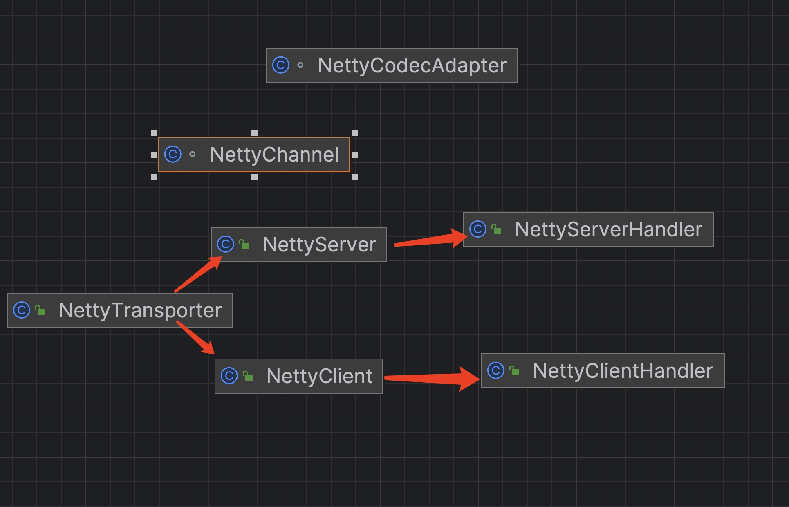

# dubbo源码-网络服务器-Transporter之客户端实现


### AbstractPeer

```java
    /**
     * 通道处理器
     */
    private final ChannelHandler handler;
    /**
     * URL
     */
    private volatile URL url;
    /**
     * 正在关闭
     *
     * {@link #startClose()}
     */
    // closing closed means the process is being closed and close is finished
    private volatile boolean closing;
    /**
     * 关闭完成
     *
     * {@link #close()}
     */
    private volatile boolean closed;

    public AbstractPeer(URL url, ChannelHandler handler) {
        if (url == null) {
            throw new IllegalArgumentException("url == null");
        }
        if (handler == null) {
            throw new IllegalArgumentException("handler == null");
        }
        this.url = url;
        this.handler = handler;
    }
```


#### 说明：
* (1) 实现 Endpoint、ChannelHandler 接口，Peer 抽象类。
* (2) handler 属性，通道处理器，通过构造方法传入。实现的 ChannelHandler 的接口方法，直接调用 handler 的方法，进行执行逻辑处理。
* (3) url 属性，URL ，通过构造方法传入。通过该属性，传递 Dubbo 服务引用和服务暴露的配置项。
* closing 属性，正在关闭，调用 #startClose() 方法，变更。
* close 属性，关闭完成，调用 #close() 方法，变更。

### 业务方法：

```java
    @Override
    public void disconnected(Channel ch) throws RemotingException {
        handler.disconnected(ch);
    }

    @Override
    public void sent(Channel ch, Object msg) throws RemotingException {
        if (closed) {
            return;
        }
        handler.sent(ch, msg);
    }

    @Override
    public void received(Channel ch, Object msg) throws RemotingException {
        if (closed) {
            return;
        }
        handler.received(ch, msg);
    }

    @Override
    public void caught(Channel ch, Throwable ex) throws RemotingException {
        handler.caught(ch, ex);
    }
```

#### 说明：
* 直接调用 handler 的方法，进行执行逻辑处理。使用的设计模式是装饰者模式，通过这个实现逐步对功能进行增强。


### AbstractEndpoint

```java
    /**
     * 编解码器
     */
    private Codec2 codec;
    /**
     * 超时时间
     */
    private int timeout;
    /**
     * 连接超时时间
     */
    private int connectTimeout;

    public AbstractEndpoint(URL url, ChannelHandler handler) {
        super(url, handler);
        this.codec = getChannelCodec(url);
        this.timeout = url.getPositiveParameter(Constants.TIMEOUT_KEY, Constants.DEFAULT_TIMEOUT);
        this.connectTimeout = url.getPositiveParameter(Constants.CONNECT_TIMEOUT_KEY, Constants.DEFAULT_CONNECT_TIMEOUT);
    }
    
        /**
     * 获得编解码器
     *
     * @param url URL
     * @return 编解码器
     */
    protected static Codec2 getChannelCodec(URL url) {
        String codecName = url.getParameter(Constants.CODEC_KEY, "telnet");
        if (ExtensionLoader.getExtensionLoader(Codec2.class).hasExtension(codecName)) { // 例如，在 DubboProtocol 中，会获得 DubboCodec
            return ExtensionLoader.getExtensionLoader(Codec2.class).getExtension(codecName);
        } else {
            return new CodecAdapter(ExtensionLoader.getExtensionLoader(Codec.class).getExtension(codecName));
        }
    }
```

#### 说明：
* codec 属性，编解码器。在构造方法中，可以看到调用 #getChannelCodec(url) 方法，基于 url 参数，加载对应的 Codec 实现对象。

### AbstractClient

#### 构造方法：
```java
    /**
     * 重连定时任务执行器
     */
    private static final ScheduledThreadPoolExecutor reconnectExecutorService = new ScheduledThreadPoolExecutor(2, new NamedThreadFactory("DubboClientReconnectTimer", true));
    /**
     * 连接锁，用于实现发起连接和断开连接互斥，避免并发。
     */
    private final Lock connectLock = new ReentrantLock();
    /**
     * 发送消息时，若断开，是否重连
     */
    private final boolean send_reconnect;
    /**
     * 重连次数
     */
    private final AtomicInteger reconnect_count = new AtomicInteger(0);
    /**
     * 重连时，是否已经打印过错误日志。
     */
    // Reconnection error log has been called before?
    private final AtomicBoolean reconnect_error_log_flag = new AtomicBoolean(false);
    /**
     * 重连 warning 的间隔.(waring多少次之后，warning一次) //for test
     */
    // reconnect warning period. Reconnect warning interval (log warning after how many times) //for test
    private final int reconnect_warning_period;
    /**
     * 关闭超时时间
     */
    private final long shutdown_timeout;

    public AbstractClient(URL url, ChannelHandler handler) throws RemotingException {
        super(url, handler);
        // 从 URL 中，获得重连相关配置项
        send_reconnect = url.getParameter(Constants.SEND_RECONNECT_KEY, false);
        shutdown_timeout = url.getParameter(Constants.SHUTDOWN_TIMEOUT_KEY, Constants.DEFAULT_SHUTDOWN_TIMEOUT);
        // The default reconnection interval is 2s, 1800 means warning interval is 1 hour.
        reconnect_warning_period = url.getParameter("reconnect.waring.period", 1800);

        // 初始化客户端
        try {
            doOpen();
        } catch (Throwable t) {
            close(); // 失败，则关闭
            throw new RemotingException(url.toInetSocketAddress(), null,
                    "Failed to start " + getClass().getSimpleName() + " " + NetUtils.getLocalAddress()
                            + " connect to the server " + getRemoteAddress() + ", cause: " + t.getMessage(), t);
        }

        // 连接服务器
        try {
            // connect.
            connect();
            if (logger.isInfoEnabled()) {
                logger.info("Start " + getClass().getSimpleName() + " " + NetUtils.getLocalAddress() + " connect to the server " + getRemoteAddress());
            }
        } catch (RemotingException t) {
            if (url.getParameter(Constants.CHECK_KEY, true)) {
                close(); // 失败，则关闭
                throw t;
            } else {
                logger.warn("Failed to start " + getClass().getSimpleName() + " " + NetUtils.getLocalAddress()
                        + " connect to the server " + getRemoteAddress() + " (check == false, ignore and retry later!), cause: " + t.getMessage(), t);
            }
        } catch (Throwable t) {
            close(); // 失败，则关闭
            throw new RemotingException(url.toInetSocketAddress(), null,
                    "Failed to start " + getClass().getSimpleName() + " " + NetUtils.getLocalAddress()
                            + " connect to the server " + getRemoteAddress() + ", cause: " + t.getMessage(), t);
        }
    // 获得线程池
    executor = (ExecutorService) ExtensionLoader.getExtensionLoader(DataStore.class).getDefaultExtension()
            .get(Constants.CONSUMER_SIDE, Integer.toString(url.getPort()));
    ExtensionLoader.getExtensionLoader(DataStore.class).getDefaultExtension()
            .remove(Constants.CONSUMER_SIDE, Integer.toString(url.getPort()));
}
```

#### 说明：
* reconnectExecutorService 属性，重连定时任务执行器。在客户端连接服务端时，会创建后台任务，定时检查连接，若断开，会进行重连。
* 调用 #doOpen() 抽象方法，初始化客户端。若异常，调用 #close() 方法，进行关闭。
* 调用 #connect() 实现方法，连接服务器。若异常，调用 #close() 方法，进行关闭。


#### 抽象方法：
```java
protected abstract void doOpen() throws Throwable;
protected abstract void doClose() throws Throwable;

protected abstract void doConnect() throws Throwable;
protected abstract void doDisConnect() throws Throwable;

protected abstract Channel getChannel();
```

#### 说明：
* com.alibaba.dubbo.remoting.transport.AbstractClient ，实现 Client 接口，继承 AbstractEndpoint 抽象类，客户端抽象类，重点实现了公用的重连逻辑，同时抽象了连接等模板方法，供子类实现。抽象方法如上面所示。


#### connect方法：

```java
    /**
     * (1) 获得锁，如果已经连接了，则返回
     * （2）初始化重连线程
     * （3）执行连接
     * （4）连接失败，抛出异常 RemotingException 。
     * （5）连接成功，则重置连接为0.
     * @throws RemotingException 
     */
    protected void connect() throws RemotingException {
        // 获得锁
        connectLock.lock();
        try {
            // 已连接，
            if (isConnected()) {
                return;
            }
            // 初始化重连线程
            initConnectStatusCheckCommand();
            // 执行连接
            doConnect();
            // 连接失败，抛出异常
            if (!isConnected()) {
                throw new RemotingException(this, "Failed connect to server " + getRemoteAddress() + " from " + getClass().getSimpleName() + " "
                        + NetUtils.getLocalHost() + " using dubbo version " + Version.getVersion()
                        + ", cause: Connect wait timeout: " + getTimeout() + "ms.");
            // 连接成功，打印日志
            } else {
                if (logger.isInfoEnabled()) {
                    logger.info("Successed connect to server " + getRemoteAddress() + " from " + getClass().getSimpleName() + " "
                            + NetUtils.getLocalHost() + " using dubbo version " + Version.getVersion()
                            + ", channel is " + this.getChannel());
                }
            }
            // 设置重连次数归零
            reconnect_count.set(0);
            // 设置未打印过错误日志
            reconnect_error_log_flag.set(false);
        } catch (RemotingException e) {
            throw e;
        } catch (Throwable e) {
            throw new RemotingException(this, "Failed connect to server " + getRemoteAddress() + " from " + getClass().getSimpleName() + " "
                    + NetUtils.getLocalHost() + " using dubbo version " + Version.getVersion()
                    + ", cause: " + e.getMessage(), e);
        } finally {
            // 释放锁
            connectLock.unlock();
        }
    }
```

#### 说明：
 * (1) 获得锁，如果已经连接了，则返回
 * （2）初始化重连线程
 * （3）执行连接
 * （4）连接失败，抛出异常 RemotingException 。
 * （5）连接成功，则重置连接为0.


#### send

```java
@Override
public void send(Object message, boolean sent) throws RemotingException {
    // 未连接时，开启重连功能，则先发起连接
    if (send_reconnect && !isConnected()) {
        connect();
    }
    // 发送消息
    Channel channel = getChannel();
    //TODO Can the value returned by getChannel() be null? need improvement.
    if (channel == null || !channel.isConnected()) {
        throw new RemotingException(this, "message can not send, because channel is closed . url:" + getUrl());
    }
    channel.send(message, sent);
}
```


#### wrapChannelHandler 包装通道处理器

```java
    /**
     * 包装通道处理器
     *
     * @param url URL
     * @param handler 被包装的通道处理器
     * @return 包装后的通道处理器
     */
    protected static ChannelHandler wrapChannelHandler(URL url, ChannelHandler handler) {
        // 设置线程名
        url = ExecutorUtil.setThreadName(url, CLIENT_THREAD_POOL_NAME);
        // 设置使用的线程池类型
        url = url.addParameterIfAbsent(Constants.THREADPOOL_KEY, Constants.DEFAULT_CLIENT_THREADPOOL);
        // 包装通道处理器
        return ChannelHandlers.wrap(handler, url);
    }
   
       public static ChannelHandler wrap(ChannelHandler handler, URL url) {
        return ChannelHandlers.getInstance().wrapInternal(handler, url);
    }

    protected static ChannelHandlers getInstance() {
        return INSTANCE;
    }
 
     protected ChannelHandler wrapInternal(ChannelHandler handler, URL url) {
        return new MultiMessageHandler(
                new HeartbeatHandler(
                        ExtensionLoader.getExtensionLoader(Dispatcher.class).getAdaptiveExtension().dispatch(handler, url)
                )
        );
    }

```

#### 说明：
* wrapChannelHandler 这个方法实现在AbstractClient里面，目的是使用装饰者模式包装了传入的业务handler
* wrapInternal方法 在 ChannelHandlers 通道处理器工厂，进一步包装了这个handler。
  增强了MultiMessageHandler， HeartbeatHandler 和 DispatcherHander.
* NIO 服务器这里有大量的这种类似的装饰者模式来增强业务功能。


### Netty Client和Server的业务抽象图




#### 说明：
* NettyCodecAdapter为编解码实现
* NettyBackedChannelBuffer为缓冲区
* NettyChannel为通道

### NettyChannel

```java
/**
 * 通道集合
 */
private static final ConcurrentMap<io.netty.channel.Channel, NettyChannel> channelMap = new ConcurrentHashMap<Channel, NettyChannel>();

/**
 * 通道
 */
private final io.netty.channel.Channel channel;
/**
 * 属性集合
 */
private final Map<String, Object> attributes = new ConcurrentHashMap<String, Object>();

private NettyChannel(io.netty.channel.Channel channel, URL url, ChannelHandler handler) {
    super(url, handler);
    if (channel == null) {
        throw new IllegalArgumentException("netty channel == null;");
    }
    this.channel = channel;
}
```

#### 说明：

* io.netty.channel.ChannelFuture.NettyChannel ，实现 AbstractChannel 抽象类，封装 Netty Channel 的通道实现类。
* channel 属性，通道。NettyChannel 是传入 channel 属性的装饰器，每个实现的方法，都会调用 channel 。
* attributes 属性，属性集合。注意，setAttribute(...) 等方法，使用的是该属性，而不是 io.netty.channel.Channel 的。
* channelMap 静态属性，通道集合。在实际 Netty Handler 里（例如下面我们会看到的 NettyServerHandler 和 NettyClientHandler），每个方法参数里，传递的是
* io.netty.channel.Channel 对象。通过 NettyChannel.channelMap 中，获得对应的 NettyChannel 对象。


####

```java
static NettyChannel getOrAddChannel(io.netty.channel.Channel ch, URL url, ChannelHandler handler) {
    if (ch == null) {
        return null;
    }
    NettyChannel ret = channelMap.get(ch);
    if (ret == null) {
        NettyChannel nettyChannel = new NettyChannel(ch, url, handler);
        if (ch.isActive()) { // 连接中
            ret = channelMap.putIfAbsent(ch, nettyChannel); // 添加到 channelMap
        }
        if (ret == null) {
            ret = nettyChannel;
        }
    }
    return ret;
}
``` 
#### 说明：
* 创建 NettyChannel 对象


#### send

```java
    @Override
    public void send(Object message, boolean sent) throws RemotingException {
        // 检查连接状态
        super.send(message, sent);

        boolean success = true; // 如果没有等待发送成功，默认成功。
        int timeout = 0;
        try {
            // 发送消息
            ChannelFuture future = channel.writeAndFlush(message);
            // 等待发送成功
            if (sent) {
                timeout = getUrl().getPositiveParameter(Constants.TIMEOUT_KEY, Constants.DEFAULT_TIMEOUT);
                success = future.await(timeout);
            }
            // 若发生异常，抛出
            Throwable cause = future.cause();
            if (cause != null) {
                throw cause;
            }
        } catch (Throwable e) {
            throw new RemotingException(this, "Failed to send message " + message + " to " + getRemoteAddress() + ", cause: " + e.getMessage(), e);
        }

        // 发送失败，抛出异常
        if (!success) {
            throw new RemotingException(this, "Failed to send message " + message + " to " + getRemoteAddress()
                    + "in timeout(" + timeout + "ms) limit");
        }
    }
```
#### 说明：
* 调用 #send(message, sent) 方法，检查连接状态。
* success ，是否执行成功。若不需要等待发送成功( sent = false ) ，默认成功。
* 调用真正的 io.netty.channel.Channel#writeAndFlush(message) 方法，发送消息。
* 若需要等待发送成功( sent = true )，等待直到成功或超时。


### NettyClient

```java
    private static final NioEventLoopGroup nioEventLoopGroup = new NioEventLoopGroup(Constants.DEFAULT_IO_THREADS, new DefaultThreadFactory("NettyClientWorker", true));

    private Bootstrap bootstrap;

    private volatile io.netty.channel.Channel channel; // volatile, please copy reference to use

    public NettyClient(final URL url, final ChannelHandler handler) throws RemotingException {
        super(url, wrapChannelHandler(url, handler));
    }
```

#### 说明：
* channel 属性，通道，有 volatile 修饰符。因为客户端可能会断开重连，需要保证多线程的可见性。
* 注意这个地方使用到了 wrapChannelHandler，即上面提到的装饰者方法，将传入的业务handler包装增强为一个新的handler。


#### doOpen方法：

```java
    /**
     * （1）标准的NettyClient初始化的逻辑。
     * （2）初始化 NettyClientHandler
     * （3）设置Bootstrap，设置线程组，设置channel类型为 NioSocketChannel
     * （4）封装 NettyCodecAdapter 初始化编解码器，就是Codec里面的编解码实现。
     * 
     */
    @Override
    protected void doOpen() {
        // 设置日志工厂
        NettyHelper.setNettyLoggerFactory();

        // 创建 NettyClientHandler 对象
        final NettyClientHandler nettyClientHandler = new NettyClientHandler(getUrl(), this);

        // 实例化 ServerBootstrap
        bootstrap = new Bootstrap();
        bootstrap
                // 设置它的线程组
                .group(nioEventLoopGroup)
                // 设置可选项
                .option(ChannelOption.SO_KEEPALIVE, true)
                .option(ChannelOption.TCP_NODELAY, true)
                .option(ChannelOption.ALLOCATOR, PooledByteBufAllocator.DEFAULT)
                //.option(ChannelOption.CONNECT_TIMEOUT_MILLIS, getTimeout())
                // 设置 Channel类型
                .channel(NioSocketChannel.class);

        // 设置连接超时时间
        if (getTimeout() < 3000) {
            bootstrap.option(ChannelOption.CONNECT_TIMEOUT_MILLIS, 3000);
        } else {
            bootstrap.option(ChannelOption.CONNECT_TIMEOUT_MILLIS, getTimeout());
        }

        // 设置责任链路
        bootstrap.handler(new ChannelInitializer() {
            @Override
            protected void initChannel(Channel ch) {
                // 创建 NettyCodecAdapter 对象
                NettyCodecAdapter adapter = new NettyCodecAdapter(getCodec(), getUrl(), NettyClient.this);
                ch.pipeline()//.addLast("logging",new LoggingHandler(LogLevel.INFO))//for debug
                        .addLast("decoder", adapter.getDecoder()) // 解码
                        .addLast("encoder", adapter.getEncoder()) // 编码
                        .addLast("handler", nettyClientHandler); // 处理器
            }
        });
    }
```
#### 说明：
 * （1）标准的NettyClient初始化的逻辑。
 * （2）初始化 NettyClientHandler
 * （3）设置Bootstrap，设置线程组，设置channel类型为 NioSocketChannel
 * （4）封装 NettyCodecAdapter 初始化编解码器，就是Codec里面的编解码实现。


#### doConnect方法：
```java
    protected void doConnect() throws Throwable {
        long start = System.currentTimeMillis();
        // 连接服务器
        ChannelFuture future = bootstrap.connect(getConnectAddress());
        try {
            // 等待连接成功或者超时
            boolean ret = future.awaitUninterruptibly(3000, TimeUnit.MILLISECONDS);
            // 连接成功
            if (ret && future.isSuccess()) {
                Channel newChannel = future.channel();
                try {
                    // 关闭老的连接
                    // Close old channel
                    Channel oldChannel = NettyClient.this.channel; // copy reference
                    if (oldChannel != null) {
                        try {
                            if (logger.isInfoEnabled()) {
                                logger.info("Close old netty channel " + oldChannel + " on create new netty channel " + newChannel);
                            }
                            oldChannel.close();
                        } finally {
                            NettyChannel.removeChannelIfDisconnected(oldChannel);
                        }
                    }
                } finally {
                    // 若 NettyClient 被关闭，关闭连接
                    if (NettyClient.this.isClosed()) {
                        try {
                            if (logger.isInfoEnabled()) {
                                logger.info("Close new netty channel " + newChannel + ", because the client closed.");
                            }
                            newChannel.close();
                        } finally {
                            NettyClient.this.channel = null;
                            NettyChannel.removeChannelIfDisconnected(newChannel);
                        }
                    // 设置新连接
                    } else {
                        NettyClient.this.channel = newChannel;
                    }
                }
            // 发生异常，抛出 RemotingException 异常
            } else if (future.cause() != null) {
                throw new RemotingException(this, "client(url: " + getUrl() + ") failed to connect to server "
                        + getRemoteAddress() + ", error message is:" + future.cause().getMessage(), future.cause());
            // 无结果（连接超时），抛出 RemotingException 异常
            } else {
                throw new RemotingException(this, "client(url: " + getUrl() + ") failed to connect to server "
                        + getRemoteAddress() + " client-side timeout "
                        + getConnectTimeout() + "ms (elapsed: " + (System.currentTimeMillis() - start) + "ms) from netty client "
                        + NetUtils.getLocalHost() + " using dubbo version " + Version.getVersion());
            }
        } finally {
            if (!isConnected()) { // 【TODO 8028】为什么不取消 future
                //future.cancel(true);
            }
        }
    }
```

#### 说明：
* 1，调用 Bootstrap#connect(remoteAddress) 方法，连接服务器。
* 2，调用 ChannelFuture#awaitUninterruptibly(3000, TimeUnit) 方法，等待连接成功或超时
* 3，连接成功。若存在老的连接，调用 Channel#close() 方法，进行关闭。
* 若 NettyClient 被关闭，调用 Channel#close() 方法，关闭新的连接。
* 设置新的连接到 channel。


### NettyCodecAdapter

```java
/**
 * Netty 编码器
 */
private final ChannelHandler encoder = new InternalEncoder();
/**
 * Netty 解码器
 */
private final ChannelHandler decoder = new InternalDecoder();

/**
 * Dubbo 编解码器
 */
private final Codec2 codec;
/**
 * Dubbo URL
 */
private final URL url;
/**
 * Dubbo ChannelHandler
 */
private final com.alibaba.dubbo.remoting.ChannelHandler handler;

public NettyCodecAdapter(Codec2 codec, URL url, com.alibaba.dubbo.remoting.ChannelHandler handler) {
    this.codec = codec;
    this.url = url;
    this.handler = handler;
}
```


#### 说明：
* com.alibaba.dubbo.remoting.transport.netty4.NettyCodecAdapter ，Netty 编解码适配器，将 Dubbo 编解码器 适配成 Netty4 的编码器和解码器。


```java
private class InternalEncoder extends MessageToByteEncoder {

    @Override
    protected void encode(ChannelHandlerContext ctx, Object msg, ByteBuf out) throws Exception {
        // 创建 NettyBackedChannelBuffer 对象
        com.alibaba.dubbo.remoting.buffer.ChannelBuffer buffer = new NettyBackedChannelBuffer(out);
        // 获得 NettyChannel 对象
        Channel ch = ctx.channel();
        NettyChannel channel = NettyChannel.getOrAddChannel(ch, url, handler);
        try {
            // 编码
            codec.encode(channel, buffer, msg);
        } finally {
            // 移除 NettyChannel 对象，若断开连接
            NettyChannel.removeChannelIfDisconnected(ch);
        }
    }

}
```


```java
 private class InternalDecoder extends ByteToMessageDecoder {

        /** 
         *  循环解析，直到结束
         * (1) saveReaderIndex = message.readerIndex();
         * (2) msg == Codec2.DecodeResult.NEED_MORE_INPUT
         * (3) 可以解码的时候，持续解码
         * 
         * @param ctx 
         * @param input
         * @param out
         * @throws Exception
         */
        @Override
        protected void decode(ChannelHandlerContext ctx, ByteBuf input, List<Object> out) throws Exception {
            // 创建 NettyBackedChannelBuffer 对象
            ChannelBuffer message = new NettyBackedChannelBuffer(input);
            // 获得 NettyChannel 对象
            NettyChannel channel = NettyChannel.getOrAddChannel(ctx.channel(), url, handler);
            // 循环解析，直到结束
            Object msg;
            int saveReaderIndex;
            try {
                // decode object.
                do {
                    // 记录当前读进度
                    saveReaderIndex = message.readerIndex();
                    // 解码
                    try {
                        msg = codec.decode(channel, message);
                    } catch (IOException e) {
                        throw e;
                    }
                    // 需要更多输入，即消息不完整，标记回原有读进度，并结束
                    if (msg == Codec2.DecodeResult.NEED_MORE_INPUT) {
                        message.readerIndex(saveReaderIndex);
                        break;
                    // 解码到消息，添加到 `out`
                    } else {
                        //is it possible to go here ? 芋艿：不可能，哈哈哈
                        if (saveReaderIndex == message.readerIndex()) {
                            throw new IOException("Decode without read data.");
                        }
                        if (msg != null) {
                            out.add(msg);
                        }
                    }
                } while (message.readable());
            } finally {
                // 移除 NettyChannel 对象，若断开连接
                NettyChannel.removeChannelIfDisconnected(ctx.channel());
            }
        }
    }
}
```

### 说明：
 *  循环解析，直到结束
 * (1) saveReaderIndex = message.readerIndex();
 * (2) msg == Codec2.DecodeResult.NEED_MORE_INPUT
 * (3) 可以解码的时候，持续解码


