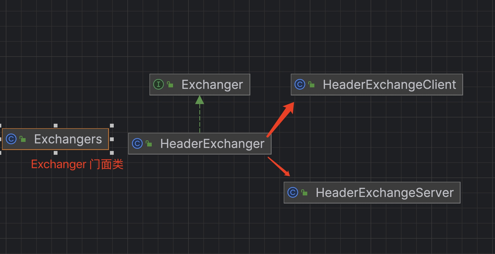

# dubbo源码-网络服务器-之Exchange

### Exchanger抽象




#### 说明：
* （1）Exchanges作为门面类，使用SPI，初始化了HeaderExchanger
* （2）HeaderExchanger 初始化了 HeaderExchangeClient HeaderExchangeServer
* （3）HeaderExchangeClient 封装了NettyClient
* (4) HeaderExchangeServer 封装了NettyServer

```java
public class HeaderExchanger implements Exchanger {

    public static final String NAME = "header";

    @Override
    public ExchangeClient connect(URL url, ExchangeHandler handler) throws RemotingException {
        return new HeaderExchangeClient(Transporters.connect(url, new DecodeHandler(new HeaderExchangeHandler(handler))), true);
    }

    @Override
    public ExchangeServer bind(URL url, ExchangeHandler handler) throws RemotingException {
        return new HeaderExchangeServer(Transporters.bind(url, new DecodeHandler(new HeaderExchangeHandler(handler))));
    }

}
```


### HeaderExchangeClient


#### 成员变量和构造器

```java
    /**
     * 定时器线程池
     */
    private static final ScheduledThreadPoolExecutor scheduled = new ScheduledThreadPoolExecutor(2, new NamedThreadFactory("dubbo-remoting-client-heartbeat", true));
    /**
     * 客户端
     */
    private final Client client;
    /**
     * 信息交换通道
     */
    private final ExchangeChannel channel;
    // heartbeat timer
    /**
     * 心跳定时器
     */
    private ScheduledFuture<?> heartbeatTimer;
    /**
     * 是否心跳
     */
    private int heartbeat;
    // heartbeat timeout (ms), default value is 0 , won't execute a heartbeat.
    /**
     * 心跳间隔，单位：毫秒
     */
    private int heartbeatTimeout;

    public HeaderExchangeClient(Client client, boolean needHeartbeat) {
        if (client == null) {
            throw new IllegalArgumentException("client == null");
        }
        this.client = client;
        // 创建 HeaderExchangeChannel 对象
        this.channel = new HeaderExchangeChannel(client);
        // 读取心跳相关配置
        String dubbo = client.getUrl().getParameter(Constants.DUBBO_VERSION_KEY);
        this.heartbeat = client.getUrl().getParameter(Constants.HEARTBEAT_KEY, dubbo != null && dubbo.startsWith("1.0.") ? Constants.DEFAULT_HEARTBEAT : 0);
        this.heartbeatTimeout = client.getUrl().getParameter(Constants.HEARTBEAT_TIMEOUT_KEY, heartbeat * 3);
        if (heartbeatTimeout < heartbeat * 2) { // 避免间隔太短
            throw new IllegalStateException("heartbeatTimeout < heartbeatInterval * 2");
        }
        // 发起心跳定时器
        if (needHeartbeat) {
            startHeatbeatTimer();
        }
    }

```

#### 说明：
* （1）初始化了client 和 HeaderExchangeChannel 对象
* （2）初始化了心跳参数和心跳超时参数
* （3）发起心跳定时器，心跳定时器是一个HeartBeatTask 任务。

```java
    private void startHeatbeatTimer() {
        // 停止原有定时任务
        stopHeartbeatTimer();
        // 发起新的定时任务
        if (heartbeat > 0) {
            heartbeatTimer = scheduled.scheduleWithFixedDelay(
                    new HeartBeatTask(new HeartBeatTask.ChannelProvider() {
                        @Override
                        public Collection<Channel> getChannels() {
                            return Collections.<Channel>singletonList(HeaderExchangeClient.this);
                        }
                    }, heartbeat, heartbeatTimeout),
                    heartbeat, heartbeat, TimeUnit.MILLISECONDS);
        }
    }
```


### HeartBeatTask

```java
@Override
    public void run() {
        try {
            long now = System.currentTimeMillis();
            for (Channel channel : channelProvider.getChannels()) {
                if (channel.isClosed()) {
                    continue;
                }
                try {
                    Long lastRead = (Long) channel.getAttribute(HeaderExchangeHandler.KEY_READ_TIMESTAMP);
                    Long lastWrite = (Long) channel.getAttribute(HeaderExchangeHandler.KEY_WRITE_TIMESTAMP);
                    // 最后读写的时间，任一超过心跳间隔，发送心跳
                    if ((lastRead != null && now - lastRead > heartbeat)
                            || (lastWrite != null && now - lastWrite > heartbeat)) {
                        Request req = new Request();
                        req.setVersion("2.0.0");
                        req.setTwoWay(true); // 需要响应
                        req.setEvent(Request.HEARTBEAT_EVENT);
                        channel.send(req);
                        if (logger.isDebugEnabled()) {
                            logger.debug("Send heartbeat to remote channel " + channel.getRemoteAddress()
                                    + ", cause: The channel has no data-transmission exceeds a heartbeat period: " + heartbeat + "ms");
                        }
                    }
                    // 最后读的时间，超过心跳超时时间
                    if (lastRead != null && now - lastRead > heartbeatTimeout) {
                        logger.warn("Close channel " + channel
                                + ", because heartbeat read idle time out: " + heartbeatTimeout + "ms");
                        // 客户端侧，重新连接服务端
                        if (channel instanceof Client) {
                            try {
                                ((Client) channel).reconnect();
                            } catch (Exception e) {
                                //do nothing
                            }
                        // 服务端侧，关闭客户端连接
                        } else {
                            channel.close();
                        }
                    }
                } catch (Throwable t) {
                    logger.warn("Exception when heartbeat to remote channel " + channel.getRemoteAddress(), t);
                }
            }
        } catch (Throwable t) {
            logger.warn("Unhandled exception when heartbeat, cause: " + t.getMessage(), t);
        }
    }
```

#### 说明：
* 核心是两个任务
* （1）最后读或写的时间，任一超过心跳间隔 heartbeat ，发送心跳
* （2）最后读的时间，超过心跳超时时间 heartbeatTimeout 
   *  （1）如果是客户端侧，重新连接服务端 reconnect
   *  （2）如果是服务端侧，则需要关闭连接。

