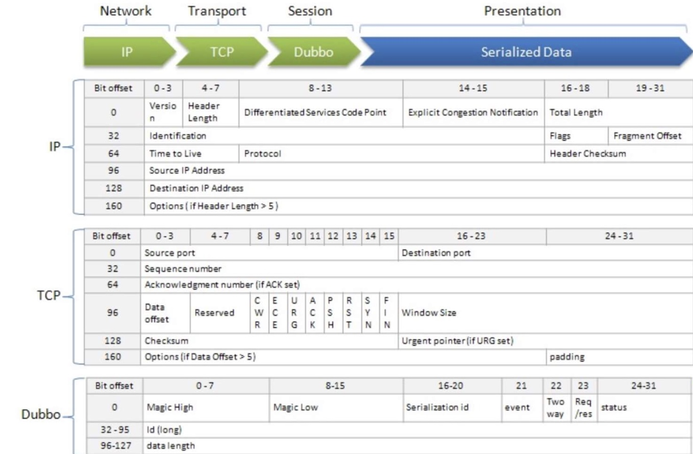

# dubbo源码-网络服务器-之Exchange层-codec和dubbo协议


## Dubbo RPC协议编码数据结构



#### 说明：
以上为dubbo的编码协议，来自于
```java
com.alibaba.dubbo.remoting.exchange.codec.ExchangeCodec
``` 
类，继承 TelnetCodec 类，信息交换编解码器。

#### bits位解释：
* Header 部分，协议头，通过 Codec 编解码。Bits 位如下：
* [0, 15]：Magic Number
* [16, 20]：Serialization 编号。
* [21]：event 是否为事件。
* [22]：twoWay 是否需要响应。
* [23]：是请求还是响应。
* [24 - 31]：status 状态。
* [32 - 95]：id 编号，Long 型。
* [96 - 127]：Body 的长度。通过该长度，读取 Body 。
* Body 部分，协议体，通过 Serialization 序列化/反序列化。


#### 成员变量：

```java
    // header length. Header 总长度，16 Bytes = 128 Bits 。
    protected static final int HEADER_LENGTH = 16;
    // magic header.
    protected static final short MAGIC = (short) 0xdabb;
    protected static final byte MAGIC_HIGH = Bytes.short2bytes(MAGIC)[0];
    protected static final byte MAGIC_LOW = Bytes.short2bytes(MAGIC)[1];
    // message flag.
    protected static final byte FLAG_REQUEST = (byte) 0x80; // 128
    protected static final byte FLAG_TWOWAY = (byte) 0x40; // 64
    protected static final byte FLAG_EVENT = (byte) 0x20; // 32
    protected static final int SERIALIZATION_MASK = 0x1f; // 31

```

#### 编码实现：

```java
    /**
     * （1）如果是请求Request，则调用 encodeRequest 方法
     * （2）如果是响应 Response， 则调用 encodeResponse 方法
     * （3）否则提交给父类Telnet 处理Telnet 命令
     * 
     * @param channel 通道 
     * @param buffer  Buffer
     * @param msg     消息
     * @throws IOException
     */
    @Override
    public void encode(Channel channel, ChannelBuffer buffer, Object msg) throws IOException {
        if (msg instanceof Request) { // 请求
            encodeRequest(channel, buffer, (Request) msg);
        } else if (msg instanceof Response) { // 响应
            encodeResponse(channel, buffer, (Response) msg);
        } else { // 提交给父类( Telnet ) 处理，目前是 Telnet 命令的结果。
            super.encode(channel, buffer, msg);
        }
    }
```

#### 说明：
 * （1）如果是请求Request，则调用 encodeRequest 方法
 * （2）如果是响应 Response， 则调用 encodeResponse 方法
 * （3）否则提交给父类Telnet 处理Telnet 命令


### encodeRequest 

```java
    /**
     * 编码请求
     *  （1）首先获取 Serialization 序列化实现，可以通过URL的参数，通过codecSupport 的SPI机制获取
     *  （2）设置magic number
     *  （3）设置序列化的序号 和 request的编码
     *  （3）设置是否需要响应 twoWay
     *  （4）设置是否是事件
     *  （5）设置requestId
     *  （6） 编码 `Request.data` 到 Body ，并写入到 Buffer
     *      （1）如果是事件 encodeEventData
     *      （2）如果是request  encodeRequestData
     *  （7）checkPayload 检查body的长度，是否超过限制。
     *  （9）获取body长度并写入到header，Bytes.int2bytes(len, header, 12);
     *  （10）写入 Header 到 Buffer buffer.writeBytes(header);   
     *
     * @param channel 通道
     * @param buffer Buffer
     * @param req 请求
     * @throws IOException 当发生 IO 异常时
     */
    protected void encodeRequest(Channel channel, ChannelBuffer buffer, Request req) throws IOException {
        Serialization serialization = getSerialization(channel);
        // `[0, 15]`：Magic Number
        // header.
        byte[] header = new byte[HEADER_LENGTH];
        // set magic number.
        Bytes.short2bytes(MAGIC, header);

        // `[16, 20]`：Serialization 编号 && `[23]`：请求。
        // set request and serialization flag.
        header[2] = (byte) (FLAG_REQUEST | serialization.getContentTypeId());

        // `[21]`：`event` 是否为事件。
        if (req.isTwoWay()) header[2] |= FLAG_TWOWAY;
        // `[22]`：`twoWay` 是否需要响应。
        if (req.isEvent()) header[2] |= FLAG_EVENT;

        // `[32 - 95]`：`id` 编号，Long 型。
        // set request id.
        Bytes.long2bytes(req.getId(), header, 4);

        // 编码 `Request.data` 到 Body ，并写入到 Buffer
        // encode request data.
        int savedWriteIndex = buffer.writerIndex();
        buffer.writerIndex(savedWriteIndex + HEADER_LENGTH);
        ChannelBufferOutputStream bos = new ChannelBufferOutputStream(buffer);
        ObjectOutput out = serialization.serialize(channel.getUrl(), bos); // 序列化 Output
        if (req.isEvent()) {
            encodeEventData(channel, out, req.getData());
        } else {
            encodeRequestData(channel, out, req.getData());
        }
        // 释放资源
        out.flushBuffer();
        if (out instanceof Cleanable) {
            ((Cleanable) out).cleanup();
        }
        bos.flush();
        bos.close();
        // 检查 Body 长度，是否超过消息上限。
        int len = bos.writtenBytes();
        checkPayload(channel, len);
        // `[96 - 127]`：Body 的**长度**。
        Bytes.int2bytes(len, header, 12);

        // 写入 Header 到 Buffer
        // write
        buffer.writerIndex(savedWriteIndex);
        buffer.writeBytes(header); // write header.
        buffer.writerIndex(savedWriteIndex + HEADER_LENGTH + len);
    }
```

#### 说明：
 *  （1）首先获取 Serialization 序列化实现，可以通过URL的参数，通过codecSupport 的SPI机制获取
 *  （2）设置magic number
 *  （3）设置序列化的序号 和 request的编码
 *  （3）设置是否需要响应 twoWay
 *  （4）设置是否是事件
 *  （5）设置requestId
 *  （6） 编码 `Request.data` 到 Body ，并写入到 Buffer
 *      （1）如果是事件 encodeEventData
 *      （2）如果是request  encodeRequestData
 *  （7）checkPayload 检查body的长度，是否超过限制。
 *  （9）获取body长度并写入到header，Bytes.int2bytes(len, header, 12);
 *  （10）写入 Header 到 Buffer buffer.writeBytes(header);
 *   为什么 Buffer 先写入了 Body ，再写入 Header 呢？因为 Header 中，里面 [96 - 127] 的 Body 长度，需要序列化后才得到。
 *   encodeResponse的逻辑和 encodeRequest的逻辑差不多 


### decode解码：

```java
    @Override
    public Object decode(Channel channel, ChannelBuffer buffer) throws IOException {
        // 读取 Header 数组
        int readable = buffer.readableBytes();
        byte[] header = new byte[Math.min(readable, HEADER_LENGTH)];
        buffer.readBytes(header);
        // 解码
        return decode(channel, buffer, readable, header);
    }

```

```java
    /**
     * （1）先校验魔数，如果不是dubbo协议的话，默认是telnet命令，调用父类的codec进行编解码
     * （2）Header 长度不够，返回需要更多的输入
     * （3）总长度不够，返回需要更多的输入
     * （4）调用decodeBody 方法进行解码
     * 
     * @param channel
     * @param buffer
     * @param readable
     * @param header
     * @return
     * @throws IOException
     */
    @Override
    protected Object decode(Channel channel, ChannelBuffer buffer, int readable, byte[] header) throws IOException {
        // 非 Dubbo 协议，目前是 Telnet 命令。
        // check magic number.
        if (readable > 0 && header[0] != MAGIC_HIGH || readable > 1 && header[1] != MAGIC_LOW) {
            // 将 buffer 完全复制到 `header` 数组中。因为，上面的 `#decode(channel, buffer)` 方法，可能未读全
            int length = header.length;
            if (header.length < readable) {
                header = Bytes.copyOf(header, readable);
                buffer.readBytes(header, length, readable - length);
            }
            // 【TODO 8026 】header[i] == MAGIC_HIGH && header[i + 1] == MAGIC_LOW ？
            for (int i = 1; i < header.length - 1; i++) {
                if (header[i] == MAGIC_HIGH && header[i + 1] == MAGIC_LOW) {
                    buffer.readerIndex(buffer.readerIndex() - header.length + i);
                    header = Bytes.copyOf(header, i);
                    break;
                }
            }
            // 提交给父类( Telnet ) 处理，目前是 Telnet 命令。
            return super.decode(channel, buffer, readable, header);
        }
        // Header 长度不够，返回需要更多的输入
        // check length.
        if (readable < HEADER_LENGTH) {
            return DecodeResult.NEED_MORE_INPUT;
        }

        // `[96 - 127]`：Body 的**长度**。通过该长度，读取 Body 。
        // get data length.
        int len = Bytes.bytes2int(header, 12);
        checkPayload(channel, len);

        // 总长度不够，返回需要更多的输入
        int tt = len + HEADER_LENGTH;
        if (readable < tt) {
            return DecodeResult.NEED_MORE_INPUT;
        }

        // 解析 Header + Body
        // limit input stream.
        ChannelBufferInputStream is = new ChannelBufferInputStream(buffer, len);
        try {
            return decodeBody(channel, is, header);
        } finally {
            // skip 未读完的流，并打印错误日志
            if (is.available() > 0) {
                try {
                    if (logger.isWarnEnabled()) {
                        logger.warn("Skip input stream " + is.available());
                    }
                    StreamUtils.skipUnusedStream(is);
                } catch (IOException e) {
                    logger.warn(e.getMessage(), e);
                }
            }
        }
    }
```

```java
    /**
     * 解析，返回 Request 或 Response
     * （1） 获取编码中的序列化实现。
     * （2） 获取requestId
     * （3） 如果是resp的话，解码resp，如果是请求的话，解码请求，逻辑基本类似
     * （4）如果是事件的话，将其设置为HEARTBEAT_EVENT 心跳事件
     * （5）依次解码不同的事件，心跳和响应Response
     * 
     * @param channel 通道
     * @param is 输出
     * @param header Header
     * @return 结果
     * @throws IOException 当发生 IO 异常时
     */
    protected Object decodeBody(Channel channel, InputStream is, byte[] header) throws IOException {
        byte flag = header[2], proto = (byte) (flag & SERIALIZATION_MASK);
        Serialization s = CodecSupport.getSerialization(channel.getUrl(), proto);
        ObjectInput in = s.deserialize(channel.getUrl(), is);
        // Response
        // get request id.
        long id = Bytes.bytes2long(header, 4);
        if ((flag & FLAG_REQUEST) == 0) { // Response
            // decode response.
            Response res = new Response(id);
            if ((flag & FLAG_EVENT) != 0) {
                res.setEvent(Response.HEARTBEAT_EVENT);
            }
            // get status.
            byte status = header[3];
            res.setStatus(status);
            if (status == Response.OK) {
                try {
                    Object data;
                    if (res.isHeartbeat()) {
                        data = decodeHeartbeatData(channel, in);
                    } else if (res.isEvent()) {
                        data = decodeEventData(channel, in);
                    } else {
                        data = decodeResponseData(channel, in, getRequestData(id)); // `#getRequestData(id)` 的调用，是多余的
                    }
                    res.setResult(data);
                } catch (Throwable t) {
                    res.setStatus(Response.CLIENT_ERROR);
                    res.setErrorMessage(StringUtils.toString(t));
                }
            } else {
                res.setErrorMessage(in.readUTF());
            }
            return res;
        // Request
        } else { // Request
            // decode request.
            Request req = new Request(id);
            req.setVersion("2.0.0");
            req.setTwoWay((flag & FLAG_TWOWAY) != 0);
            if ((flag & FLAG_EVENT) != 0) { // 心跳事件
                req.setEvent(Request.HEARTBEAT_EVENT);
            }
            try {
                Object data;
                if (req.isHeartbeat()) {
                    data = decodeHeartbeatData(channel, in);
                } else if (req.isEvent()) {
                    data = decodeEventData(channel, in);
                } else {
                    data = decodeRequestData(channel, in);
                }
                req.setData(data);
            } catch (Throwable t) {
                // bad request
                req.setBroken(true);
                req.setData(t);
            }
            return req;
        }
    }
```

#### 说明：
 * （1）先校验魔数，如果不是dubbo协议的话，默认是telnet命令，调用父类的codec进行编解码
 * （2）Header 长度不够，返回需要更多的输入
 * （3）总长度不够，返回需要更多的输入
 * （4）调用decodeBody 方法进行解码

 * 解析，返回 Request 或 Response
 * （1） 获取编码中的序列化实现。
 * （2） 获取requestId
 * （3） 如果是resp的话，解码resp，如果是请求的话，解码请求，逻辑基本类似
 * （4）如果是事件的话，将其设置为HEARTBEAT_EVENT 心跳事件
 * （5）依次解码不同的事件，心跳和响应Response

