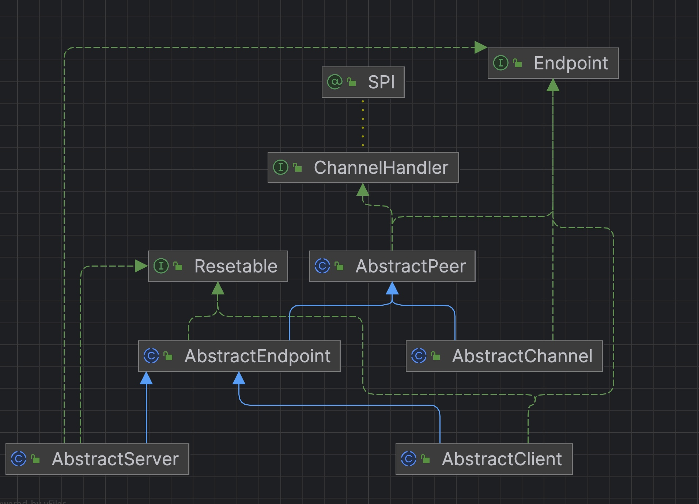
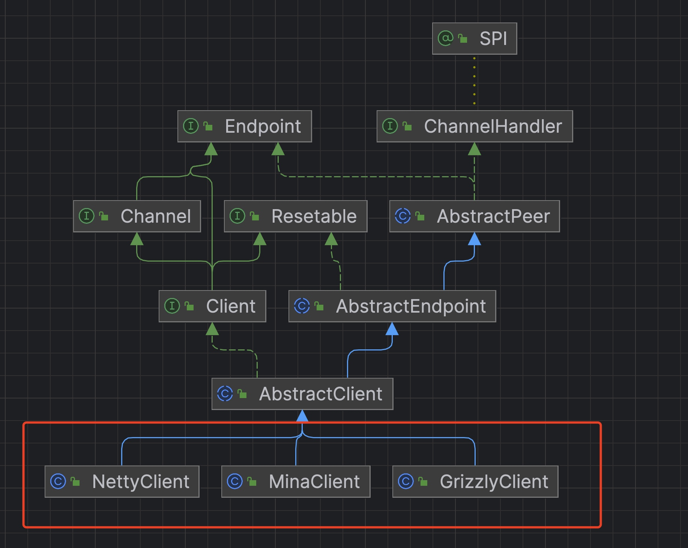
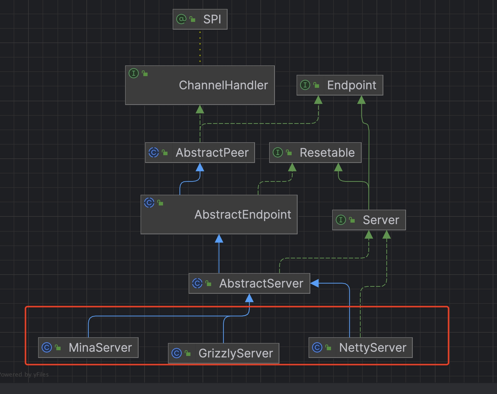
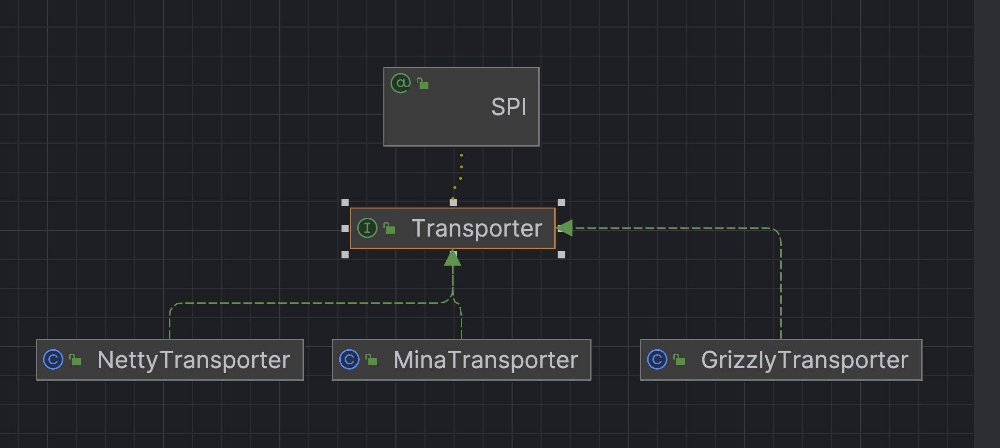
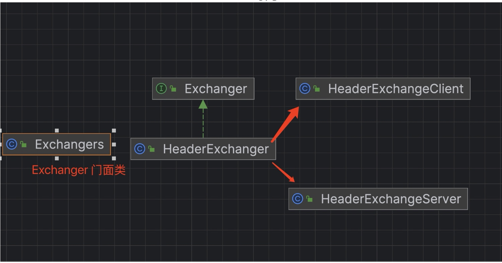
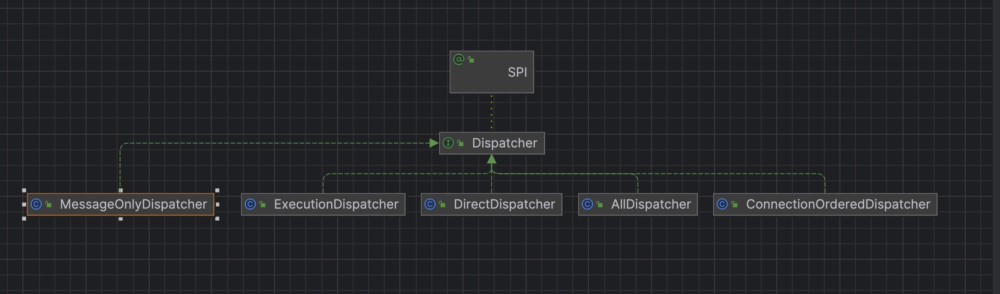

# dubbo源码-网络服务器-之transporter 抽象


### NIO服务器顶层抽象










#### 说明:
* (1) 我们将整个NIO服务器分为六个部分，分别是 client，server，channel，channelhandler（业务处理器），codec编码，和Dispatcher线程模型
* （2）如上面三个图展示了client 和sever的集成逻辑，
* （3）client 和 server分别都有三个实现，主要看的是netty实现。





### NettyTransporter
```java
public class NettyTransporter implements Transporter {

    public static final String NAME = "netty";

    @Override
    public Server bind(URL url, ChannelHandler listener) throws RemotingException {
        return new NettyServer(url, listener);
    }

    @Override
    public Client connect(URL url, ChannelHandler listener) throws RemotingException {
        return new NettyClient(url, listener);
    }
}
```


#### 说明：
* （1）transporter作为类似于工厂类，用于初始化各个transporter。
* （2）transporter具体的类，有初始化了对应的NettyClient和NettyServer
* （3）bind对应的是 NettyServer类，connect对应的是NettyClient类。


### Netty Client和Server的业务抽象图




### Transporters 门面类：
```java
    public static Server bind(URL url, ChannelHandler... handlers) throws RemotingException {
        if (url == null) {
            throw new IllegalArgumentException("url == null");
        }
        if (handlers == null || handlers.length == 0) {
            throw new IllegalArgumentException("handlers == null");
        }
        // 创建 handler
        ChannelHandler handler;
        if (handlers.length == 1) {
            handler = handlers[0];
        } else {
            handler = new ChannelHandlerDispatcher(handlers);
        }
        // 创建 Server 对象
        return getTransporter().bind(url, handler);
    }

    public static Client connect(URL url, ChannelHandler... handlers) throws RemotingException {
        if (url == null) {
            throw new IllegalArgumentException("url == null");
        }
        // 创建 handler
        ChannelHandler handler;
        if (handlers == null || handlers.length == 0) {
            handler = new ChannelHandlerAdapter();
        } else if (handlers.length == 1) {
            handler = handlers[0];
        } else {
            handler = new ChannelHandlerDispatcher(handlers);
        }
        // 创建 Client 对象
        return getTransporter().connect(url, handler);
    }

    public static Transporter getTransporter() {
        return ExtensionLoader.getExtensionLoader(Transporter.class).getAdaptiveExtension();
    }
```

#### 说明：
* （1） Transporters 提供了初始化NioClient 和NioServer的方式
* （2） 首先通过SPI机制 getTransporter 获得对应的 Transporter 工厂类
* （3） 通过Transporter 获得对应的 client 和server。


### dispatcher抽象




#### 说明：
* 1，Dispatcher对应的是网络提交的线程模型
* 2，all 所有消息都派发到线程池，包括请求，响应，连接事件，断开事件，心跳等。
* 3，direct 所有消息都不派发到线程池，全部在 IO 线程上直接执行。
* 4，message 只有请求响应消息派发到线程池，其它连接断开事件，心跳等消息，直接在 IO 线程上执行。
* 5，execution 只请求消息派发到线程池，不含响应，响应和其它连接断开事件，心跳等消息，
   直接在 IO 线程上执行。
* 6，connection 在 IO 线程上，将连接断开事件放入队列，有序逐个执行，其它消息派发到线程池。

