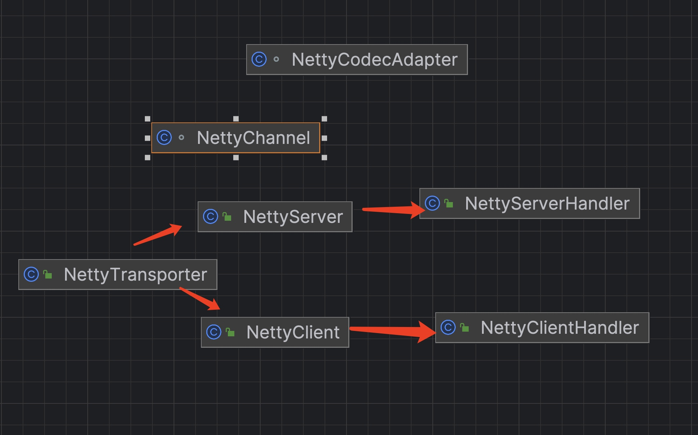

# dubbo源码-网络服务器-之transporter 服务端实现


### 和client公共的代码可以在client部分找到

### AbstractServer

```java
    /**
     * 线程池
     */
    ExecutorService executor;
    /**
     * 服务地址
     */
    private InetSocketAddress localAddress;
    /**
     * 绑定地址
     */
    private InetSocketAddress bindAddress;
    /**
     * 服务器最大可接受连接数
     */
    private int accepts;
    /**
     * 空闲超时时间，单位：毫秒
     */
    private int idleTimeout; //600 seconds

    public AbstractServer(URL url, ChannelHandler handler) throws RemotingException {
        super(url, handler);
        // 服务地址
        localAddress = getUrl().toInetSocketAddress();
        // 绑定地址
        String bindIp = getUrl().getParameter(Constants.BIND_IP_KEY, getUrl().getHost());
        int bindPort = getUrl().getParameter(Constants.BIND_PORT_KEY, getUrl().getPort());
        if (url.getParameter(Constants.ANYHOST_KEY, false) || NetUtils.isInvalidLocalHost(bindIp)) {
            bindIp = NetUtils.ANYHOST;
        }
        bindAddress = new InetSocketAddress(bindIp, bindPort);
        // 服务器最大可接受连接数
        this.accepts = url.getParameter(Constants.ACCEPTS_KEY, Constants.DEFAULT_ACCEPTS);
        // 空闲超时时间
        this.idleTimeout = url.getParameter(Constants.IDLE_TIMEOUT_KEY, Constants.DEFAULT_IDLE_TIMEOUT);

        // 开启服务器
        try {
            doOpen();
            if (logger.isInfoEnabled()) {
                logger.info("Start " + getClass().getSimpleName() + " bind " + getBindAddress() + ", export " + getLocalAddress());
            }
        } catch (Throwable t) {
            throw new RemotingException(url.toInetSocketAddress(), null, "Failed to bind " + getClass().getSimpleName()
                    + " on " + getLocalAddress() + ", cause: " + t.getMessage(), t);
        }

        // 获得线程池
        DataStore dataStore = ExtensionLoader.getExtensionLoader(DataStore.class).getDefaultExtension();
        executor = (ExecutorService) dataStore.get(Constants.EXECUTOR_SERVICE_COMPONENT_KEY, Integer.toString(url.getPort()));
    }
```

#### 说明：
* 1, 从 URL 中，加载 localAddress bindAddress accepts idleTimeout 配置项。
* 2, 调用 #doOpen() 方法，开启服务器。
* 3, AbstractServer ，实现 Server 接口，继承 AbstractEndpoint 抽象类，服务器抽象类，重点实现了公用的逻辑，同时抽象了开启、关闭等模板方法，供子类实现。抽象方法如下：
protected abstract void doOpen() throws Throwable;
protected abstract void doClose() throws Throwable;


```java
@Override
public void connected(Channel ch) throws RemotingException {
    // If the server has entered the shutdown process, reject any new connection
    if (this.isClosing() || this.isClosed()) {
        logger.warn("Close new channel " + ch + ", cause: server is closing or has been closed. For example, receive a new connect request while in shutdown process.");
        ch.close();
        return;
    }

    // 超过上限，关闭新的链接
    Collection<Channel> channels = getChannels();
    if (accepts > 0 && channels.size() > accepts) {
        logger.error("Close channel " + ch + ", cause: The server " + ch.getLocalAddress() + " connections greater than max config " + accepts);
        ch.close(); // 关闭新的链接
        return;
    }
    // 连接
    super.connected(ch);
}
```

#### 说明：
* 1， 如果服务器正在关闭，则拒绝新的连接
* 2， 超过上限，关闭新的链接


### Netty Client和Server的业务抽象图




### NettyServer

#### 成员变量和构造器
```java
/**
 * 通道集合
 */
private Map<String, Channel> channels; // <ip:port, channel>

private ServerBootstrap bootstrap;

private io.netty.channel.Channel channel;

private EventLoopGroup bossGroup;
private EventLoopGroup workerGroup;

public NettyServer(URL url, ChannelHandler handler) throws RemotingException {
    super(url, ChannelHandlers.wrap(handler, ExecutorUtil.setThreadName(url, SERVER_THREAD_POOL_NAME) /* 设置线程名到 URL 上 */));
}
```

#### 说明:
* 1, com.alibaba.dubbo.remoting.transport.netty4.NettyServer ，实现 Server 接口，继承 AbstractServer 抽象类，Netty 服务器实现类。


#### doOpen方法：

```java
    @Override
   /**
     * 常规的 Netty Open操作
     * 
     * （1）实例化 ServerBootstrap
     * （2）创建BossGroup 和 WorkerGroup
     * （3）创建 NettyServerHandler 对象
     * （4）设置 `channels` 属性
     * （5）创建 NettyCodecAdapter 对象
     * （6） 服务器绑定端口监听
     */
    protected void doOpen() {
        // 设置日志工厂
        NettyHelper.setNettyLoggerFactory();

        // 实例化 ServerBootstrap
        bootstrap = new ServerBootstrap();

        // 创建线程组
        bossGroup = new NioEventLoopGroup(1, new DefaultThreadFactory("NettyServerBoss", true));
        workerGroup = new NioEventLoopGroup(getUrl().getPositiveParameter(Constants.IO_THREADS_KEY, Constants.DEFAULT_IO_THREADS),
                new DefaultThreadFactory("NettyServerWorker", true));

        // 创建 NettyServerHandler 对象
        final NettyServerHandler nettyServerHandler = new NettyServerHandler(getUrl(), this);
        // 设置 `channels` 属性
        channels = nettyServerHandler.getChannels();

        bootstrap
                // 设置它的线程组
                .group(bossGroup, workerGroup)
                // 设置 Channel类型
                .channel(NioServerSocketChannel.class) // Server
                // 设置可选项
                .childOption(ChannelOption.TCP_NODELAY, Boolean.TRUE)
                .childOption(ChannelOption.SO_REUSEADDR, Boolean.TRUE)
                .childOption(ChannelOption.ALLOCATOR, PooledByteBufAllocator.DEFAULT)
                // 设置责任链路
                .childHandler(new ChannelInitializer<NioSocketChannel>() {
                    @Override
                    protected void initChannel(NioSocketChannel ch) {
                        // 创建 NettyCodecAdapter 对象
                        NettyCodecAdapter adapter = new NettyCodecAdapter(getCodec(), getUrl(), NettyServer.this);
                        ch.pipeline()//.addLast("logging",new LoggingHandler(LogLevel.INFO))//for debug
                                .addLast("decoder", adapter.getDecoder()) // 解码
                                .addLast("encoder", adapter.getEncoder())  // 解码
                                .addLast("handler", nettyServerHandler); // 处理器
                    }
                });

        // 服务器绑定端口监听
        // bind
        ChannelFuture channelFuture = bootstrap.bind(getBindAddress());
        channelFuture.syncUninterruptibly();
        channel = channelFuture.channel();
    }
```

#### 说明：
 * （1）实例化 ServerBootstrap
 * （2）创建BossGroup 和 WorkerGroup
 * （3）创建 NettyServerHandler 对象
 * （4）设置 `channels` 属性
 * （5）创建 NettyCodecAdapter 对象
 * （6）服务器绑定端口监听
 * （7）调用 NettyCodecAdapter#getDecoder() 方法，获得解码器  
 * （8）调用 NettyCodecAdapter#getEncoder() 方法，获得编码器，
 
 
 
 #### doClose
 
 ```java
    @Override
        /**
     * (1) 关闭服务器通道
     * (2) 关闭连接到服务器的客户端通道
     * (3)  优雅关闭工作组
     */

    protected void doClose() {
        // 关闭服务器通道
        try {
            if (channel != null) {
                // unbind.
                channel.close();
            }
        } catch (Throwable e) {
            logger.warn(e.getMessage(), e);
        }
        // 关闭连接到服务器的客户端通道
        try {
            Collection<com.alibaba.dubbo.remoting.Channel> channels = getChannels();
            if (channels != null && channels.size() > 0) {
                for (com.alibaba.dubbo.remoting.Channel channel : channels) {
                    try {
                        channel.close();
                    } catch (Throwable e) {
                        logger.warn(e.getMessage(), e);
                    }
                }
            }
        } catch (Throwable e) {
            logger.warn(e.getMessage(), e);
        }
        // 优雅关闭工作组
        try {
            if (bootstrap != null) {
                bossGroup.shutdownGracefully();
                workerGroup.shutdownGracefully();
            }
        } catch (Throwable e) {
            logger.warn(e.getMessage(), e);
        }
        // 清空连接到服务器的客户端通道
        try {
            if (channels != null) {
                channels.clear();
            }
        } catch (Throwable e) {
            logger.warn(e.getMessage(), e);
        }
    }
 ```

#### 说明：
 * (1) 关闭服务器通道
 * (2) 关闭连接到服务器的客户端通道
 * (3)  优雅关闭工作组

