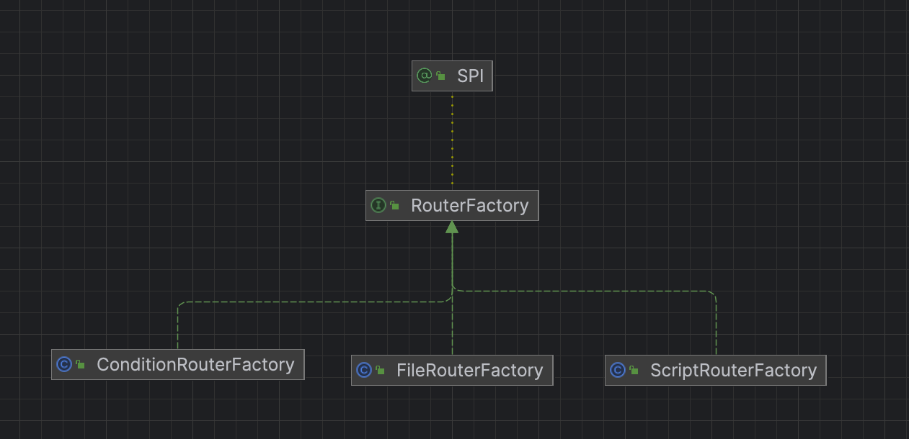
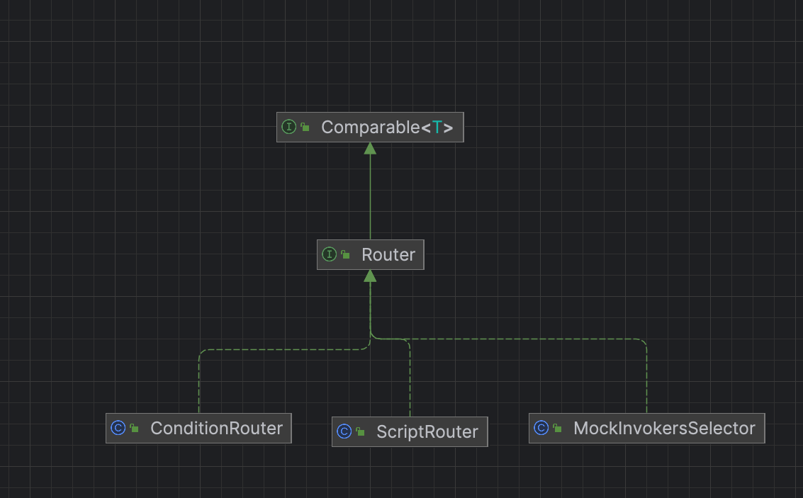

# dubbo源码-集群cluster-之Router


## RouterFactory 代码结构




## Router代码结构





### FileRouterFactory

#### 基于文件读取路由规则，然后创建对应的router实现。

```java
public class FileRouterFactory implements RouterFactory {

    public static final String NAME = "file";

    /**
     * RouterFactory$Adaptive 对象
     */
    private RouterFactory routerFactory;

    public void setRouterFactory(RouterFactory routerFactory) {
        this.routerFactory = routerFactory;
    }

    /**
     * （1）从URL中获取routerKey， 默认 为脚本类型的router。
     * （2）解析文件的格式，type 比如说 type =  js
     * （3）读取文件
     * （4）设置router的URL。
     * （5）根据  RouterFactory$Adaptive 对象   routerFactory 来加载对应的router
     * @param url 
     * @return
     */
    @Override
    public Router getRouter(URL url) {
        try {
            // Transform File URL into Script Route URL, and Load
            // file:///d:/path/to/route.js?router=script ==> script:///d:/path/to/route.js?type=js&rule=<file-content>
            String protocol = url.getParameter(Constants.ROUTER_KEY, ScriptRouterFactory.NAME); // Replace original protocol (maybe 'file') with 'script'
            // 使用文件后缀做为类型
            String type = null; // Use file suffix to config script type, e.g., js, groovy ...
            String path = url.getPath();
            if (path != null) {
                int i = path.lastIndexOf('.');
                if (i > 0) {
                    type = path.substring(i + 1);
                }
            }
            // 读取规则内容
            String rule = IOUtils.read(new FileReader(new File(url.getAbsolutePath())));

            // 创建路由规则 URL
            boolean runtime = url.getParameter(Constants.RUNTIME_KEY, false);
            URL script = url.setProtocol(protocol).addParameter(Constants.TYPE_KEY, type)
                    .addParameter(Constants.RUNTIME_KEY, runtime)
                    .addParameterAndEncoded(Constants.RULE_KEY, rule);

            // 通过 Dubbo SPI Adaptive 机制，获得 Router 对象
            return routerFactory.getRouter(script);
        } catch (IOException e) {
            throw new IllegalStateException(e.getMessage(), e);
        }
    }

```

#### 说明：
 * （1）从URL中获取routerKey， 默认 为脚本类型的router。
 * （2）解析文件的格式，type 比如说 type =  js
 * （3）读取文件
 * （4）设置router的URL。
 * （5）根据  RouterFactory$Adaptive 对象   routerFactory 来加载对应的router


### Router
```java
public interface Router extends Comparable<Router> {

    /**
     * get the router url.
     * <p>
     * 路由规则 URL
     *
     * @return url
     */
    URL getUrl();

    /**
     * route.
     *
     * 路由，筛选匹配的 Invoker 集合
     *
     * @param invokers   Invoker 集合
     * @param url        refer url
     * @param invocation
     * @return routed invokers 路由后的 Invoker 集合
     * @throws RpcException
     */
    <T> List<Invoker<T>> route(List<Invoker<T>> invokers, URL url, Invocation invocation) throws RpcException;

}

```
#### 说明：
> 一个 Router 对象，对应一条路由规则。
> route(List<Invoker<T>> invokers, URL url, Invocation invocation) 接口方法，路由，筛选匹配的 Invoker 集合。 真实的调用在Directory中，持续的传入invokerList获取满足router规则的列表。

