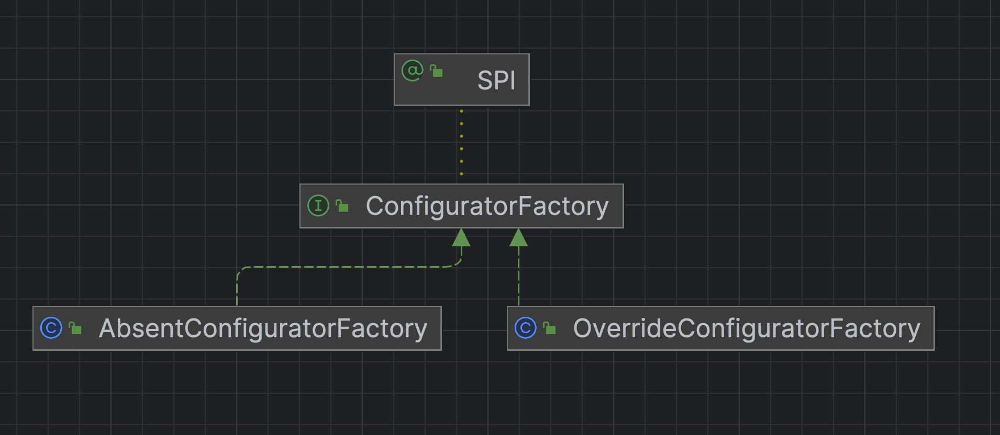
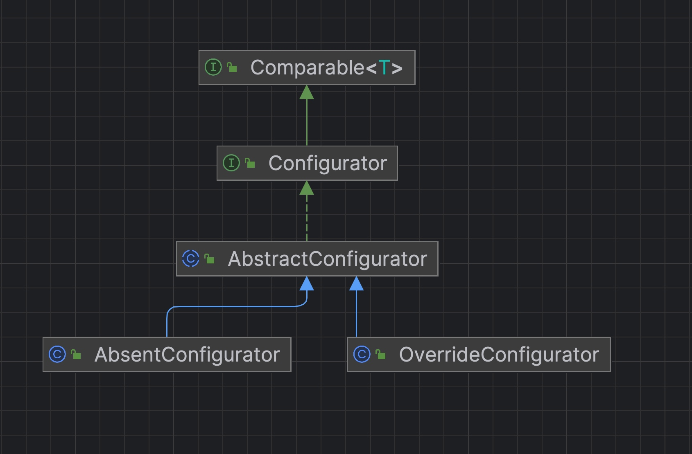

# dubbo源码-集群cluster-之configurator抽象层


## 代码结构

### ConfiguratorFactory




### Configurator




#### 说明：
* ConfiguratorFactory 作为工厂创建Configurator对象，整个dubbo的设计模式基本也是这种。


### ConfiguratorFactory

```java
@SPI
public interface ConfiguratorFactory {

    /**
     * get the configurator instance.
     *
     * @param url - configurator url.
     * @return configurator instance.
     */
    @Adaptive("protocol")
    Configurator getConfigurator(URL url);
}
```
#### 说明：
* @SPI 注解，Dubbo SPI 拓展点，无默认值。
* @Adaptive("protocol") 注解，基于 Dubbo SPI Adaptive 机制，加载对应的 Configurator 实现，使用 URL.protocol 属性。
* #getConfigurator(URL url) 接口方法，获得 Configurator 对象。

###  OverrideConfiguratorFactory
```java
public class OverrideConfiguratorFactory implements ConfiguratorFactory {

    @Override
    public Configurator getConfigurator(URL url) {
        return new OverrideConfigurator(url);
    }
}
```

### AbsentConfiguratorFactory

```java
public class AbsentConfiguratorFactory implements ConfiguratorFactory {
    @Override
    public Configurator getConfigurator(URL url) {
        return new AbsentConfigurator(url);
    }
}
``` 

#### 说明:
* 代码都比较简单，就是创建了对应的对象。

