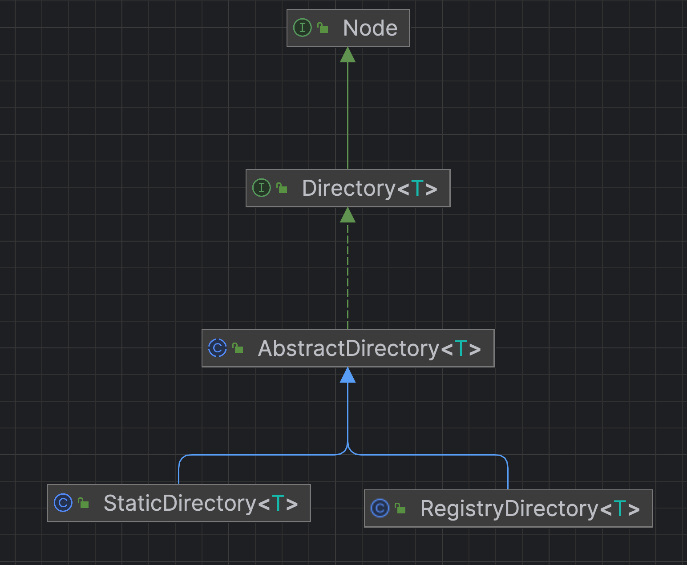

# dubbo源码-集群cluster-之directory抽象。

```Directory ，中文直译为目录，代表了多个 Invoker ，可以把它看成 List<Invoker> 。但与 List 不同的是，它的值可能是动态变化的，比如注册中心推送变更。
相当于，可以通过directory，获取所有的invoker列表，同时他的子类，
比如说RegistryDirectory，实现的是可以变化的Directory。
```


## 代码结构



#### 说明：
> 总共两个实现类，一个是Static，一个是Registry
> Static是静态不可变的意思， Registry是基于注册中心，可以改变的。会根据注册中心的推送变更 List<Invoker> 。
> RegistryDirectory 位于dubbo-registry包。


#### Directory

```java
public interface Directory<T> extends Node {

    /**
     * get service type.
     *
     * 获得服务类型，例如：com.alibaba.dubbo.demo.DemoService
     *
     * @return service type.
     */
    Class<T> getInterface();

    /**
     * list invokers.
     *
     * 获得所有服务 Invoker 集合
     *
     * @return invokers
     */
    List<Invoker<T>> list(Invocation invocation) throws RpcException;
}

```

> 定义了两个接口方法，分别返回服务的类型和 Invoker 集合。
> 一个 Directory 只对应一个服务类型。


#### AbstractDirectory

成员变量与构造方法
```java
    /**
     * 是否已经销毁
     */
    private volatile boolean destroyed = false;
    /**
     * 注册中心 URL
     */
    private final URL url;
    /**
     * 消费者 URL
     *
     * 若未显示调用 {@link #AbstractDirectory(URL, URL, List)} 构造方法，consumerUrl 等于 {@link #url}
     */
    private volatile URL consumerUrl;
    /**
     * Router 数组
     */
    private volatile List<Router> routers;

    public AbstractDirectory(URL url) {
        this(url, null);
    }

    public AbstractDirectory(URL url, List<Router> routers) {
        this(url, url, routers);
    }

    public AbstractDirectory(URL url, URL consumerUrl, List<Router> routers) {
        if (url == null) {
            throw new IllegalArgumentException("url == null");
        }
        this.url = url;
        this.consumerUrl = consumerUrl;
        // 设置 Router 数组
        setRouters(routers);
    }

```

```java

    /**
     * （1） CopyOnWrite routers 这个列表，因为下面要修改。
     * （2） url 这个url为注册中心的url
     * （3） 通过注册中心的url获得对应的routerKey，然后通过 ExtensionLoader.getExtensionLoader(RouterFactory.class).getExtension(routerkey);
     *      dubbo spi 扩展加载对应的RouterFactory，然后初始化router。
     * （4） 添加对应的 MockInvokersSelector。（降级router选择器）
     * （5） 排序并更新。
     * 
     * @param routers 
     */

    protected void setRouters(List<Router> routers) {
        // copy list // 复制 routers ，因为下面要修改
        routers = routers == null ? new ArrayList<Router>() : new ArrayList<Router>(routers);
        // append url router
        // 拼接 `url` 中，配置的路由规则
        String routerkey = url.getParameter(Constants.ROUTER_KEY);
        if (routerkey != null && routerkey.length() > 0) {
            RouterFactory routerFactory = ExtensionLoader.getExtensionLoader(RouterFactory.class).getExtension(routerkey);
            routers.add(routerFactory.getRouter(url));
        }
        // append mock invoker selector
        routers.add(new MockInvokersSelector());
        // 排序
        Collections.sort(routers);
        // 赋值给属性
        this.routers = routers;
    }

```

#### 说明：
* （1） CopyOnWrite routers 这个列表，因为下面要修改。
* （2） url 这个url为注册中心的url
* （3） 通过注册中心的url获得对应的routerKey，然后通过 ExtensionLoader.getExtensionLoader(RouterFactory.class).getExtension(routerkey);
*      dubbo spi 扩展加载对应的RouterFactory，然后初始化router。
* （4） 添加对应的 MockInvokersSelector。（降级router选择器）
* （5） 排序并更新。


#### 核心的list

通过list方法得到对应的所有的invoker。

```java
    /**
     * （1）通过doList方法得到对应的invoker集合
     * （2）注意这个地方会获得所有的router列表。
     * （3）对invokers 列表，都需要调用所有的router进行路由，持续更新invokers列表。
     * （4）返回invoker列表
     * @param invocation 
     * @return
     * @throws RpcException
     */

    @Override
    public List<Invoker<T>> list(Invocation invocation) throws RpcException {
        if (destroyed) {
            throw new RpcException("Directory already destroyed .url: " + getUrl());
        }
        // 获得所有 Invoker 集合
        List<Invoker<T>> invokers = doList(invocation);
        // 根据路由规则，筛选 Invoker 集合
        List<Router> localRouters = this.routers; // local reference 本地引用，避免并发问题
        if (localRouters != null && !localRouters.isEmpty()) {
            for (Router router : localRouters) {
                try {
                    if (router.getUrl() == null || router.getUrl().getParameter(Constants.RUNTIME_KEY, false)) {
                        invokers = router.route(invokers, getConsumerUrl(), invocation);
                    }
                } catch (Throwable t) {
                    logger.error("Failed to execute router: " + getUrl() + ", cause: " + t.getMessage(), t);
                }
            }
        }
        return invokers;
    }

```

#### 说明：
 * （1）通过doList方法得到对应的invoker集合
 * （2）注意这个地方会获得所有的router列表。
 * （3）对invokers 列表，都需要调用所有的router进行路由，持续更新invokers列表。
 * （4）返回invoker列表


```java
protected abstract List<Invoker<T>> doList(Invocation invocation) throws RpcException;
```
