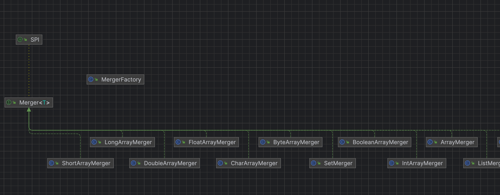

# dubbo源码-集群cluster-之merger实现


## 代码结构：




```理解分组聚合含义
 按组合并返回结果。从不同group中选取部分内容合并他们结果返回，这便是分组聚合。
 比如菜单服务，接口一样，但有多种实现，用group区分，现在消费方需从每种group中调用一次返回结果，合并结果返回，这样就可以实现聚合菜单项。
```

### 配置
搜索所有分组
```xml
<dubbo:reference interface="com.xxx.MenuService" group="*" merger="true" />
```
合并指定分组
```xml
<dubbo:reference interface="com.xxx.MenuService" group="aaa,bbb" merger="true" />
```
指定方法合并结果，其它未指定的方法，将只调用一个 Group
```xml
<dubbo:reference interface="com.xxx.MenuService" group="*">
    <dubbo:method name="getMenuItems" merger="true" />
</dubbo:service>
```

某个方法不合并结果，其它都合并结果
```xml
<dubbo:reference interface="com.xxx.MenuService" group="*" merger="true">
    <dubbo:method name="getMenuItems" merger="false" />
</dubbo:service>
```

### Merger接口

```java
@SPI
public interface Merger<T> {

    /**
     * 合并 T 数组，返回合并后的 T 对象
     *
     * @param items T 数组
     * @return T 对象
     */
    T merge(T... items);

}
```

### Merger实现类
从代码上看，逻辑基本一致，

#### MapMerger
```java
public class MapMerger implements Merger<Map<?, ?>> {

    @Override
    public Map<?, ?> merge(Map<?, ?>... items) {
        if (items.length == 0) {
            return null;
        }
        // 创建结果 Map
        Map<Object, Object> result = new HashMap<Object, Object>();
        // 合并多个 Map
        for (Map<?, ?> item : items) {
            if (item != null) {
                result.putAll(item);
            }
        }
        return result;
    }
}
```

#### ShortArrayMerger
```java
public class ShortArrayMerger implements Merger<short[]> {

    @Override
    public short[] merge(short[]... items) {
        // 计算合并后的数组大小
        int total = 0;
        for (short[] array : items) {
            total += array.length;
        }
        // 创建结果数组
        short[] result = new short[total];
        // 合并多个数组
        int index = 0;
        for (short[] array : items) {
            for (short item : array) {
                result[index++] = item;
            }
        }
        return result;
    }

}
```


### MergerFactory
```java
public class MergerFactory {

    /**
     * Merger 对象缓存
     */
    private static final ConcurrentMap<Class<?>, Merger<?>> mergerCache = new ConcurrentHashMap<Class<?>, Merger<?>>();

    public static <T> Merger<T> getMerger(Class<T> returnType) {
        Merger result;
        // 数组类型
        if (returnType.isArray()) {
            Class type = returnType.getComponentType();
            // 从缓存中获得 Merger 对象
            result = mergerCache.get(type);
            if (result == null) {
                loadMergers();
                result = mergerCache.get(type);
            }
            // 获取不到，使用 ArrayMerger
            if (result == null && !type.isPrimitive()) {
                result = ArrayMerger.INSTANCE;
            }
        // 普通类型
        } else {
            // 从缓存中获得 Merger 对象
            result = mergerCache.get(returnType);
             if (result == null) {
                loadMergers();
                result = mergerCache.get(returnType);
            }
        }
        return result;
    }

    /**
     * 初始化所有的 Merger 拓展对象，到 mergerCache 缓存中。
      */
    static void loadMergers() {
        Set<String> names = ExtensionLoader.getExtensionLoader(Merger.class).getSupportedExtensions();
        for (String name : names) {
            Merger m = ExtensionLoader.getExtensionLoader(Merger.class).getExtension(name);
            mergerCache.putIfAbsent(ReflectUtils.getGenericClass(m.getClass()), m);
        }
    }
}

```

#### 说明：
>  通过Class类型来获取对应的merger实现。


### MergeableCluster 和 MergeableClusterInvoker 参考Cluster的逻辑。
