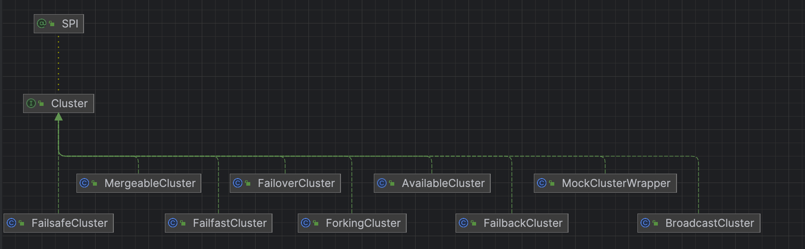
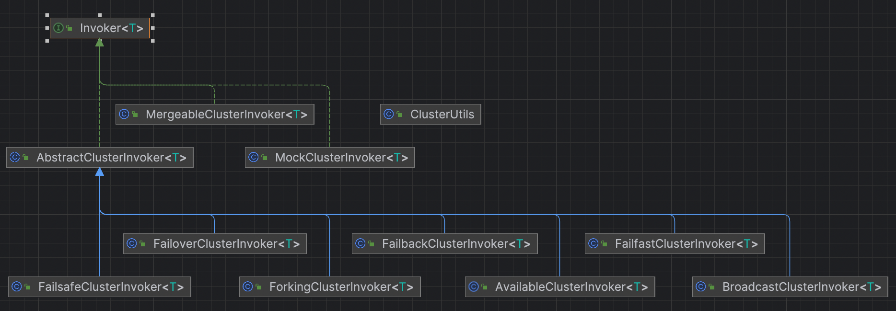

# dubbo源码-集群容错-之容错全流程

#### 说明：
```
cluster作为集群容错的顶层接口，
子类有多个实现，比如说failover，failfast，failback等cluster实现。
提供了多种容错机制的实现。

AbstractClusterInvoker 作为顶层抽象类，通过invoke方法，封装了
整个调用的模板方法抽象

包括
（1）获取invokerList
（2）路由到合适的invoker
（3）和loadBalance组合，负载均衡到一个合适的invoker
（4）使用子类的实现类，比如说FailOverClusterInvoker进行真正的调用。
```


## 代码抽象
 #### cluster实现类




#### clusterInvoker实现类



