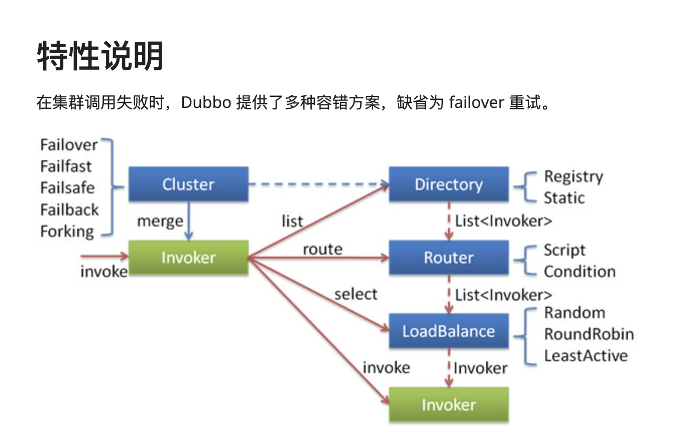
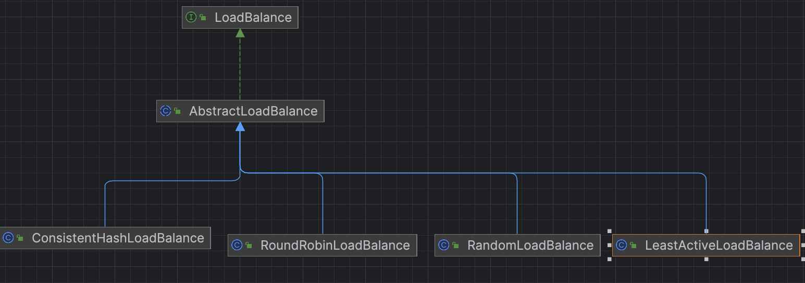

# dubbo源码-集群容错-负载均衡之RoundRobin实现



#### dubbo-cluster的 整体结构。

```各节点关系：

这里的 Invoker 是 Provider 的一个可调用 Service 的抽象，Invoker 封装了 Provider 地址及 Service 接口信息
Directory 代表多个 Invoker，可以把它看成 List<Invoker> ，但与 List 不同的是，它的值可能是动态变化的，比如注册中心推送变更
Cluster 将 Directory 中的多个 Invoker 伪装成一个 Invoker，对上层透明，伪装过程包含了容错逻辑，调用失败后，重试另一个
Router 负责从多个 Invoker 中按路由规则选出子集，比如读写分离，应用隔离等
LoadBalance 负责从多个 Invoker 中选出具体的一个用于本次调用，选的过程包含了负载均衡算法，调用失败后，需要重选
通过使用服务注册表和负载平衡，可以提高集群提供的容错能力，服务注册表用于存储有关可用服务及其位置的信息，负载平衡用于确保请求均匀分布在集群中的所有服务器上，如果一台服务器发生故障，负载将转移到其他可用服务器。

配置监视集群中服务器运行状况的运行状况检查，如果服务器未通过运行状况检查，则可以将其从集群中删除，并将负载转移到其余服务器，确保集群正常运行，并且用户可以使用应用程序。
```


## 代码抽象


#### 共有四个实现，分别是，一致性哈希，RoundRobin，随机，最小活跃数量。

### LoadBalance接口
```java
@SPI(RandomLoadBalance.NAME)
public interface LoadBalance {

    /**
     * select one invoker in list.
     * 从 Invoker 集合中，选择一个
     */
    @Adaptive("loadbalance")
    <T> Invoker<T> select(List<Invoker<T>> invokers, URL url, Invocation invocation) throws RpcException;
}
```
#### 说明：
> RandomLoadBalance.NAME SPI拓展点，默认是Random方式
> select 方法表示从 invokersList中选择一个出来。

### AbstractLoadBalance父抽象类
包含有三个方法

#### select方法
```java
    @Override
    public <T> Invoker<T> select(List<Invoker<T>> invokers, URL url, Invocation invocation) {
        if (invokers == null || invokers.isEmpty()) {
            return null;
        }
        if (invokers.size() == 1) {
            return invokers.get(0);
        }
        return doSelect(invokers, url, invocation);
    }
```
#### 说明： 如果是空的话返回，一个的话，直接返回，否则 提供一个doSelect抽象类。

#### getWeight 方法
```java
    protected int getWeight(Invoker<?> invoker, Invocation invocation) {
        // 获得 weight 配置，即服务权重。默认为 100
        int weight = invoker.getUrl().getMethodParameter(invocation.getMethodName(), Constants.WEIGHT_KEY, Constants.DEFAULT_WEIGHT);
        if (weight > 0) {
        // 服务的启动时间
            long timestamp = invoker.getUrl().getParameter(Constants.REMOTE_TIMESTAMP_KEY, 0L);
            if (timestamp > 0L) {
                // 获得启动总时长
                int uptime = (int) (System.currentTimeMillis() - timestamp);
                // 获得预热需要总时长。默认为 10 * 60 * 1000 = 10 分钟
                int warmup = invoker.getUrl().getParameter(Constants.WARMUP_KEY, Constants.DEFAULT_WARMUP);
                // 处于预热中，计算当前的权重
                if (uptime > 0 && uptime < warmup) {
                    weight = calculateWarmupWeight(uptime, warmup, weight);
                }
            }
        }
        return weight;
    }
```

#### 说明：服务刚开始启动的时候，不会直接给到100%的流量，涉及到一个预热过程，所以这个地方计算了从启动到完成预热的时间的比例，根据比例计算当前服务的权重

#### calculateWarmupWeight方法

```java
    static int calculateWarmupWeight(int uptime, int warmup, int weight) {
        // 计算权重
        int ww = (int) ((float) uptime / ((float) warmup / (float) weight));
        // 权重范围为 [0, weight] 之间
        return ww < 1 ? 1 : (ww > weight ? weight : ww);
    }
```

#### 说明： (uptime / warmup) * weight ，相当于进度百分比 * 权重。


### RoundRobin实现-RoundRobinLoadBalance

```java
    /**
     *  (1) 先找到invokerList 里面的 最大权重和最小权重。同时计算权重的总和。
     *  （2）如果权重都相等的话，直接 通过当前请求的sequence 对 invoker列表取余获取。
     *  （3）如果不相等的话。
     *  假设我们有三台服务器 servers = [A, B, C]，对应的权重为 weights = [2, 5, 1]。
     *  接下来对上面的逻辑进行简单的模拟。
     *  
     *  mod = 0：满足条件，此时直接返回服务器 A
     *  
     *  mod = 1：需要进行一次递减操作才能满足条件，此时返回服务器 B
     *  
     *  mod = 2：需要进行两次递减操作才能满足条件，此时返回服务器 C
     *  
     *  mod = 3：需要进行三次递减操作才能满足条件，经过递减后，服务器权重为 [1, 4, 0]，此时返回服务器 A
     *  
     *  mod = 4：需要进行四次递减操作才能满足条件，经过递减后，服务器权重为 [0, 4, 0]，此时返回服务器 B
     *  
     *  mod = 5：需要进行五次递减操作才能满足条件，经过递减后，服务器权重为 [0, 3, 0]，此时返回服务器 B
     *  
     *  mod = 6：需要进行六次递减操作才能满足条件，经过递减后，服务器权重为 [0, 2, 0]，此时返回服务器 B
     *  
     *  mod = 7：需要进行七次递减操作才能满足条件，经过递减后，服务器权重为 [0, 1, 0]，此时返回服务器 B
     *  
     *  经过8次调用后，我们得到的负载均衡结果为 [A, B, C, A, B, B, B, B]，
     *  次数比 A:B:C = 2:5:1，等于权重比。当 sequence = 8 时，mod = 0，此时重头再来。
     *  从上面的模拟过程可以看出，当 mod >= 3 后，服务器 C 就不会被选中了，因为它的权重被减为0了。
     *  当 mod >= 4 后，服务器 A 的权重被减为0，此后 A 就不会再被选中。
     * @param invokers
     * @param url
     * @param invocation
     * @param <T>
     * @return
     */
    @Override
    protected <T> Invoker<T> doSelect(List<Invoker<T>> invokers, URL url, Invocation invocation) {
        String key = invokers.get(0).getUrl().getServiceKey() + "." + invocation.getMethodName();
        int length = invokers.size(); // Number of invokers
        int maxWeight = 0; // The maximum weight
        int minWeight = Integer.MAX_VALUE; // The minimum weight
        final LinkedHashMap<Invoker<T>, IntegerWrapper> invokerToWeightMap = new LinkedHashMap<Invoker<T>, IntegerWrapper>();
        int weightSum = 0;
        // 计算最小、最大权重，总的权重和。
        for (int i = 0; i < length; i++) {
            int weight = getWeight(invokers.get(i), invocation);
            maxWeight = Math.max(maxWeight, weight); // Choose the maximum weight
            minWeight = Math.min(minWeight, weight); // Choose the minimum weight
            if (weight > 0) {
                invokerToWeightMap.put(invokers.get(i), new IntegerWrapper(weight));
                weightSum += weight;
            }
        }
        // 获得 AtomicPositiveInteger 对象
        AtomicPositiveInteger sequence = sequences.get(key);
        if (sequence == null) {
            sequences.putIfAbsent(key, new AtomicPositiveInteger());
            sequence = sequences.get(key);
        }
        // 获得当前顺序号，并递增 + 1
        int currentSequence = sequence.getAndIncrement();
        // 权重不相等，顺序根据权重分配
        if (maxWeight > 0 && minWeight < maxWeight) {
            int mod = currentSequence % weightSum; // 剩余权重
            for (int i = 0; i < maxWeight; i++) { // 循环最大权重
                for (Map.Entry<Invoker<T>, IntegerWrapper> each : invokerToWeightMap.entrySet()) { // 循环 Invoker 集合
                    final Invoker<T> k = each.getKey();
                    final IntegerWrapper v = each.getValue();
                    // 剩余权重归 0 ，当前 Invoker 还有剩余权重，返回该 Invoker 对象
                    if (mod == 0 && v.getValue() > 0) {
                        return k;
                    }
                    // 若 Invoker 还有权重值，扣除它( value )和剩余权重( mod )。
                    if (v.getValue() > 0) {
                        v.decrement();
                        mod--;
                    }
                }
            }
        }
        // 权重相等，平均顺序获得
        // Round robin
        return invokers.get(currentSequence % length);
    }
```

#### 说明： 注释写了具体的轮询逻辑，本质是一个加权轮询的机制。


