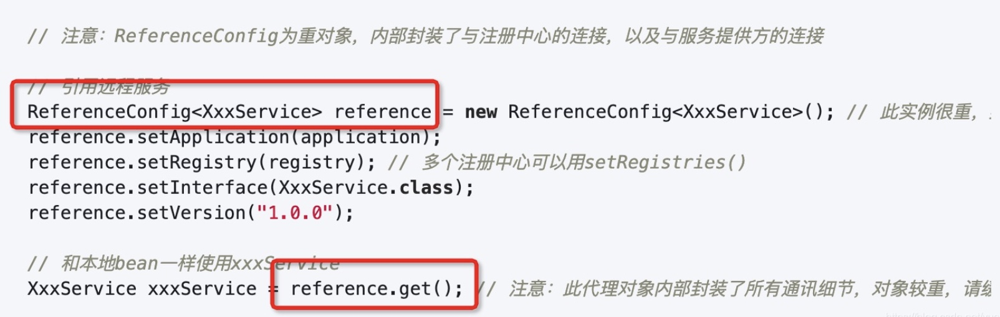

# dubbo源码之 consumer端 本地引用（injvm）分析


### Reference 初始化流程


#### 说明：
初始化过程会调用ReferenceConfig 的get方法。

### ReferenceConfig

####get方法
```java
    public synchronized T get() {
        // 已销毁，不可获得
        if (destroyed) {
            throw new IllegalStateException("Already destroyed!");
        }
        // 初始化
        if (ref == null) {
            init();
        }
        return ref;
    }
```

#### 说明：
* init方法里面除去各种校验之后，会走到createProxy方法创建代理。

#### createProxy
```java
    private T createProxy(Map<String, String> map) {
        URL tmpUrl = new URL("temp", "localhost", 0, map);
        // 是否本地引用
        final boolean isJvmRefer;
        // injvm 属性为空，不通过该属性判断
        if (isInjvm() == null) {
            // 直连服务提供者，参见文档《直连提供者》https://dubbo.gitbooks.io/dubbo-user-book/demos/explicit-target.html
            if (url != null && url.length() > 0) { // if a url is specified, don't do local reference
                isJvmRefer = false;
            // 通过 `tmpUrl` 判断，是否需要本地引用
            } else if (InjvmProtocol.getInjvmProtocol().isInjvmRefer(tmpUrl)) {
                // by default, reference local service if there is
                isJvmRefer = true;
            // 默认不是
            } else {
                isJvmRefer = false;
            }
        // 通过 injvm 属性。
        } else {
            isJvmRefer = isInjvm();
        }

        // 本地引用
        if (isJvmRefer) {
            // 创建本地服务引用 URL 对象。
            URL url = new URL(Constants.LOCAL_PROTOCOL, NetUtils.LOCALHOST, 0, interfaceClass.getName()).addParameters(map);
            // 引用服务，返回 Invoker 对象
            invoker = refprotocol.refer(interfaceClass, url);
            if (logger.isInfoEnabled()) {
                logger.info("Using injvm service " + interfaceClass.getName());
            }
        // 正常流程，一般为远程引用
        
        return (T) proxyFactory.getProxy(invoker);
```
#### 说明：
    * 这个地方会判断是否是injvmRef, 如果是的话，会创建一个URL。通过URL，通过dubbo的自适应获取对应的InJvmProtocol。
    * 先通过refProtocol 导出invoker。最后通过proxyFactory.getProxy 获取真正的代理对象。
    * 真实的代理对象还封装了InvocationHandler。
    * 根据dubbo的SPI，ProxyFactory的默认SPI配置是javassist，所以最后加载的是JavaAssistProxyFactory。


     
#### 成员变量
```java
private static final Protocol refprotocol = ExtensionLoader.getExtensionLoader(Protocol.class).getAdaptiveExtension();
```
#### 说明：
* 根据dubbo spi 扩展点的自适应特性，会在url找protocol属性的值，这里url的protocol属性值是injvm，也就是 com.alibaba.dubbo.rpc.protocol.injvm.InjvmProtocol


#### com.alibaba.dubbo.rpc.protocol.injvm.InjvmProtocol#refer

```java
 @Override
 public <T> Invoker<T> refer(Class<T> serviceType, URL url) throws RpcException {
      return new InjvmInvoker<T>(serviceType, url, url.getServiceKey(), exporterMap);
 }
```


#### 生成的代理类对象。
```java
public class proxy0
implements ClassGenerator.DC,
EchoService,
IHelloService {
    public static Method[] methods;
    private InvocationHandler handler;

    @Override
    public String hello(Integer n) {
        Object[] arrobject = new Object[]{n};
        Object object = this.handler.invoke(this, methods[0], arrobject);
        return (String)object;
    }

    public Object $echo(Object object) {
        Object[] arrobject = new Object[]{object};
        Object object2 = this.handler.invoke(this, methods[1], arrobject);
        return object2;
    }
    public proxy0() {
    }
    public proxy0(InvocationHandler invocationHandler) {
        this.handler = invocationHandler;
    }
}
```
#### 说明：
* 在实现接口方法里面将参数封装到数据里面，然后调用了invocationHandler的invoke方法。
* invocationHandler 实现了默认的本地方法的执行逻辑，最后调用了真实的方法

### InvokerInvocationHandler
```java
public class InvokerInvocationHandler implements InvocationHandler {
    private final Invoker<?> invoker;
    public InvokerInvocationHandler(Invoker<?> handler) {
        this.invoker = handler;
    }
    @Override
    public Object invoke(Object proxy, Method method, Object[] args) throws Throwable {
        String methodName = method.getName();
        Class<?>[] parameterTypes = method.getParameterTypes();
        if (method.getDeclaringClass() == Object.class) {
            return method.invoke(invoker, args);
        }
        if ("toString".equals(methodName) && parameterTypes.length == 0) {
            return invoker.toString();
        }
        if ("hashCode".equals(methodName) && parameterTypes.length == 0) {
            return invoker.hashCode();
        }
        if ("equals".equals(methodName) && parameterTypes.length == 1) {
            return invoker.equals(args[0]);
        }
        return invoker.invoke(new RpcInvocation(method, args)).recreate();
    }
}
```

### InjvmInvoker
```java
class InjvmInvoker<T> extends AbstractInvoker<T> {
    private final String key;
    private final Map<String, Exporter<?>> exporterMap;
    InjvmInvoker(Class<T> type, URL url, String key, Map<String, Exporter<?>> exporterMap) {
        super(type, url);
        this.key = key;
        this.exporterMap = exporterMap;
    }
    @Override
    public boolean isAvailable() {
        InjvmExporter<?> exporter = (InjvmExporter<?>) exporterMap.get(key);
        if (exporter == null) {
            return false;
        } else {
            return super.isAvailable();
        }
    }
    @Override
    public Result doInvoke(Invocation invocation) throws Throwable {
        Exporter<?> exporter = InjvmProtocol.getExporter(exporterMap, getUrl());
        if (exporter == null) {
            throw new RpcException("Service [" + key + "] not found.");
        }
        RpcContext.getContext().setRemoteAddress(NetUtils.LOCALHOST, 0);
        return exporter.getInvoker().invoke(invocation);
    }
}
```


### AbstractInvoker

```java
 @Override
    public Result invoke(Invocation inv) throws RpcException {
        // if invoker is destroyed due to address refresh from registry, let's allow the current invoke to proceed
        if (destroyed.get()) {
            logger.warn("Invoker for service " + this + " on consumer " + NetUtils.getLocalHost() + " is destroyed, "
                    + ", dubbo version is " + Version.getVersion() + ", this invoker should not be used any longer");
        }

        RpcInvocation invocation = (RpcInvocation) inv;
        invocation.setInvoker(this);//设置invoker ，将自己设置进去
        if (attachment != null && attachment.size() > 0) {
            invocation.addAttachmentsIfAbsent(attachment);
        }
        Map<String, String> contextAttachments = RpcContext.getContext().getAttachments();
        if (contextAttachments != null && contextAttachments.size() != 0) {
            invocation.addAttachments(contextAttachments);
        }
        if (getUrl().getMethodParameter(invocation.getMethodName(), Constants.ASYNC_KEY, false)) {
            invocation.setAttachment(Constants.ASYNC_KEY, Boolean.TRUE.toString());
        }
        RpcUtils.attachInvocationIdIfAsync(getUrl(), invocation);


        try {
            return doInvoke(invocation);
        } catch (InvocationTargetException e) { // biz exception
            Throwable te = e.getTargetException();
            if (te == null) {
                return new RpcResult(e);
            } else {
                if (te instanceof RpcException) {
                    ((RpcException) te).setCode(RpcException.BIZ_EXCEPTION);
                }
                return new RpcResult(te);
            }
        } catch (RpcException e) {
            if (e.isBiz()) {
                return new RpcResult(e);
            } else {
                throw e;
            }
        } catch (Throwable e) {
            return new RpcResult(e);
        }
    }
```

#### 说明：
* 首先父类的invoke方法做了基本的封装参数的操作。
* 然后把doInvoke交给了子类。
* 子类通过Invoker发起了真实的调用。

