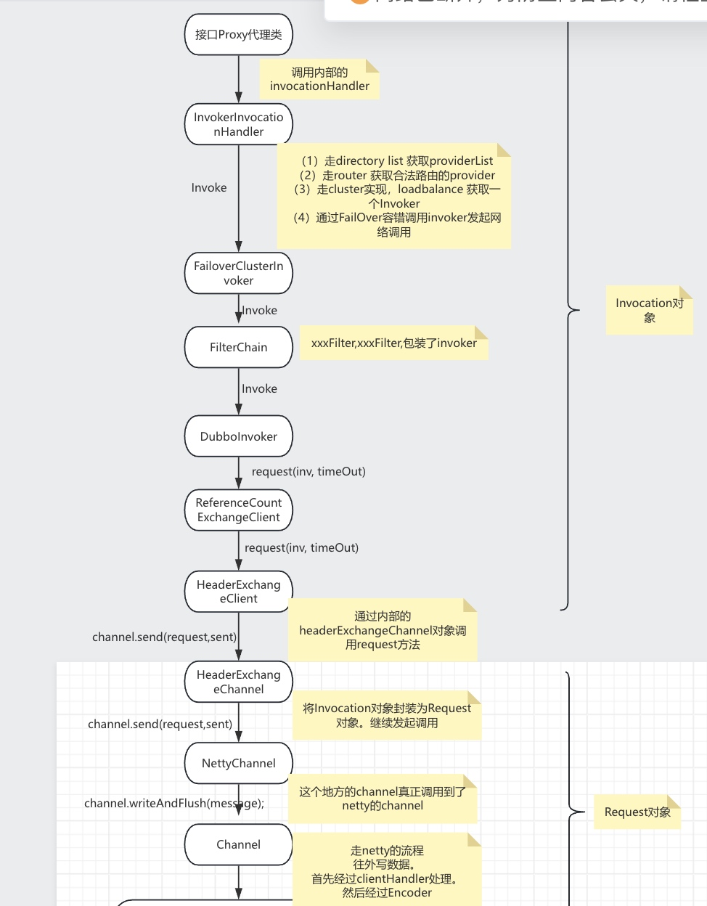
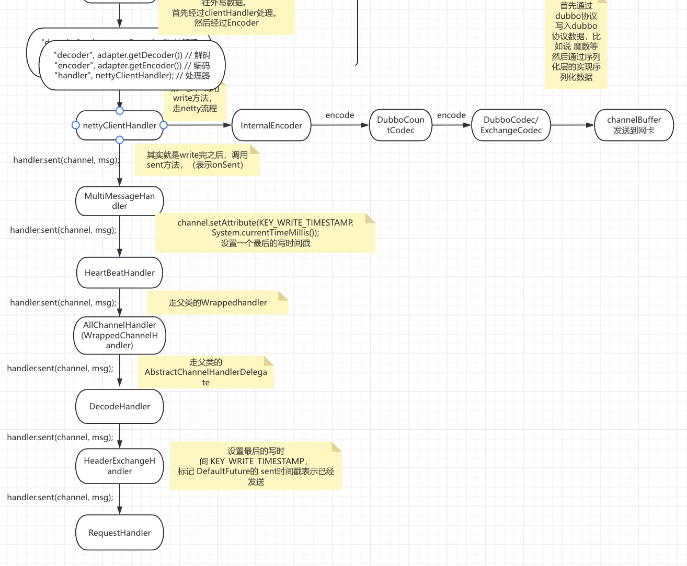
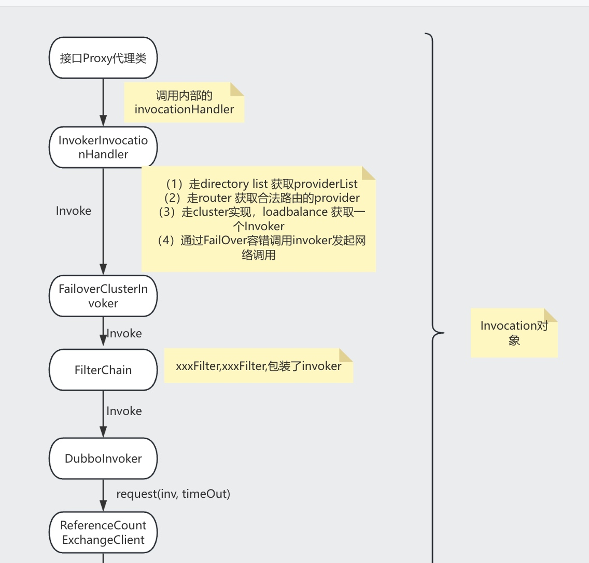
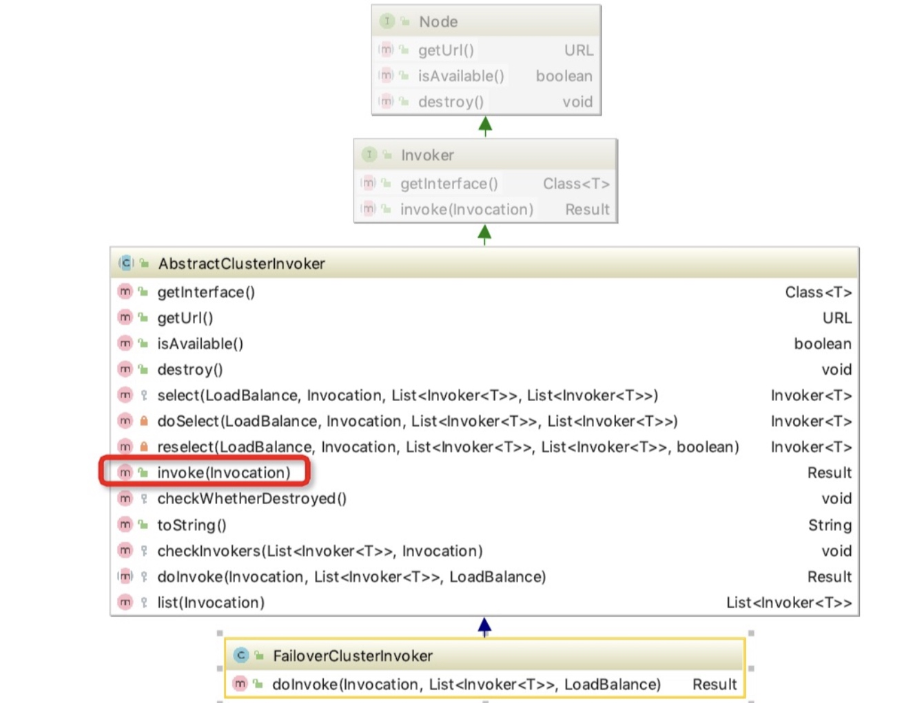
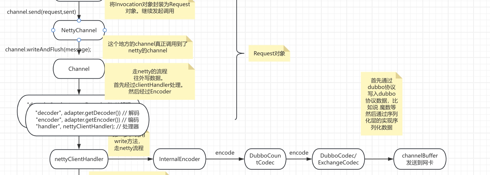

# dubbo源码之-dubbo consumer 发起调用

```
大致流程是，从proxy0的生成代码，调用到InvocationHandler。后面进一步调用到FailOverClusterInvoker进行集群调用和容错。最后经过过滤链。
最后封装为Req/Resp. 经过Netty的writeAndFlush方法发起发送。
走netty pipeline，进行编码，真正发生到网卡
```

## 汇总流程




## 发起调用




### InvokerInvocationHandler

```java
    @Override
    public Object invoke(Object proxy, Method method, Object[] args) throws Throwable {
        String methodName = method.getName();
        Class<?>[] parameterTypes = method.getParameterTypes();
        // wait 等方法，直接反射调用
        if (method.getDeclaringClass() == Object.class) {
            return method.invoke(invoker, args);
        }
        // 基础方法，不使用 RPC 调用
        if ("toString".equals(methodName) && parameterTypes.length == 0) {
            return invoker.toString();
        }
        if ("hashCode".equals(methodName) && parameterTypes.length == 0) {
            return invoker.hashCode();
        }
        if ("equals".equals(methodName) && parameterTypes.length == 1) {
            return invoker.equals(args[0]);
        }
        // RPC 调用
        return invoker.invoke(new RpcInvocation(method, args)).recreate();
    }
```
#### 说明：
* 就是把Object的一些方法过滤去，当调用Object方法的时候直接调用invoker自己对象的方法，就不用远程调用了。

### FailoverClusterInvoker
```
是一个失败重试机制的集群调用类。
```
#### 继承关系



#### invoke

```java
 // 实现接口的invoker方法
    @Override
    public Result invoke(final Invocation invocation) throws RpcException {
        checkWhetherDestroyed();   // 检验是否销毁
        LoadBalance loadbalance = null;  //定义负载均衡

        // binding attachments into invocation.
        Map<String, String> contextAttachments = RpcContext.getContext().getAttachments();
        if (contextAttachments != null && contextAttachments.size() != 0) {// 就是将一些公共的kv 设置到invocation中
            ((RpcInvocation) invocation).addAttachments(contextAttachments);
        }
        // 获取所有服务提供者的集合
        List<Invoker<T>> invokers = list(invocation);
        if (invokers != null && !invokers.isEmpty()) {

            // invokers 不是空  根据dubbo spi 获取负载均衡策略  默认是random
            loadbalance = ExtensionLoader.getExtensionLoader(LoadBalance.class).getExtension(invokers.get(0).getUrl()
                    .getMethodParameter(RpcUtils.getMethodName(invocation), Constants.LOADBALANCE_KEY, Constants.DEFAULT_LOADBALANCE));
        }

        // 如果是异步调用，就设置调用编号
        RpcUtils.attachInvocationIdIfAsync(getUrl(), invocation);

        // 具体实现是由子类实现的
        return doInvoke(invocation, invokers, loadbalance);
    }
    // 检测是否已经销毁
    protected void checkWhetherDestroyed() {

        if (destroyed.get()) {
            throw new RpcException("Rpc cluster invoker for " + getInterface() + " on consumer " + NetUtils.getLocalHost()
                    + " use dubbo version " + Version.getVersion()
                    + " is now destroyed! Can not invoke any more.");
        }
    }

```
#### 说明：
* 1.首先检查是否销毁
* 2.将上下文中的附加信息添加到invocation 中。
* 3.获取invoker集合，获取负载均衡策略
* 4.调用子类的doInvoke(invocation, invokers, loadbalance) 方法。


#### doInvoke

```java
public Result doInvoke(Invocation invocation, final List<Invoker<T>> invokers, LoadBalance loadbalance) throws RpcException {
        List<Invoker<T>> copyinvokers = invokers;
        checkInvokers(copyinvokers, invocation);// 检验参数

        // 获取重试次数，如果没有设置，就是用默认2+1  加1 操作是本身要调用一次，然后如果失败了 再重试调用1次
        int len = getUrl().getMethodParameter(invocation.getMethodName(), Constants.RETRIES_KEY, Constants.DEFAULT_RETRIES) + 1;
        if (len <= 0) {
            len = 1;
        }
        // retry loop.
        RpcException le = null; // last exception. 异常
        List<Invoker<T>> invoked = new ArrayList<Invoker<T>>(copyinvokers.size()); // invoked invokers.
        Set<String> providers = new HashSet<String>(len);
        for (int i = 0; i < len; i++) {
            //Reselect before retry to avoid a change of candidate `invokers`.
            //NOTE: if `invokers` changed, then `invoked` also lose accuracy.
            if (i > 0) {
                checkWhetherDestroyed();  //检验是否已经销毁
                copyinvokers = list(invocation);  // 获取所有的invokers
                // check again
                checkInvokers(copyinvokers, invocation);
            }

            // 选择一个invoker
            Invoker<T> invoker = select(loadbalance, invocation, copyinvokers, invoked);
            invoked.add(invoker);  // 添加到已经选择的列表中

            // 将已经选择过的invoker列表设置到context中
            RpcContext.getContext().setInvokers((List) invoked);
            try {
                // 调用 获得结果
                Result result = invoker.invoke(invocation);
                if (le != null && logger.isWarnEnabled()) {//重试过程中，将最后一次调用的异常信息以 warn 级别日志输出
                    logger.warn("Although retry the method " + invocation.getMethodName()
                            + " in the service " + getInterface().getName()
                            + " was successful by the provider " + invoker.getUrl().getAddress()
                            + ", but there have been failed providers " + providers
                            + " (" + providers.size() + "/" + copyinvokers.size()
                            + ") from the registry " + directory.getUrl().getAddress()
                            + " on the consumer " + NetUtils.getLocalHost()
                            + " using the dubbo version " + Version.getVersion() + ". Last error is: "
                            + le.getMessage(), le);
                }
                return result;
            } catch (RpcException e) {
                if (e.isBiz()) { // biz exception.   // 如果是业务性质的异常，不再重试，直接抛出
                    throw e;
                }
                le = e;  // 其他性质的异常统一封装成RpcException
            } catch (Throwable e) {
                le = new RpcException(e.getMessage(), e);
            } finally {

                // 将提供者的地址添加到providers
                providers.add(invoker.getUrl().getAddress());
            }
        }
        // 最后抛出异常
        throw new RpcException(le != null ? le.getCode() : 0, "Failed to invoke the method "
                + invocation.getMethodName() + " in the service " + getInterface().getName()
                + ". Tried " + len + " times of the providers " + providers
                + " (" + providers.size() + "/" + copyinvokers.size()
                + ") from the registry " + directory.getUrl().getAddress()
                + " on the consumer " + NetUtils.getLocalHost() + " using the dubbo version "
                + Version.getVersion() + ". Last error is: "
                + (le != null ? le.getMessage() : ""), le != null && le.getCause() != null ? le.getCause() : le);
    }
```

#### 说明：
* 1 重试次数默认情况是配置次数+ 1
* 2 不是第一次的时候，要重新获取invoker列表，这里就是为了保证invoker列表是最新的，能够跟注册中心的保持一致。
* 3 调用select()方法，这个方法其实就是根据负载均衡算法获取一个invoker，
* 4 之后就是调用invoker的invoke方法，返回Result 结果
* 5 异常处理是如果是业务异常 直接抛出不再重试，其他异常接着重试。


#### filterChain过滤链调用

```java
        List<Filter> filters = ExtensionLoader.getExtensionLoader(Filter.class).getActivateExtension(invoker.getUrl(), key, group);
        // 倒序循环 Filter ，创建带 Filter 链的 Invoker 对象
        if (!filters.isEmpty()) {
            for (int i = filters.size() - 1; i >= 0; i--) {
                final Filter filter = filters.get(i);
                final Invoker<T> next = last;
                last = new Invoker<T>() {

                    @Override
                    public Class<T> getInterface() {
                        return invoker.getInterface();
                    }

                    @Override
                    public URL getUrl() {
                        return invoker.getUrl();
                    }

                    @Override
                    public boolean isAvailable() {
                        return invoker.isAvailable();
                    }

                    @Override
                    public Result invoke(Invocation invocation) throws RpcException {
                        return filter.invoke(next, invocation);
                    }

                    @Override
                    public void destroy() {
                        invoker.destroy();
                    }

                    @Override
                    public String toString() {
                        return invoker.toString();
                    }
                };
            }
        }
```

#### 说明：
* 1 将filter 实现一个个包装起来，然后一层层调用过去。


### DubboInvoker

```java
    protected Result doInvoke(final Invocation invocation) {
        RpcInvocation inv = (RpcInvocation) invocation;
        // 获得方法名
        final String methodName = RpcUtils.getMethodName(invocation);
        // 获得 `path`( 服务名 )，`version`
        inv.setAttachment(Constants.PATH_KEY, getUrl().getPath());
        inv.setAttachment(Constants.VERSION_KEY, version);

        // 获得 ExchangeClient 对象
        ExchangeClient currentClient;
        if (clients.length == 1) {
            currentClient = clients[0];
        } else {
            currentClient = clients[index.getAndIncrement() % clients.length];
        }
        // 远程调用
        try {
            // 获得是否异步调用
            boolean isAsync = RpcUtils.isAsync(getUrl(), invocation);
            // 获得是否单向调用
            boolean isOneway = RpcUtils.isOneway(getUrl(), invocation);
            // 获得超时时间
            int timeout = getUrl().getMethodParameter(methodName, Constants.TIMEOUT_KEY, Constants.DEFAULT_TIMEOUT);
            // 单向调用
            if (isOneway) {
                boolean isSent = getUrl().getMethodParameter(methodName, Constants.SENT_KEY, false);
                currentClient.send(inv, isSent);
                RpcContext.getContext().setFuture(null);
                return new RpcResult();
            // 异步调用
            } else if (isAsync) {
                ResponseFuture future = currentClient.request(inv, timeout);
                RpcContext.getContext().setFuture(new FutureAdapter<Object>(future));
                return new RpcResult();
            // 同步调用
            } else {
                RpcContext.getContext().setFuture(null);
                return (Result) currentClient.request(inv, timeout).get();
            }
        } catch (TimeoutException e) {
            throw new RpcException(RpcException.TIMEOUT_EXCEPTION, "Invoke remote method timeout. method: " + invocation.getMethodName() + ", provider: " + getUrl() + ", cause: " + e.getMessage(), e);
        } catch (RemotingException e) {
            throw new RpcException(RpcException.NETWORK_EXCEPTION, "Failed to invoke remote method: " + invocation.getMethodName() + ", provider: " + getUrl() + ", cause: " + e.getMessage(), e);
        }
    }
```

#### 说明：
* 1 选取一个client
* 2 判断是否是单向调用，是否是异步调用。
* 3，异步调用会封装一个ResponseFuture，否则会同步等待结果
* 4，注意这个地方还是Invocation对象


#### ReferenceCountExchangeClient#request

```java
    @Override
    public ResponseFuture request(Object request) throws RemotingException {
        return client.request(request);
    }
```

#### HeaderExchangeClient#request

```java
    @Override
    public ResponseFuture request(Object request, int timeout) throws RemotingException {
        return channel.request(request, timeout);
    }
```

#### HeaderExchangeChannel#request
```java
    @Override
    public ResponseFuture request(Object request, int timeout) throws RemotingException {
        if (closed) {
            throw new RemotingException(this.getLocalAddress(), null, "Failed to send request " + request + ", cause: The channel " + this + " is closed!");
        }
        // create request. 创建请求
        Request req = new Request();
        req.setVersion("2.0.0");
        req.setTwoWay(true); // 需要响应
        req.setData(request);
        // 创建 DefaultFuture 对象
        DefaultFuture future = new DefaultFuture(channel, req, timeout);
        try {
            // 发送请求
            channel.send(req);
        } catch (RemotingException e) { // 发生异常，取消 DefaultFuture
            future.cancel();
            throw e;
        }
        // 返回 DefaultFuture 对象
        return future;
    }
```

#### 说明：
* 这个地方将Invocation封装到了Request的data对象里面。
* 调用了NettyChannel进行发送。


## 后续流程



### NettyChannel 

```
NettyChannel 封装了 netty 的channel对象。
最后真实的发送走的是原生的channel 发送writeAndFlush，并走了Netty的pipeline。
```


#### send

```java
    @Override
    public void send(Object message, boolean sent) throws RemotingException {
        // 检查连接状态
        super.send(message, sent);

        boolean success = true; // 如果没有等待发送成功，默认成功。
        int timeout = 0;
        try {
            // 发送消息
            ChannelFuture future = channel.writeAndFlush(message);
            // 等待发送成功
            if (sent) {
                timeout = getUrl().getPositiveParameter(Constants.TIMEOUT_KEY, Constants.DEFAULT_TIMEOUT);
                success = future.await(timeout);
            }
            // 若发生异常，抛出
            Throwable cause = future.cause();
            if (cause != null) {
                throw cause;
            }
        } catch (Throwable e) {
            throw new RemotingException(this, "Failed to send message " + message + " to " + getRemoteAddress() + ", cause: " + e.getMessage(), e);
        }

        // 发送失败，抛出异常
        if (!success) {
            throw new RemotingException(this, "Failed to send message " + message + " to " + getRemoteAddress()
                    + "in timeout(" + timeout + "ms) limit");
        }
    }
```


### InternalEncoder#encode

```java
        @Override
        protected void encode(ChannelHandlerContext ctx, Object msg, ByteBuf out) throws Exception {
            // 创建 NettyBackedChannelBuffer 对象
            com.alibaba.dubbo.remoting.buffer.ChannelBuffer buffer = new NettyBackedChannelBuffer(out);
            // 获得 NettyChannel 对象
            Channel ch = ctx.channel();
            NettyChannel channel = NettyChannel.getOrAddChannel(ch, url, handler);
            try {
                // 编码
                codec.encode(channel, buffer, msg);
            } finally {
                // 移除 NettyChannel 对象，若断开连接
                NettyChannel.removeChannelIfDisconnected(ch);
            }
        }
```


### DubboCountCodec

```调用了DubboCodec 的encode方法进行编码```

```java
    @Override
    public void encode(Channel channel, ChannelBuffer buffer, Object msg) throws IOException {
        codec.encode(channel, buffer, msg);
    }
```


### ExchangeCodec

```java
    @Override
    public void encode(Channel channel, ChannelBuffer buffer, Object msg) throws IOException {
        if (msg instanceof Request) { // 请求
            encodeRequest(channel, buffer, (Request) msg);
        } else if (msg instanceof Response) { // 响应
            encodeResponse(channel, buffer, (Response) msg);
        } else { // 提交给父类( Telnet ) 处理，目前是 Telnet 命令的结果。
            super.encode(channel, buffer, msg);
        }
    }
```

#### 说明：
* 最后调用了ExchangeCodec 里面的方法进行编码，首先按照dubbo协议编码RPC需要的字段。
* 最后序列号对象为二进制。这个流程在序列号和dubbo协议已经讲过。


