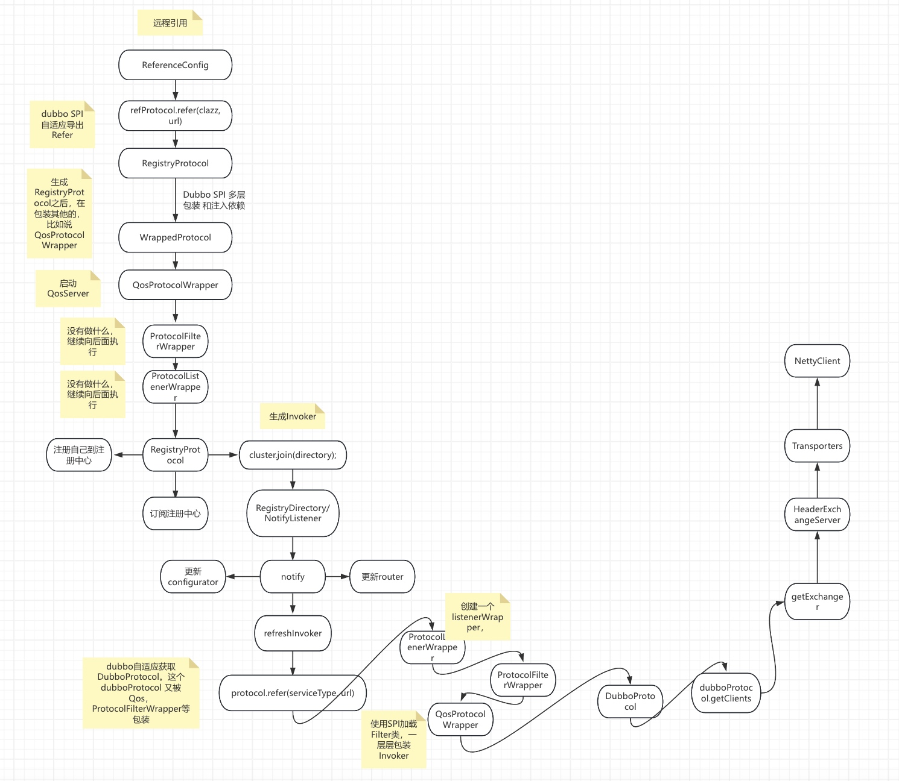
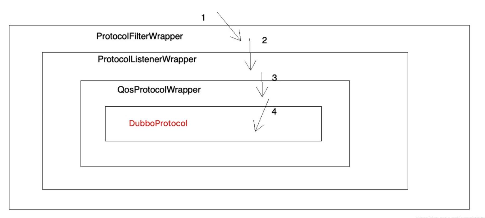
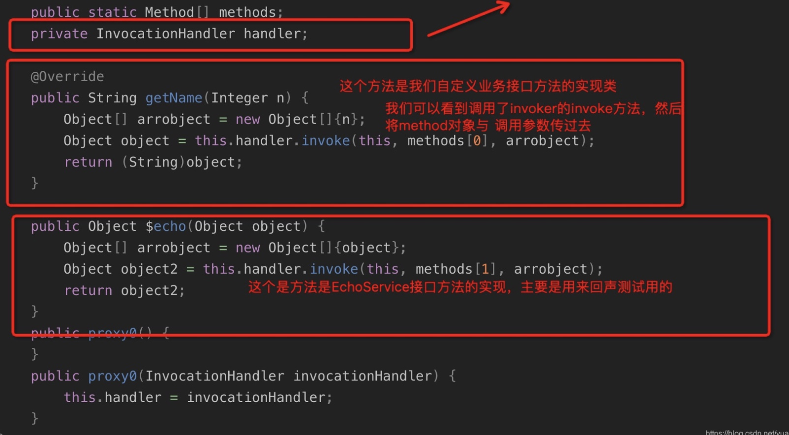

# dubbo源码之-dubbo consumer端远程引用分析 （一）

```我们把远程引用分为两个环节，分别是创建本地代理，和初始化client```


## 汇总流程




## 创建本地代理

### ReferenceConfig

#### createProxy

```java
if (isJvmRefer) {// jvm
 ...
} else {
	
   if (url != null && url.length() > 0) { // user specified URL, could be peer-to-peer address, or register center's address.
       ....
   } else { // assemble URL from register center's configuration
       List<URL> us = loadRegistries(false);
       if (us != null && !us.isEmpty()) {
           for (URL u : us) {
               URL monitorUrl = loadMonitor(u);
               if (monitorUrl != null) {// 如果监控url存在的话，就将 monitor 塞到map中
                   map.put(Constants.MONITOR_KEY, URL.encode(monitorUrl.toFullString()));
               }/// 将url添加到urls， refer= k=v&k1=v1&k2=v2
               urls.add(u.addParameterAndEncoded(Constants.REFER_KEY, StringUtils.toQueryString(map)));
           }
       }
       if (urls.isEmpty()) {// urls
           throw new IllegalStateException("No such any registry to reference " + interfaceName + " on the consumer " + NetUtils.getLocalHost() + " use dubbo version " + Version.getVersion() + ", please config <dubbo:registry address=\"...\" /> to your spring config.");
       }
   }

   if (urls.size() == 1) {
       invoker = refprotocol.refer(interfaceClass, urls.get(0));
   } else {
       List<Invoker<?>> invokers = new ArrayList<Invoker<?>>();
       URL registryURL = null;
       for (URL url : urls) {
           invokers.add(refprotocol.refer(interfaceClass, url));
           if (Constants.REGISTRY_PROTOCOL.equals(url.getProtocol())) {
               registryURL = url; // use last registry url
           }
       }
       if (registryURL != null) { // registry url is available
           // use AvailableCluster only when register's cluster is available
           URL u = registryURL.addParameter(Constants.CLUSTER_KEY, AvailableCluster.NAME);
           invoker = cluster.join(new StaticDirectory(u, invokers));
       } else { // not a registry url
           invoker = cluster.join(new StaticDirectory(invokers));
       }
   }
}
```
#### 说明：
* 1 第一个是加载注册中心。
* 2 如果是一个的话
直接调用 refprotocol.refer(interfaceClass, urls) 获得invoker ，如果是多个的话就会循环调用然后塞到invokers。
* 3 refprotocol 其实来自于 Protocol refprotocol = ExtensionLoader.getExtensionLoader(Protocol.class).getAdaptiveExtension();
是Protocol接口自适应类，这里我们protocol是registry，所以这个refprotocol.refer其实最后就调到了RegistryProtocol。
* 由于是SPI，而且RegistryProtocol 实现了Protocol接口，所以在真正初始化的时候，会通过包装类，将RegistryProtocol 进行包装，比如说QosProtocolWrapper。

* 包装后的结果如下，真正执行的时候，会一步步进行调用。包装的顺序不是固定的。根据SPI的配置来定。



### ProtocolFilterWrapper

```java
    public <T> Invoker<T> refer(Class<T> type, URL url) throws RpcException {
        // 注册中心
        if (Constants.REGISTRY_PROTOCOL.equals(url.getProtocol())) {
            return protocol.refer(type, url);
        }
        // 引用服务，返回 Invoker 对象
        // 给改 Invoker 对象，包装成带有 Filter 过滤链的 Invoker 对象
        return buildInvokerChain(protocol.refer(type, url), Constants.REFERENCE_FILTER_KEY, Constants.CONSUMER);
    }
```

####说明：
* 由于当前我们是REGISTRY_PROTOCOL，所以这一步不做过来链的构建，只refer。


### ProtocolListenerWrapper
```java
    public <T> Invoker<T> refer(Class<T> type, URL url) throws RpcException {
        // 注册中心协议
        if (Constants.REGISTRY_PROTOCOL.equals(url.getProtocol())) {
            return protocol.refer(type, url);
        }
        // 引用服务
        Invoker<T> invoker = protocol.refer(type, url);
        // 获得 InvokerListener 数组
        List<InvokerListener> listeners = Collections.unmodifiableList(ExtensionLoader.getExtensionLoader(InvokerListener.class).getActivateExtension(url, Constants.INVOKER_LISTENER_KEY));
        // 创建 ListenerInvokerWrapper 对象
        return new ListenerInvokerWrapper<T>(invoker, listeners);
    }
```

#### 说明：
* 由于当前是注册中心的协议，所以继续向后面调用。


### QosProtocolWrapper

```java
    @Override
    public <T> Invoker<T> refer(Class<T> type, URL url) throws RpcException {
        if (Constants.REGISTRY_PROTOCOL.equals(url.getProtocol())) {
            startQosServer(url);
            return protocol.refer(type, url);
        }
        return protocol.refer(type, url);
    }
```

#### 说明：
* 这个地方启动了QosServer服务器，然后继续向后调用。

### RegistryProtocol

```java
    public <T> Invoker<T> refer(Class<T> type, URL url) throws RpcException {
        // 获得真实的注册中心的 URL
        url = url.setProtocol(url.getParameter(Constants.REGISTRY_KEY, Constants.DEFAULT_REGISTRY)).removeParameter(Constants.REGISTRY_KEY);
        // 获得注册中心
        Registry registry = registryFactory.getRegistry(url);
        if (RegistryService.class.equals(type)) {
            return proxyFactory.getInvoker((T) registry, type, url);
        }

        // 获得服务引用配置参数集合
        // group="a,b" or group="*"
        Map<String, String> qs = StringUtils.parseQueryString(url.getParameterAndDecoded(Constants.REFER_KEY));
        String group = qs.get(Constants.GROUP_KEY);
        // 分组聚合，参见文档 http://dubbo.io/books/dubbo-user-book/demos/group-merger.html
        if (group != null && group.length() > 0) {
            if ((Constants.COMMA_SPLIT_PATTERN.split(group)).length > 1
                    || "*".equals(group)) {
                // 执行服务引用
                return doRefer(getMergeableCluster(), registry, type, url);
            }
        }
        // 执行服务引用
        return doRefer(cluster, registry, type, url);
    }
```

####说明：
* 1 第一行是将url 中parameters 里面的registry的值获取出来，如果你是用zk作为注册中心，获取出来的就是zookeeper，然后设置到url的protocol属性上，之后就是将parameters 的 registry remove掉了，这时候url的protocol 就是zookeeper了
* 2 第二行 就是根据 url的protocol来获取RegistryFactory 的实现类，也就是ZookeeperRegistryFactory ，然后就是调用它的getRegistry()方法，获取Registry ，总而言之就是获取 注册中心的Registry 对象。
* 3 接着就是如果你这个接口类型是RegistryService 的话，就找proxyFactory 来生成invoker。
* 4 再往下走就是解析将url中refer 属性值取出来，然后解析成map，其实这个refer就是在ReferenceConfig#createProxy 中塞进去的，就是一些属性，然后获取group 属性，进行分组。走到最后就是调用了doRefer()方法。


#### Proxy代理类生成过程
```java 
(T) proxyFactory.getProxy(invoker)


@SPI("javassist")
public interface ProxyFactory {
    @Adaptive({Constants.PROXY_KEY})
    <T> T getProxy(Invoker<T> invoker) throws RpcException;
    // 是否范化调用
    @Adaptive({Constants.PROXY_KEY})
    <T> T getProxy(Invoker<T> invoker, boolean generic) throws RpcException;
    @Adaptive({Constants.PROXY_KEY})
    <T> Invoker<T> getInvoker(T proxy, Class<T> type, URL url) throws RpcException;
}
```

#### 说明：
* 根据dubbo spi 的自适应规则，先去找url中PROXY_KEY 的值，如果有值的话使用我们自定义的，如果没有值的话就使用@SPI注解里面实现类JavassistProxyFactory。
* JavassistProxyFactory 继承父类AbstractProxyFactory ，然后这个两个getProxy方法都是在父类实现的


#### getProxy
```java
    public <T> T getProxy(Invoker<T> invoker) throws RpcException {
        Class<?>[] interfaces = null;

        String config = invoker.getUrl().getParameter("interfaces");
        if (config != null && config.length() > 0) {
            String[] types = Constants.COMMA_SPLIT_PATTERN.split(config);
            if (types != null && types.length > 0) {
                interfaces = new Class<?>[types.length + 2];
                interfaces[0] = invoker.getInterface();
                interfaces[1] = EchoService.class;
                for (int i = 0; i < types.length; i++) {
                    interfaces[i + 1] = ReflectUtils.forName(types[i]);
                }
            }
        }
        // 增加 EchoService 接口，用于回生测试。参见文档《回声测试》https://dubbo.gitbooks.io/dubbo-user-book/demos/echo-service.html
        if (interfaces == null) {
            interfaces = new Class<?>[]{invoker.getInterface(), EchoService.class};
        }
        return getProxy(invoker, interfaces);
    }

```

#### 说明：
* 1 这个一个参数的getProxy调用两个参数的getProxy，然后范化参数是false，表示不范化调用。
* 2 我们可以看到先从invoker的url里面获取interfaces，这个一看就就是多个interface的，我们这里是null，直接走了是null的情况，将我们自己业务接口class 与EchoService class 放到了interfaces中，


### 最后生成的代理类




