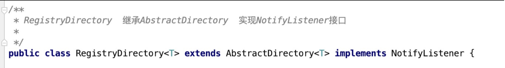
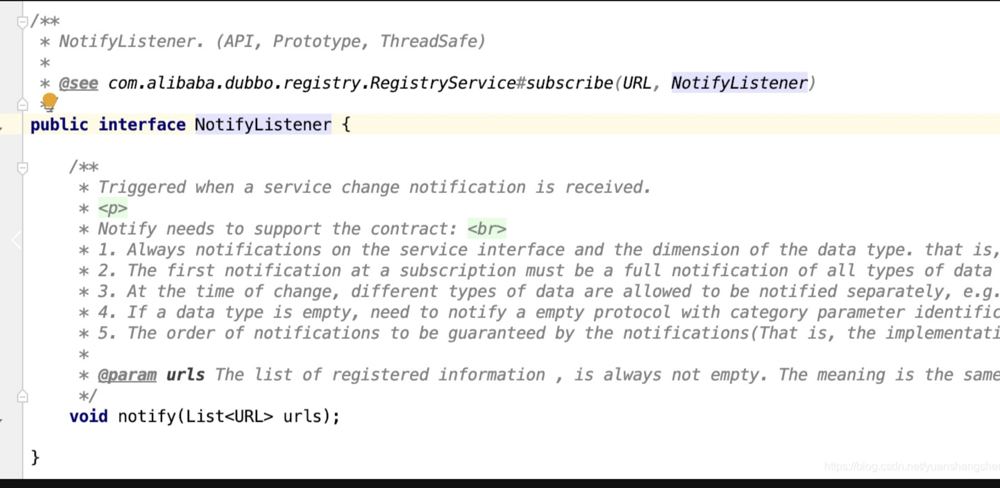
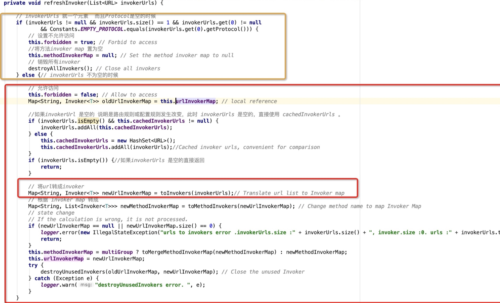
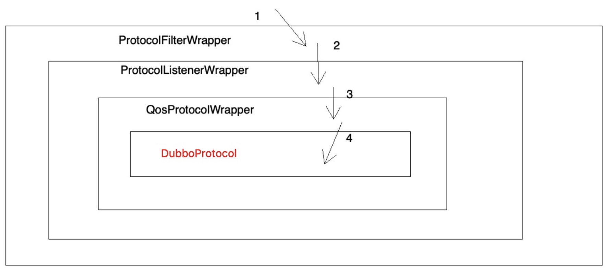
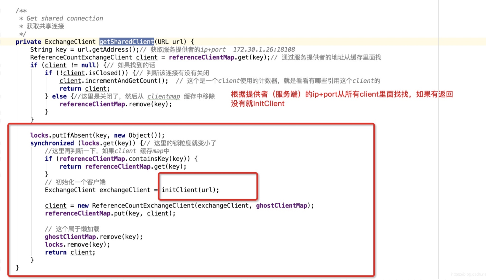
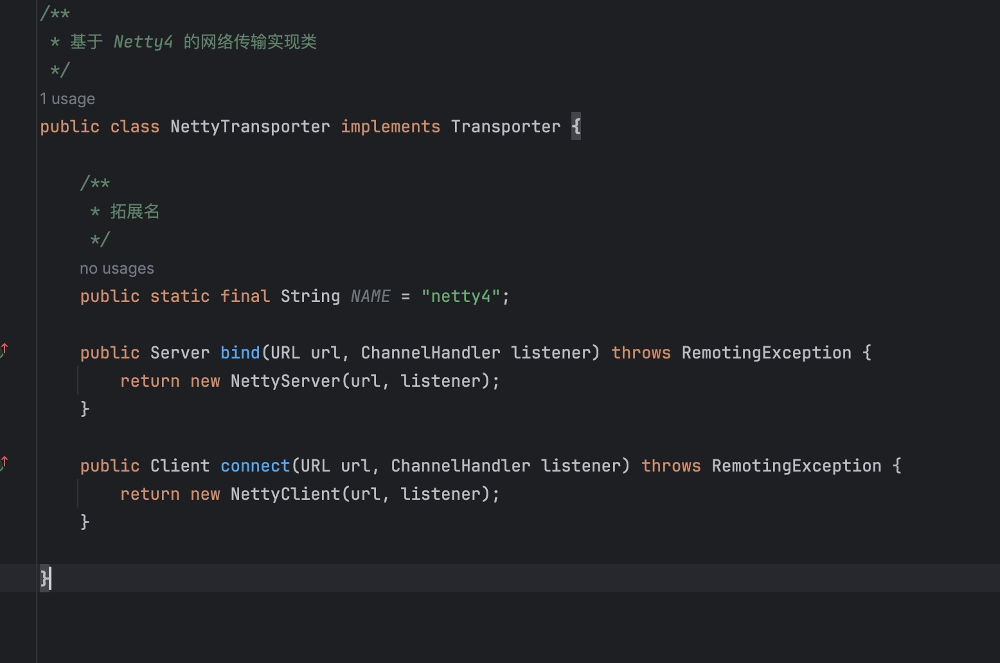

# dubbo源码之-dubbo consumer端远程引用分析 （二）


## 初始化client

```
其实创建client 和 ReferenceConfig发起创建代理是两个流程。
ReferenceConfig 创建了consumer端的代理。

另一个流程，是注册中心的流程，创建了RegistryDirectory 之后。RegistryDirectory 本身是一个NotifyListener。会处理zk注册中心的变更。又订阅了providers,routers,configurators,最后使用cluster的join方法生成了invoker。
真实生成invoker的过程是  RegistryDirectory 消费了zk的变更之后。
然后将变更的providerURL 一个个通过 protocol refer出来了 client
```


### RegistryDirectory



### NotifyListener


#### 说明：
 * 这个接口有一个notify()方法，我们在refer的时候，向注册中心订阅了providers，routers，configurators组，当有变动的时候，注册中心就会调用这个NotifyListener 的notify来进行通知。


#### RegistryDirectory#notify
```java
    @Override
    public synchronized void notify(List<URL> urls) {
        // 根据 URL 的分类或协议，分组成三个集合 。
        List<URL> invokerUrls = new ArrayList<URL>(); // 服务提供者 URL 集合
        List<URL> routerUrls = new ArrayList<URL>();
        List<URL> configuratorUrls = new ArrayList<URL>();
        for (URL url : urls) {
            String protocol = url.getProtocol();
            String category = url.getParameter(Constants.CATEGORY_KEY, Constants.DEFAULT_CATEGORY);
            if (Constants.ROUTERS_CATEGORY.equals(category) || Constants.ROUTE_PROTOCOL.equals(protocol)) {
                routerUrls.add(url);
            } else if (Constants.CONFIGURATORS_CATEGORY.equals(category) || Constants.OVERRIDE_PROTOCOL.equals(protocol)) {
                configuratorUrls.add(url);
            } else if (Constants.PROVIDERS_CATEGORY.equals(category)) {
                invokerUrls.add(url);
            } else {
                logger.warn("Unsupported category " + category + " in notified url: " + url + " from registry " + getUrl().getAddress() + " to consumer " + NetUtils.getLocalHost());
            }
        }
        // 处理配置规则 URL 集合
        // configurators
        if (!configuratorUrls.isEmpty()) {
            this.configurators = toConfigurators(configuratorUrls);
        }
        // 处理路由规则 URL 集合
        // routers
        if (!routerUrls.isEmpty()) {
            List<Router> routers = toRouters(routerUrls);
            if (routers != null) { // null - do nothing
                setRouters(routers);
            }
        }
        // 合并配置规则，到 `directoryUrl` 中，形成 `overrideDirectoryUrl` 变量。
        List<Configurator> localConfigurators = this.configurators; // local reference
        // merge override parameters
        this.overrideDirectoryUrl = directoryUrl;
        if (localConfigurators != null && !localConfigurators.isEmpty()) {
            for (Configurator configurator : localConfigurators) {
                this.overrideDirectoryUrl = configurator.configure(overrideDirectoryUrl);
            }
        }
        // 处理服务提供者 URL 集合
        // providers
        refreshInvoker(invokerUrls);
    }

```

#### 说明：
* 1 ，首先创建几个集合，这个是分组用的，接着就是遍历url，对url进行分组，不同类型的url就会被add到对应的集合中，再往下就是转换，比如说configuratorUrls集合转成configurators ，routerUrls集合中转成Router。
* 2 configuratorUrls 用于更新配置。routerUrls 重新获取router，然后更新router。
* 3 最后是 invokerUrls转成invoker集合


#### refreshInvokers



#### 说明：
* 1 前半部分就是就是处理缓存问题，就是invokerUrl是空的，然后缓存不是空的，就将缓存的添加到这invokerUrl中，否则就将这个invokerUrl中的内容缓存起来。再往下看可以看到调用了toInvokers方法，将invokerUrl转成了map。


#### toInvokers
```java
 /**
     * Turn urls into invokers, and if url has been refer, will not re-reference.
     * 将url转成invoker
     * @param urls
     * @return invokers
     */
    private Map<String, Invoker<T>> toInvokers(List<URL> urls) {
        Map<String, Invoker<T>> newUrlInvokerMap = new HashMap<String, Invoker<T>>();
        if (urls == null || urls.isEmpty()) {// 是空的直接返会空map
            return newUrlInvokerMap;
        }
        Set<String> keys = new HashSet<String>();
        String queryProtocols = this.queryMap.get(Constants.PROTOCOL_KEY);//获取consumer 的  protocol
        for (URL providerUrl : urls) {
            // If protocol is configured at the reference side, only the matching protocol is selected
            if (queryProtocols != null && queryProtocols.length() > 0) {
                boolean accept = false;
                String[] acceptProtocols = queryProtocols.split(",");
                for (String acceptProtocol : acceptProtocols) {
                    if (providerUrl.getProtocol().equals(acceptProtocol)) {
                        accept = true;
                        break;
                    }
                }
                if (!accept) {
                    continue;
                }
            }
            if (Constants.EMPTY_PROTOCOL.equals(providerUrl.getProtocol())) {//如果是个empty protocol直接跳过去
                continue;
            }
            if (!ExtensionLoader.getExtensionLoader(Protocol.class).hasExtension(providerUrl.getProtocol())) {// 服务提供者协议不存在的时候抛出异常
                logger.error(new IllegalStateException("Unsupported protocol " + providerUrl.getProtocol() + " in notified url: " + providerUrl + " from registry " + getUrl().getAddress() + " to consumer " + NetUtils.getLocalHost()
                        + ", supported protocol: " + ExtensionLoader.getExtensionLoader(Protocol.class).getSupportedExtensions()));
                continue;
            }
            URL url = mergeUrl(providerUrl);// 处理了一下providerUrl
            String key = url.toFullString(); // The parameter urls are sorted
            if (keys.contains(key)) { // Repeated url
                continue;
            }
            keys.add(key);
            // Cache key is url that does not merge with consumer side parameters, regardless of how the consumer combines parameters, if the server url changes, then refer again
            Map<String, Invoker<T>> localUrlInvokerMap = this.urlInvokerMap; // local reference
            Invoker<T> invoker = localUrlInvokerMap == null ? null : localUrlInvokerMap.get(key);// 根据key从缓存里面获取invoker
            if (invoker == null) { // Not in the cache, refer again
                try {
                    boolean enabled = true;
                    if (url.hasParameter(Constants.DISABLED_KEY)) {
                        enabled = !url.getParameter(Constants.DISABLED_KEY, false);//disabled
                    } else {
                        enabled = url.getParameter(Constants.ENABLED_KEY, true);//enabled
                    }
                    if (enabled) {// 这里生成一个invoker
                        invoker = new InvokerDelegate<T>(protocol.refer(serviceType, url), url, providerUrl);
                    }
                } catch (Throwable t) {
                    logger.error("Failed to refer invoker for interface:" + serviceType + ",url:(" + url + ")" + t.getMessage(), t);
                }
                if (invoker != null) { // Put new invoker in cache
                    newUrlInvokerMap.put(key, invoker);
                }
            } else {
                newUrlInvokerMap.put(key, invoker);
            }
        }
        keys.clear();
        return newUrlInvokerMap;
    }
```

#### 说明：
* 我们可以看到这个方法里面就是遍历url，然后循环前半部分判断一些东西，不符合的直接略过去，后半部分就是生成invoker了
* 最后是这行代码 protocol.refer(serviceType, url) 生成的invoker。
* 这个protocol.refer(serviceType, url)的protocol就是Protocol接口实现类，根据dubbo spi自适应技术，根据url里面的protocol属性，又加上dubbo spi 的setter ，wrapper特性，最后调用的就是DubboProtocol 外面包装了一堆Wrapper类，调用关系如下：




#### DubboProtocol#refer方法

```java
    public <T> Invoker<T> refer(Class<T> serviceType, URL url) throws RpcException {
        // 初始化序列化优化器
        optimizeSerialization(url);
        // 获得远程通信客户端数组
        // 创建 DubboInvoker 对象
        // create rpc invoker.
        DubboInvoker<T> invoker = new DubboInvoker<T>(serviceType, url, getClients(url), invokers);
        // 添加到 `invokers`
        invokers.add(invoker);
        return invoker;
    }
```


#### DubboProtocol#getClients方法

```java
    /**
     * 获得连接服务提供者的远程通信客户端数组
     *
     * @param url 服务提供者 URL
     * @return 远程通信客户端
     */
    private ExchangeClient[] getClients(URL url) {
        // 是否共享连接
        // whether to share connection
        boolean service_share_connect = false;
        int connections = url.getParameter(Constants.CONNECTIONS_KEY, 0);
        // if not configured, connection is shared, otherwise, one connection for one service
        if (connections == 0) { // 未配置时，默认共享
            service_share_connect = true;
            connections = 1;
        }

        // 创建连接服务提供者的 ExchangeClient 对象数组
        ExchangeClient[] clients = new ExchangeClient[connections];
        for (int i = 0; i < clients.length; i++) {
            if (service_share_connect) { // 共享
                clients[i] = getSharedClient(url);
            } else { // 不共享
                clients[i] = initClient(url);
            }
        }
        return clients;
    }
```

#### getSharedClient




#### initClient方法
调用Exchangers connect 创建了NettyTransporter。
通过NettyTransporter 创建了NettyClient



