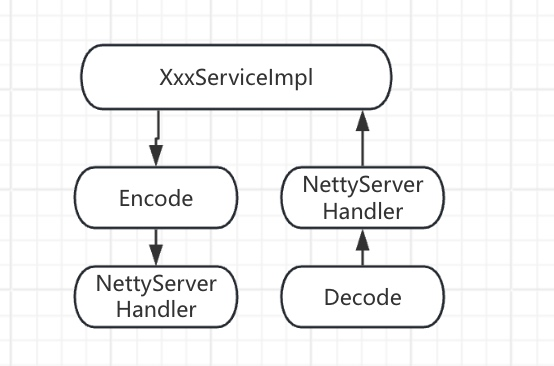
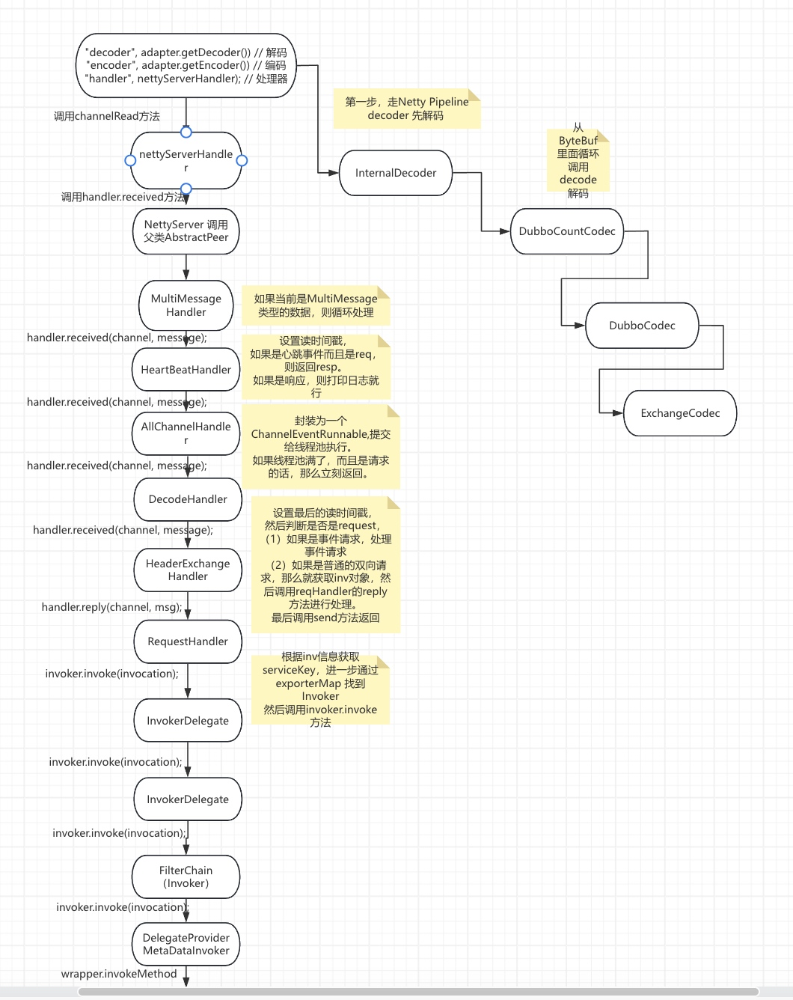
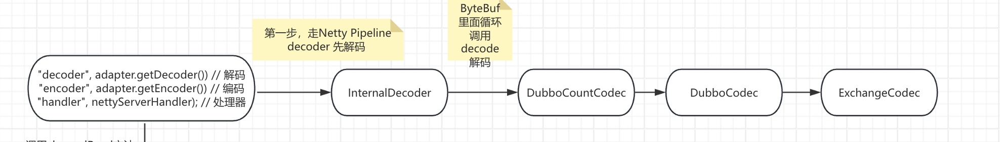
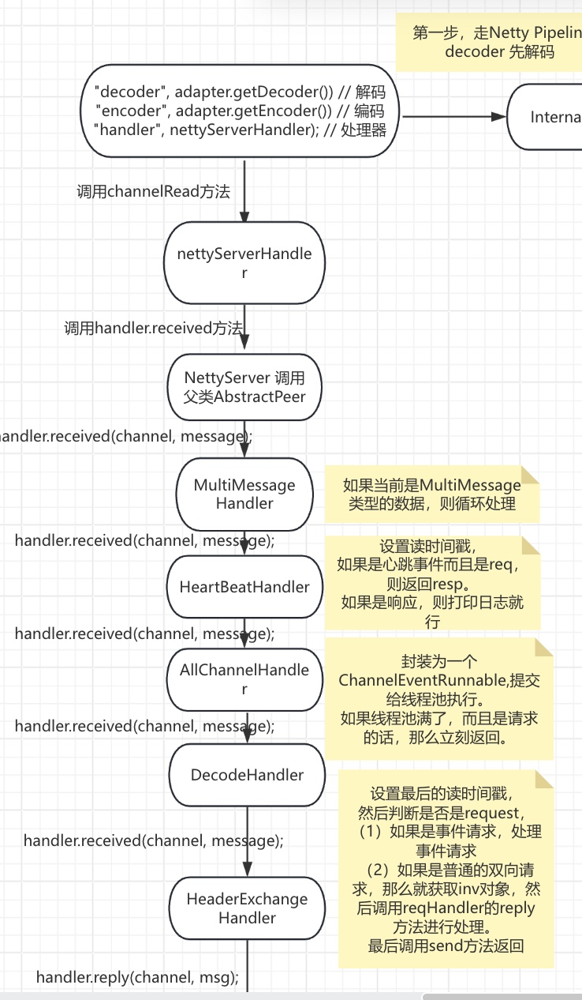
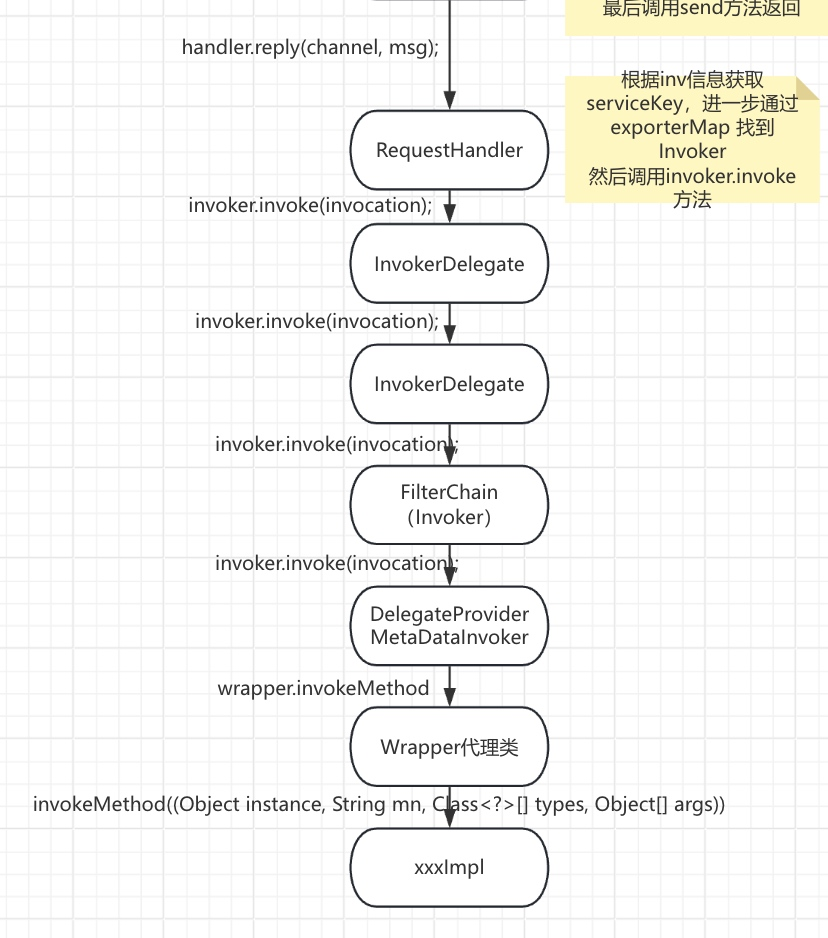
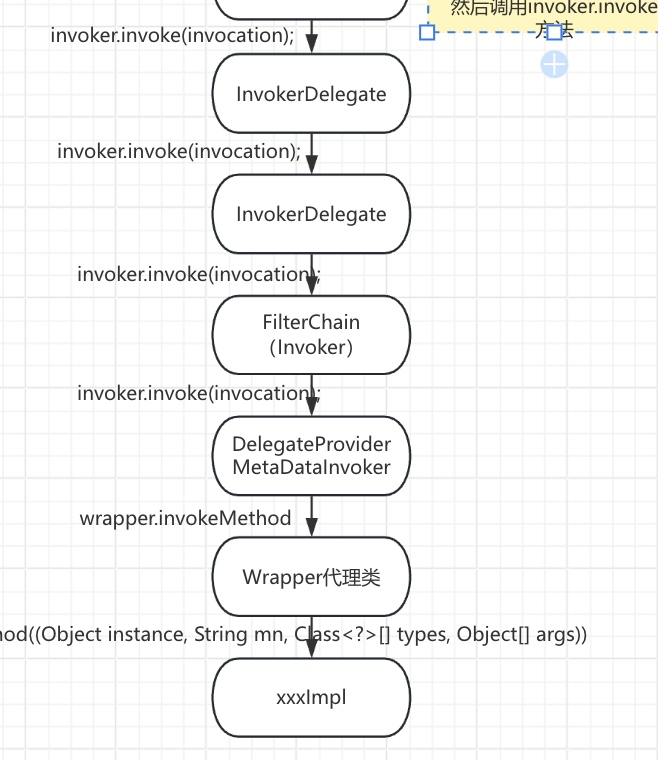

# dubbo源码之-dubbo provider 收到请求


```
第一步首先走Netty Pipeline进行解码，解码完成后。
dubbo对业务处理的NettyServerHandler进行了多层封装。
后一步步调用传递到业务实现。即xxxImpl
```



## 汇总流程




## 解码流程




### InternalDecoder

#### decode
```java
        @Override
        protected void decode(ChannelHandlerContext ctx, ByteBuf input, List<Object> out) throws Exception {
            // 创建 NettyBackedChannelBuffer 对象
            ChannelBuffer message = new NettyBackedChannelBuffer(input);
            // 获得 NettyChannel 对象
            NettyChannel channel = NettyChannel.getOrAddChannel(ctx.channel(), url, handler);
            // 循环解析，直到结束
            Object msg;
            int saveReaderIndex;
            try {
                // decode object.
                do {
                    // 记录当前读进度
                    saveReaderIndex = message.readerIndex();
                    // 解码
                    try {
                        msg = codec.decode(channel, message);
                    } catch (IOException e) {
                        throw e;
                    }
                    // 需要更多输入，即消息不完整，标记回原有读进度，并结束
                    if (msg == Codec2.DecodeResult.NEED_MORE_INPUT) {
                        message.readerIndex(saveReaderIndex);
                        break;
                    // 解码到消息，添加到 `out`
                    } else {
                        //is it possible to go here ? 芋艿：不可能，哈哈哈
                        if (saveReaderIndex == message.readerIndex()) {
                            throw new IOException("Decode without read data.");
                        }
                        if (msg != null) {
                            out.add(msg);
                        }
                    }
                } while (message.readable());
            } finally {
                // 移除 NettyChannel 对象，若断开连接
                NettyChannel.removeChannelIfDisconnected(ctx.channel());
            }
        }
```

#### 说明：
* 由于收到的可能比一个完整的响应多，所以会逐步通过do while循环处理解码操作。
* 获取buffer 可以读取的位置。
* 然后调用DubboCountCodec 进行解码


### DubboCountCodec

```java
    @Override
    public Object decode(Channel channel, ChannelBuffer buffer) throws IOException {
        // 记录当前读位置
        int save = buffer.readerIndex();
        // 创建 MultiMessage 对象
        MultiMessage result = MultiMessage.create();
        do {
            // 解码
            Object obj = codec.decode(channel, buffer);
            // 输入不够，重置读进度
            if (Codec2.DecodeResult.NEED_MORE_INPUT == obj) {
                buffer.readerIndex(save);
                break;
            // 解析到消息
            } else {
                // 添加结果消息
                result.addMessage(obj);
                // 记录消息长度到隐式参数集合，用于 MonitorFilter 监控
                logMessageLength(obj, buffer.readerIndex() - save);
                // 记录当前读位置
                save = buffer.readerIndex();
            }
        } while (true);
        // 需要更多的输入
        if (result.isEmpty()) {
            return Codec2.DecodeResult.NEED_MORE_INPUT;
        }
        // 返回解析到的消息
        if (result.size() == 1) {
            return result.get(0);
        }
        return result;
    }
```
#### 说明：
* 1 MultiMessage result = MultiMessage.create(); 创建MultiMessage对象。
* 2 进行解码 codec.decode(channel, buffer);
* 3 如果解码长度为1，则直接返回，否则返回MultiMessage。

### DubboCodec，ExchangeCodec

```java
    @Override
    public Object decode(Channel channel, ChannelBuffer buffer) throws IOException {
        // 读取 Header 数组
        int readable = buffer.readableBytes();
        byte[] header = new byte[Math.min(readable, HEADER_LENGTH)];
        buffer.readBytes(header);
        // 解码
        return decode(channel, buffer, readable, header);
    }
```

#### 说明：
* 依旧是通过Dubbo协议的方式，先解码Header，后通过自定义序列号解码req。
* 解码和协议的具体内容其他章节有解释。


## 后续流程





### MultiMessageHandler

```java
    @Override
    public void received(Channel channel, Object message) throws RemotingException {
        if (message instanceof MultiMessage) { // 多消息
            MultiMessage list = (MultiMessage) message;
            for (Object obj : list) {
                handler.received(channel, obj);
            }
        } else {
            handler.received(channel, message);
        }
    }
```

#### 说明：
* 如果是MultiMessage，就循环遍历，然后调用received。否则直接调用handler.received

### HeartBeatHandler

```java
    @Override
    public void received(Channel channel, Object message) throws RemotingException {
        // 设置最后的读时间
        setReadTimestamp(channel);
        // 如果是心跳事件请求，返回心跳事件的响应
        if (isHeartbeatRequest(message)) {
            Request req = (Request) message;
            if (req.isTwoWay()) {
                Response res = new Response(req.getId(), req.getVersion());
                res.setEvent(Response.HEARTBEAT_EVENT);
                channel.send(res);
                if (logger.isInfoEnabled()) {
                    int heartbeat = channel.getUrl().getParameter(Constants.HEARTBEAT_KEY, 0);
                    if (logger.isDebugEnabled()) {
                        logger.debug("Received heartbeat from remote channel " + channel.getRemoteAddress()
                                + ", cause: The channel has no data-transmission exceeds a heartbeat period"
                                + (heartbeat > 0 ? ": " + heartbeat + "ms" : ""));
                    }
                }
            }
            return;
        }
        // 如果是心跳事件响应，返回
        if (isHeartbeatResponse(message)) {
            if (logger.isDebugEnabled()) {
                logger.debug(new StringBuilder(32).append("Receive heartbeat response in thread ").append(Thread.currentThread().getName()).toString());
            }
            return;
        }
        // 提交给装饰的 `handler`，继续处理
        handler.received(channel, message);
    }
```
####说明：
* 1 setReadTimestamp(channel); 设置最后的读时间
* 2 如果是心跳事件请求，返回心跳事件的响应
* 3 如果是心跳事件响应，不做操作
* 4 handler.received(channel, message); 提交给装饰的 `handler`，继续处理


### AllChannelHandler

```java
    public void received(Channel channel, Object message) throws RemotingException {
        ExecutorService cexecutor = getExecutorService();
        try {
            cexecutor.execute(new ChannelEventRunnable(channel, handler, ChannelState.RECEIVED, message));
        } catch (Throwable t) {
            //TODO A temporary solution to the problem that the exception information can not be sent to the opposite end after the thread pool is full. Need a refactoring
            //fix The thread pool is full, refuses to call, does not return, and causes the consumer to wait for time out
        	if(message instanceof Request && t instanceof RejectedExecutionException){
        		Request request = (Request)message;
        		if(request.isTwoWay()){
        			String msg = "Server side(" + url.getIp() + "," + url.getPort() + ") threadpool is exhausted ,detail msg:" + t.getMessage();
        			Response response = new Response(request.getId(), request.getVersion());
        			response.setStatus(Response.SERVER_THREADPOOL_EXHAUSTED_ERROR);
        			response.setErrorMessage(msg);
        			channel.send(response);
        			return;
        		}
        	}
            throw new ExecutionException(message, channel, getClass() + " error when process received event .", t);
        }
    }
```
#### 说明：
* 将handler封装为一个ChannelEventRunnable
* 提交给线程池处理
* 出现了异常，如果message是request，然后是个线程池拒绝异常，这时候快速回复一个失败的响应。


### HeaderExchangeHandler

```java
    @Override
    public void received(Channel channel, Object message) throws RemotingException {
        // 设置最后的读时间
        channel.setAttribute(KEY_READ_TIMESTAMP, System.currentTimeMillis());
        // 创建 ExchangeChannel 对象
        ExchangeChannel exchangeChannel = HeaderExchangeChannel.getOrAddChannel(channel);
        try {
            // 处理请求( Request )
            if (message instanceof Request) {
                // handle request.
                Request request = (Request) message;
                // 处理事件请求
                if (request.isEvent()) {
                    handlerEvent(channel, request);
                } else {
                    // 处理普通请求
                    if (request.isTwoWay()) {
                        Response response = handleRequest(exchangeChannel, request);
                        channel.send(response);
                    // 提交给装饰的 `handler`，继续处理
                    } else {
                        handler.received(exchangeChannel, request.getData());
                    }
                }
            // 处理响应( Response )
            } else if (message instanceof Response) {
                handleResponse(channel, (Response) message);
            // 处理 String
            } else if (message instanceof String) {
                // 客户端侧，不支持 String
                if (isClientSide(channel)) {
                    Exception e = new Exception("Dubbo client can not supported string message: " + message + " in channel: " + channel + ", url: " + channel.getUrl());
                    logger.error(e.getMessage(), e);
                // 服务端侧，目前是 telnet 命令
                } else {
                    String echo = handler.telnet(channel, (String) message);
                    if (echo != null && echo.length() > 0) {
                        channel.send(echo);
                    }
                }
                // 提交给装饰的 `handler`，继续处理
            } else {
                handler.received(exchangeChannel, message);
            }
        } finally {
            // 移除 ExchangeChannel 对象，若已断开
            HeaderExchangeChannel.removeChannelIfDisconnected(channel);
        }
    }
```

```java
    Response handleRequest(ExchangeChannel channel, Request req) {
        Response res = new Response(req.getId(), req.getVersion());
        // 请求无法解析，返回 BAD_REQUEST 响应
        if (req.isBroken()) {
            Object data = req.getData();
            String msg; // 请求数据，转成 msg
            if (data == null) {
                msg = null;
            } else if (data instanceof Throwable) {
                msg = StringUtils.toString((Throwable) data);
            } else {
                msg = data.toString();
            }
            res.setErrorMessage("Fail to decode request due to: " + msg);
            res.setStatus(Response.BAD_REQUEST);
            return res;
        }
        // 使用 ExchangeHandler 处理，并返回响应
        // find handler by message class.
        Object msg = req.getData();
        try {
            // handle data.
            Object result = handler.reply(channel, msg);
            res.setStatus(Response.OK);
            res.setResult(result);
        } catch (Throwable e) {
            res.setStatus(Response.SERVICE_ERROR);
            res.setErrorMessage(StringUtils.toString(e));
        }
        return res;
    }

```

#### 说明：
*  统一的received方法，封装了consumer和provider 对message的处理
*  1）如果是事件请求，处理事件请求
* （2）如果是普通的双向请求，那么就获取inv对象，然后调用reqHandler的reply方法进行处理。
最后调用send方法返回
* (3) 将数据转换为Response，同时取出里面的data，交给后续处理
* Object result = handler.reply(channel, msg);


### RequestHandler
```java
Invoker<?> invoker = getInvoker(channel, inv);
                RpcContext.getContext().setRemoteAddress(channel.getRemoteAddress());
                // 执行调用
                return invoker.invoke(inv);
```
#### 说明：
* 根据inv获取serviceKey，进一步通过exporterMap 找到Invoker
* 然后调用invoker.invoke方法


##后续说明：
```后面讲过INvokerDelete代理，传给FilterChain过滤链调用。
经过Wrapper代理类调用到真实的XXXImpl方法执行。
```




