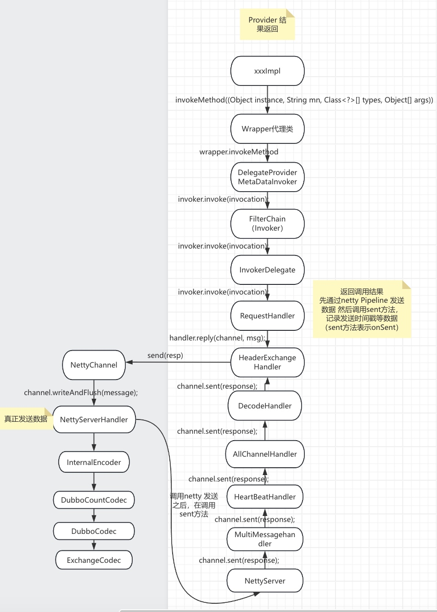
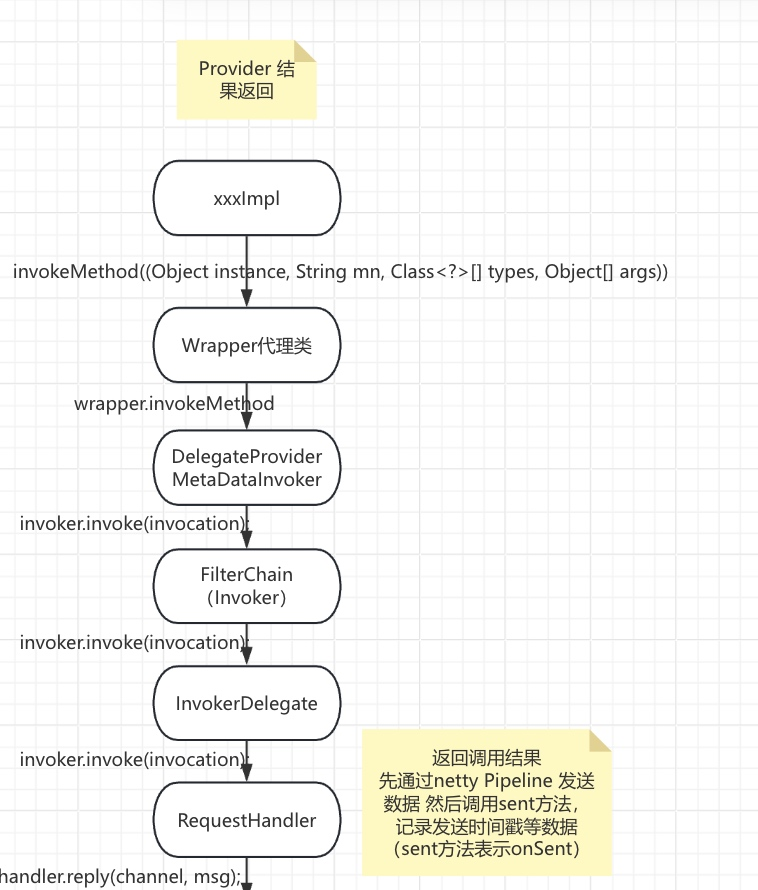
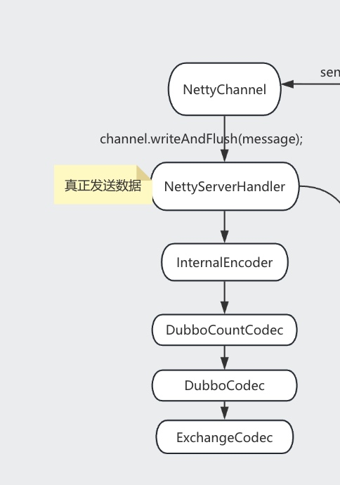

# dubbo源码之-dubbo provider 返回响应

```
dubbo provider端经过xxxImpl业务返回的响应。
经过一系列的handler之后，一方面走NettyPipeline发出去。进行编码，然后flush
然后发出去之后，调用sent，也就是onSent方法。做一些计数上的操作。
```

## 汇总流程




## 常规流程



#### 说明：
*  走业务处理，然后走代理，然后过滤链路，最后到Requesthandler,然后handler.reply返回


## Netty Pipeline返回数据




## 调用writeAndFlush返回结果
    走 pipeline编码数据序列化

### InternalEncoder#encode

```java
        @Override
        protected void encode(ChannelHandlerContext ctx, Object msg, ByteBuf out) throws Exception {
            // 创建 NettyBackedChannelBuffer 对象
            com.alibaba.dubbo.remoting.buffer.ChannelBuffer buffer = new NettyBackedChannelBuffer(out);
            // 获得 NettyChannel 对象
            Channel ch = ctx.channel();
            NettyChannel channel = NettyChannel.getOrAddChannel(ch, url, handler);
            try {
                // 编码
                codec.encode(channel, buffer, msg);
            } finally {
                // 移除 NettyChannel 对象，若断开连接
                NettyChannel.removeChannelIfDisconnected(ch);
            }
        }
```


### DubboCountCodec

```调用了DubboCodec 的encode方法进行编码```

```java
    @Override
    public void encode(Channel channel, ChannelBuffer buffer, Object msg) throws IOException {
        codec.encode(channel, buffer, msg);
    }
```


### ExchangeCodec

```java
    @Override
    public void encode(Channel channel, ChannelBuffer buffer, Object msg) throws IOException {
        if (msg instanceof Request) { // 请求
            encodeRequest(channel, buffer, (Request) msg);
        } else if (msg instanceof Response) { // 响应
            encodeResponse(channel, buffer, (Response) msg);
        } else { // 提交给父类( Telnet ) 处理，目前是 Telnet 命令的结果。
            super.encode(channel, buffer, msg);
        }
    }
```

#### 说明：
* 最后调用了ExchangeCodec 里面的方法进行编码，首先按照dubbo协议编码RPC需要的字段。
* 最后序列号对象为二进制。这个流程在序列号和dubbo协议已经讲过。


### NettyServerHandler和后续流程

```在NettyServer里面调用 handler.sent方法返回，后面的handler
要么做了一些时间上的更新，要么都是装饰者，没做什么具体操作。
```


