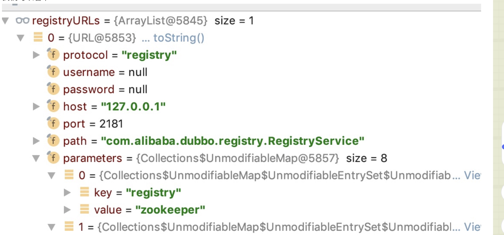

# dubbo源码之-dubbo provider端本地暴露(injvm)流程

### ServiceConfig 成员变量
```java
// 自适应Protocol ，根据具体的参数值变成不同的实现
private static final Protocol protocol = ExtensionLoader.getExtensionLoader(Protocol.class).getAdaptiveExtension();
//代理工厂的自适应
private static final ProxyFactory proxyFactory = ExtensionLoader.getExtensionLoader(ProxyFactory.class).getAdaptiveExtension();
//记录随机端口的
private static final Map<String, Integer> RANDOM_PORT_MAP = new HashMap<String, Integer>();
// 延时暴露 executor
private static final ScheduledExecutorService delayExportExecutor = Executors.newSingleThreadScheduledExecutor(new NamedThreadFactory("DubboServiceDelayExporter", true));
private final List<URL> urls = new ArrayList<URL>();
// exporters
private final List<Exporter<?>> exporters = new ArrayList<Exporter<?>>();
// interface type
private String interfaceName; // 接口名
private Class<?> interfaceClass;//接口class
// reference to interface impl
private T ref;// 具体实现类
// service name
private String path;
// method configuration
//方法的配置
private List<MethodConfig> methods;
// 关于provider的配置
private ProviderConfig provider;
// 是否已经暴露
private transient volatile boolean exported;
//是否需要暴露
private transient volatile boolean unexported;
//范化
private volatile String generic;
```

### export
```java
 public synchronized void export() {
        if (provider != null) {
            if (export == null) {
                export = provider.getExport();
            }
            if (delay == null) {
                delay = provider.getDelay();
            }
        }
        if (export != null && !export) {
            return;
        }
        //  延时暴露
        if (delay != null && delay > 0) {
            delayExportExecutor.schedule(new Runnable() {
                @Override
                public void run() {
                    doExport();
                }
            }, delay, TimeUnit.MILLISECONDS);
        } else {
            doExport();
        }
    }
```


### doExport

```java
protected synchronized void doExport() {
        if (unexported) {
            throw new IllegalStateException("Already unexported!");
        }
        if (exported) {
            return;
        }
        exported = true;
        if (interfaceName == null || interfaceName.length() == 0) {
            throw new IllegalStateException("<dubbo:service interface=\"\" /> interface not allow null!");
        }
        checkDefault();
        if (provider != null) {
            if (application == null) {
                application = provider.getApplication();
            }
            if (module == null) {
                module = provider.getModule();
            }
            if (registries == null) {
                registries = provider.getRegistries();
            }
            if (monitor == null) {
                monitor = provider.getMonitor();
            }
            if (protocols == null) {
                protocols = provider.getProtocols();
            }
        }
        if (module != null) {
            if (registries == null) {
                registries = module.getRegistries();
            }
            if (monitor == null) {
                monitor = module.getMonitor();
            }
        }
        if (application != null) {
            if (registries == null) {
                registries = application.getRegistries();
            }
            if (monitor == null) {
                monitor = application.getMonitor();
            }
        }
        
        if (ref instanceof GenericService) {
            interfaceClass = GenericService.class;
            if (StringUtils.isEmpty(generic)) {
                generic = Boolean.TRUE.toString();
            }
        } else {
            try {// 创建class对象
                interfaceClass = Class.forName(interfaceName, true, Thread.currentThread()
                        .getContextClassLoader());
            } catch (ClassNotFoundException e) {
                throw new IllegalStateException(e.getMessage(), e);
            }//  检查方法是否在接口中
            checkInterfaceAndMethods(interfaceClass, methods);
            checkRef();// 检查实现类
            generic = Boolean.FALSE.toString();// 不是泛化
        }
        if (local != null) {
            if ("true".equals(local)) {
                local = interfaceName + "Local";
            }
            Class<?> localClass;
            try {
                localClass = ClassHelper.forNameWithThreadContextClassLoader(local);
            } catch (ClassNotFoundException e) {
                throw new IllegalStateException(e.getMessage(), e);
            }
            if (!interfaceClass.isAssignableFrom(localClass)) {
                throw new IllegalStateException("The local implementation class " + localClass.getName() + " not implement interface " + interfaceName);
            }
        }
        if (stub != null) {
            if ("true".equals(stub)) {
                stub = interfaceName + "Stub";
            }
            Class<?> stubClass;
            try {
                stubClass = ClassHelper.forNameWithThreadContextClassLoader(stub);
            } catch (ClassNotFoundException e) {
                throw new IllegalStateException(e.getMessage(), e);
            }
            if (!interfaceClass.isAssignableFrom(stubClass)) {
                throw new IllegalStateException("The stub implementation class " + stubClass.getName() + " not implement interface " + interfaceName);
            }
        }
        checkApplication();
        checkRegistry();
        checkProtocol();
        appendProperties(this);
        checkStub(interfaceClass);
        checkMock(interfaceClass);
        if (path == null || path.length() == 0) {
            path = interfaceName;
        }
        doExportUrls();
        ProviderModel providerModel = new ProviderModel(getUniqueServiceName(), this, ref);
        ApplicationModel.initProviderModel(getUniqueServiceName(), providerModel);
    }
```
#### 说明:
* 主要是参数校验的工作，
* 后面会交给doExportUrls 进行暴露。

#### doExportUrls
```java
    private void doExportUrls() {
        List<URL> registryURLs = loadRegistries(true);
        for (ProtocolConfig protocolConfig : protocols) {
            doExportUrlsFor1Protocol(protocolConfig, registryURLs);
        }
    }
```
#### 说明：
* loadRegistries(true); 这个方法，获取到了一个URL集合，其实这里就是获取注册中心列表，





#### doExportUrlsFor1Protocol
```java
private void doExportUrlsFor1Protocol(ProtocolConfig protocolConfig, List<URL> registryURLs) {
        String name = protocolConfig.getName();
        if (name == null || name.length() == 0) {
            name = "dubbo";/// 默认是dubbo
        }

        Map<String, String> map = new HashMap<String, String>();
        map.put(Constants.SIDE_KEY, Constants.PROVIDER_SIDE);// side 哪一端
        map.put(Constants.DUBBO_VERSION_KEY, Version.getProtocolVersion());// 版本
        map.put(Constants.TIMESTAMP_KEY, String.valueOf(System.currentTimeMillis()));// timestamp
        if (ConfigUtils.getPid() > 0) {
            map.put(Constants.PID_KEY, String.valueOf(ConfigUtils.getPid()));// pid
        }
        appendParameters(map, application);
        appendParameters(map, module);
        appendParameters(map, provider, Constants.DEFAULT_KEY);
        appendParameters(map, protocolConfig);
        appendParameters(map, this);
        if (methods != null && !methods.isEmpty()) {
            for (MethodConfig method : methods) {
                appendParameters(map, method, method.getName());
                String retryKey = method.getName() + ".retry";
                if (map.containsKey(retryKey)) {
                    String retryValue = map.remove(retryKey);
                    if ("false".equals(retryValue)) {
                        map.put(method.getName() + ".retries", "0");
                    }
                }
                List<ArgumentConfig> arguments = method.getArguments();
                if (arguments != null && !arguments.isEmpty()) {
                    for (ArgumentConfig argument : arguments) {
                        // convert argument type
                        if (argument.getType() != null && argument.getType().length() > 0) {
                            Method[] methods = interfaceClass.getMethods();
                            // visit all methods
                            if (methods != null && methods.length > 0) {
                                for (int i = 0; i < methods.length; i++) {
                                    String methodName = methods[i].getName();
                                    // target the method, and get its signature
                                    if (methodName.equals(method.getName())) {
                                        Class<?>[] argtypes = methods[i].getParameterTypes();
                                        // one callback in the method
                                        if (argument.getIndex() != -1) {
                                            if (argtypes[argument.getIndex()].getName().equals(argument.getType())) {
                                                appendParameters(map, argument, method.getName() + "." + argument.getIndex());
                                            } else {
                                                throw new IllegalArgumentException("argument config error : the index attribute and type attribute not match :index :" + argument.getIndex() + ", type:" + argument.getType());
                                            }
                                        } else {
                                            // multiple callbacks in the method
                                            for (int j = 0; j < argtypes.length; j++) {
                                                Class<?> argclazz = argtypes[j];
                                                if (argclazz.getName().equals(argument.getType())) {
                                                    appendParameters(map, argument, method.getName() + "." + j);
                                                    if (argument.getIndex() != -1 && argument.getIndex() != j) {
                                                        throw new IllegalArgumentException("argument config error : the index attribute and type attribute not match :index :" + argument.getIndex() + ", type:" + argument.getType());
                                                    }
                                                }
                                            }
                                        }
                                    }
                                }
                            }
                        } else if (argument.getIndex() != -1) {
                            appendParameters(map, argument, method.getName() + "." + argument.getIndex());
                        } else {
                            throw new IllegalArgumentException("argument config must set index or type attribute.eg: <dubbo:argument index='0' .../> or <dubbo:argument type=xxx .../>");
                        }

                    }
                }
            } // end of methods for
        }

        if (ProtocolUtils.isGeneric(generic)) {//泛化调用
            map.put(Constants.GENERIC_KEY, generic);
            map.put(Constants.METHODS_KEY, Constants.ANY_VALUE);
        } else {
            String revision = Version.getVersion(interfaceClass, version);
            if (revision != null && revision.length() > 0) {
                map.put("revision", revision);
            }

            String[] methods = Wrapper.getWrapper(interfaceClass).getMethodNames();
            if (methods.length == 0) {
                logger.warn("NO method found in service interface " + interfaceClass.getName());
                map.put(Constants.METHODS_KEY, Constants.ANY_VALUE);
            } else {
                map.put(Constants.METHODS_KEY, StringUtils.join(new HashSet<String>(Arrays.asList(methods)), ","));
            }
        }
        if (!ConfigUtils.isEmpty(token)) {
            if (ConfigUtils.isDefault(token)) {
                map.put(Constants.TOKEN_KEY, UUID.randomUUID().toString());
            } else {
                map.put(Constants.TOKEN_KEY, token);
            }
        }
        if (Constants.LOCAL_PROTOCOL.equals(protocolConfig.getName())) {// 本地injvm
            protocolConfig.setRegister(false);
            map.put("notify", "false");
        }
        // export service
        String contextPath = protocolConfig.getContextpath();
        if ((contextPath == null || contextPath.length() == 0) && provider != null) {
            contextPath = provider.getContextpath();
        }
        //  host
        String host = this.findConfigedHosts(protocolConfig, registryURLs, map);
        Integer port = this.findConfigedPorts(protocolConfig, name, map);// port
        URL url = new URL(name, host, port, (contextPath == null || contextPath.length() == 0 ? "" : contextPath + "/") + path, map);

        if (ExtensionLoader.getExtensionLoader(ConfiguratorFactory.class)
                .hasExtension(url.getProtocol())) {
            url = ExtensionLoader.getExtensionLoader(ConfiguratorFactory.class)
                    .getExtension(url.getProtocol()).getConfigurator(url).configure(url);
        }

        String scope = url.getParameter(Constants.SCOPE_KEY);
        // don't export when none is configured
        if (!Constants.SCOPE_NONE.toString().equalsIgnoreCase(scope)) {

            // export to local if the config is not remote (export to remote only when config is remote)
            if (!Constants.SCOPE_REMOTE.toString().equalsIgnoreCase(scope)) {  // 本地服务暴露   不是remote就本地暴露，如果不配置scope也进行本地暴露
                exportLocal(url);
            }
            // export to remote if the config is not local (export to local only when config is local)
            if (!Constants.SCOPE_LOCAL.toString().equalsIgnoreCase(scope)) {  // 远程服务暴露    不是local
                if (logger.isInfoEnabled()) {
                    logger.info("Export dubbo service " + interfaceClass.getName() + " to url " + url);
                }
                if (registryURLs != null && !registryURLs.isEmpty()) {
                    //遍历注册中心
                    for (URL registryURL : registryURLs) {
                        url = url.addParameterIfAbsent(Constants.DYNAMIC_KEY, registryURL.getParameter(Constants.DYNAMIC_KEY));
                        URL monitorUrl = loadMonitor(registryURL);//获取监控中心
                        if (monitorUrl != null) {  // 将监控中心添加到 url中
                            url = url.addParameterAndEncoded(Constants.MONITOR_KEY, monitorUrl.toFullString());
                        }
                        if (logger.isInfoEnabled()) {
                            logger.info("Register dubbo service " + interfaceClass.getName() + " url " + url + " to registry " + registryURL);
                        }

                        // For providers, this is used to enable custom proxy to generate invoker
                        String proxy = url.getParameter(Constants.PROXY_KEY);  // 配置中有proxy_key 的话就使用配置的
                        if (StringUtils.isNotEmpty(proxy)) {  //  设置配置的 proxy_key
                            registryURL = registryURL.addParameter(Constants.PROXY_KEY, proxy);
                        }


                        // invoker  使用ProxyFactory 生成 invoker对象，这里这个invoker其实是一个代理对象
                        Invoker<?> invoker = proxyFactory.getInvoker(ref, (Class) interfaceClass, registryURL.addParameterAndEncoded(Constants.EXPORT_KEY, url.toFullString()));
                        // 创建  DelegateProvoderMetaInvoker 对象
                        DelegateProviderMetaDataInvoker wrapperInvoker = new DelegateProviderMetaDataInvoker(invoker, this);
                        //  registryURL.getProtocol= registry


                        //   filter ---->listener --->registryProtocol   ( 这里使用了wapper 包装机制)
                        //  filter ----> listener ----> dubboProtocol    服务暴露
                        Exporter<?> exporter = protocol.export(wrapperInvoker);
                        // 添加exporter
                        exporters.add(exporter);
                    }
                } else { // 没有注册中心
                    Invoker<?> invoker = proxyFactory.getInvoker(ref, (Class) interfaceClass, url);
                    DelegateProviderMetaDataInvoker wrapperInvoker = new DelegateProviderMetaDataInvoker(invoker, this);

                    Exporter<?> exporter = protocol.export(wrapperInvoker);
                    exporters.add(exporter);
                }
            }
        }
        this.urls.add(url);
    }
```

#### 说明：
    * 这个方法首先判断ProtocolConfig的协议，如果没有默认设置成dubbo，
    * 再往下就是设置参数，比如说side=provider，dubbo=2.2.0,timestamp,pid等等，然后把一些config中的配置塞到map中，接着就是遍历处理MethodConfig。
    * 再接着就是判断是不是范化调用，如果是就把范化的信息扔到map中，设置methods=*，如果不是范化调用，就找到你所有的method，然后将methods=你所有method名拼接起来。
    * 接着就是将token参数塞到map中。如果你得协议是injvm，设置notify=false，protocolConfig.setRegister(false);获取host，port。
    * 最终利用map里面这一堆配置创建出一个新的URL。其实上面这些就是提取配置，封装配置，最后创建URL。

#### exportLocal

```java
    private void exportLocal(URL url) {  // 本地服务暴露

        // 如果protocol不是injvm
        if (!Constants.LOCAL_PROTOCOL.equalsIgnoreCase(url.getProtocol())) {

            // 设置protolol是injvm
            URL local = URL.valueOf(url.toFullString())
                    .setProtocol(Constants.LOCAL_PROTOCOL)
                    .setHost(LOCALHOST)  // host 是127.0.0.1
                    .setPort(0);
            //service.classimpl
StaticContext.getContext(Constants.SERVICE_IMPL_CLASS).put(url.getServiceKey(), getServiceClass(ref));
            /**
             * ref： 接口实现类
             * interfaceClass： 接口class
             * local ： URL
             */
            Exporter<?> exporter = protocol.export(
                    proxyFactory.getInvoker(ref, (Class) interfaceClass, local));
            exporters.add(exporter);
            logger.info("Export dubbo service " + interfaceClass.getName() + " to local registry");
        }
    }
```

#### 说明
* protocol不是injvm的话，就把URL中的protocol变成injvm，
* host是127.0.0.1，port是0 。其实这里是新生成了一个URL
* Exporter<?> exporter = protocol.export(
proxyFactory.getInvoker(ref, (Class) interfaceClass, local));

#### proxyFactory.getInvoker(ref, (Class) interfaceClass, local)这个方法。

```java
ProxyFactory proxyFactory = ExtensionLoader.getExtensionLoader(ProxyFactory.class).getAdaptiveExtension();
```

```java
@SPI("javassist")
public interface ProxyFactory {
    /**
     * create proxy.
     *
     * @param invoker
     * @return proxy
     */
    @Adaptive({Constants.PROXY_KEY})
    <T> T getProxy(Invoker<T> invoker) throws RpcException;

    /**
     * create proxy.
     *
     * @param invoker
     * @return proxy
     */
    @Adaptive({Constants.PROXY_KEY})
    <T> T getProxy(Invoker<T> invoker, boolean generic) throws RpcException;

    /**
     * create invoker.
     *
     * @param <T>
     * @param proxy
     * @param type
     * @param url
     * @return invoker
     */
    @Adaptive({Constants.PROXY_KEY})
    <T> Invoker<T> getInvoker(T proxy, Class<T> type, URL url) throws RpcException;

}
```

#### 说明：
* 默认 @SPI(“javassist”)中的javassist实现类。也就是JavassistProxyFactory这个类。


### JavassistProxyFactory
```java
public class JavassistProxyFactory extends AbstractProxyFactory {

    @Override
    @SuppressWarnings("unchecked")
    public <T> T getProxy(Invoker<T> invoker, Class<?>[] interfaces) {
        return (T) Proxy.getProxy(interfaces).newInstance(new InvokerInvocationHandler(invoker));
    }
    //生成一个invoker的包装类
    /**
     * @param proxy  接口实现类
     * @param type  接口类型class
     * @param url  URL
     * @param <T>  接口类型
     * @return  Invoker
     */
    @Override
    public <T> Invoker<T> getInvoker(T proxy, Class<T> type, URL url) {
        // TODO Wrapper cannot handle this scenario correctly: the classname contains '$' wrapper 不能解析类名中带$的
        // 这里是如果，接口实现类中有$符号，就是用接口类型，没有$符号，就用实现类的类型
        final Wrapper wrapper = Wrapper.getWrapper(proxy.getClass().getName().indexOf('$') < 0 ? proxy.getClass() : type);
        return new AbstractProxyInvoker<T>(proxy, type, url) {
            /**
             * 进行调用
             * @param proxy 实现类
             * @param methodName 方法名
             * @param parameterTypes  参数类型们
             * @param arguments  参数
             * @return
             * @throws Throwable
             */
            @Override
            protected Object doInvoke(T proxy, String methodName,
                                      Class<?>[] parameterTypes,
                                      Object[] arguments) throws Throwable {
                return wrapper.invokeMethod(proxy, methodName, parameterTypes, arguments);
            }
        };
    }

}
```

```java
 protocol.export(proxyFactory.getInvoker(ref, (Class) interfaceClass, local));
```
#### 说明：
    * 这里这个protocol也是ServiceConfig的类成员，获取自适应实现类
    * 因为我们URL这里protocol=injvm，所以回去找对应的实现，也就是InjvmProtocol这个类

### InjvmProtocol
```java
public class InjvmProtocol extends AbstractProtocol implements Protocol {

    public static final String NAME = Constants.LOCAL_PROTOCOL;

    public static final int DEFAULT_PORT = 0;
    private static InjvmProtocol INSTANCE;

    public InjvmProtocol() {
        INSTANCE = this;
    }

    public static InjvmProtocol getInjvmProtocol() {
        if (INSTANCE == null) {
            ExtensionLoader.getExtensionLoader(Protocol.class).getExtension(InjvmProtocol.NAME); // load
        }
        return INSTANCE;
    }
    static Exporter<?> getExporter(Map<String, Exporter<?>> map, URL key) {
        Exporter<?> result = null;

        if (!key.getServiceKey().contains("*")) {
            result = map.get(key.getServiceKey());
        } else {
            if (map != null && !map.isEmpty()) {
                for (Exporter<?> exporter : map.values()) {
                    if (UrlUtils.isServiceKeyMatch(key, exporter.getInvoker().getUrl())) {
                        result = exporter;
                        break;
                    }
                }
            }
        }

        if (result == null) {
            return null;
        } else if (ProtocolUtils.isGeneric(
                result.getInvoker().getUrl().getParameter(Constants.GENERIC_KEY))) {
            return null;
        } else {
            return result;
        }
    }
    @Override
    public int getDefaultPort() {
        return DEFAULT_PORT;
    }
    /**
     * 服务暴露
     * @param invoker Service invoker
     * @param <T>
     * @return
     * @throws RpcException
     */
    @Override
    public <T> Exporter<T> export(Invoker<T> invoker) throws RpcException {
        return new InjvmExporter<T>(invoker, invoker.getUrl().getServiceKey(), exporterMap);
    }
```

#### 说明：
    * InjvmProtocol 最后导出来 InjvmExporter

### InjvmExporter
```java
class InjvmExporter<T> extends AbstractExporter<T> {
    //service key
    private final String key;
    private final Map<String, Exporter<?>> exporterMap;
    InjvmExporter(Invoker<T> invoker, String key, Map<String, Exporter<?>> exporterMap) {
        super(invoker);
        this.key = key;
        this.exporterMap = exporterMap;
        exporterMap.put(key, this);
    }

    @Override
    public void unexport() {
        super.unexport();
        exporterMap.remove(key);
    }

}
```
#### 说明：
* key=接口全类名，value=this（也就是InjvmExporter对象）put到exporterMap中了

