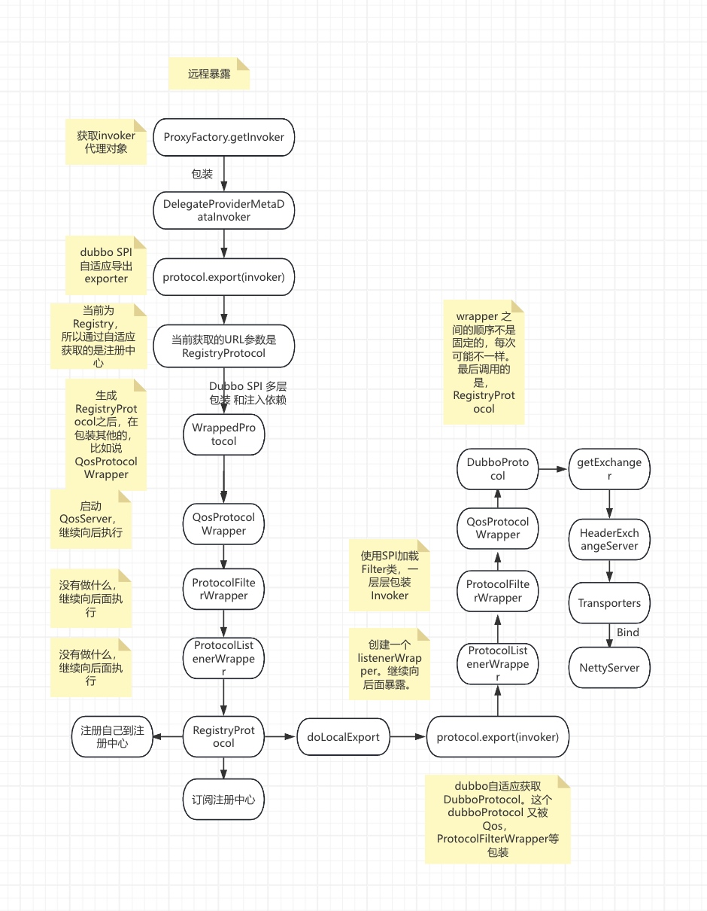
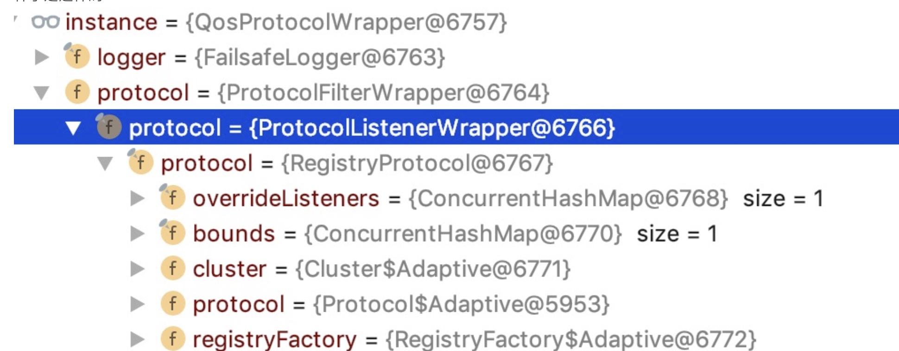
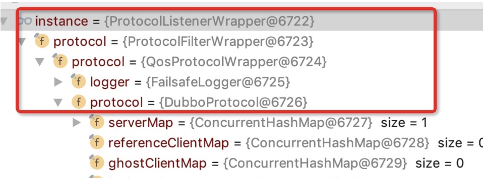

# dubbo源码之-dubbo provider端远程暴露流程（一）

```
服务暴露分为本地（injvm）与远程（remote）两种方式,
远程暴露 位于doExportUrlsFor1Protocol这个方法的后半部分。
可以参考服务暴露的流程图来理解。
```


## 汇总流程




#### doExportUrlsFor1Protocol
```java
  // don't export when none is configured
        if (!Constants.SCOPE_NONE.toString().equalsIgnoreCase(scope)) {

            // export to local if the config is not remote (export to remote only when config is remote)
            if (!Constants.SCOPE_REMOTE.toString().equalsIgnoreCase(scope)) {  // 本地服务暴露   不是remote就本地暴露，如果不配置scope也进行本地暴露
                exportLocal(url);
            }
            // export to remote if the config is not local (export to local only when config is local)
            if (!Constants.SCOPE_LOCAL.toString().equalsIgnoreCase(scope)) {  // 远程服务暴露    不是local
                if (logger.isInfoEnabled()) {
                    logger.info("Export dubbo service " + interfaceClass.getName() + " to url " + url);
                }
                if (registryURLs != null && !registryURLs.isEmpty()) {
                    //遍历注册中心
                    for (URL registryURL : registryURLs) {
                        url = url.addParameterIfAbsent(Constants.DYNAMIC_KEY, registryURL.getParameter(Constants.DYNAMIC_KEY));
                        URL monitorUrl = loadMonitor(registryURL);//获取监控中心
                        if (monitorUrl != null) {  // 将监控中心添加到 url中
                            url = url.addParameterAndEncoded(Constants.MONITOR_KEY, monitorUrl.toFullString());
                        }
                        if (logger.isInfoEnabled()) {
                            logger.info("Register dubbo service " + interfaceClass.getName() + " url " + url + " to registry " + registryURL);
                        }

                        // For providers, this is used to enable custom proxy to generate invoker
                        String proxy = url.getParameter(Constants.PROXY_KEY);  // 配置中有proxy_key 的话就使用配置的
                        if (StringUtils.isNotEmpty(proxy)) {  //  设置配置的 proxy_key
                            registryURL = registryURL.addParameter(Constants.PROXY_KEY, proxy);
                        }


                        // invoker  使用ProxyFactory 生成 invoker对象，这里这个invoker其实是一个代理对象
                        Invoker<?> invoker = proxyFactory.getInvoker(ref, (Class) interfaceClass, registryURL.addParameterAndEncoded(Constants.EXPORT_KEY, url.toFullString()));
                        // 创建  DelegateProvoderMetaInvoker 对象
                        DelegateProviderMetaDataInvoker wrapperInvoker = new DelegateProviderMetaDataInvoker(invoker, this);
                        //  registryURL.getProtocol= registry
                        //   filter ---->listener --->registryProtocol   ( 这里使用了wapper 包装机制)
                        //  filter ----> listener ----> dubboProtocol    服务暴露
                        Exporter<?> exporter = protocol.export(wrapperInvoker);
                        // 添加exporter
                        exporters.add(exporter);
                    }
                } else { // 没有注册中心
                    Invoker<?> invoker = proxyFactory.getInvoker(ref, (Class) interfaceClass, url);
                    DelegateProviderMetaDataInvoker wrapperInvoker = new DelegateProviderMetaDataInvoker(invoker, this);

                    Exporter<?> exporter = protocol.export(wrapperInvoker);
                    exporters.add(exporter);
                }
            }
        }
```

#### 说明：
* 1。如果scope属性没有明确指出是local，这时候就进行远程暴露，
* 2.如果有注册中心，然后遍历注册中心，首先是获取监控中心，将监控中心添加到url中，然后就是将proxy_key属性放到registryUrl中，其实这个proxy_key 的值是可以设置的，就是告诉dubbo我用什么来进行生成代理，这个对应的就是dubbo spi 自适应特性。
* 3. protocol.export 这个方法，由于当前是RegistryProtocol，那么首先作用的是RegistryProtocol的包装类。后面RegistryProtocol 里面在二次进行export，调用的是DubboProtocol的包装类，真正将服务暴露。并注册好。


### DelegateProviderMetaDataInvoker
```java
public class DelegateProviderMetaDataInvoker<T> implements Invoker {
    protected final Invoker<T> invoker;
    private ServiceConfig metadata;
    public DelegateProviderMetaDataInvoker(Invoker<T> invoker,ServiceConfig metadata) {
        this.invoker = invoker;
        this.metadata = metadata;
    }
   	...
    public ServiceConfig getMetadata() {
        return metadata;
    }
}
```

#### 说明：
*  DelegateProviderMetaDataInvoker wrapperInvoker = new DelegateProviderMetaDataInvoker(invoker, this);，这行就是包装了一下这个invoker，主要是把原始的配置信息跟invoker绑在一块了。


```java
private static final Protocol protocol = ExtensionLoader.getExtensionLoader(Protocol.class).getAdaptiveExtension();

Exporter<?> exporter = protocol.export(wrapperInvoker);
```

```java
@SPI("dubbo")
public interface Protocol {
    int getDefaultPort();
    @Adaptive
    <T> Exporter<T> export(Invoker<T> invoker) throws RpcException;
    @Adaptive
    <T> Invoker<T> refer(Class<T> type, URL url) throws RpcException;
    void destroy();
}
```

#### 说明：
* 1 Protocol这个扩展点export方法上是有@Adaptive注解的，然后没有value，根据自适应的规则，没有value则value=类名小写。这样的话就是从url中获取protocol的值，咱们invoker里面包的url是registryURL，然后对应的protocol也就是注册中心的protocol，RegistryProtocol这个类。

* 2 但是在创建扩展实现类的时候dubbo会给我们setter注入与wrapper包装，所以我们拿到的RegistryProtocol最终样子是这样的。如下图所示。





```java
Qos —> Filter —> Listener ----> RegistryProtocol
```

### QosProtocolWrapper
```java
 @Override
    public <T> Exporter<T> export(Invoker<T> invoker) throws RpcException {
        //判断是registry
        if (Constants.REGISTRY_PROTOCOL.equals(invoker.getUrl().getProtocol())) {
            // 启动Qos服务器？
            startQosServer(invoker.getUrl());
            return protocol.export(invoker);
        }
        return protocol.export(invoker);
    }
```

#### 说明：
* 1 判断当前是REGISTRY_PROTOCOL，那么启动QosServer，然后继续向后面调用。也就是ProtocolFilterWrapper

### ProtocolFilterWrapper
```java
  @Override
    public <T> Exporter<T> export(Invoker<T> invoker) throws RpcException {
        if (Constants.REGISTRY_PROTOCOL.equals(invoker.getUrl().getProtocol())) {
        /// registry protocol  就到下一个wapper 包装对象中就可以了
            return protocol.export(invoker);
        }
        return protocol.export(buildInvokerChain(invoker, Constants.SERVICE_FILTER_KEY, Constants.PROVIDER));
    }
```
#### 说明：
* 1 由于当前是RegistryProtocol，所以啥也没干。

### ProtocolListenerWrapper
```java
 @Override
    public <T> Exporter<T> export(Invoker<T> invoker) throws RpcException {
        if (Constants.REGISTRY_PROTOCOL.equals(invoker.getUrl().getProtocol())) {// registry   是否是注册中心
            return protocol.export(invoker);
        }
        return new ListenerExporterWrapper<T>(protocol.export(invoker),// dubbo export  dubbo --->暴露服务 生成exporter
                Collections.unmodifiableList(ExtensionLoader.getExtensionLoader(ExporterListener.class)
                        .getActivateExtension(invoker.getUrl(), Constants.EXPORTER_LISTENER_KEY)));//  exporter listener
    }
```

#### 说明：
* 这里也是判断了一下是否是registry协议，如果是的话就直接进入下一个RegistryProtocol。


### RegistryProtocol
```java
 @Override
    public <T> Exporter<T> export(final Invoker<T> originInvoker) throws RpcException {
        //export invoker  暴露服务    doLocalExport表示本地启动服务不包括去注册中心注册
        final ExporterChangeableWrapper<T> exporter = doLocalExport(originInvoker);
        // 获得注册中心URL
        URL registryUrl = getRegistryUrl(originInvoker);

        //registry provider   获得注册中心对象
        final Registry registry = getRegistry(originInvoker);

        // 获得服务提供者URL
        final URL registeredProviderUrl = getRegisteredProviderUrl(originInvoker);

        //to judge to delay publish whether or not
        boolean register = registeredProviderUrl.getParameter("register", true);
        // 向本地服务注册表注册服务
        ProviderConsumerRegTable.registerProvider(originInvoker, registryUrl, registeredProviderUrl);

        if (register) {  // 向注册中心注册自己
            register(registryUrl, registeredProviderUrl);
            ProviderConsumerRegTable.getProviderWrapper(originInvoker).setReg(true);  // 设置注册标志
        }

        final URL overrideSubscribeUrl = getSubscribedOverrideUrl(registeredProviderUrl);
        final OverrideListener overrideSubscribeListener = new OverrideListener(overrideSubscribeUrl, originInvoker);
        overrideListeners.put(overrideSubscribeUrl, overrideSubscribeListener);
        registry.subscribe(overrideSubscribeUrl, overrideSubscribeListener);
        //Ensure that a new exporter instance is returned every time export
        return new DestroyableExporter<T>(exporter, originInvoker, overrideSubscribeUrl, registeredProviderUrl);
    }
```


#### 第一行 ExporterChangeableWrapper<T> exporter = doLocalExport(originInvoker);

#### doLocalExport

```java
    private <T> ExporterChangeableWrapper<T> doLocalExport(final Invoker<T> originInvoker) {
        String key = getCacheKey(originInvoker);
        ExporterChangeableWrapper<T> exporter = (ExporterChangeableWrapper<T>) bounds.get(key);
        if (exporter == null) {//之前没有暴露过
            synchronized (bounds) {
                exporter = (ExporterChangeableWrapper<T>) bounds.get(key);
                if (exporter == null) {
                    // 封装 InvokerDelegete  将url封装起来了
                    final Invoker<?> invokerDelegete = new InvokerDelegete<T>(originInvoker, getProviderUrl(originInvoker));
                    exporter = new ExporterChangeableWrapper<T>((Exporter<T>) protocol.export(invokerDelegete), originInvoker);/// dubbo protocol
                    // 缓存起来
                    bounds.put(key, exporter);
                }
            }
        }
        return exporter;
    }
```

#### (1) 我们先看 RegistryProtocol 的成员变量 
```java
procotol = ExtensionLoader.getExtensionLoader(Protocol.class).getAdaptiveExtension();
```

```java
    public com.alibaba.dubbo.rpc.Exporter export(com.alibaba.dubbo.rpc.Invoker arg0) throws com.alibaba.dubbo.rpc.RpcException {
        if (arg0 == null) throw new IllegalArgumentException("com.alibaba.dubbo.rpc.Invoker argument == null");
        if (arg0.getUrl() == null)
            throw new IllegalArgumentException("com.alibaba.dubbo.rpc.Invoker argument getUrl() == null");
        com.alibaba.dubbo.common.URL url = arg0.getUrl();
        String extName = (url.getProtocol() == null ? "dubbo" : url.getProtocol());
        if (extName == null)
            throw new IllegalStateException("Fail to get extension(com.alibaba.dubbo.rpc.Protocol) name from url(" + url.toString() + ") use keys([protocol])");
        com.alibaba.dubbo.rpc.Protocol extension = (com.alibaba.dubbo.rpc.Protocol) ExtensionLoader.getExtensionLoader(com.alibaba.dubbo.rpc.Protocol.class).getExtension(extName);
        return extension.export(arg0);
    }
```

#### 说明：
* （1） 上面是Protocol对应的自适应类。这个地方 和ServiceConfig 不一样，获取的是DubboProtocol。准确来说是Wrapper包装的DubboProtocol类。接下来的export也会按照。
Listener-----> Filter----->Qos-----> Dubbo的过程来执行。





### ProtocolListenerWrapper

```java
  @Override
    public <T> Exporter<T> export(Invoker<T> invoker) throws RpcException {
        if (Constants.REGISTRY_PROTOCOL.equals(invoker.getUrl().getProtocol())) {// registry   是否是注册中心
            return protocol.export(invoker);
        }
        return new ListenerExporterWrapper<T>(protocol.export(invoker),// dubbo export  dubbo --->暴露服务 生成exporter
                Collections.unmodifiableList(ExtensionLoader.getExtensionLoader(ExporterListener.class)
                        .getActivateExtension(invoker.getUrl(), Constants.EXPORTER_LISTENER_KEY)));//  exporter listener
    }
```

#### 说明：
* 1 这里由于不是REGISTRY_PROTOCOL，走的是下面的ListenerExporterWrapper 将服务暴露返回的exporter与自动激活的listener们绑在了一起。


### ListenerExporterWrapper
```java
public class ListenerExporterWrapper<T> implements Exporter<T> {
    private static final Logger logger = LoggerFactory.getLogger(ListenerExporterWrapper.class);
    private final Exporter<T> exporter;
    private final List<ExporterListener> listeners;
    public ListenerExporterWrapper(Exporter<T> exporter, List<ExporterListener> listeners) {
        if (exporter == null) {// 判断null
            throw new IllegalArgumentException("exporter == null");
        }
        this.exporter = exporter;
        this.listeners = listeners;
        if (listeners != null && !listeners.isEmpty()) {
            RuntimeException exception = null;
            for (ExporterListener listener : listeners) {//遍历通知
                if (listener != null) {
                    try {
                        listener.exported(this);//通知
                    } catch (RuntimeException t) {
                        logger.error(t.getMessage(), t);
                        exception = t;
                    }
                }
            }
            if (exception != null) {
                throw exception;
            }
        }
    }
   ...
}
```
#### 说明：
* 1 就是遍历通知listener，告诉他们当前服务暴露完了

