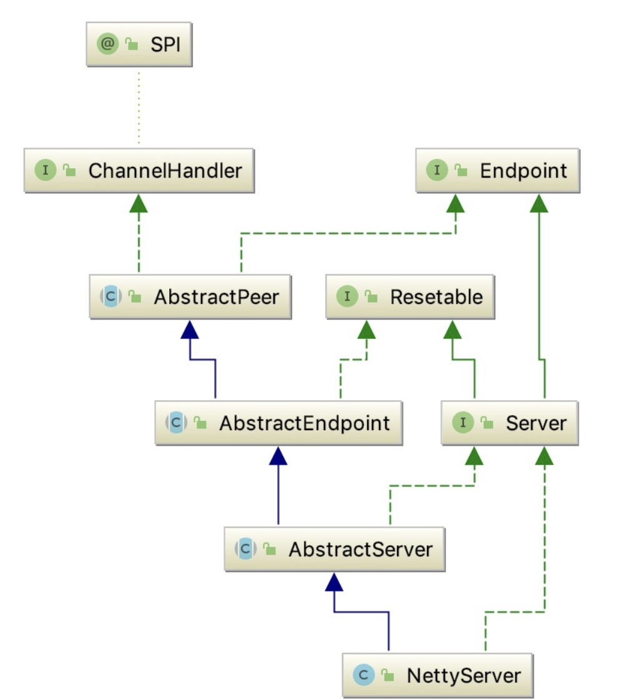

# dubbo源码之-dubbo provider端远程暴露流程（三）


## 继承关系


### 构造器
```java
   public NettyServer(URL url, ChannelHandler handler) throws RemotingException {
        super(url, ChannelHandlers.wrap(handler, ExecutorUtil.setThreadName(url, SERVER_THREAD_POOL_NAME)));
    }
```

### AbstractServer

```java
public abstract class AbstractServer extends AbstractEndpoint implements Server {
    protected static final String SERVER_THREAD_POOL_NAME = "DubboServerHandler";
    private static final Logger logger = LoggerFactory.getLogger(AbstractServer.class);
    // 线程池
    ExecutorService executor;
    // 服务地址
    private InetSocketAddress localAddress;
    //绑定地址
    private InetSocketAddress bindAddress;
    // 服务器最大可接受连接数
    private int accepts;
    // 空闲超时时间
    private int idleTimeout = 600;
    public AbstractServer(URL url, ChannelHandler handler) throws RemotingException {
        super(url, handler);
        localAddress = getUrl().toInetSocketAddress();
        String bindIp = getUrl().getParameter(Constants.BIND_IP_KEY, getUrl().getHost());//ip
        int bindPort = getUrl().getParameter(Constants.BIND_PORT_KEY, getUrl().getPort()); //port
        if (url.getParameter(Constants.ANYHOST_KEY, false) || NetUtils.isInvalidLocalHost(bindIp)) {
            bindIp = NetUtils.ANYHOST;
        }
        bindAddress = new InetSocketAddress(bindIp, bindPort);
        // 服务器最大可接受连接数
        this.accepts = url.getParameter(Constants.ACCEPTS_KEY, Constants.DEFAULT_ACCEPTS);
        this.idleTimeout = url.getParameter(Constants.IDLE_TIMEOUT_KEY, Constants.DEFAULT_IDLE_TIMEOUT);
        try {
            doOpen();  // 子类实现， 真正打开服务器
            if (logger.isInfoEnabled()) {
                logger.info("Start " + getClass().getSimpleName() + " bind " + getBindAddress() + ", export " + getLocalAddress());
            }
        } catch (Throwable t) {
            throw new RemotingException(url.toInetSocketAddress(), null, "Failed to bind " + getClass().getSimpleName()
                    + " on " + getLocalAddress() + ", cause: " + t.getMessage(), t);
        }
        //fixme replace this with better method
        // 获取线程池
        DataStore dataStore = ExtensionLoader.getExtensionLoader(DataStore.class).getDefaultExtension();
        executor = (ExecutorService) dataStore.get(Constants.EXECUTOR_SERVICE_COMPONENT_KEY, Integer.toString(url.getPort()));
    }

    protected abstract void doOpen() throws Throwable;
}
```

#### 说明：
* 主要是获取基本的参数，然后调用doOpen方法启动服务。

```java
   @Override
    protected void doOpen() throws Throwable {
        bootstrap = new ServerBootstrap();
        bossGroup = new NioEventLoopGroup(1, new DefaultThreadFactory("NettyServerBoss", true));
        //iothreads  默认是cpu核心数+1  与 32 进行比较，取小的那个  也就是最大不超过32
        workerGroup = new NioEventLoopGroup(getUrl().getPositiveParameter(Constants.IO_THREADS_KEY, Constants.DEFAULT_IO_THREADS),
                new DefaultThreadFactory("NettyServerWorker", true));
        final NettyServerHandler nettyServerHandler = new NettyServerHandler(getUrl(), this);
        channels = nettyServerHandler.getChannels();
/**
 *  ChannelOption.SO_REUSEADDR  这个参数表示允许重复使用本地地址和端口，
 *
 * 　　　　比如，某个服务器进程占用了TCP的80端口进行监听，此时再次监听该端口就会返回错误，使用该参数就可以解决问题，该参数允许共用该端口，这个在服务器程序中比较常使用，
 *
 * 　　　　比如某个进程非正常退出，该程序占用的端口可能要被占用一段时间才能允许其他进程使用，而且程序死掉以后，内核一需要一定的时间才能够释放此端口，不设置SO_REUSEADDR
 *
 * 　　　　就无法正常使用该端口。
 */
        // 设置线程组
        bootstrap.group(bossGroup, workerGroup)
                .channel(NioServerSocketChannel.class)// 设置channel类型  nio
                .childOption(ChannelOption.TCP_NODELAY, Boolean.TRUE)//禁止使用nagle算法
                .childOption(ChannelOption.SO_REUSEADDR, Boolean.TRUE)
                .childOption(ChannelOption.ALLOCATOR, PooledByteBufAllocator.DEFAULT)
                .childHandler(new ChannelInitializer<NioSocketChannel>() {
                    @Override
                    protected void initChannel(NioSocketChannel ch) throws Exception {
                        NettyCodecAdapter adapter = new NettyCodecAdapter(getCodec(), getUrl(), NettyServer.this);
                        ch.pipeline()//.addLast("logging",new LoggingHandler(LogLevel.INFO))//for debug
                                .addLast("decoder", adapter.getDecoder())
                                .addLast("encoder", adapter.getEncoder())
                                .addLast("handler", nettyServerHandler);
                    }
                });
        // bind
        ChannelFuture channelFuture = bootstrap.bind(getBindAddress());
        channelFuture.syncUninterruptibly();
        channel = channelFuture.channel();
```

#### 说明：
* 启动netty服务器，然后boss线程是一个，然后work线程是是cpu数+1然后与32做比较，取最小的那个，也就是最大不超过32个线程。

### HeaderExchangeServer 如何维护心跳。

```java
 public HeaderExchangeServer(Server server) {
        if (server == null) {
            throw new IllegalArgumentException("server == null");
        }

        // 服务器
        this.server = server;

        //心跳
        this.heartbeat = server.getUrl().getParameter(Constants.HEARTBEAT_KEY, 0);

        // 心跳超时
        this.heartbeatTimeout = server.getUrl().getParameter(Constants.HEARTBEAT_TIMEOUT_KEY, heartbeat * 3);
        if (heartbeatTimeout < heartbeat * 2) {
            throw new IllegalStateException("heartbeatTimeout < heartbeatInterval * 2");
        }

        // 启动心跳
        startHeartbeatTimer();
    }
``` 
#### 说明：
* 这里有heartbeat 与heartbeatTimeout 这两个参数，我们可以看到heartbeat 缺省是0 ，但是我们在DubboProtocol的createServer创建server方法设置了值为60 * 1000，也就是60s，然后heartbeatTimeout就是3*60s。

```java
    private void startHeartbeatTimer() {
        stopHeartbeatTimer();
        if (heartbeat > 0) {
            heartbeatTimer = scheduled.scheduleWithFixedDelay(
                    new HeartBeatTask(new HeartBeatTask.ChannelProvider() {
                        @Override
                        public Collection<Channel> getChannels() {
                            return Collections.unmodifiableCollection(
                                    HeaderExchangeServer.this.getChannels());
                        }
                    }, heartbeat, heartbeatTimeout),
                    heartbeat, heartbeat, TimeUnit.MILLISECONDS);
        }
    }
```

### 服务启动完成后，服务注册。

### export
```java
        final ExporterChangeableWrapper<T> exporter = doLocalExport(originInvoker);
        // 获得注册中心URL
        URL registryUrl = getRegistryUrl(originInvoker);

        //registry provider   获得注册中心对象
        final Registry registry = getRegistry(originInvoker);

        // 获得服务提供者URL
        final URL registeredProviderUrl = getRegisteredProviderUrl(originInvoker);

        //to judge to delay publish whether or not
        boolean register = registeredProviderUrl.getParameter("register", true);
        // 向本地服务注册表注册服务
        ProviderConsumerRegTable.registerProvider(originInvoker, registryUrl, registeredProviderUrl);

        if (register) {  // 向注册中心注册自己
            register(registryUrl, registeredProviderUrl);
            ProviderConsumerRegTable.getProviderWrapper(originInvoker).setReg(true);  // 设置注册标志
        }

        // Subscribe the override data
        // FIXME When the provider subscribes, it will affect the scene : a certain JVM exposes the service and call the same service. Because the subscribed is cached key with the name of the service, it causes the subscription information to cover.
        final URL overrideSubscribeUrl = getSubscribedOverrideUrl(registeredProviderUrl);
        final OverrideListener overrideSubscribeListener = new OverrideListener(overrideSubscribeUrl, originInvoker);
        overrideListeners.put(overrideSubscribeUrl, overrideSubscribeListener);
        registry.subscribe(overrideSubscribeUrl, overrideSubscribeListener);
        //Ensure that a new exporter instance is returned every time export
        return new DestroyableExporter<T>(exporter, originInvoker, overrideSubscribeUrl, registeredProviderUrl);
```


#### 说明：
* 1 registry = getRegistry(originInvoker); 获取Registry，然后注册。这个代码在注册中心那里已经讲过。
* 2 registry.subscribe(overrideSubscribeUrl, overrideSubscribeListener); 然后调用registry.subscribe 方法进行订阅。
* 3 ProviderConsumerRegTable#registerProvider 这个里面有两个map。分别是consumer和provider。在后面Qos维护的时候，比如说online provider，那么就会把这个里面的provider 进行发布。


